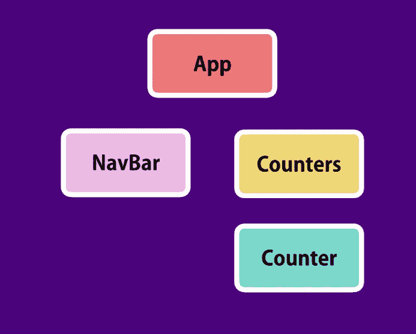
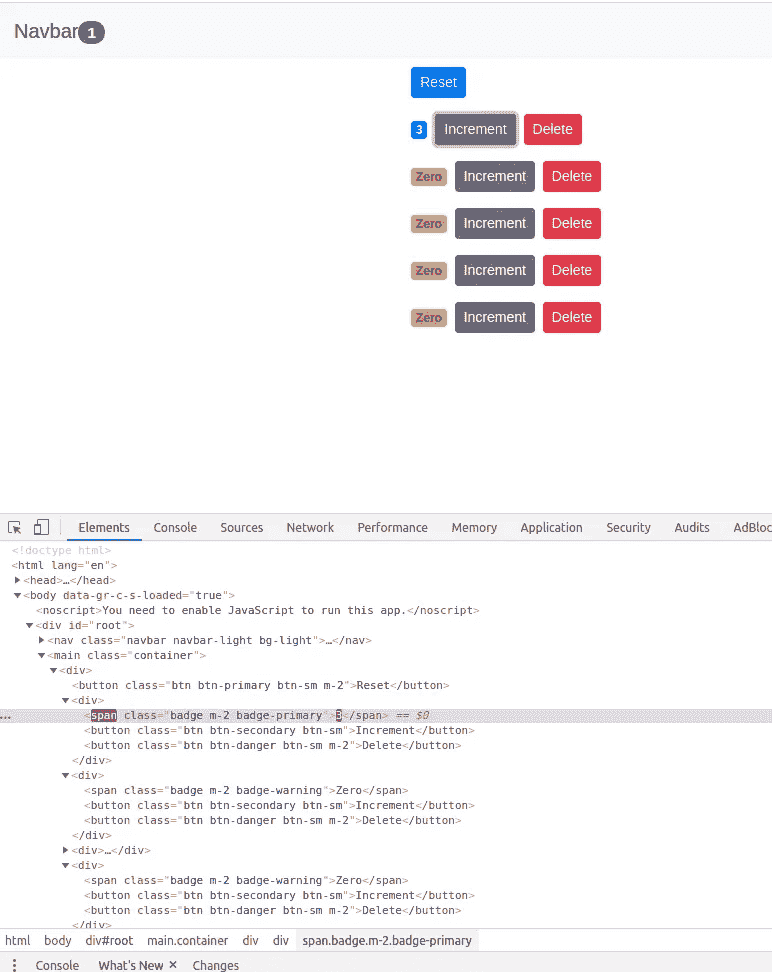

# 为什么我们不应该直接更新反应状态！

> 原文：<https://medium.com/analytics-vidhya/why-we-should-never-update-react-state-directly-c1b794fac59b?source=collection_archive---------2----------------------->

任何工作过或学习过一点 **React** 的人可能都知道我们不应该直接改变或更新状态。相反，我们应该总是声明一个新对象`const obj = {}`并使用`this.setState({ obj })`并让 react 处理它，就像我在下面的例子中所做的那样。但是为什么呢？

```
state = {
    counters: [
      { id: 1, value: 4 },
      { id: 2, value: 0 },
      { id: 3, value: 0 },
      { id: 4, value: 0 },
      { id: 5, value: 0 }
    ]
  };handleIncrements = counter => {
    const counters = [...this.state.counters];
    const index = counters.indexOf(counter);
    counters[index] = { ...counter };
    counters[index].value++;
    this.setState({ counters });
  };};
```

为了掌握这个问题，我们首先需要知道 React lifecycle 是如何工作的。
*(想要简答的可以向下滚动到底部)*

React 有三个生命周期阶段:

1.  贴装阶段:
    第一次贴装元件时。它有三个我们常用的生命周期钩子:
    i .构造器
    ii。渲染
    二。组件安装
2.  更新阶段:
    当组件已经挂载并且状态或属性发生变化时。它有两个我们常用的生命周期挂钩:
    i. render
    ii。componentDidUpdate
3.  卸载阶段:
    删除组件时。它有一个我们常用的生命周期钩子:
    i. componentWillUnmount

所有这些生命周期挂钩都按顺序调用。

在 React 中，无论组件是在安装阶段还是在更新阶段进行渲染，它总是渲染树中的所有组件。假设我们有一个这样的应用程序结构:



简单的组件树截图来自 Mosh 教程

当我们运行这个应用程序时，如果我们声明了上面提到的所有生命周期钩子，并且在每个钩子中声明了`console.log()`，我们将会看到钩子是按照下面的顺序被调用的。

一、App-constructor
ii。App 渲染
三。NavBar-rendered (NavBar 是无状态功能组件)
iv。Counters-rendered (Counters 是一个无状态的功能组件)
v .(4)Counter-rendered(Counter 是一个无状态的功能组件)
vi。App-didMount

现在，如果你不知道什么是无状态功能组件，它是一个没有状态或构造函数或任何生命周期挂钩的组件，并且完全由它们的父组件控制。它们只呈现一个 react 组件。

那么现在，当一个状态或道具被改变时会发生什么？它再次呈现其所有组件。

> **注意，我已经说过所有的组件都被再次渲染，而不是再次更新。**

正如您在下面的屏幕截图中看到的，只有增加的 span 被更新(在 inspect 元素中，您可以看到紫色的变化)。那么，它是如何工作的呢？



eact 保存了其所有虚拟 DOM 的跟踪记录。每当发生变化时，所有的组件都会被渲染，然后将这个新的虚拟 DOM 与旧的虚拟 DOM 进行比较。只有发现的差异才会反映在原始 DOM 中。

因此，从声明中可以明显看出，如果我们直接改变状态，它也将改变先前虚拟 DOM 中的状态引用。因此，React 看不到状态的变化，所以在我们重新加载之前，它不会反映在原始 DOM 中。当我们用`React.PureComponent`而不是`React.component`扩展一个组件时，问题就更明显了，React 试图通过在没有发现变化的情况下不渲染组件来优化一些时间。
此外，直接改变状态会导致奇怪的错误和难以优化的组件。

我希望你喜欢这个博客。如果你想看更多我的博客，你可以在[媒体](/@anuragbhattacharjee)这里关注我。

我是阿努拉格。从 2014 年开始专业从事软件工程师工作。我经常就我经常看到人们问的问题写博客，并认为这些问题很重要。在我的空闲时间，我喜欢开发简单有用的网络和移动应用程序。您可以在此与我联系:

🔗[https://www.linkedin.com/in/anuragbhattacharjee/](https://www.linkedin.com/in/anuragbhattacharjee/)🕸[http://anuragbhattacharjee.com](http://anuragbhattacharjee.com)

快乐编码😀


祝你好运