# 为什么您需要探索您的数据以及如何开始

> 原文：<https://medium.com/analytics-vidhya/why-you-need-to-explore-your-data-how-you-can-start-13de6f29c8c1?source=collection_archive---------3----------------------->


照片由来自 [Pexels](https://www.pexels.com/photo/man-using-black-binoculars-near-forest-trees-at-daytime-1181809/?utm_content=attributionCopyText&utm_medium=referral&utm_source=pexels) 的[迈克](https://www.pexels.com/@mike-468229?utm_content=attributionCopyText&utm_medium=referral&utm_source=pexels)拍摄

## 探索性数据分析逐步指南。

我们生活在一个每天都会产生数百万数据的世界，这些数据来自我们每天使用的智能手机，我们在谷歌或必应上搜索的内容，我们在不同社交媒体平台上发布、喜欢、评论或分享的内容，我们在电子商务网站上购买的内容，机器和其他来源产生的数据。我们正处于**数据时代**，数据是一种**新石油。**


**快速事实:**《福布斯》的文章称*“我们每天产生的数据量确实令人难以置信。以我们目前的速度，每天会产生 2.5 万亿字节的数据。*

如果你能从中发现见解，数据有很大的潜力，它能让你在任何业务中做出数据驱动的决策，而不是依赖你的经验。从大到小的公司都开始使用数据来更好地了解他们的客户、销售和营销行为，并为他们的业务做出准确的决策。

问题是你如何开始从你的数据中发现洞察力，以便做出数据驱动的决策。？

这一切都始于探索您的数据，以发现和理解隐藏的模式、知识和事实，从而帮助您做出更好的决策。

在本文中，您将了解到

*   探索性数据分析。
*   探索性数据分析的重要性。
*   可用于探索数据的 Python 包。
*   现实世界数据集的实际例子。

# 什么是探索性数据分析？

探索性数据分析是指对数据进行初始*调查，以发现 ***模式*** ，发现 ***异常*** ，检验 ***假设*** ，并借助汇总统计和图形表示检查 ***假设*** 的关键过程。
先了解数据，尽量从中收集尽可能多的 ***见解*** 是一个很好的做法。*

## *为什么探索性数据分析很重要？*

*通过探索您的数据，您可以从不同方面受益，例如:-*

*   *识别数据集中最重要的**变量/特征**。*
*   *测试**假设**或检查与数据集相关的假设。*
*   *检查数据的**质量，以便进一步处理和清理。***
*   *向业务利益相关方提供**数据驱动的洞察**。*
*   *验证预期的**关系**实际存在于数据中。*
*   *在数据中寻找**意想不到的结构**或模式。*

## ***用于探索性数据分析的 Python 包***

*以下 python 包将帮助您开始探索数据集。*

*   ***Pandas**——是一个专注于数据分析的 Python 包。*
*   *NumPy 是一个通用的数组处理包。*
*   ***Matplotlib-** 是一个 Python 2D 绘图库，可生成各种格式的出版物质量数据。*
*   ***Seaborn**——是一个基于 matplotlib 的 Python 数据可视化库。它提供了一个高层次的界面来绘制有吸引力的和信息丰富的统计图形。*

*现在，您已经了解了什么是 EDA 及其优势，让我们继续，开始探索来自 [zindi Africa](http://zindi.africa) 的非洲数据集中的金融包容性，以便您能够了解在分析自己的数据集时需要遵循的重要步骤。*

## *非洲数据集中金融包容性的探索性数据分析*

*第一个重要步骤是理解关于要分析的数据集的问题陈述。这将帮助您生成关于数据集的假设。*

## *1.理解问题陈述*

*金融包容性仍然是非洲经济和人类发展的主要障碍之一。例如，在肯尼亚、卢旺达、坦桑尼亚和乌干达，只有 910 万成年人(占成年人口的 13.9%)能够获得或使用商业银行账户。*

*传统上，获得银行账户被视为金融包容性的一个指标。尽管移动货币在非洲激增，创新的金融科技解决方案也在增长，但银行在促进获得金融服务方面仍发挥着关键作用。获得银行账户使家庭能够储蓄和方便支付，同时也有助于企业建立信誉，改善他们获得其他金融服务的机会。因此，获得银行账户是长期经济增长的一个重要因素。*

*欲了解更多问题陈述，请访问[津迪非洲金融包容性竞赛](https://zindi.africa/competitions/financial-inclusion-in-africa)*

## *2.问题的类型*

*在完成问题陈述后，数据集侧重于一个分类，在该分类中，您必须预测个人是否最有可能拥有或使用银行账户。但是在本文中，您不会应用机器学习技术。*

## *3.假设生成*

*这是数据探索过程中非常重要的阶段。它包括通过头脑风暴尽可能多的影响结果的因素来详细理解问题。这是通过在查看数据之前彻底理解问题陈述来完成的。*

*以下是我认为可能影响一个人拥有银行账户机会的一些因素*

*   *由于移动货币服务，拥有手机的人使用银行账户的机会较低。*
*   *就业的人比失业的人有更高的机会拥有银行账户。*
*   *受教育程度低的人拥有银行账户的机会很低。*
*   *农村地区的人很少有机会拥有银行账户。*
*   *女性拥有银行账户的机会较少。*

*现在，让我们加载并分析数据集，看看生成的假设是有效还是无效。你可以在这里下载数据集和笔记本[。](https://github.com/Davisy/Exploratory-Data-Analysis-)*

***加载 Python 包***

*我们导入所有重要的 python 包来开始分析我们的数据集。*

***加载金融包容性数据集。***

*让我们看看数据的形状。*

```
*train data shape : (23524, 13)*
```

*在我们的数据集中，我们有 13 列和 23544 行。*

*我们可以通过使用 pandas 库中的 head()方法来观察数据集中的前五行。*

*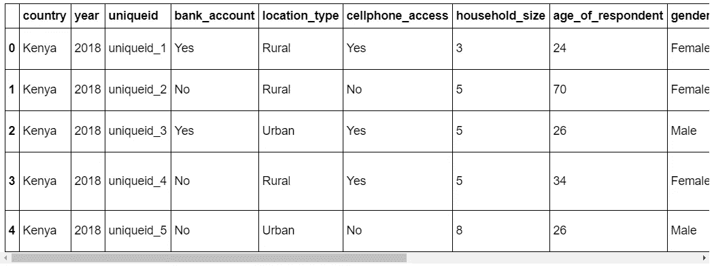*

*理解每个要素的含义非常重要，这样您才能真正理解数据集。点击[此处](https://github.com/Davisy/Exploratory-Data-Analysis-/blob/master/data/VariableDefinitions.csv)获取数据集中每个特征的定义。*

*通过使用 pandas 的 **info()** 方法，我们可以获得更多关于这些特性的信息。*

*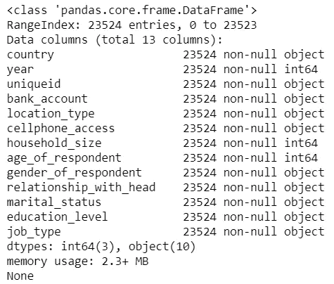*

*输出显示变量/特征、大小的列表，如果它包含每个变量的缺失值和数据类型。从数据集中，我们没有任何缺失值，我们有 3 个整数数据类型的特征和 10 个对象数据类型的特征。*

*如果您想了解如何处理数据集中的缺失数据，我推荐您阅读 Jason Brownlee 的文章“[如何使用 python](https://machinelearningmastery.com/handle-missing-data-python/) 处理缺失数据”。*

## *4.单变量分析*

*在本节中，我们将进行单变量分析。这是分析数据的最简单形式，我们单独检查每个**变量。**对于分类特征，我们可以使用频率表或柱状图来计算特定变量中每个类别的数量。对于数字特征，概率密度图可用于查看变量的分布。*

*以下代码显示了 **bank_account** 变量中的唯一值，其中“是”表示此人有银行账户，“否”表示此人没有银行账户。*

```
*# Frequency table of a variable will give us the count of each category in that Target variable.
data['bank_account'].value_counts()* 
```

*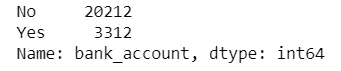**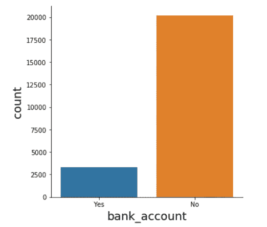*

*数据显示，在我们的目标变量中，有大量的**无**阶层，而不是**有**阶层，这意味着大多数人没有银行账户。*

*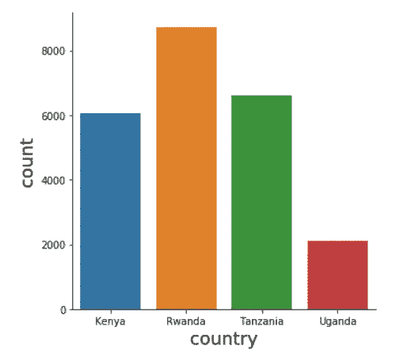*

*上图中的国家特征显示，大部分数据是在卢旺达收集的，在乌干达收集的数据较少。*

*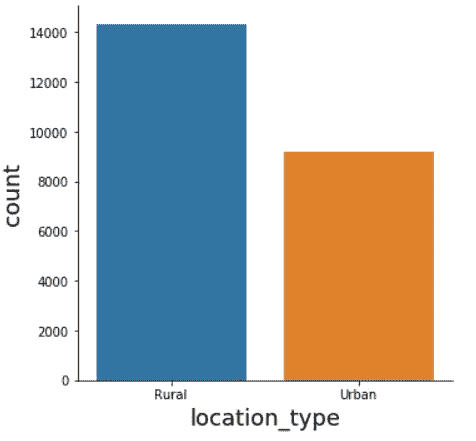*

*在 Location_type 特性中，居住在农村地区的人比居住在城市地区的人多。*

*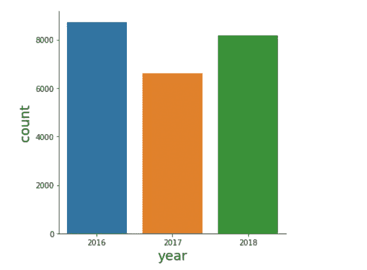*

*在今年的专题中，大部分数据是在 2016 年收集的。*

*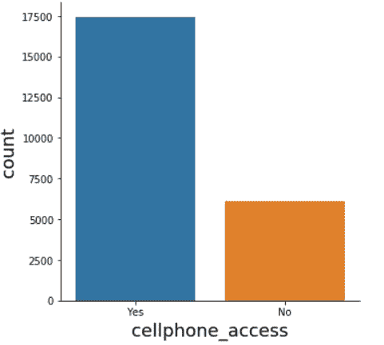*

*在手机访问功能中，大多数参与者都可以访问手机。*

*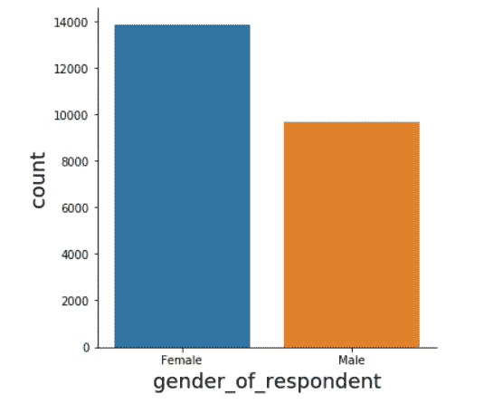*

*在受访者的性别特征中，女性多于男性。*

*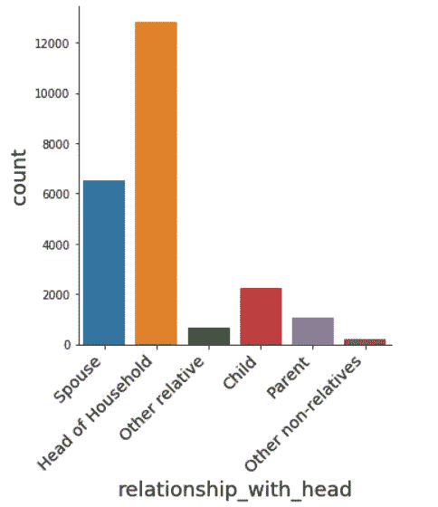*

*在“与户主的关系”功能中，我们有更多的户主参与者，很少有其他非亲属参与者。*

*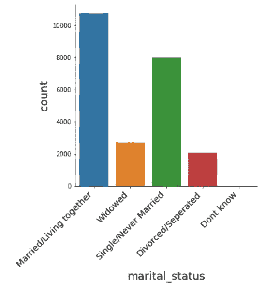*

*在婚姻状况特征中，大多数参与者是已婚/同居的。*

*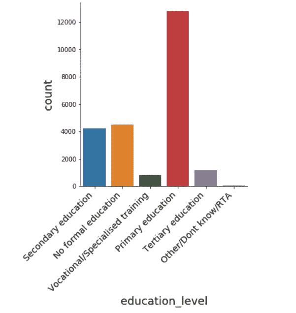*

*在教育水平方面，大多数参与者都有小学教育水平。*

*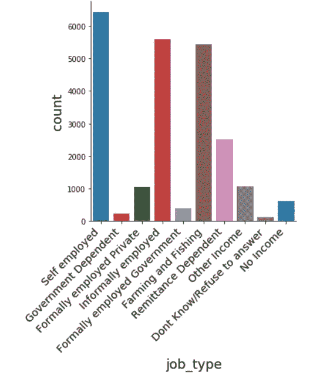*

*在 job_type 功能中，大多数参与者都是自由职业者。*

*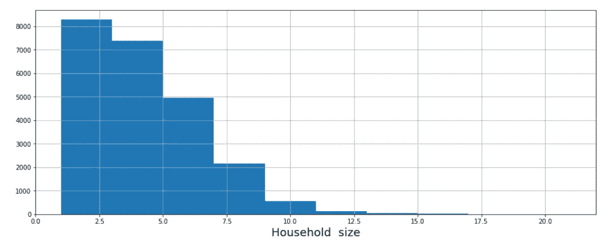*

*家庭规模不是正态分布的，最常见的居住人数是 2 人。*

*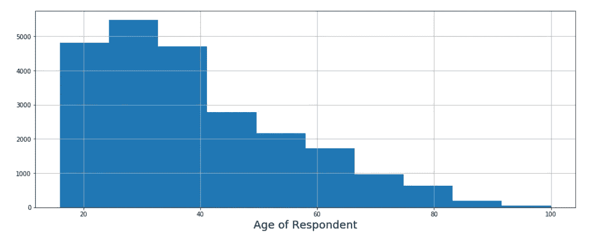*

*在我们最后一个名为“受访者年龄”的专题中，大多数参与者的年龄在 25 岁至 35 岁之间。*

# *5.双变量分析*

*双变量分析是对两个变量(属性)的同时分析。它探讨了两个变量之间的关系的概念，是否存在关联和这种关联的强度，或者两个变量之间是否存在差异以及这些差异的意义。*

*在单变量分析中单独研究了每个变量后，我们现在将再次研究它们与目标变量的关系。*

**

*从上面的情节，你可以看到大多数生活在农村地区的人没有银行账户。因此，我们在假设生成过程中做出的假设是有效的，即生活在农村地区的人拥有银行账户的机会很低。*

*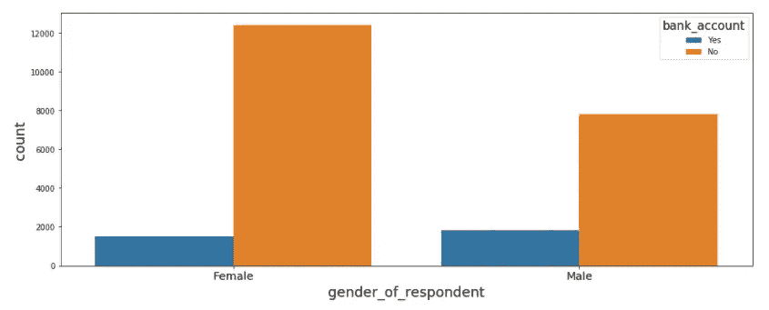*

*在上面的图中，我们尝试将目标变量(银行账户)与回答者的性别进行比较。该图显示，拥有银行账户的男性和女性之间存在微小差异(男性数量大于女性)。这证明了我们的假设，即女性拥有银行账户的机会较少。*

*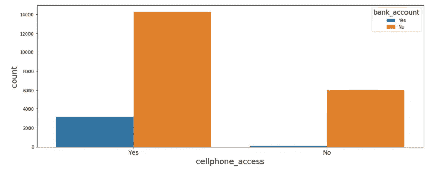*

*手机上网图显示，大多数人有手机上网，但没有银行账户。这证明了使用手机的人使用银行账户的几率较低。其中一个原因是移动支付服务的可用性，尤其是对于生活在农村地区的人来说，这种服务更容易获得，也更便宜。*

*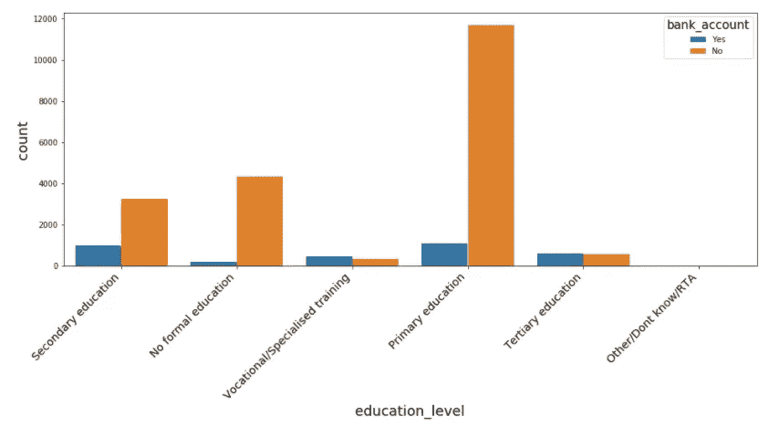*

*教育水平图表明，大多数人受过小学教育，而且大多数人没有银行账户。这也证明了我们的假设，受教育程度较低的人拥有银行账户的几率较低。*

*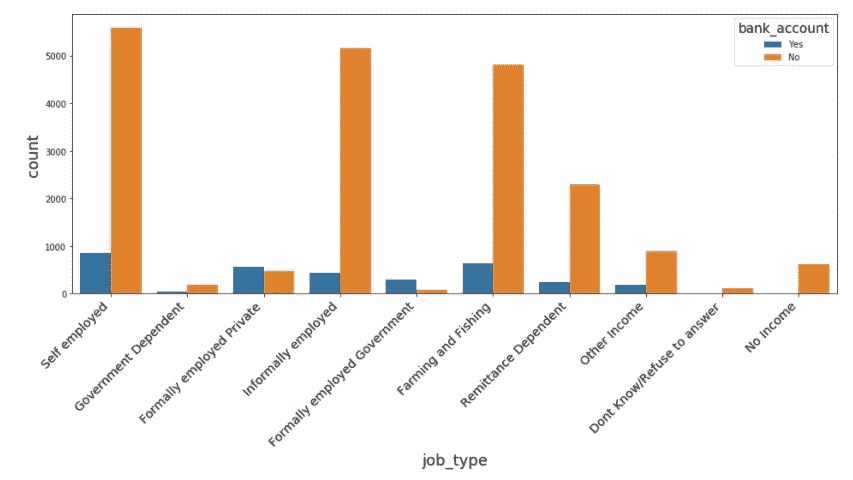*

*工作类型图表明，大多数自营职业者没有银行账户，其次是非正规就业者以及农业和渔业从业者。*

*现在，您了解了在尝试探索和发现数据集中的见解和隐藏模式时可以采取的重要步骤。通过比较数据集中呈现的独立要素之间的关系，您可以更进一步。*

*但是，如果数据集的要素(列)超过 100 个，该怎么办呢？你认为通过尝试逐个分析每个单独的特征将是最好的方法。？数据集中有许多要素意味着需要花费大量时间来分析和发现数据集中的细节。*

*解决这个问题的最好方法是使用最新的 python 包 [data profiling 包](https://github.com/pandas-profiling/pandas-profiling)。该软件包将加快探索性数据分析步骤。*

# *数据分析包*

*概要分析是一个帮助您理解数据的过程，pandas 概要分析是一个 python 包，它可以完成这一任务。这是对熊猫数据框架进行探索性数据分析的一种简单而快速的方法。*

*熊猫 **df.describe()** 和 **df.info()** 函数通常被用作 EDA 过程的第一步。但是，它只是给出了数据的一个非常基本的概述，对于大型数据集没有太大的帮助。另一方面，pandas profiling 函数使用 **df.profile_report()** 扩展了 pandas DataFrame，以便进行快速数据分析。*

*Pandas profiling 为您的数据集生成一份完整的报告，其中包括:*

*   *基本数据类型信息。*
*   *描述性统计(平均值、中位数等。).*
*   *普通价值观和极端价值观。*
*   *分位数统计(告诉您数据是如何分布的)。*
*   *数据的直方图(用于可视化分布)。*
*   *相关性(显示相关的特征)。*

## *如何安装软件包*

*有三种方法可以在你的电脑上安装 pandas-profiling。*

*您可以使用 pip 软件包管理器通过运行。*

```
*pip install pandas-profiling*
```

*或者，您可以直接从 Github 安装:*

```
*pip install https://github.com/pandas-profiling/pandas-profiling/archive/master.zip*
```

*您可以使用 conda 软件包管理器通过运行。*

```
*conda install -c conda-forge pandas-profiling*
```

*安装完软件包后，现在您需要通过编写以下代码来导入软件包。*

*现在，让我们使用刚刚导入的包进行 EDA。我们既可以在笔记本环境中打印输出，也可以将其保存到 HTML 文件中，供任何人下载和共享。*

*在上面的代码中，我们将数据对象添加到将生成报告的 ProfileReport 方法中。*

*如果要生成 HTML 报告文件，请将 ProfileReport 保存到对象中，并使用 to_file()函数:*

*现在，您可以在浏览器中打开 eda_report.html 文件，并观察包生成的输出。*

*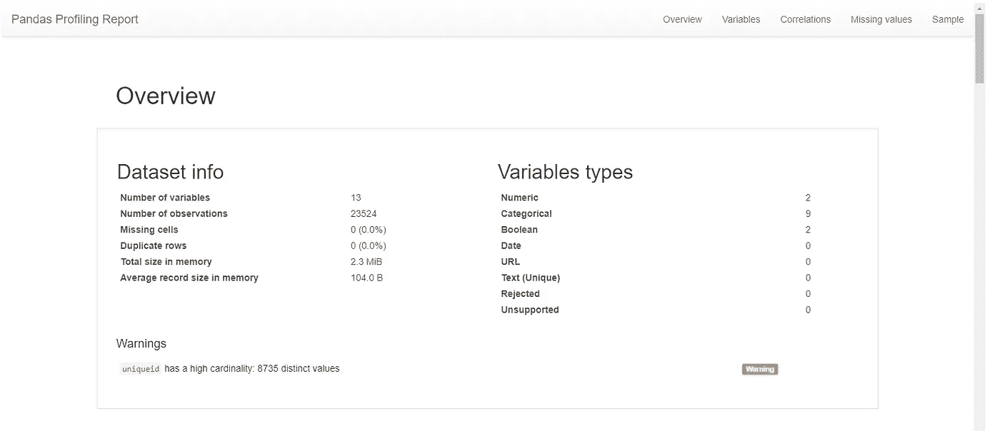*

*熊猫-生成的分析报告*

*上图显示了生成的报告中的第一个输出。你可以点击 **查看整个报告[。](https://github.com/Davisy/Exploratory-Data-Analysis-)***

# ***结论***

*您可以按照本文中提供的步骤在数据集中执行探索性数据分析，并开始发现数据集中的见解和隐藏模式。请记住，数据集来自具有不同数据类型的不同来源，这意味着您需要应用不同的方法来浏览数据，如时间序列和文本数据集。*

*如果你学到了新的东西或者喜欢阅读这篇文章，请鼓掌👏并分享给其他人看。也可以随意发表评论。在那之前，下一篇文章再见！*