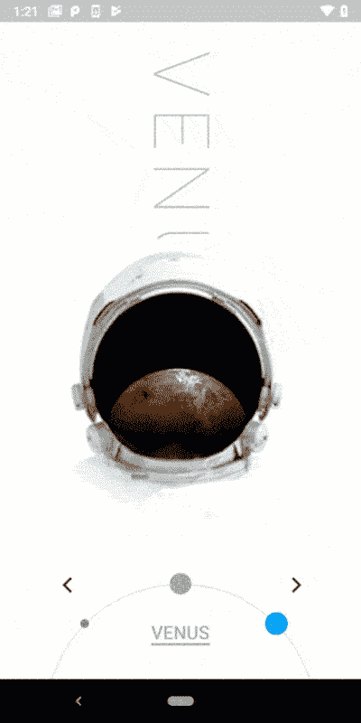
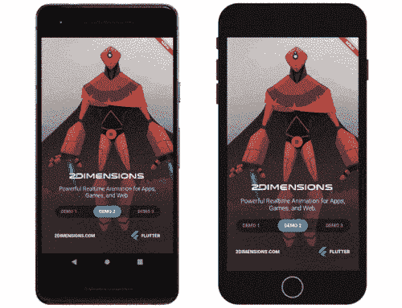

# 为什么要在 2020 年学习 Flutter？手机 App 开发的最新进展和未来。

> 原文：<https://medium.com/analytics-vidhya/why-you-should-learn-flutter-in-2020-the-latest-progress-and-future-of-mobile-app-development-d8885fefcdad?source=collection_archive---------12----------------------->

> Flutter 可以让你控制屏幕上的每一个像素，其强大的合成功能可以让你无限制地叠加和动画图形、视频、文本和控件

# 什么是颤振？

Flutter 移动应用程序 SDK 是一种构建快速、漂亮的移动应用程序的新方法，可以帮助开发人员摆脱过去常见的“cookie cutting”应用程序。尝试过的人都很喜欢。

Flutter 是 Google 提供的一个优秀的跨平台框架，可用于构建移动、桌面和 web 平台的应用程序。2018 年 12 月正式发布，不到一年时间在 GitHub 和 StackOverflow 上获得了比 React Native 更多的知名度。在所有这些热潮的背后，有一个很好的理由来学习这个移动应用程序开发框架，本文解释了为什么。

# **1。颤振及其快速增长。**

相信关注我们的开发者对 Flutter 已经很熟悉了:它是 Google 主导的多平台 UI 工具包，在最近的 I/O 大会上已经进入 1.12 版本。其优势可以概括为四个方面:

## **美丽的**

飘动是美丽的。Flutter 可以让您控制屏幕上的每个像素，其强大的合成功能可以让您无限制地叠加图形、视频、文本和控件并制作动画

当 Flutter 构建应用程序时，它允许开发者**实现 UI** 的像素级控制。这也意味着可以完美执行最初的设计意图，从而忠实地向用户传达品牌个性。

## **快**

颤动速度超快。

Flutter 的 **UI 渲染性能非常强大**。在生产环境中，Flutter 将代码编译成机器代码来执行，并充分利用 GPU 的图形加速能力，因此使用 Flutter 开发的移动应用程序即使在低配手机上也可以实现每秒 60 帧的 UI 渲染速度。

Flutter 既“美”又“快”的原因在于它的架构。Flutter 引擎是用 C ++编写的，包括高效的 Skia 2D 渲染引擎、Dart 运行时和文本渲染库。这个引擎使 Flutter 框架能够自由、灵活、高效地绘制 UI 组件。应用程序开发人员可以使用 Flutter 框架轻松实现各种设计语言和动画效果。

## **高效**

热重装允许开发人员在修改界面后立即看到相应的变化

对于开发者来说，**用 Flutter 开发应用非常高效**。Flutter 广受好评的热重新加载特性可以在不到一秒的时间内实现代码到 UI 的更新，从而大大缩短开发周期。此外，热重装可以在执行过程中保留应用程序的当前状态(即有状态)。例如，您可以修改导航结构中的子页面。保留状态的热重新加载可以使您不必从头开始单击返回到此子页，并在代码修改完成后立即看到结果。

## **开源**

Flutter 是开源的。

Flutter 的 GitHub 回购

**Flutter 是开放的**，是一个完全开源的项目。世界各地的开发者可以免费使用和扩展 Flutter 的源代码，并为 Flutter 的生态和文档做出贡献。我们看到许多开发者活跃在社区中，为 Flutter 做出了坚实的贡献。

## **颤振发展**

在 StackOverflow 的 2019 年全球开发者调查问卷中，Flutter 被选为最受开发者欢迎的框架之一，超过了 TensorFlow 和 Node.js。

全球很多大家熟悉的品牌都采用了 Flutter，包括国内很多知名公司。例如，阿里巴巴有许多移动应用程序都推出了 Flutter 版本。

颤振创造全球大奖作品(flutter.dev/create)

来自多家公司的开发人员已经向 Flutter 代码库提交了 Pull 请求。特别是一个来自阿里巴巴的开发者，在今年 2 月的一周内，他合并的 pr 比 Flutter 团队的任何其他成员都多。Flutter 欢迎每一位开发者以多种方式参与 Flutter 的开发过程，包括在 GitHub 上提交问题和 PRs。

Flutter 已经在移动上证明了自己的技术和开发经验。Flutter 不仅仅适用于移动应用。Flutter 团队也已经在去年的 I/O 大会上公开了 Flutter for Web 的技术预览。他们也已经开始在桌面和嵌入式系统上进行实验性探索。他们的长期目标是让 Flutter 在所有配备屏幕的设备上提供出色的用户体验——甚至是充满创意的大型互动装置。

# **2。多平台愿景:为网络而战**

从丹麦可以看出，用 Flutter 开发的移动和 web 应用程序的体验几乎是一样的

Flutter for Web 的目标之一是让开发人员能够轻松地重用移动代码。关于 Flutter for Web 的很多技术细节，比如架构设计和渲染机制的选择，Flutter 团队在去年的《蜂鸟:Web 中的 Flutter》一文中已经有详细介绍，感兴趣的朋友可以深入阅读，下面简单介绍一下 Flutter 在移动端和 Web 端的一些异同:

**Flutter 在 Web 上的技术实现:**

**Flutter 在 Web 上的技术实现**

如上图所示，在移动端，C ++引擎由 Flutter 中的上层框架通过 dart: ui 库调用。Dart: ui 这个库很低级，它没有 ui 组件的概念，也不知道 UI 布局或者动画。它只做一件事，就是把上边框生成的图片对象绘制到屏幕上

颤振腹板发动机

Flutter for Web 保留了 Flutter 框架的代码，以最大限度地重用移动和 Web 代码。但是为了能够在浏览器中运行颤振程序，Web 端的颤振 SDK 用颤振 Web 引擎替换了移动端的 C ++颤振引擎。这个 Flutter Web 引擎在 Web 平台上提供了 dart: ui 库的实现。它做的事情类似于移动 dart:ui——“绘制”由 Flutter 上层框架生成的图片对象到网页上。

具体来说，Flutter Web 引擎首先使用 HTML 和 CSS 来绘制图像。这样可以利用浏览器自身的性能优化机制，缩放页面时也不用担心像素化问题。只有在少数情况下，Flutter Web 引擎使用 Canvas 来实现绘图。我们目前正在尝试使用 CSS Paint API 代替 Canvas drawing 来提高性能。不过这个 API 比较新，需要各大浏览器支持。

但回到上层逻辑，代码复用的优势开始显现 Flutter Web 引擎使用与 mobile 一致的 Flutter 框架构建 widgets，实现 UI 布局。此外，我们使用 Dart2js 编译器将 Dart 语言转换为 JavaScript。

**腹板颤振的定位和使用场景**

第一个用例是使用 Flutter for web 为现有的移动应用程序开发一个 Web 端的配套应用程序。很多产品都是移动优先，但是在某些场景下，移动端有一定的局限性，比如屏幕太小，文字输入麻烦。这时候很多厂商会开发一个 Web 端的配套应用，利用桌面电脑的输入输出设备来提高交互效率(这样的例子很多，比如微信就有 Web 端的配套应用)。

第二个场景是使用 Flutter for Web 来利用现有 Flutter 移动项目中的交互元素。上面显示的颤动的移动应用程序是谷歌广告。它有很多动态的、交互式的图表，实现起来比较复杂。使用 Flutter for Web，您可以在 Web 应用程序中重用这些代码。类似的交互元素还包括一些小游戏和工具应用，比如日历、汽车配置向导、投资组合分析工具等。

Flutter for Web 在 Widget 层面与移动端高度一致，所以代码重用性非常好。图像渲染的结果也高度一致。开发调试时，可以使用 Dart DevTools，支持热重装。虽然在开发体验上还有很多工作要做，但目前处于基本可用的状态。

为 Web 开发经验而战

Flutter for Web 几乎准备接管 Web 开发行业

# **3。生态建设:与社区共建的国家管理解决方案**

Flutter 使用类似于 React 的反应式编程模型。运行时 UI 的视觉变化由应用程序的状态驱动:

颤振反应规划模型

这个状态应该放在应用程序的什么地方，如何更新和读取，这是状态管理的问题。颤振团队在官网上总结了比较主流的状态管理方法和代码包。开发者可以根据不同应用的具体需求选择使用:

颤振状态管理解决方案清单

[https://flutter . dev/docs/development/data-and-back end/state-management/options](https://flutter.dev/docs/development/data-and-backend/state-mgmt/options)

不过，对于没有复杂需求的开发者或初学者，Flutter Team 也推荐其中一个状态管理包:provider。这个状态管理解决方案是由 Flutter 社区的一名成员提供的。

在 provider 发布之前，Google 团队实际上做了一个类似想法的状态管理包，叫做 provide。但是对比之后，我发现这个社区贡献的包可以解决同样的问题，而且更容易上手。

**包:提供方的工作机制**

下面的示例程序包含三个不同的页面:登录、产品列表和购物车。用户向产品列表添加一些商品后，购物车中的金额需要自动更新。但是，在反应式编程模型下，产品列表页面中的代码不能直接修改购物车中的数据。

解决这个问题的一个基本思路是将两个页面共享的数据放在 UI 组件树的顶部。提供者提供了一种机制来管理由多个节点共享的应用程序状态。这一机制包括三个基本步骤:

首先，我们定义一个继承自 ChangeNotifier 的 CartModel 来读写购物车中的数据。ChangeNotifier 是 Flutter SDK 中的一个简单类。它可以使用 notifyListeners 方法向侦听器发送通知。在这个例子中，每当一个商品被放入购物车，CartModel 就会通知它的监听器。

然后我们需要使用 ChangeNotifierProvider 小部件。它可以返回特定类型的 ChangeNotifier，并将其提供给小部件。在本例中，我们将 ChangeNotifierProvider 放在 MyApp 上面的节点上，这样列表和购物车页面都可以读写 CartModel 中的数据。当需要它的状态时，我们可以使用消费者类来获取它的实例。

这里我们需要指定要访问的数据类型。在这个例子中，我们使用消费者<cartmodel>来指定对 CartModel 类型的访问。在消费者的构建器函数中，我们可以获得 CartModel 的一个实例，并使用它来更新要在购物车中显示的总价。</cartmodel>

使用 UI 树顶部的 ChangeNotifierProvider 使 CartModel 类在产品列表和购物车页面上都可用。然后在需要使用 CartModel 操作其中的状态数据来更新 UI 的子节点中实例化这个类。

# **4。开发经验:“UI 即代码”**

Flutter 团队一直非常重视 Flutter 的开发体验，因此他们在提高 Flutter UI 代码的可读性方面做了一系列的尝试，包括 Dart 语法的改进和 IDE UI 的改进。这些统称为 UI 代码。

Flutter 的 UI 代码使用了 Dart 语言，具有以下优点:

*   Flutter 的声明式 UI 编写方法可以直观的描述 UI 结构
*   不需要学习 UI 布局的额外语法
*   不需要在代码之外维护 UI 定义文件

但是以前的实现方法也有几个值得改进的地方:

*   复杂的 UI 逻辑使用命令式语法，打破了代码结构和 UI 视觉结构的一致性
*   理解多层嵌套后 UI 的组成并不容易

最近他们做了一些成功的改进，包括 Dart 2 中针对 UI 编程优化的新语法元素，以及 IDE 中的编辑器 UI 指南。

**飞镖 2 的改进**

在 Dart 2 中，他们在集合中添加了控制流元素，可以在集合数据类型的定义中使用 if 和 for 等流控制元素。此外，还增加了对扩展运算符的支持。

**IDE 的改进**

对于开发者日常使用的 ide，希望开发者不用改代码就能一眼看到 UI 的结构。flutter 团队在这方面所做的改进是编辑器 UI 指南:

这个功能现在在最新版本的 IntelliJ 和 Android Studio 插件中是默认启用的，需要在 VS 代码中的设置中启用。

# 所以，“对 Flutter 来说，有什么新的和令人兴奋的？”"

如果有人问你关于 Flutter 的问题，现在你知道如何回答他们了:

*   没有 JavaScript 桥的反应式视图的好处
*   快速、流畅、可预测；代码将 AOT 编译成本机(ARM)代码
*   开发者可以完全控制小部件和布局
*   拥有漂亮的、可定制的部件
*   优秀的开发工具，惊人的热重装
*   更高的性能、更多的兼容性、更多的乐趣

你注意到我从这张单子上去掉了什么吗？当人们谈论颤振时，这通常是人们提到的第一件事，但对我来说，这是关于颤振最不有趣的事情之一。事实上，Flutter 可以从单个代码库为多个平台构建漂亮、快速的应用程序。当然，这应该是给定的！这是可定制和可扩展的，并且它使得在不牺牲性能或功耗的情况下针对多个平台的颤振变得容易。