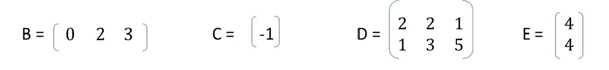

# 作为数据科学初学者，为什么应该学习线性代数

> 原文：<https://medium.com/analytics-vidhya/why-you-should-learn-linear-algebra-as-a-data-science-beginner-6bc5cea11ebd?source=collection_archive---------28----------------------->

一般来说，线性代数的概念对于图像处理、密码学、图形学、机器学习和数据科学是必不可少的。线性代数的应用领域非常广泛。但是，每一个数据科学尤其是机器学习领域的专业人士，都必须对线性代数有所了解，以及如何应用线性代数解决问题。仅仅学习概率和统计并止步于此是不行的。

**目录**

*   向量空间
*   线性依赖/独立
*   正交性
*   矩阵
*   特征值和特征向量

我们开始吧👍

**向量空间**

首先，向量空间是称为向量的对象的集合，这些对象可以加在一起并乘以称为标量的数字。

*x* 和 *y* 是矢量。每当你得到一组向量时，很自然会问它们是否可以用彼此的线性组合来表示，即它们是线性相关还是独立的。

**线性相关性**

如果存在不全等于零的 m 个标量系数α1、α2、…、αm，并且使得:

否则向量是独立的。

等价地，我们可以将线性相关集合中的至少一个向量表示为其余向量的线性组合，这与线性无关集合不同。

**正交性**

线性代数中的一个重要概念是正交性。如果( *x* ， *y* ) = 0，则两个向量 *x* 和 *y* 正交

对于所有的集合 S，如果( *x* ， *s* ) = 0，则向量 x 正交于集合 S

S1、S2 两组是正交的，如果对于任一组 *x* ES1， *y* ES2，则( *x* ， *y* ) = 0

(E 表示它是的一个元素)

**矩阵**

矩阵是一个矩形阵列(一个范围或显示🔢)的数字，例如:

它的大小由(行维)x(列维)给出。上面的矩阵是 3 x 3，因为它包含 3 行 3 列。矩阵中的元素也称为元素或系数。

给定一个 m 矩阵；

Bij 可以用来表示它们的行和列索引，其中 I 是行索引，j 是列索引。索引从 1 开始。

**矩阵的行列式**

矩阵的行列式是一个标量值，可以从方阵的元素中计算出来。

**矩阵形状**

*   两个矩阵相等，如果它们的大小相同，比如说 *m* = *n* (也称为*方阵*)
*   如果 *m* > *n* ，高矩阵是可能的
*   而宽若*米*米<米*米*

**分块矩阵**

我们可以形成这样的分块矩阵:

b、C、D 和 E 是矩阵(称为 A 的*子矩阵*或*块)*

**注意**:

*   每个模块行中的矩阵必须具有相同的高度(*行尺寸*)
*   每个块列中的矩阵必须具有相同的宽度(*列尺寸*)

**示例**:

然后；

**转置**

矩阵 A 的转置表示为 A，其定义为:

**因而:**

转置将列转换为行，反之亦然。A 的转置的转置是 A .像这样；(^T) ^T=

**矩阵的加法和减法**

我们可以像向量一样增加或减少相同大小的矩阵。看看这个。记住 I 和 j 代表行和列。

**注意以下属性:**

**矩阵乘法**

study.com

我们可以将 *m* x *p* 矩阵 A 和 *p* x *n* 矩阵 B 相乘得到 c。

要得到 Cij，沿着 A 的第 I 行，b 的第 j 列移动。

**特征值和特征向量**

图片来自:yutsumura.com

我太兴奋了💃谈论特征值和特征向量，因为它们是数据科学尤其是机器学习中最实用和最适用的领域之一。在我们继续之前，我想告诉你一些它在现实生活中的应用:

*   **设计汽车音响系统:**特征值分析也用于汽车音响系统的设计，它有助于再现汽车因音乐而产生的振动。
*   **电气工程:**特征值和特征向量的应用对于通过对称分量变换实现三相系统的解耦很有用。
*   **石油公司**频繁使用特征值分析来勘探石油用地。石油、灰尘和其他物质都会产生具有不同特征值的线性系统，因此特征值分析可以很好地指示石油储量的位置。
*   **机械工程:**特征值和特征向量允许我们将一个线性运算“化简”为单独的、更简单的问题。例如，如果一个应力施加在一个“塑性”固体上，变形可以分解成“主方向”，即变形最大的方向。

所以你看，你的特征值知识不仅会帮助你在数据科学家的职业中脱颖而出，而且你将能够在不同的领域工作，如机械工程，石油化工，等等。这难道不是想要学习特征值和向量的足够理由吗？我想那是肯定的！

在线性代数中，线性变换的特征向量或特征本征是一个非零向量，当对其应用线性变换时，它最多改变一个标量因子。相应的特征值是特征向量缩放的因子。说够了，让我们开始工作吧！

设 FA(λ) = det(A — λI)

然后；

*   a 是矩阵
*   fA(λ)是 n 次多项式
*   det 是决定因素
*   λ是标量
*   I 是单位矩阵

为了清楚起见，让我们解决一个例子，同时这个例子也有帮助；

mathisfun.com

det(A) = ad — bc(这就是我们如何找到一个 2 x 2 矩阵的行列式)

我们也能找到踪迹。tr(A) = a + d，tr 表示迹线。

从而数学上；

= (a — λ) ( d — λ) — (b c)

=λ2-(a+d)λ+ad—b c

= λ2 — tr(A)λ + det(A) = 0

你注意到矩阵的行列式是它们的特征值的乘积了吗？

让我们用实数来解决一个问题，以便更好地理解。

= (1 — λ)(4 — λ) + 2

= λ2–5 λ + 6

回想一下特征方程|A — λI| = 0，其中特征多项式为 fA(λ) = det(A — λI)

因此，λ2–5λ+6 = 0(二次求解)我们有 2 和 3 是我们的特征值；λ 1 = 2，λ2 = 3。特征值相乘(2 x 3 = 6)就可以求出行列式。所以我们的行列式是 6。但这不是我们现在要找的。

假设 a 和 b 是我们的特征向量(你可以假设任何字母)，我们将使用特征值找到特征向量

x 是特征值λ1 = 2 对应的特征向量

从|A — λI|开始，我们用|A — 2I|替换它

-a–b = 0，(等式 1)

2a + 2b = 0，(等式 2)

从(等式 2)我们得到 a + b = 0，设 b = 1 ( b 可以是任何数，最好是较小的数，因为它们更容易计算。我们得到一个= -1

因此，特征值λ1 = 2 的特征向量分别为-1 和 1。你可以用同样的方法计算λ2 = 3。

这不仅仅是关于特征向量。很广，不是一天就能治疗好的。你应该尝试研究更多的线性代数，并应用于你的问题解决💯

**参考文献:**

吉尔伯特·斯特朗教授的线性代数及其应用

https://www.cpp.edu/~manasab/eigenvalue.pdf

[https://en . m . Wikipedia . org/wiki/特征值和特征向量#:~:text =几何% 2C % 20ananan %特征向量% 2C % 20 对应%20to，负% 2C % 20 方向%20is%20reversed](https://en.m.wikipedia.org/wiki/Eigenvalues_and_eigenvectors#:~:text=Geometrically%2C%20an%20eigenvector%2C%20corresponding%20to,negative%2C%20the%20direction%20is%20reversed) 。