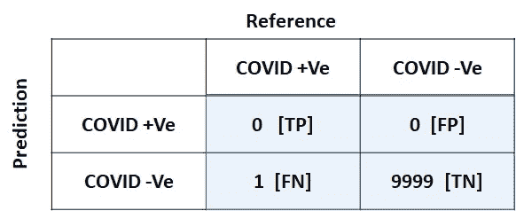

# 为什么你应该着眼于准确性！！

> 原文：<https://medium.com/analytics-vidhya/why-you-should-look-ahead-of-accuracy-bbf79d4e909a?source=collection_archive---------27----------------------->

卢克·切瑟在 [Unsplash](https://unsplash.com?utm_source=medium&utm_medium=referral) 上的照片

大家好，在机器学习领域，模型性能评估是一个关键阶段。根据评估，我们最终决定是否部署我们的模型。研究人员和实践者使用各种度量来评估他们的模型。根据问题的性质，指标可能会有所不同。例如:我们对分类模型使用准确度、精确度、召回率，对机器翻译模型使用 BLEU、Meteor 和 Rouge。这篇文章将关注分类标准，并看看准确性分数如何误导你。众所周知，当我们评估一个分类模型时，我们不应该只满足于准确度分数。在这里，我将用一个新冠肺炎测试场景的例子向大家解释。新冠肺炎测试可以被建模为具有两类(+ve，-ve)的分类问题。

**场景:**一个研究实验室(RLd)开发了一个测试套件(TKT)来识别新冠肺炎+ve 人群。在推出 TKT 之前，需要进行临床试验。RLd 联系医院进行试验。医院向 RLd 提供了 9 名受试者(新冠肺炎+ve，-ve)的所需数据。接下来，RLd 使用这九名受试者的数据进行测试。在图 01 中，参考集代表受试者的实际状态。参考集中只有一个 COVID +ve(点 5)。RLd 在测试后得到预测集。现在我们将计算精度，并分析与之相关的问题。

图 01 临床试验

准确率= *#正确预测数/ #总预测数* = 8/9 = **88.88 %，** RLd 的 TKT 达到了 88.88 %的准确率，是很不错的一个。让我们把它变得更现实些。假设我们的参考集中有 10000 个患者，只有一个是 COVID +ve。TKT 预测所有 10000 个都是 COVID -ve。现在，准确率是 99.99 % (9999/10000)。我们已经达到了接近 100%的准确率。是不是很棒！！！！！！TKT 只做了一次错误的预测，但那是一次非常关键的预测。如果 TKT 预测患者 COVID -ve，实际上是+ve，这将是非常危险的。感染者也会传染给其他人。因此，我们必须向前迈进，寻找一些其他指标，以获得 TKT 的真实表现。

首先，我们创建一个叫做混淆矩阵的表格(图 02)。阴影部分是我们的主矩阵，其余部分是元数据。

图 02 混淆矩阵

**TP** (真正):预测+ve 但实际上也+ve 的实例数。在我们的例子中，只有一个+ve，TKT 没有预测任何一个实例为+ve，因此 TP = 0

**FP** (误报):预测+ve 实际-ve 的实例数。在我们的例子中，只有一个+ve，TKT 没有预测任何一个实例是+ve，因此 FP = 0

**FN** (假阴性):预测为-ve 但实际为+ve 的实例数量。在我们的例子中，只有一个+ve，TKT 预测它为-ve，因此 FN = 0

**TN** (真负值):预测为-ve 但实际上也为-ve 的实例数。在我们的例子中，有 9999 -ve，而 TKT 没有把它们都预测为-ve，因此 TN = 9999

精确度:我们的模型(TKT)多精确啊！！！在所有预测的+ve 实例中，有多少实际上是+ve。

回忆:我们的模型能回忆得多好！！！有多少实际的+ve 实例被预测为+ve。

我们可以看到 TKT 的召回率为零。TKT 记不起实际的+ve 实例是+ve。为了精确，我们得到 NA(0/0)。说明我们的模型肯定有问题。一般来说，精度为 NA 表示模型没有预测到一个实例为+ve。同样令人怀疑的是，reference 不会包含+ve 实例。因此，这是 TKT 或任何其他分类模型的正确度量。

这里我们只讨论了一个两类问题(+ve，-ve)。我们可以用大小为 N*N 的混淆矩阵将其扩展到 N 个类。理想情况下，除了混淆矩阵中的对角线值之外，所有值都必须为零。

我们只讨论了精度和召回率。如果你想探索更多的指标，这里有一些重要的链接:[1][https://en.wikipedia.org/wiki/Confusion_matrix](https://en.wikipedia.org/wiki/Confusion_matrix)【2】[https://en.wikipedia.org/wiki/Precision_and_recall](https://en.wikipedia.org/wiki/Precision_and_recall)