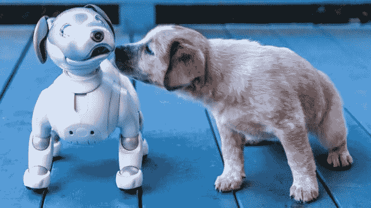
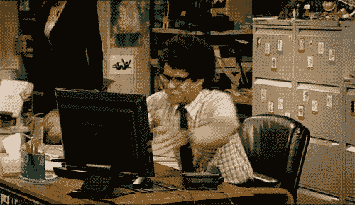
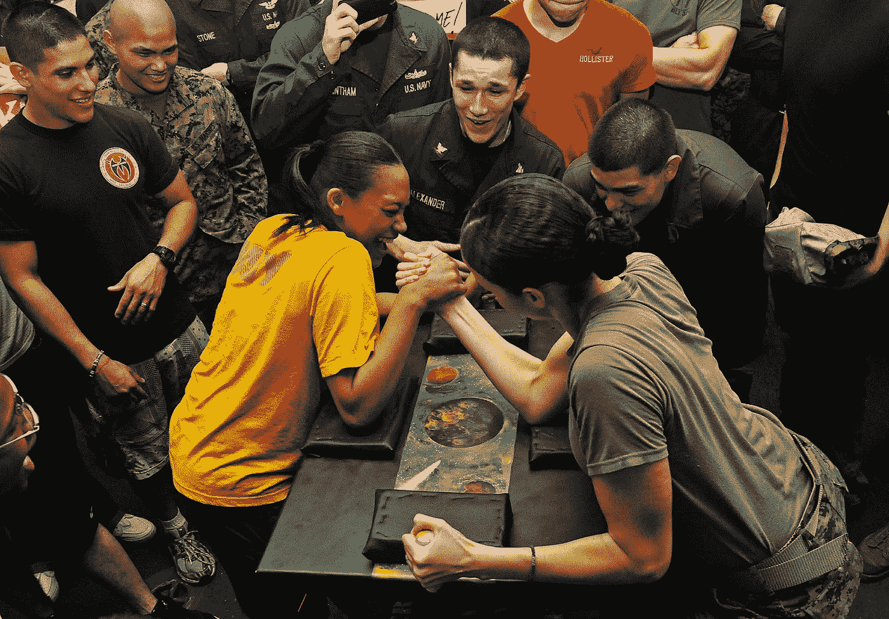

# 为什么当编码变得困难时你不应该放弃

> 原文：<https://medium.com/analytics-vidhya/why-you-shouldnt-quite-when-coding-or-anything-gets-hard-4de543e93299?source=collection_archive---------7----------------------->

## 认识你自己

来源:Pixabay

十大最需要的技术技能中有很大一部分需要某种编程技能。对机器或计算机的日益依赖要求我们告诉它们该做什么或不该做什么。

编程是我们实现这一目标的一种方式。人类的基本能力正在被模拟，以供计算机学习，例如通过自然语言处理来理解情绪，计算机甚至被训练使用神经网络来闻气味。把编程看作是计算机的一个学习过程。

话虽如此，为什么编程有时会很难呢？你有没有走进死胡同，对自己说，我再也不这样了？不要害怕！你不是唯一有这种感觉的人。

出现这种情况的一些原因包括:

*   准确性:编程不允许出错。例如，一些区分大小写的语言，比如 R，可能要花几个小时或几天来调试一个小的大小写错误。你必须遵循一套指令，不容出错。
*   **连贯性:**因为有大量的语法需要学习，所以需要连贯性。然而，你可能需要在两种语言之间转换，当你离开一种语言一段时间后，你不可避免地会忘记语法，一个简单的原因是，当我们离开一种语言时，我们往往会对另一种语言的语法表达产生共鸣。适应的唯一方法就是继续练习。

> 一致性要求你今天和一年前一样无知。
> 
> —伯纳德·贝伦森

还有其他因素，包括学习语言背后的数学，如代数、微积分。Lol，很多人逃离数学，包括我。但是如果没有挑战，那还有什么乐趣呢？

以下是根据[的一些特质 *Brian Feldman 每个优秀的程序员都应该具备的*](https://www.forbes.com/sites/quora/2014/10/31/why-dont-more-people-work-as-programmers/#3813f8bc55c0)*；*

1.  自学——自学的能力。
2.  无限的坚持，继续尝试故障排除、修复和开发。
3.  数学和解决问题的技能
4.  出色的短期和长期记忆

说了这么多，它仍然没有使编程比你开始阅读这篇文章之前更容易，是的，我知道对吗？！然而，它确实使之成为可能。问题是我如何获得这些技能？

大脑在面临挑战时如何工作背后是有科学依据的。 ***我不是什么脑科医生*** 但这应该会有帮助。

我曾经读过一本书，诺曼·多伊格写的《改变自己的大脑》，讲的是大脑如何有能力调整自己以适应特定的环境，或者大脑如何组织自己并开拓新的领域以完成交给它的任务。

> 根据迈克尔·m·梅泽尼奇的说法，大脑是一种有食欲的生物，它可以在适当的营养和锻炼下生长和改变自己。

给自己一点时间，你不会忘记你的想法。

也许你以前演奏过一种乐器，比如说吉他，当你拿起一个特定的音阶来学习时，你会发现你身体的很大一部分需要达到音符，但是随着相同音阶的持续练习，你现在可以很容易地达到它们。你拿起另一个音阶，所需要的身体动作的数量不像你一开始弹吉他时那么多，现在你的整个存在与你的乐器同步共振。这个曾经陌生的工具几乎感觉像是你身体的延伸，因为大脑已经通过映射/开拓新的区域进行了调整，使你能够更有效地执行那个功能。

编程也是一样，无论你是初学者还是其他人，每次学习时，你的大脑都会开始调整。它就像蜗牛啃食一片叶子一样，慢慢开始开拓新的领域。

这就是有趣的地方，每次你走进一个看似死胡同的时候，休息一下，然后回去，坚持解决这个问题，大脑实际上正在花时间适应它发现自己的新情况。因此，把它看作一个知道成长需要过程的生物。其他提示包括:

*   试着使用更多积极的话语，而不是告诉自己消极的话语，比如不可能，你不能告诉自己我可以，我很聪明。把它看作是你的大脑撤退以获取更多的资源，这样你们两个都可以成为一个厉害的团队。
*   想象你自己实际上解决了问题，即使你仍然停留在现实中。想象有办法刺激我们的现实。

> 记住——一个人想什么，他就是什么

资料来源:Pixabay/skeeze

去工作，去踢一些编码屁股！