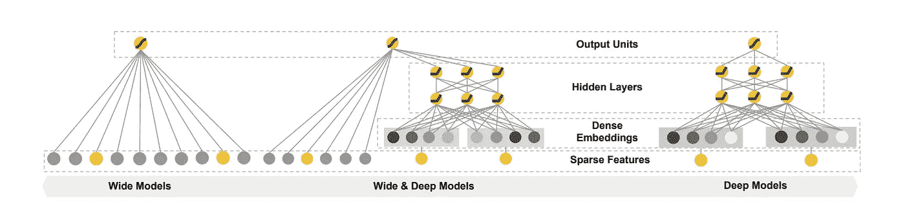

# 推荐系统的广度和深度学习

> 原文：<https://medium.com/analytics-vidhya/wide-deep-learning-for-recommender-systems-dc99094fc291?source=collection_archive---------2----------------------->

[freestocks.org](https://unsplash.com/@freestocks?utm_source=medium&utm_medium=referral)在 [Unsplash](https://unsplash.com?utm_source=medium&utm_medium=referral) 上拍照

本文介绍了[这里](https://arxiv.org/abs/1606.07792)宽&深度学习——提供了一种联合训练宽线性模型和深度神经网络的方法——以结合推荐系统的记忆和概括的优势。它声称已经在 Google Play 上生产和评估了该系统，Google Play 是一个商业移动应用程序商店，拥有超过 10 亿活跃用户和超过 100 万个应用程序。

**声明** —在线实验结果显示，与仅使用 Wide 和仅使用 Deep 的模型相比，Wide & Deep 显著增加了应用获取量。

**作为排名系统的推荐系统**

推荐系统可以被视为一个搜索排名系统，其中输入查询是一组用户和上下文信息，输出是一个排序的项目列表。给定一个查询，推荐任务是在数据库中找到相关的项目，然后根据某些目标(如点击或购买)对项目进行排序。

## **记忆与概括**

**记忆**可以粗略地定义为学习项目或特征的频繁共现，并利用历史数据中可用的相关性。

1.通过广泛的跨产品特征转换来记忆特征交互是有效的和可解释的，而一般化需要更多的特征工程努力。

2.基于记忆的推荐通常更具主题性，并且与用户已经对其执行了动作的项目直接相关。

3.在稀疏特征上使用叉积变换可以有效地实现记忆。这解释了特征对的共现如何与目标标签相关联。

4.叉积转换的一个限制是，它们不能推广到尚未出现在训练数据中的查询-项目特征对。

5.宽线性模型可以使用叉积特征变换有效地记忆稀疏特征交互。

**另一方面，一般化**基于相关性的传递性，探索过去从未或很少出现的新特征组合。

1.通过较少的特征工程，深度神经网络可以通过为稀疏特征学习的低维密集嵌入来更好地概括看不见的特征组合。

2.然而，当用户-项目交互稀疏且排名较高时，具有嵌入的深度神经网络会过度概括并推荐不太相关的项目。

3.一般化倾向于提高推荐项目的多样性。可以通过使用更小粒度的特征来增加一般化，但是通常需要手动的特征工程。

4.对于工业环境中的大规模在线推荐和排名系统，诸如逻辑回归之类的广义线性模型被广泛使用，因为它们简单、可扩展且可解释。这些模型通常使用一键编码在二值化稀疏特征上进行训练。

**密集与稀疏交互**

**在一般化场景**基于嵌入的模型，如因式分解机器或深度神经网络，可以通过学习每个查询和项目特征的低维密集嵌入向量，一般化到以前看不到的查询-项目特征对，具有更少的特征工程负担。然而，当底层查询-项目矩阵是稀疏的和高秩的时，例如具有特定偏好的用户或具有狭窄吸引力的小众项目，很难学习查询和项目的有效低维表示。

在这种情况下，大多数查询-项目对之间应该没有交互，但是密集嵌入将导致所有查询-项目对的非零预测，因此可能过度概括并做出不太相关的推荐。

**记忆场景**

另一方面，具有叉积特征变换的线性模型可以用少得多的参数记住这些“例外规则”。

深度神经网络可以通过低维嵌入推广到以前看不到的特征交互。

**型号**

1.  *宽组件*

宽分量是 y = wT x + b 形式的广义线性模型，如图 1(左)所示。y 是预测，x = [x1，x2，…，xd]是 d 特征的向量，w = [w1，w2，…，wd]是模型参数，b 是偏差。特征集包括原始输入特征和变换后的输入特征。最重要的转换之一是叉积转换，其定义为:

这捕获了二元特征之间的相互作用，并向广义线性模型添加了非线性。

2.*深层组件*

深层组件是一个前馈神经网络，如图 1(右)所示。对于分类特征，原始输入是特征串(例如，“language=en”)。这些稀疏的高维分类特征中的每一个首先被转换成低维和密集的实值向量，通常被称为嵌入向量。嵌入的维数通常在 O(10)到 O(100)的数量级。随机初始化嵌入向量，然后在模型训练期间训练值以最小化最终损失函数。然后，这些低维密集嵌入向量在前向传递中被馈送到神经网络的隐藏层中。具体来说，每个隐藏层执行以下计算:

其中 l 是层数，f 是激活函数，通常为 ReLUs。a(l)、b(l)和 W(l)是第 l 层的激活、偏置和模型权重。

深度神经网络可以通过低维嵌入推广到以前看不到的特征交互。

**宽深部件联合训练**

宽分量和深分量使用它们的输出对数概率的加权和作为预测来组合，然后将其馈送到一个共同的逻辑损失函数用于联合训练。

宽和深模型的联合训练是通过使用小批量随机优化同时将梯度从输出反向传播到模型的宽和深部分来完成的

在实验中，我们使用遵循正则化先导(FTRL)算法，L1 正则化作为模型宽部分的优化器，AdaGrad 作为深度部分的优化器。对于逻辑回归问题，模型的预测是:

其中，Y 是二进制分类标签，σ()是 sigmoid 函数，φ(x)是原始要素 x 的叉积变换，b 是偏差项。w(宽)是所有宽模型权重的向量，w(深)是应用于最终激活 a(lf)的权重。

**联训 vs 合奏**

在集成中，单独的模型在彼此不了解的情况下被单独训练，并且它们的预测仅在推断时而不是在训练时被组合。相比之下，联合训练通过在训练时考虑宽和深部分以及它们总和的权重来同时优化所有参数。

根据该论文，对模型大小也有影响:对于集成，由于训练是不相交的，每个单独的模型大小通常需要更大(例如，具有更多的特征和变换)以实现集成工作的合理精度。相比之下，对于联合训练，宽部分只需要用少量跨产品特征转换来补充深部分的弱点，而不是全尺寸的宽模型。

**训练详情**

在训练期间，输入层接收训练数据和词汇，并生成稀疏和密集特征以及标签。wide 组件由用户安装应用和印象应用的跨产品转化组成。对于模型的深层部分，为每个分类特征学习 32 维嵌入向量。该模型将所有嵌入与密集特征连接在一起，产生大约 1200 维的密集向量。然后，连接的矢量被送入 3 个 ReLU 层，最后是逻辑输出单元。

**结果**

Wide & Deep 模型相对于对照组在 app store 主登陆页的 app 获取率提高了+3.9%(统计显著)。还将结果与仅使用具有相同特征和神经网络结构的模型的深度部分的另一个 1%组进行比较，并且宽&深模式在仅深度模型之上具有+1%的增益(统计显著)。