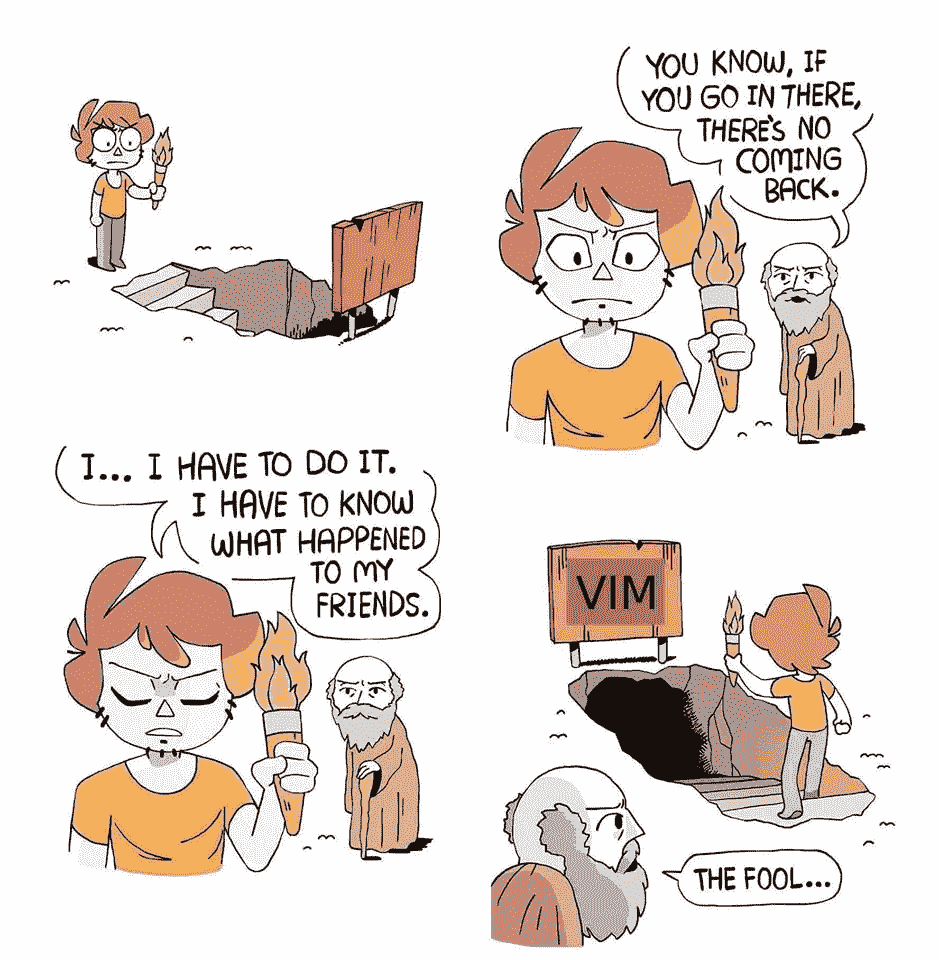
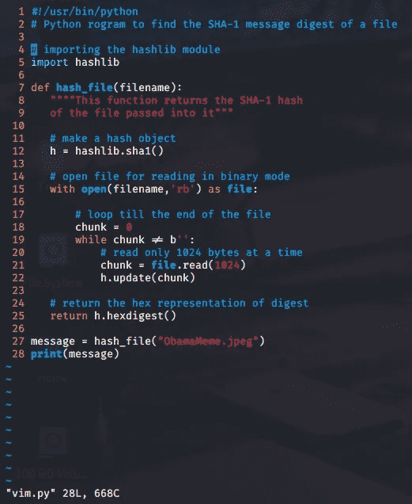

# 你会不会不再害怕“维姆”？

> 原文：<https://medium.com/analytics-vidhya/will-you-stop-fearing-vim-or-not-cb00088dc270?source=collection_archive---------10----------------------->

你遇到过这种情况吗？

您正在遵循一个教程，仔细检查每一个步骤，直到讲师打开 Vim 编辑器来编辑一个文件或创建一个新文件，您心里想:

“哦，又来了”。

giphy.com

然后你用你常用的编辑器打开文件，因为你的大脑在捉弄你，让你认为打开 Vim 编辑器就像打开 Jumanji playbox 一样。

你打开它，噗噗！烦恼和困惑开始从每个角落落下。

我知道这种感觉。不使用 Vim 感觉很尴尬，因为你害怕把事情搞砸。我知道有时候你会问自己，为什么不能像其他人一样使用 Vim。

既然有 Nano 和 Gedit 等其他编辑器，为什么还要为这样的想法而烦恼呢？

我明白。确实如此，但是相信我，Vim 更好。

上个月开始学汇编语言和逆向工程的时候我就意识到了。

我发现 Vim 是一个功能丰富的编辑器，并没有看起来那么复杂。

出于这些原因，我决定写这篇文章，因为我知道有些人就像我过去一样，他们总是避免使用 Vim editor，因为害怕不再退出。我知道在我职业生涯的某个时刻，我会处于被迫使用 Vim 的境地。

本教程的目标是教你 Vim 的基础知识，并推动你鼓起勇气，开始使用它作为你的默认编辑器。

会很清楚，可以理解。

在本教程结束时，您将有信心和勇气开始使用 Vim，而不用担心会把事情搞砸。

够了，我们开始吧。

1 打开、关闭和编辑文件。

使用 vim 打开文件很容易。只需输入 vim +文件名。

在我的例子中，它是一个 python 文件。是的，我们将编辑一个返回文件散列的小 python 代码。很简单。

基本上，Vim 中有三种模式，即:

**命令模式**:这是我们用 Vim 打开文件时的默认模式，我们用它来输入命令(我们将在后面看到一些)。我们总是可以通过按 ESC 进入命令模式。所以如果你觉得卡住了，就按 ESC 键(有时候这样不行哈哈)。

**插入模式**:插入模式是我们可以在文件中写东西的模式。在命令模式下，我们可以通过按“I”来访问它。当您这样做时，您会在文件的底部看到类似这样的内容(— INSERT —)。

现在打开一个扩展名为 py 的文件，进入插入模式，复制下面的代码，并使用(Shift+Ctrl+v)将它粘贴到文件中

完成了吗？

**视觉模式**:通过左右移动光标可以高亮显示字符，然后可以对高亮显示的块进行任何形式的编辑。

现在让我们关闭文件。为此，我们按 ESC 退出插入模式，进入命令模式，然后键入“:"+ wq 或只键入“ZZ”。

这样想吧， **w** 礼变和 **q** uite。

当用只读权限打开一个文件时，我们使用“:q！”也就是说完全不用写改动。

现在关闭您的文件并写入更改。

**2 调整你的活力。**

当编写代码时，有时我们需要显示代码中的行数，并使它像上面的图片一样丰富多彩。为此，我们进入命令模式并键入以下内容:

> 语法开启
> 
> 设置数字

那会比以前漂亮得多。

> PRO 提示:这样你就不必在每次打开 vim 时添加这样的命令了，你可以转到你的主目录，将它们添加到一个名为。vimrc”。

**3 更编辑。**

当编码时，我们经常想要在行间移动，在 Vim 中，我们可以通过使用插入模式下的箭头键或者字母 h.l.k.j(当我们不能使用箭头键时)来实现。

相信我，这有时会发生😉

练习。

> h =左/ l =右/ k =上/ j =下

现在就使用它们。

编辑代码时，有时我们希望将光标移动到行尾或行首。我们可以用 0 和$

0 移动到该行的第一个字符。

$移动到行尾。

练习。

如果你有一个很长的页面，你想滚动到它的结尾？

如果您想在命令模式下使用“gg”返回到文件的开头，只需按 CTRL+f 即可。

如果当有一个 bug 的时候，你想跳到一个特定的行怎么办？

你可以用“:”+行号来实现。

**4 复制/粘贴/撤销**

计算史上最有用的特性来了。

要从文件中复制字符，转到可视模式，选择要复制的字符块，然后按“y”(猛拉)

要跳过您复制的内容，请按“p”。

我们都会犯错误，尤其是在编码时，所以我们经常需要撤销更改。为此，我们在切换到命令模式后按“u”。要进行“重做”，请按 CTRL+r

你应该习惯按 ESC 键。

练习。

**5 在文件中搜索内容。**

如果你想在一个文件中搜索一个单词或一个字符，只需切换到命令模式并键入“/”+你要找的东西。

但是在此之前，请先设置以下命令。

> 设置 hlsearch:这会突出你的发现。
> 
> set incsearch:这将激活增量搜索。

要转到下一个查找，只需按“N”和“N”即可返回到上一个查找。

要在多个文件中搜索，使用命令 *vimgrep <表达式>文件>*

> :vimgrep 标志*。文本文件（textfile）

6 寻求帮助。

有时候就是这样

Vim 实际上是一个非常友好的编辑器。它为你提供了一个非常有用的手册来帮助你熟悉它。

要访问帮助手册，输入命令“:help”，就会出现一个手册。

要搜索特定主题的帮助，请键入“:help”+您想要的帮助。

按“q”退出。😉

就是这样。

你刚刚战胜了你的一个恐惧。

你看，那没花多长时间。问题是我们的大脑在捉弄我们。它让我们相信我们不能做某事，即使我们完全知道我们能做到。

您已经有了基本的，现在轮到您开始使用 vim 作为默认编辑器了。

记住，练习，练习，再练习。

如果你觉得受到了教育，并想获得更多我发布的内容，我邀请你订阅我的电子邮件简讯。别担心，我不会淹没你的收件箱。但是，我会在每次发布的时候给你发一些有用的东西，比如这个教程。

 [## 更频繁地进行测试

### 我们通过执行我们的想法来学习、提高和达到我们的目标。有时候，我们也从别人那里得到这些想法…

mailchi.mp](https://mailchi.mp/f37eb4abdeac/pentesting-thoughts) 

干杯，下次见。