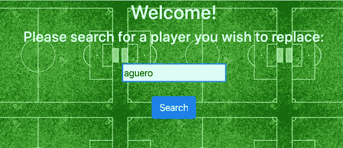

# 用数据科学赢得冠军联赛

> 原文：<https://medium.com/analytics-vidhya/win-the-champions-league-with-data-science-68aaf31a18b8?source=collection_archive---------20----------------------->

维也纳·雷耶斯在 [Unsplash](https://unsplash.com?utm_source=medium&utm_medium=referral) 上拍摄的照片

> [希旺·艾莉亚](https://medium.com/u/7cacfe673e8?source=post_page-----68aaf31a18b8--------------------------------) | [鲁特维克·巴沙尔](https://medium.com/u/645496352289?source=post_page-----68aaf31a18b8--------------------------------) | [阿布舍克·卡尔达克](https://medium.com/u/91654f579456?source=post_page-----68aaf31a18b8--------------------------------) | [阿迪蒂亚·谢蒂](https://medium.com/u/5420b9bf9649?source=post_page-----68aaf31a18b8--------------------------------) | [沙朗·瓦卡卡尔](https://medium.com/u/5c1d1a3d6900?source=post_page-----68aaf31a18b8--------------------------------)

## **一、简介**

作为这款漂亮游戏的粉丝，我们有兴趣了解球员数据如何塑造足球业务。特别是，我们想看看我们是否可以帮助俱乐部经理或老板，向他们推荐一些球员，这些球员可以用具有类似技能的球员取代他们现有的或即将离任的球员。在此基础上，我们还想创建一个应用程序，给定一个预算和一个编队将提供最好的发挥十一。

链接到数据集:[https://www.kaggle.com/karangadiya/fifa19](https://www.kaggle.com/karangadiya/fifa19)

链接到 GitHub:[https://github.com/sharangw/fifa-data-analysis](https://github.com/sharangw/fifa-data-analysis)

## **二。目标**

1.  为你的球员寻找理想的替代者。
2.  帮助星探和战术星探找到合适的人才。
3.  为足球俱乐部即将离任的球员推荐最佳替代品。
4.  在给定的预算内建立一个团队。

## **三。探索性数据分析**

*年龄与潜力*

球员的巅峰时期大约在 22-24 岁，这与球员的潜力和整体得分直接相关。

*首选脚和球员潜力*

接下来，我们想看看一个球员喜欢的脚和他的潜力之间是否有任何关系。首先，我们来看看有多少球员是左脚或右脚。

不出所料，喜欢用右脚踢球的运动员比用左脚踢球的运动员多。在我们讨论这是否转化为一个球员的整体潜力之前，让我们看看球员的潜力和整体得分是如何相关的。

我们找不到偏好的脚和球员潜力之间有任何有意义的联系，因为两者的分布非常相似。

## **四。球员替换**

我们着手建立一个推荐系统，它可以成为经理或老板在决定球员转会时使用的工具。首先，我们使用玩家的所有数字属性作为连续数据。例如，这包括诸如年龄、总体评价、潜力、偏好的脚、穿越能力等栏。此外，我们必须一次性编码分类变量，以便将它们包含在分析中。例如，一键编码后的 Body 类型属性如下:

一键编码后的体型特征

在清理数据集和选择特定特征后，我们决定确定每个玩家与其他玩家的相似程度。我们采用了两种方法:余弦相似度和 K 近邻。对于余弦相似性，我们利用了内置的 python 函数。在这种情况下，它返回与给定玩家最相似的前 15 名玩家，按余弦相似性分数排序。

使用余弦相似度的推荐器

此外，对于 KNN，我们使用了 sklearn 库中的最近邻算法，并将其应用到我们球员的数据框中。这个函数计算数据中给定玩家和所有玩家之间的欧几里德距离。然后，它选择并返回离给定玩家最近的 15 个邻居。

使用 KNN 的推荐器

接下来，我们决定将这两种方法结合起来，得到最相似玩家的交集，之后我们得到如下结果:

库蒂尼奥的替代者

伊万·佩里西奇的替代者

文森特·坎帕尼的替代者

*评估模型*

我们必须找到一种方法来验证我们的结果。为此，我们决定将它们与球员转会的真实例子进行比较。例如，我们推荐的替代菲利佩·库蒂尼奥的球员之一是安托万·格里兹曼。在 2019 年夏天的转会窗口，库蒂尼奥离开了他的俱乐部巴萨，以租借的方式前往拜仁慕尼黑。在同一个转会窗口，巴塞罗那从另一家俱乐部获得了格里兹曼。据推测，这是巴塞罗那俱乐部的一次类似的尝试。根据我们的推荐系统，我们也会建议俱乐部也这样做。

同样，意大利足球俱乐部国际米兰用亚历克西斯·桑切斯替换了即将离任的球员伊万·佩里希奇。这也证实了模型；事实上，我们的推荐将桑切斯列为与佩里希奇最相似的球员。

最后，曼城俱乐部的传奇人物文森特·坎帕尼在上赛季末离开了俱乐部。孔帕尼是球队防守、文化和领导力不可或缺的一部分。当这样的球员离开时，俱乐部找到合适的替代者来填补巨大的空缺是至关重要的。我们的模型建议像博阿滕，佩佩和米兰达这样的老将防守。但是对于文森特·坎帕尼的替代者来说，第一推荐人是埃梅里克·拉波尔特。顺便说一句，上赛季后半段，曼城买下拉波特，作为应对受伤球员和孔帕尼最终离开的一种方式。

因此，通过这种方式，我们能够使用上个赛季的真实球员转会实例来验证我们的模型的建议。

**网络应用**

顺便提一下，我们想通过分享一个我们创建的简单网站来更新这篇文章，在这个网站上你可以模拟球员替换的场景。首先，你输入一个玩家的名字，你希望得到可能的替代者。这将在我们的数据集中搜索与输入相似的玩家名字。接下来，你必须从发音相似的名字列表中选择真正的玩家。

网站截图

一旦你点击搜索，代码将有效地调用前面提到的'*推荐* ' python 函数，并使用余弦相似度和 KNN 来查找和显示在技能和其他属性方面最接近原始球员的其他五名球员。

该应用程序是使用 Flask 构建的，托管在 Azure:

【https://fifa-manager.azurewebsites.net】T5[T6](https://fifa-manager.azurewebsites.net)

## *五、预算十一*

我们想利用我们拥有的大量数据，超越球员推荐系统，在给定预算的情况下建立一个完整的团队。看待这个问题的另一种方式是为即将到来的足球队的潜在所有者提供建议。

我们已经成功地建立了一个优化模型，以预算为输入，输出 11 名球员，最大化平均团队评分，同时符合预算。为了实现这一点，我们首先按照玩家总体评分的降序对他们进行排序。比如综合评分最高的 94 分的梅西就是榜单第一名。

接下来，我们检查所有球员组合的总价值，从 4–4–2 阵型中得分最高到最低，即 1 名门将、2 名中后卫、2 名边后卫、4 名中场和 2 名前锋。为了得到一致的结果，我们必须保持这个阵型不变。

然后我们检查当前玩家集合的总价值之和是否小于给定的预算。我们按照等级递减的顺序对每组玩家重复这个过程。使用 sciPy 最大化评级函数会花费太多时间，因为它会检查这些位置上球员的每个可能组合。然而，我们的方法给出了相同的结果，但速度更快，更简单，因为我们首先根据玩家的总体评分对他们进行了排序。

考虑一个例子:让我们假设一个 2 亿欧元的预算，并使用函数来寻找在预算内最大化球队评级的最佳球员。

4–4–2 打 11 场比赛，预算 2 亿欧元

我们验证这一点的唯一方法是检查玩家的总评分是否是在预算内可以得到的最大值。不幸的是，我们不知道这支球队是否会表现出色，因为还有很多变量需要考虑，比如这些球员之间的化学反应。

## 六。未来改进

在现实生活中，当足球俱乐部想要替换年龄较大的球员时，他们通常会寻找更年轻的球员来接替他们的位置。但是我们目前的模型给出的建议是大多数情况下年龄相似的球员。这不是一个理想的结果，因为俱乐部不想用另一名年龄相仿的球员替换一名退休的 38 岁球员，而签下一名 20 出头的年轻球员将是一笔更划算的交易。考虑到这一点，我们可以进一步改进模型，并给出反映业务趋势实际转移的结果。

俱乐部在签下一名新球员时做的另一件事是，他们寻找一名能与球队其他球员很好相处的球员，这包括考察球员的特点，如他们说的语言、他们的国籍等。

此外，目前我们的系统只能生成一个 4-4-2 阵型的球队，其中有 4 名后卫，4 名中场和 2 名前锋。在这里，我们选择了两名中后卫和两名边后卫作为后卫，对于中场，我们有中路，边路，防守和进攻型中场，对于前锋，我们考虑了左右翼，中锋和前锋。

在实际比赛中，不同的球队采用不同的阵型，其中包括不同类型球员的不同组合。在该项目的未来迭代中，我们可以添加功能来创建不同阵型的球队，如 4-2-1-3 或 3-4-3，其中我们可以添加当前模型中未考虑的位置，如边后卫，防守中场和进攻中场。

我们可以实现的另一个改进是选择 16 名球员的比赛日阵容，除了目前产生的 11 名球员外，还包括 5 名替补球员。

## 七。结论

总而言之，关于足球协会的业务，我们有两个主要目标。首先，我们想知道我们是否可以建议足球经理用谁来替换他们即将离任的球员。第二，我们想要建立一个由 11 名玩家组成的实际团队，同时在特定的预算下最大化玩家的总体评分。我们使用了一场 Kaggle 比赛的 FIFA 19 球员数据。在实现任何算法之前，我们花时间清理和准备数据。对于第一个目标，我们利用并合并了两种方法，即余弦相似性和 k-最近邻。我们能够通过我们的球员推荐模型来预测真实的转会。此外，我们能够建立一个 11 人的团队；尽管只有一种阵型，但对于任何给定的预算，人们都可以根据球员等级和位置来选择最好的球队。仍然有许多事情我们没有实现，这些事情可以极大地增强我们的模型的有用性，并提供更有洞察力的分析。如果有时间，我们很想回去做更多的工作。

总的来说，这个项目很有启发性，也很有趣，因为我们组里的所有人都对足球充满热情。我们希望您在学习 FIFA 球员数据以及它与现实世界用例的关系时获得了乐趣。现在你知道赢得冠军联赛需要什么了！

在 [Unsplash](https://unsplash.com?utm_source=medium&utm_medium=referral) 上由 [Tevarak Phanduang](https://unsplash.com/@namakuki?utm_source=medium&utm_medium=referral) 拍摄的照片