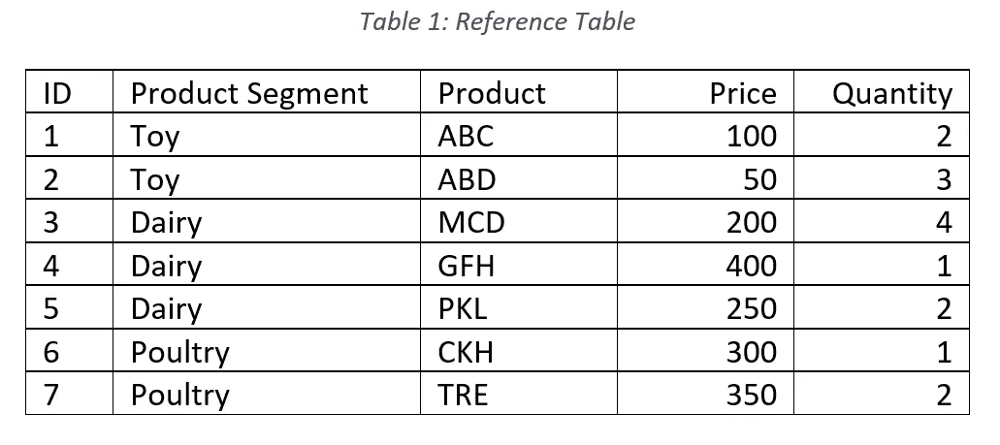
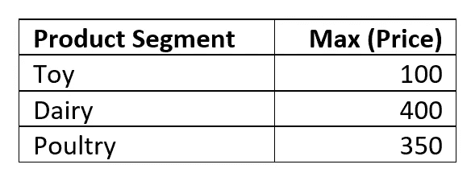
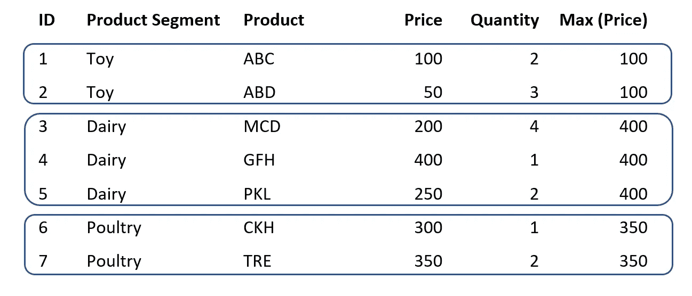
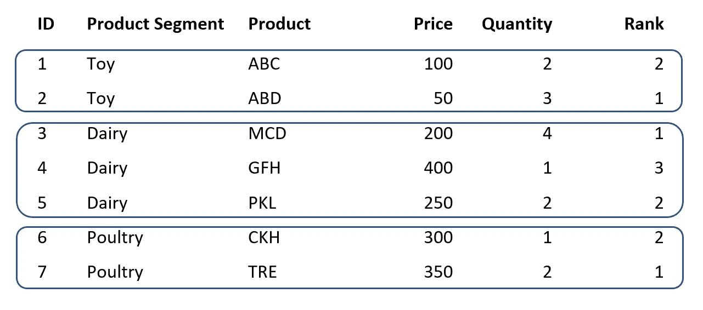
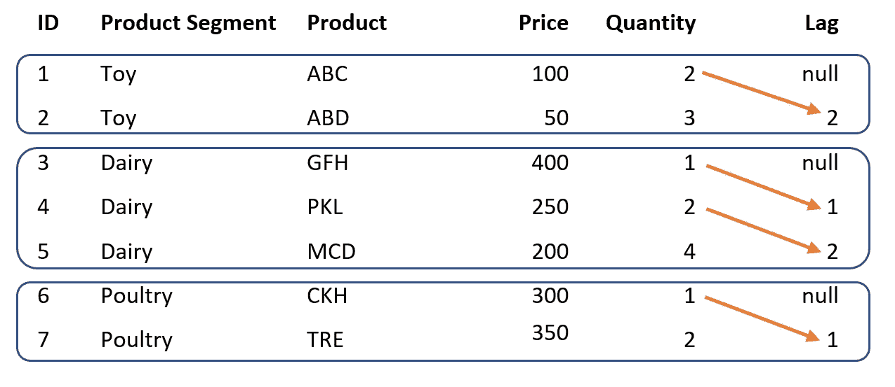

# 窗口功能

> 原文：<https://medium.com/analytics-vidhya/window-functions-64479da0b96d?source=collection_archive---------22----------------------->

前几天，我和我的同事讨论了分析功能，以及它们在创建见解和报告方面有多大帮助。过了一段时间，我们偶然发现了一个朗朗上口的短语——‘窗口功能’，并贴了一些俏皮话，我们开始探索它们。我试图让这篇文章只在概念层面上介绍窗口函数。

对于我们的讨论，我们将参考下表，

# “窗口”这个词在这里的意义是什么？

顾名思义，一个窗口是用来存放一组记录的——*‘一个记录的窗口’*很多时候，只需要对一组记录进行分析，为此，我们首先需要创建一组记录或一个“*窗口”*。

例如，使用参考表，我可以找到以下内容:

1.根据价格对不同产品细分市场(窗口)中的产品进行排序。

2.在不同产品细分市场上花费的总金额(窗口)。

3.在不同产品段(窗口)上花费的平均金额，

还有很多。

# 但是我们可以从 GroupBy 函数中实现同样的功能，为什么还需要另一个呢？

嗯，确实有需要，而且是很大的需要。GroupBy 函数将为每个组生成一个汇总形式的数据集，而 Window 函数将允许每一行保持各自的独立性。让我们使用参考表来理解这一点。

我们需要找出某个细分市场中某个产品的最高价格。

使用 GroupBy，将会导致，

GroupBy 函数“折叠记录”(伊格纳西奥，2020)

使用窗口函数，它将导致以下结果。下面是三个窗口，其中应用了聚合函数 *Max()* 。

现在，如果我们需要创建每个产品的价格报告，并在各自的细分市场中列出最高产品价格，那么 to-go 功能就是窗口功能。由于窗口函数生成的表在现有的表中添加了另一列，因此可以通过额外的数据点进行进一步的分析。

# 几种类型的窗口函数。

我们都知道聚合函数— *Max()、Min()、Sum()、Avg()* 等。但是一堆其他的功能更有趣。关于 SQL，下列函数中很少有非常有用的，

*Rank()* —顾名思义，它决定了一条记录在数据集中的排名。顺序将在排序中起决定性作用，因此应该相应地定义。让我们根据数量对参考表中的记录进行排序(降序，数量越多- >排序越好)。

试着找出如果数量相同会发生什么。

*Row_Number ()* —顾名思义，该函数确定数据集中每一行的行号。Post 定义顺序，它的作用是 Rank()，但是在一个窗口中，行的编号永远不会相同。它们将永远是连续的。

*LAG()* —这个强大的函数允许用户访问表中先前行的记录。它还允许用户定义偏移。如果我们在引用表中应用 LAG()函数，按数量排序(升序)，我们得到

还有一个功能——LEAD()。试着找出当你把它应用到上表时会发生什么。

# 打碎了窗户。

我们刚刚谈到了窗口函数的定义。什么时候使用窗口函数，什么时候不使用窗口函数，没有经验法则，但是毫无疑问，无论使用什么语言，它们都是分析师必须使用的。

为了继续你的探索，我强烈建议你列出所有的窗口函数，并与其他函数(如 GroupBy)进行比较研究，同时定义你自己的用例。

# 参考

伊格纳西奥。(2020 年 4 月 8 日)。*窗口功能*。检索自 learn SQL:[https://learn SQL . com/blog/SQL-window-functions-vs-group-by/#:~:text = happy % 20 the % 20 only % 20 相似%20point，be %几乎% 20 不可能% 20to %实现。](https://learnsql.com/blog/sql-window-functions-vs-group-by/#:~:text=Perhaps%20the%20only%20similar%20point,be%20almost%20impossible%20to%20achieve.)

*原载于*[*https://www.linkedin.com*](https://www.linkedin.com/pulse/window-functions-shahrukh-khan)*。*