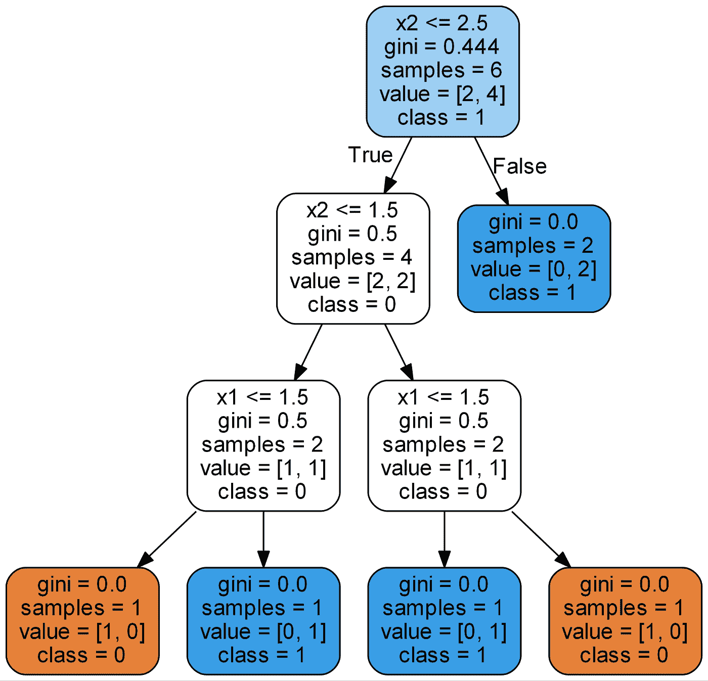
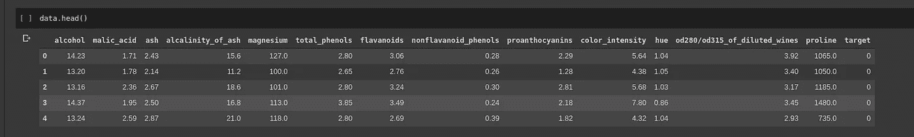
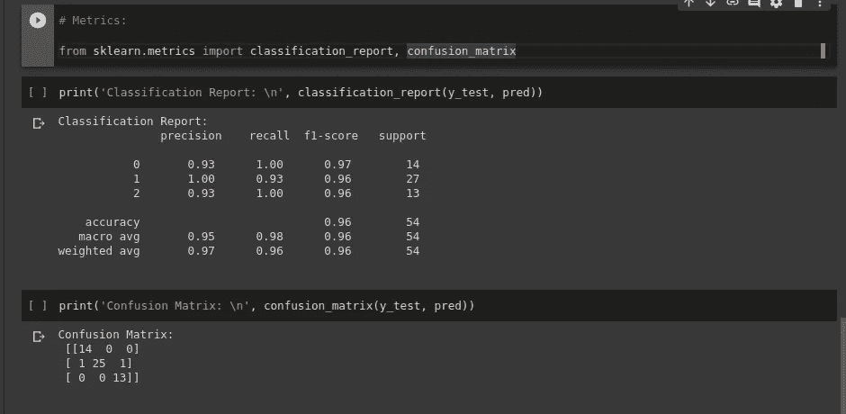
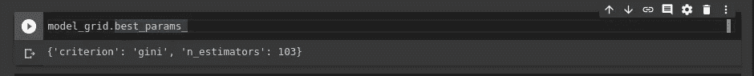
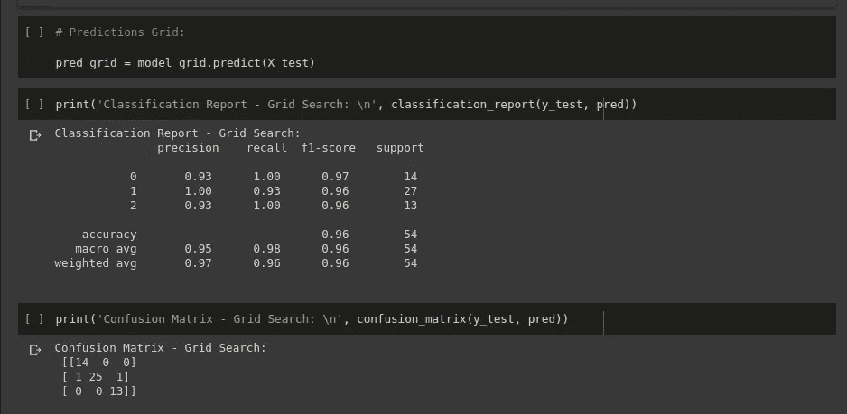

# 葡萄酒和机器学习

> 原文：<https://medium.com/analytics-vidhya/wine-and-machine-learning-efec11cd4d69?source=collection_archive---------26----------------------->


来源[此处](https://www.google.com/url?sa=i&url=http%3A%2F%2Fwww.marcelocopello.com%2Fpost%2Fvinho-combate-a-depressao-feminina&psig=AOvVaw0BC_r5w_wNAWpGyDty-CaI&ust=1593180659134000&source=images&cd=vfe&ved=0CAIQjRxqFwoTCJCNsYGWneoCFQAAAAAdAAAAABAJ)

在这篇文章中，我们将通过一个实际的例子深入研究随机森林分类器。我们将应用随机森林对葡萄酒进行分类！

# 随机林已恢复

***随机森林分类器*** 源自 [***决策树***](/greyatom/decision-trees-a-simple-way-to-visualize-a-decision-dc506a403aeb) ，基本上，在决策树中我们构建了一棵模拟人类推理的树，如下图所示:



来源[此处](https://miro.medium.com/max/1400/0*QwJ2oZssAQ2_cchJ)

如你所见，我们有节点提出问题，基于这些问题的答案，我们去其他节点。这与人类的推理非常相似，我们提出问题并建立对主题的理解，最终得到答案。

但是决策树的问题是 [***过拟合***](/@gabriel.mayers/overfitting-explained-in-less-than-5-minutes-441481afe19e) ，我们的模型只是记忆答案，实际上并没有学习如何产生答案！

基本上， [***过拟合***](/@gabriel.mayers/overfitting-explained-in-less-than-5-minutes-441481afe19e) 就是我们的模型在训练集中表现太好，而在测试集中表现太差。

更多关于 [***过拟合***](/@gabriel.mayers/overfitting-explained-in-less-than-5-minutes-441481afe19e) [可以在这里](/@gabriel.mayers/overfitting-explained-in-less-than-5-minutes-441481afe19e)阅读。

虽然决策树是一个强大的算法，但它非常容易受到[](/@gabriel.mayers/overfitting-explained-in-less-than-5-minutes-441481afe19e)*的过度拟合。而这也是 ***随机森林*** 存在的原因！*

*在 ***随机森林*** 中，我们构建了一个单独的 [***决策树***](/greyatom/decision-trees-a-simple-way-to-visualize-a-decision-dc506a403aeb) 来产生一个单独的结果，我们构建了一个森林树来赋予算法在进行预测时进行归纳的能力。*

*你可以在这里阅读更多关于 ***随机森林*** [。](https://towardsdatascience.com/an-implementation-and-explanation-of-the-random-forest-in-python-77bf308a9b76)*

*就目前而言，没有什么比通过应用来学习 ***随机森林*** 更好的了*

# *理解问题*

*我们将使用来自 [sklearn](https://scikit-learn.org/stable/index.html) 的[葡萄酒数据集](https://scikit-learn.org/stable/modules/generated/sklearn.datasets.load_wine.html)，我决定使用它，因为加载和理解数据非常简单。*

*数据集如下所示:*

**

*资料组*

*对应于葡萄酒类型的列是“target”，对于这个数据集，我们有 3 种类型，分别表示为:0、1 和 2。*

*基本上，我们将应用一个具有所有特征的 ***随机森林分类器*** ，减去目标，基于所有其他特征来预测葡萄酒的目标。*

*但是首先，我们需要把我们的数据集分成训练和测试，让我们开始吧！*

*我们可以通过使用下面的代码来做到这一点:*

```
*from sklearn.model_selection import train_test_splitX = data.drop(columns=[‘target’])y = data[‘target’]X_train, X_test, y_train, y_test = train_test_split(X, y, test_size=0.3)*
```

*首先，我们从[sk learn . model _ selection](https://scikit-learn.org/stable/modules/generated/sklearn.model_selection.train_test_split.html)中导入 [train_test_split](https://scikit-learn.org/stable/modules/generated/sklearn.model_selection.train_test_split.html) ，之后，我们将数据集的所有特征设为 X，将 y 设为数据集的目标。我们的数据集中只有 178 个例子，但这对我们的模型非常有用。之后，我们调用 train_test_split 传递作为参数，我们的 X，y 和我们测试的大小，30%。*

*现在，我们已经分割了我们的数据，是时候建立我们的模型了！*

# *构建模型*

*正如您之前看到的，我们将使用随机森林分类器算法。要使用它，我们只需要从 s [klearn.ensemble](https://scikit-learn.org/stable/modules/generated/sklearn.ensemble.RandomForestClassifier.html) 中导入，就像下面的代码:*

```
*from sklearn.ensemble import RandomForestClassifiermodel = RandomForestClassifier()*
```

*现在，我们可以使用 *fit()* 方法 passing 或 ***X_train*** 和 ***y_train*** 来训练我们的模型:*

```
*model.fit(X_train, y_train)*
```

*在训练我们的模型后，我们可以看到使用的参数。我们在实例化 RandomForestClassifier()时没有传递任何参数，所以我们的参数将是默认值。*

**

*模型参数*

*现在，我们已经可以使用我们的模型进行预测了。我们将使用 *predict()* 方法将 X_test 作为参数传递，如下面的代码所示:*

```
*# Predictions:pred = model.predict(X_test)*
```

*现在，我们已经有了模型的预测。我们需要可视化预测的准确性，为了做到这一点，我们可以使用 [sklearn.metrics](https://scikit-learn.org/stable/modules/model_evaluation.html) ，其中我们有许多工具来测量我们模型的指标。对于这个例子，我将使用[分类报告](https://scikit-learn.org/stable/modules/generated/sklearn.metrics.classification_report.html)和[混淆矩阵](https://scikit-learn.org/stable/modules/generated/sklearn.metrics.confusion_matrix.html):*

**

*我们模型的度量*

*我们的预测非常精确！😁*

*现在，我们有了一个表现非常好的模型，可以做预测了！*

# *额外收获:改进模型*

*我们有许多方法来改进我们的模型，我将解释最著名和最容易的！*

> *注意:我们的模型已经有一个很好的结果，所以很难赶上更好的结果。我个人推荐在准确率低于 90%的模型中使用 ***网格搜索****

*为了改进我们的模型，我们可以使用 ***网格搜索*** 。基本上，网格搜索是一种通过反复试验为我们的模型找到最佳参数的技术。好在 [sklearn](https://scikit-learn.org/stable/index.html) 有支持让网格搜索变得轻松，下面就来看看如何应用吧。*

*首先，我们需要导入 [GridSearchCV](https://scikit-learn.org/stable/modules/generated/sklearn.model_selection.GridSearchCV.html) 并创建一个与我们之前所做的非常相似的过程，但是这一次，我们需要将一个参数列表传递到我们的 ***网格搜索*** 中，如下面的代码所示:*

```
*from sklearn.model_selection import GridSearchCV# Parameters for Grid Search:param_grid = {‘n_estimators’: np.arange(100, 200, 1), ‘criterion’: [‘gini’, ‘entropy’]}model_grid = GridSearchCV(RandomForestClassifier(), param_grid=param_grid, refit=True)model_grid.fit(X_train, y_train)*
```

*现在，我们只需要等待我们的网格模型完成；*

*完成训练后，我们可以使用*model _ Grid . best _ params _*可视化通过 ***网格搜索*** 找到的最佳参数:*

**

*最佳参数*

*现在，我们可以像以前一样可视化网格模型的指标:*

**

*网格模型度量*

*正如你所看到的，我们的模型没有改进！*

*发生这种情况是因为我们在第一个模型中已经有了很好的精度，在 ***网格搜索*** 之前，很难再提高一个太好的精度。*

*希望你已经设法理解了 ***随机森林*** 的工作原理以及如何应用！*

*目前，这就是全部！*

*下次见！*

 *[## 在我的 VIP 内容列表订阅！

### 天天独家 AI，宝贝！n

mailchi.mp](https://mailchi.mp/42ad4556e7c5/sub-medium)* 

# *在社交网络上与我联系*

*https://www.linkedin.com/in/gabriel-mayer-779b5a162/***领英:****

*github:[https://github.com/gabrielmayers](https://github.com/gabrielmayers)*

*https://www.instagram.com/gabrielmayerl/***insta gram:****