# 葡萄酒质量预测

> 原文：<https://medium.com/analytics-vidhya/wine-quality-prediction-6461bbe837ef?source=collection_archive---------9----------------------->

这是我的朴素贝叶斯项目；数据分析和基于数据的葡萄酒质量预测。我使用 Pandas、NumPy、Seaborn 和 Scikit 学习库来分析数据和建立模型。

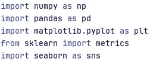

我在熊猫的帮助下导入了葡萄酒质量数据框作为数据。

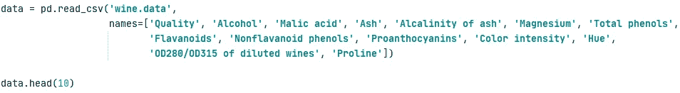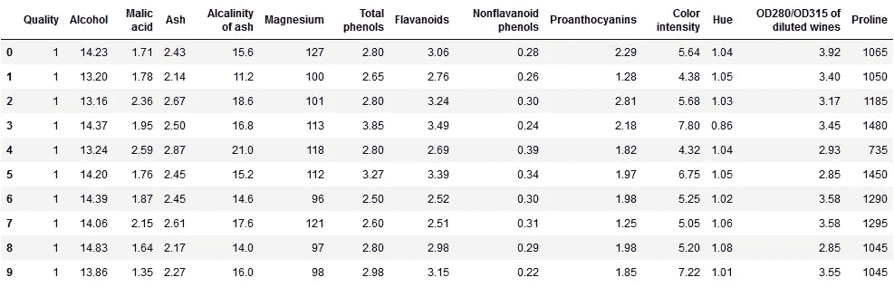

现在开始清理，幸运的是，我们的数据已经清理完毕，可以进行分析了。

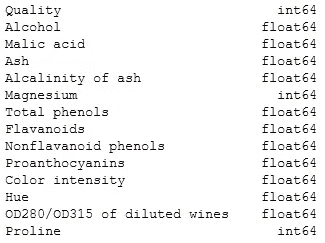

data.dtypes

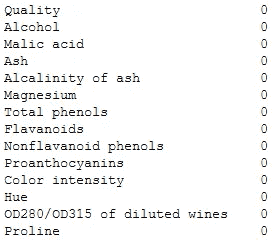

data.isnull()。总和()

现在来分析数据，在描述函数的帮助下，我检查是否有任何异常值，并在配对图的帮助下，我将数据可视化。

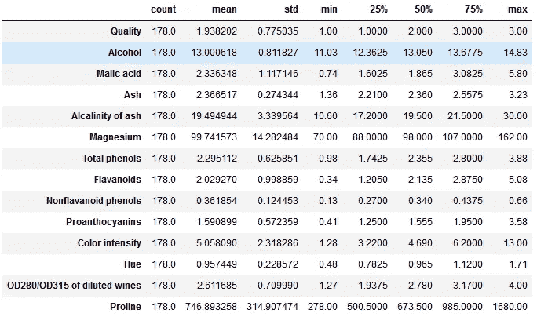

data . description()。转置()

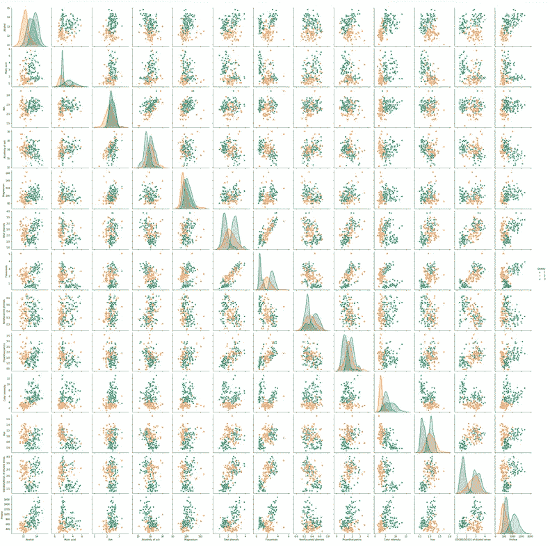

sns.pairplot(data，diag_kind = 'kde '，hue = 'Quality ')

此后，是模型的建立，我将数据分为自变量(x)和目标变量(y)。

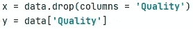

我借助 Scikit Learn 的' train_test_split '函数形式进一步将它们分为 x_train，x_test，y_train 和，y_test。

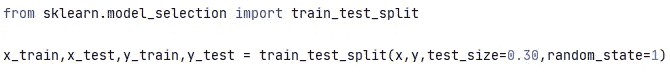

我使用 Scikit Learn 的“GaussianNB”在 x_train 和 y_train 数据上建立了一个模型，借助于“score”函数和混淆矩阵，我们可以看到模型的预测率相当高。

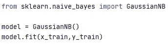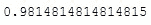

model.score(x_test，y_test)

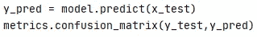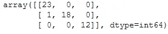

混淆矩阵

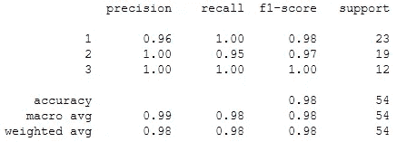

metrics . class ification _ report(y _ test，y_pred)

结论

我做这些是为了练习朴素贝叶斯分类器，以下是我在做这个项目时学到的所有东西:

> 学习了如何以及何时使用朴素贝叶斯分类器。
> 
> 了解朴素贝叶斯分类器相对于其他算法的优势。

Github 项目:[葡萄酒质量预测](https://github.com/codename-hyper/Wine-Quality-Prediction)