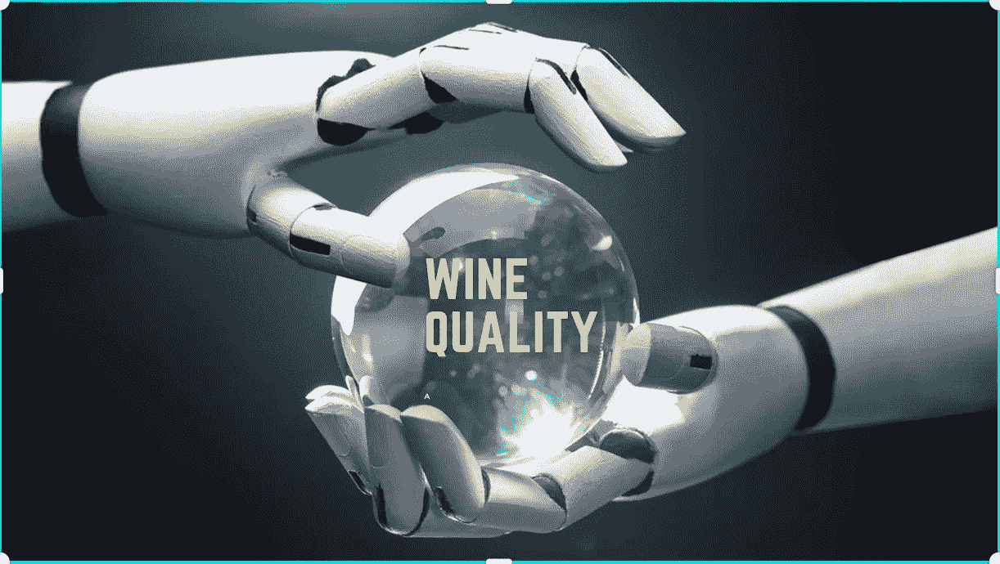
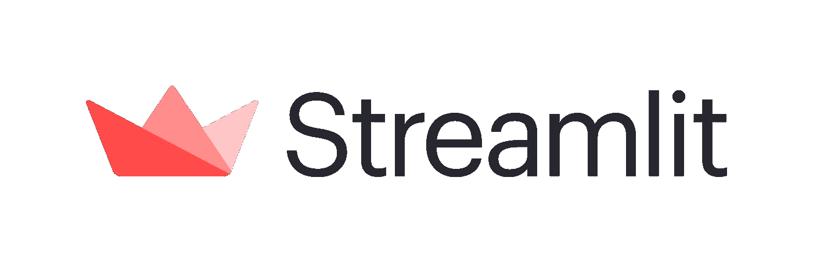
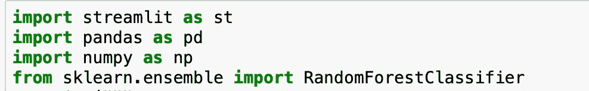
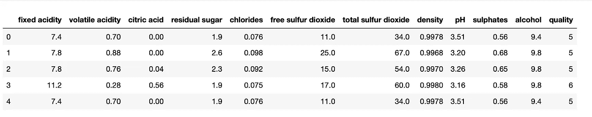
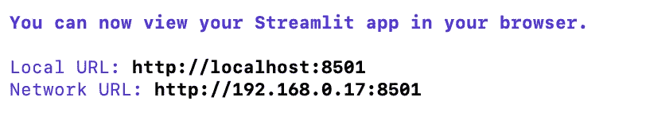
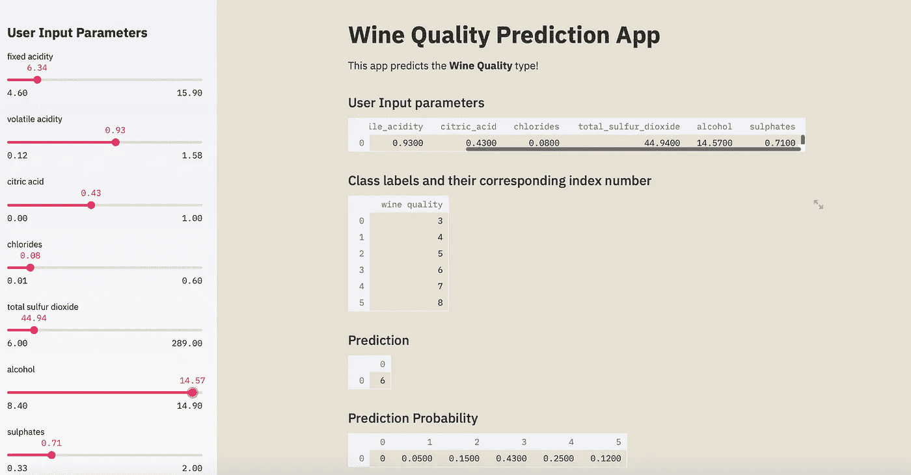

# 使用 Streamlit 的葡萄酒质量预测应用程序

> 原文：<https://medium.com/analytics-vidhya/wine-quality-prediction-app-8ba8291d40f9?source=collection_archive---------14----------------------->

是什么使一种葡萄酒比另一种质量更好。我们很难仅仅通过阅读标签来评估葡萄酒的质量。质量最好通过品尝来评定。很多时候，我们在购买前无法品尝葡萄酒，但葡萄酒标签上的信息可以帮助你做出决定，尽管你需要一定数量的关于生产商和年份的知识。当然，任何卖酒的都可以给你这个建议。在这篇文章中，我们将从机器学习中获得帮助，让它通过阅读标签来预测葡萄酒的质量。

这个博客主要关注应用程序部署。虽然部署是数据科学项目生命周期的最后一步，但它是非常重要的一个方面。它提供了对技术和非技术用户的访问。在数据科学中，项目生命周期如下图所示。

图片参考-[https://www . quora . com/What-is-the-life-cycle-of-a-data-science-project](https://www.quora.com/What-is-the-life-cycle-of-a-data-science-project)

有时候，在数据科学项目上投入这么多时间后，在 web 框架上花费时间是非常令人厌倦的。项目部署可能很棘手。斯特里特来了。Streamlit 负责部署，并且可以作为工作 web 应用程序发布。

**流线型**

Streamlit 是一个开源的 Python 库，可以轻松地为机器学习和数据科学构建漂亮的定制 web 应用程序。它非常容易使用。Streamlit 会观察每次保存时的变化，并在您编码时实时更新应用程序。代码从上到下运行，总是从干净的状态开始，不需要回调。

在这篇博客中，我们将依靠 Streamlit 的资源来帮助我们部署自己的模型。你会喜欢与 Streamlit 一起工作的！

这里我要在 Streamlit 的帮助下做一个简单的机器学习，预测葡萄酒质量从 3 到 8(和数据集中一样)。我使用了 kaggle 的红酒数据集([链接](https://www.kaggle.com/uciml/red-wine-quality-cortez-et-al-2009))。为了简单起见，我选择了随机森林模型作为分类器。

**步骤 1-安装所需的库**

在这个项目 Streamlit 中，pandas 和 scikit-learn 是必需的库。

首先，您需要使用 pip 在您的系统上安装 Streamlit。在您的终端中键入“ **$pip install streamlit** ”。以类似的方式，我们可以安装熊猫和 scikit-learn。安装后，我们可以导入它。

让我们看看数据集的实例。

**步骤 Web 应用程序代码**

lines(7–10)**ST . write()**函数以 markdown 格式打印应用程序的标题(使用#符号表示标题文本(第 8 行)，而后续行(第 9 行)为 web 应用程序提供正常的描述性文本。

第 11-34 行在应用程序中，我们正在为用户输入参数创建一个侧栏。将有不同的葡萄酒特性滑块，如固定酸度，挥发性酸度等。

st.write()函数用于显示测向数据帧的内容。

第 35–38 行第 36 行从 csv 文件加载数据集。第 38 和 39 行将数据集划分为预测值(X)和目标数据(Y)。

第 40 行创建了一个随机森林分类器实例。在随后的几行中，我们通过 clf.fit 函数使用 X 和 Y 变量作为输入参数来训练模型。

**步骤 3-运行网络应用**

简化运行 app1.py

几秒钟后，一个互联网浏览器窗口应该会弹出，并通过将您带到 [http://localhost:8501](http://localhost:8501) 来引导您到创建的 web 应用程序，如下所示。

恭喜你，你只用 50 行代码就创建了一个机器学习驱动的应用程序。最迷人的事实是，我们已经部署了一个机器学习 web 应用程序，而无需学习 Flask 或 Django。此外，Streamlit 易于使用。如果你觉得有帮助，请与你的朋友和同事分享。

参考资料:

1.  [https://towards data science . com/how-to-build-a-simple-machine-learning-we B- app-in-python-68 a 45 a0e 0291](https://towardsdatascience.com/how-to-build-a-simple-machine-learning-web-app-in-python-68a45a0e0291)
2.  [https://docs.streamlit.io/en](https://docs.streamlit.io/en)