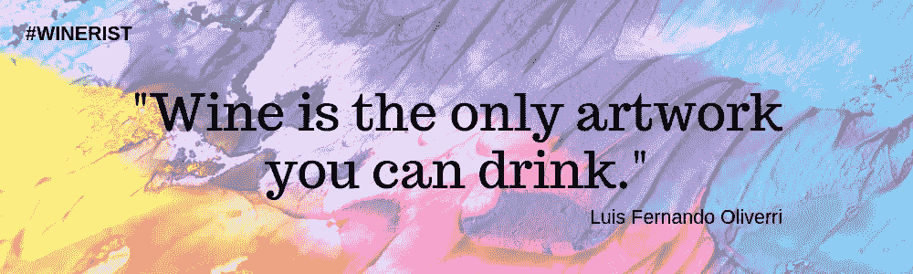
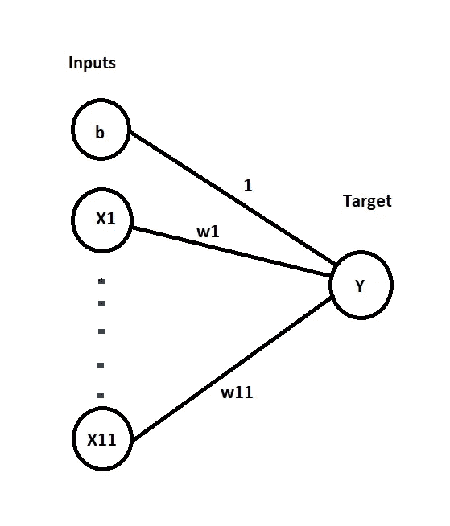
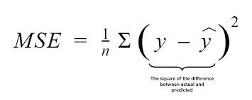

# 用 PyTorch 预测葡萄酒质量

> 原文：<https://medium.com/analytics-vidhya/wine-quality-prediction-using-pytorch-2a291670dd66?source=collection_archive---------12----------------------->

> **葡萄酒是你唯一能喝的艺术品** *(引自路易斯·费尔南多·奥利韦利)*

这句话推断了我们社会的葡萄酒标准。它不仅是一种饮料，本身也是一种生活方式。因此，葡萄酒的质量真的很重要。

一般来说，葡萄酒是根据其质量的感官数据来评分的。但是如果我们有一些关于它的心理测量数据，比如酸度、密度、含糖量等等。那么我们也可以预测质量分数。

正如你们中的一些人可能已经猜到的，这里我们可以使用机器学习或神经网络模型来做到这一点。我们只需要在具有与其相关联的质量分数的心理测量数据上进行训练，然后使用优化的模型来从心理测量数据预测质量分数。

> 如果你是深度学习的初学者，这肯定适合你…..
> 
> 坚持住。最后你会对如何从神经网络开始有一个清晰的想法。

因此，在这里我们将建立一个非常简单的神经网络，PyTorch 只有输入和输出层。

**PyTorch** 是基于 [Torch](https://en.wikipedia.org/wiki/Torch_(machine_learning)) 库的开源机器学习库，用于各种深度学习应用，如计算机视觉和自然语言处理，主要由脸书的 AI 研究实验室(FAIR)开发。

**Tensorflow，Keras，MXNet，Caffe2** 等。是 pytorch 的一些替代品。

张量**是一个 n 维数据容器。和 NumPy 的 ndarray 挺像的。比如 1d-张量是向量，2d-张量是矩阵，3d-张量是立方体，4d-张量是立方体的向量。**

这些张量被用作深度学习网络的基本构建模块。

> *你可以在这里* *阅读我关于几个基本 PyTorch 张量函数* [*的帖子。*](/@sksplay7/5-important-pytorch-tensor-functions-7ff9b5940285?source=your_stories_page---------------------------)

# 但是首先，让我们得到数据

数据集链接:[https://www . ka ggle . com/UC IML/red-wine-quality-cortez-et-al-2009](https://www.kaggle.com/uciml/red-wine-quality-cortez-et-al-2009)

这里我们将根据其他特征预测**葡萄酒质量**。

# 分成训练集和测试集

我们提到数据类型为 float32，因为 PyTorch 张量的数据类型默认为 float32。由于我们将创建权重和偏差张量，拥有相同的数据类型将避免任何未来的冲突。

因此，我们保留了 1200 份培训记录和 399 份测试记录。让我们看看训练集和测试集的形状。

# 将输入和目标矩阵转换成张量

我们需要将数据转换为张量来执行进一步的操作，并在我们的神经网络中使用它们。

**。from_numpy()** - >将 numpy 数组转换为张量

# 线性回归模型

在线性回归中，模型函数是一个线性方程，其中变量的阶数为 1，带有系数和偏差项。

因此，由于输入矩阵中有 11 个变量，等式的形式如下:

> w1 \feature 1+w2 \feature 2+…..+w11 \feature 11+b =目标
> 
> w1∫x(1，1)+w2∫x(1，2) +…..+w11∫x(1，11) + b = y1
> 
> w1∫x(2，1)+w2∫x(2，2) +…..+w11∫x(2，11) + b = y2
> 
> …………
> 
> w1∫x(1599，1)+w2∫x(1599，2) +…..+w11∫x(1599，11) + b = y1599

**w** =权重矩阵和**b**=偏差

无隐层神经网络

## 为模型创建权重和偏差

**requires_grad = True** - >它被设置为 True，因为我们需要损失函数的梯度或导数 w.r.t .的权重和偏差来优化模型以获得低误差或损失。

# 定义模型

这将返回预测值

**。mm()** - >矩阵乘法

**。t()** - >转置

# 损失函数

为了比较实际值和预测值，我们可以使用不同的指标，其中之一是**均方误差**。

它是实际值与其各自预测值之差的平方和的平均值。

均方误差公式

**。加法运算的 sum()** - >

**。numel()** - >返回该张量中元素的数量

# 流程:

*   采用权重和偏差的随机值计算预测值
*   根据指标找出实际值和预测值之间的损失或误差
*   找出损失函数相对于权重和偏差的梯度
*   基于梯度调整权重和偏差
*   将梯度重置为零
*   使用权重和偏差的更新值预测结果

我们将看到，随着这一过程的每次重复，误差在减小。因此，重复这个过程，直到误差减少到令人满意的值。

# 模特培训

**历元**:表示单遍通过训练数据。在这里，我们将根据数据对模型进行 200 次训练。

**。向后()**:计算渐变。

**。grad** :损失函数 w.r.t. **w** 和 **b** 的梯度存储在它们的。梯度属性

**。zero()** :用于在下一次计算前将存储的梯度归零。实际上渐变被添加到了*。对每个历元的属性进行分级，而不是用新值替换它。因此，我们需要在存储新值之前清除该值*

**学习率**:这里的 *1e-5* 是学习率。我们不是通过梯度值直接减少权重和偏差，而是通过梯度的一部分来减少权重和偏差，以便我们采取小的下坡步骤(朝向损失函数曲线的最小值)。这确保了我们不会跳过最小值而到达点。

我们可以看到，随着时间的推移，损失在减少。通过训练 50000 个时期的模型，我们可以得到 0.57 的误差，这是非常令人满意的，因为分数是从 0 到 10，差 1。

**让我们使用优化了权重和值的模型在测试数据集上进行预测。**

# 合法性错误

我们得到了 0.66 的验证误差，这是非常令人满意的。我们可以通过打印出 **preds** 变量来得到预测值。

损失或误差取决于我们随机选择的权重和偏差。我们可以重新运行该单元和模型训练单元，以查看损耗是否有轻微变化。

*为了达到低错误率，我们还可以在开始建模部分之前进行一些数据处理。*

## 让我们试一试…..

在这里，我试图从数据中显示一些随机观察的实际和预测的质量分数。

但是在将输入传递给 linear_model()方法之前，我们需要将其转换为所需形状的张量。

这里我们可以看到实际值和预测值非常接近。

***但是等等…..***

我们在这里手动操作，从定义模型、生成随机权重和偏差到优化参数。PyTorch 有没有可以自动做到这一点的库和方法？

*有，有。*

**我们将在接下来的帖子中讨论如何使用内置函数和使用神经网络中的隐藏层来构建相同的模型。**

> 敬请关注…..

# 参考

可以参考 Aakash N S 的这本精彩笔记本:

[https://jovian.ml/aakashns/02-linear-regression](https://jovian.ml/aakashns/02-linear-regression)

感谢 FreeCodeCamp 提供这个精彩的深度学习课程。

Pytorch 的官方文件:[https://pytorch.org/docs/stable/index.html](https://pytorch.org/docs/stable/index.html)

请随时提供您的反馈。

**在**:[https://www.linkedin.com/in/subham-kumar-sahoo-55563a136](https://www.linkedin.com/in/subham-kumar-sahoo-55563a136)和我联系