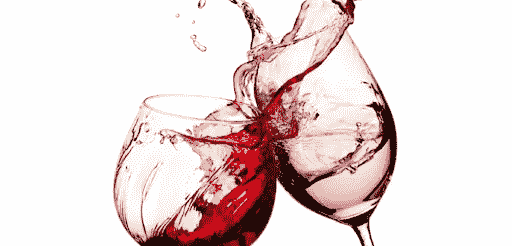

# 用 python 进行葡萄酒质量预测

> 原文：<https://medium.com/analytics-vidhya/wine-quality-prediction-with-python-695939d34d87?source=collection_archive---------8----------------------->

> 警告:这是一篇很长的文章，对于那些只寻找机器学习代码的人来说，请直接进入最后一部分，但是对于那些真正来从数据中学习一些东西的人来说，请仔细阅读整个过程，并为我准备一个问题。

首先，让我们给房间里的大象打个电话，“为什么我们要检测葡萄酒的质量？”以及“质量可以预测吗？”。后一个问题…