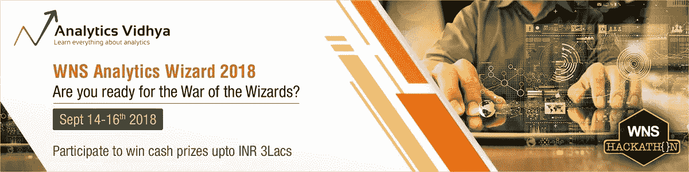

# WNS 分析向导 2018

> 原文：<https://medium.com/analytics-vidhya/wns-analytics-wizard-2018-6e990c17dfbd?source=collection_archive---------0----------------------->

[参与 WNS 分析向导](https://datahack.analyticsvidhya.com/contest/wns-analytics-hackathon-2018/?utm_source=medium)

未来属于那些在可能性变得显而易见之前就看到它们的人。在 WNS，我们的重点是将分析作为一种重复性能力，旨在推动长期商业价值。多年来，我们一直积极致力于增强我们的技术支持的分析产品，利用机器学习、认知计算和人工智能。WNS 分析黑客马拉松不仅可以帮助数据科学家和分析专业人士体验现实生活中的商业场景和挑战，还可以提高他们自己的高级分析技能。

**那么，你准备好巫师之战了吗？**

# [立即参与](https://datahack.analyticsvidhya.com/contest/wns-analytics-hackathon-2018/)

# 你为什么应该参与？

我们 WNS 相信，停止学习、探索、创造和一头扎进商业挑战永远不会太迟。我们的数据科学家每天都要应对各种各样的业务挑战，现在，在 **WNS 分析向导 2018** 上，轮到您抓住机会，找到业务问题的创新解决方案，同时与其他智囊团竞争。

# 谁应该参与？

面向所有数据爱好者开放，包括统计学家、数据科学家、业务分析师和学生。

# 关于公司

WNS(控股)有限公司(纽约证券交易所代码:WNS)，是一家领先的全球业务流程管理公司，为 350 多家全球客户提供商业价值。WNS 解决方案将卓越运营与关键垂直行业的深厚专业知识相结合，包括旅游、保险、银行和金融服务、制造、零售和消费品包装、航运和物流以及医疗保健和公用事业。WNS 提供全方位的 BPM 服务，如财务和会计、客户互动服务、技术解决方案、研究和分析以及特定行业的后台和前台流程。截至 2018 年 6 月 30 日，WNS 在全球 55 个交付中心拥有 38，227 名专业人员，包括中国、哥斯达黎加、印度、菲律宾、波兰、罗马尼亚、南非、斯里兰卡、土耳其、英国和美国。欲了解更多信息，请访问[www.wns.com](http://www.wns.com/)。

# 奖赏

现金奖励高达**印度卢比 3 拉齐**可供争夺

*   一等奖——150，000 印度卢比
*   二等奖——100，000 印度卢比
*   三等奖——50，000 印度卢比

# 参与规则

1.  比赛将于 2018 年 9 月 14 日星期五 00:00:00 (IST)开始。数据集和问题陈述将同时发布。
2.  竞赛结束后提交的参赛作品将不予考虑。
3.  黑客马拉松允许个人参与，参与者可以是团队的一员，也可以是个人。
4.  不允许使用外部数据集。
5.  参与是免费的。
6.  参与者必须更新他们的个人资料并上传他们最新的简历。
7.  在黑客马拉松的整个过程中，你应该尊重其他黑客，并保持高度的诚信。
8.  Slack Live Chat 管理员有权阻止任何被发现使用不良/无礼语言的参与者。
9.  目前的 WNS 员工也有资格参加。
10.  如果参赛者被认为有欺诈行为，维迪亚和 WNS 有权取消任何参赛者在任何比赛阶段的参赛资格。
11.  如有任何争议，Analytics Vidhya 的决定为最终决定。

# 团队形成

*   **点击** [**此处**](https://docs.google.com/document/d/1nOT8zfI7FMkhwuEiJR_4U5xhX05swotTL8YGOiETIBo/edit) **查看组队流程**
*   最多 2 人可以组队。
*   一个人只能是一个团队的成员。
*   如果一个队赢了，奖金将在队员中平均分配
*   团队一旦建立就不能解散。
*   团队不能合并。