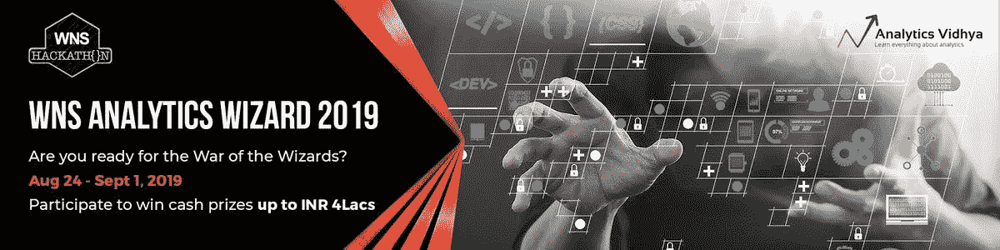
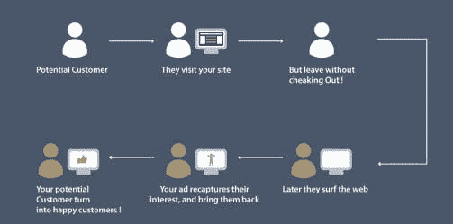

# WNS 营销分析黑客马拉松:3 大鼓舞人心的获胜解决方案

> 原文：<https://medium.com/analytics-vidhya/wns-marketing-analytics-hackathon-top-3-inspiring-winning-solutions-faa2e1efb0fc?source=collection_archive---------8----------------------->

黑客马拉松极大地塑造了我的数据科学生涯。他们帮助我理解了[结构化思维](https://courses.analyticsvidhya.com/courses/structured-thinking-and-communication-for-data-science-professionals?utm_source=blog&utm_medium=wns-marketing-analytics-hackathon-top-3-inspiring-winning-solutions)的重要性，以及如何在时间紧迫的情况下使用它。这种想法实际上是驱动成功数据科学家角色的本质。

我收到了很多有抱负的数据科学专业人士的问题，他们想知道如何从竞争中脱颖而出，并在该领域获得一席之地。这是一个多层面的问题，但我一直指出的一个共同要素是——[开始参与黑客马拉松](https://datahack.analyticsvidhya.com/contest/all/?utm_source=blog&utm_medium=wns-marketing-analytics-hackathon-top-3-inspiring-winning-solutions)并评估你的立场。


而如果能爬上排行榜，那就更好了！

在这篇文章中，我很高兴地分享了前三个成功的方法(和代码！)来自 [WNS 分析向导 2019 黑客马拉松](https://datahack.analyticsvidhya.com/contest/wns-analytics-wizard-2019/?utm_source=blog&utm_medium=wns-marketing-analytics-hackathon-top-3-inspiring-winning-solutions)。这是 Analytics Vidhya 迄今为止最大的黑客马拉松，从这些获胜者的解决方案中可以学到很多东西。

所以，拿出纸和笔，记笔记，不要错过任何其他的黑客马拉松！直接前往 [DataHack 平台](https://datahack.analyticsvidhya.com/contest/all/?utm_source=blog&utm_medium=wns-marketing-analytics-hackathon-top-3-inspiring-winning-solutions)参加今天即将到来的比赛。

# 关于 WNS 分析向导 2019 黑客马拉松

WNS 分析向导 2019 是 Analytics Vidhya 举办的最大的黑客马拉松。以下是这个历史性的黑客马拉松背后的数字总结:

*   **总注册人数:6456 人**
*   **总提交数:11，564**
*   **奖金:价值 4000 卢比(以及 WNS 的面试机会)**

这是一次令人难忘的为期 9 天的黑客马拉松，来自全球各地的众多数据科学家参与其中。



# WNS 分析向导 2019 黑客马拉松的问题陈述

让我们来看看这次黑客马拉松的问题陈述。

Zbay 是一家电子商务网站，在其在线平台上销售各种产品。Zbay 记录其客户的用户行为，并以日志形式存储。然而，大多数情况下，用户不会立即购买产品，并且会有一个时间差，在此期间，客户可能会在网上冲浪，也可能会访问竞争对手的网站。

现在，为了提高产品的销量，Zbay 聘请了广告技术公司 Adiza，该公司建立了一个系统，在其合作伙伴网站上显示 Zbay 产品的广告。

如果用户来到 Zbay 的网站并搜索一种产品，然后访问这些合作伙伴网站或应用程序，他/她以前查看的商品或其类似商品会显示为广告(ad)。如果用户点击这个广告，他/她将被重定向到 Zbay 的网站，并可能购买该产品。



> *在这个问题中，任务是基于历史观看日志数据、广告印象数据和用户数据来预测点击概率，即用户点击在未来 7 天内在合作伙伴网站上显示给他们的广告的概率。*

向参加者提供了:

*   查看用户日志(2018/10/15–2018/12/11)
*   从 Zbay 网站收集的产品描述
*   包含合作伙伴网站广告投放详情的培训数据和测试数据(培训+测试)

训练数据包含 2018/11/15–2018/12/13 期间的印象日志以及指定广告是否被点击的标签。**根据 2018/12/12–2018/12/18 期间有印象日志但无标签的测试数据对最终模型进行评估。**

# 数据集描述

向参与者提供了以下文件:

*   **train.zip** :这包含了 3 个文件，我在下面提供了每个文件的描述
*   测试文件包含了参与者需要预测点击率的印象

***train.csv:***

```
**Variable**             **Definition** 
impression_id        AD impression id 
impression_time      Time of the impression at partner website 
user_id              user id 
app_code             Code for partner website where ad was shown 
os_version           Version of operating system 
is_4G                1-Using 4G, 0-No 4G 
is_click (target)    Whether user clicked AD (1-click, 0-no click)
```

***view _ log . CSV:***

```
**Variable**               **Definition**   
server_time            Timestamp of the log   
device_type            Device type of the user   
session_id             Browser session id   
user_id user id        item_id Item id
```

***item _ data . CSV:***

```
**Variable          ** **Definition** 
item_id            Item id 
item_price         Price of the item 
category_1         Category depth 1 
category_2         Category depth 2 
category_3         Category depth 3 
product_type       anonymized item type
```

# WNS 分析向导 2019 黑客马拉松的获奖者

赢得黑客马拉松是一项极具挑战性的任务。有许多障碍需要克服，更不用说来自世界顶级数据科学家的巨大竞争了。

我喜欢浏览我们的获胜者提供的这些顶级解决方案和方法。首先，让我们看看谁赢了，并祝贺他们:

*   排名 1: [罗曼·皮扬科夫](https://datahack.analyticsvidhya.com/user/profile/TheRealRoman?utm_source=blog&utm_medium=wns-marketing-analytics-hackathon-top-3-inspiring-winning-solutions)
*   排名 2: [谢尔盖·阿雷菲耶夫](https://datahack.analyticsvidhya.com/user/profile/Vityzy?utm_source=blog&utm_medium=wns-marketing-analytics-hackathon-top-3-inspiring-winning-solutions)
*   排名 3:[AK 队](https://datahack.analyticsvidhya.com/teams/team-ak-predicttai?utm_source=blog&utm_medium=wns-marketing-analytics-hackathon-top-3-inspiring-winning-solutions)

您可以在[排行榜](https://datahack.analyticsvidhya.com/contest/wns-analytics-wizard-2019/pvt_lb?utm_source=blog&utm_medium=wns-marketing-analytics-hackathon-top-3-inspiring-winning-solutions)上查看所有参与者的最终排名。

前三名获奖者分享了他们在比赛中的详细方法。我相信你很想知道他们的秘密，所以让我们开始吧。

# 排名 3:[AK 队](https://datahack.analyticsvidhya.com/teams/team-ak-predicttai?utm_source=blog&utm_medium=wns-marketing-analytics-hackathon-top-3-inspiring-winning-solutions) (Aakash Kerawat &阿克谢·卡兰加尔)

以下是 AK 团队与我们分享的内容。

# 方法

> *我们最终的解决方案是一个由*[*light GBM*](https://www.analyticsvidhya.com/blog/2017/06/which-algorithm-takes-the-crown-light-gbm-vs-xgboost/?utm_source=blog&utm_medium=wns-marketing-analytics-hackathon-top-3-inspiring-winning-solutions)*、* [*神经网络*](https://www.analyticsvidhya.com/blog/2018/10/introduction-neural-networks-deep-learning/?utm_source=blog&utm_medium=wns-marketing-analytics-hackathon-top-3-inspiring-winning-solutions) *和*[*CatBoost*](https://www.analyticsvidhya.com/blog/2017/08/catboost-automated-categorical-data/?utm_source=blog&utm_medium=wns-marketing-analytics-hackathon-top-3-inspiring-winning-solutions)*模型组成的集合。*

粗略地看一下数据集，似乎从 *view_logs* 生成的特征将在提高分数方面发挥重要作用。但很快我们发现，从 *view_logs* 生成的大多数特征都过度适合训练集。

这是因为与测试集中的数据相比，更高百分比的训练数据具有最近的 *view_logs* 。因此，我们在训练集上更加关注特征工程。

对我们有用的功能是*每个用户的点击百分比/应用代码/用户应用代码*。仅这些功能就帮助我们在公共排行榜上达到了 0.73xx。除此之外，我们还使用了一些基于时间的特性和一些来自 *view_logs* 的特性。

> *我们两人的方法略有不同，在公开排行榜上给出了大约 0.75xx 的相似分数。*

除了这些共同特征，我们在个人方法中使用了一些不同的技术/特征，给出了大约 0.75xx 的分数。**我们最终提交的是最佳个人模型的平均值排名。**

## Aakash 的方法:

*   我最强大的功能是基于目标的，即 *user_id* 、 *app_code* 和 *user_id/app_code* 的平均点击量。上述的加权平均值也被证明是重要的(给予较新的记录较高的权重)。我创建的其他功能有:
    1。*时间 _ 自 _ 前 _ 广告
    2。印象数(针对用户)
    3。上一次点击次数总和
    4。印象 _ 时间 _ 小时，*等。
*   我为 *view_logs* 单独设计了功能，然后根据最近的 *server_time 将它们结合起来。*然而*，*只有一个特征——视图数量——是有用的，而其他特征都过拟合
*   由于 train 和 view_logs 数据之间存在交集，因此强有力的验证策略对于这个问题非常重要。我设计了复制测试集的验证集(验证集和 view_logs 之间没有交集)
*   最后，我训练了 20 个 [LightGBM 模型](https://www.analyticsvidhya.com/blog/2017/06/which-algorithm-takes-the-crown-light-gbm-vs-xgboost/?utm_source=blog&utm_medium=wns-marketing-analytics-hackathon-top-3-inspiring-winning-solutions)和 20 个全连接的神经网络(所有模型都有一个随机状态作为唯一的区别)，取 LightGBM 模型和神经网络模型的算术平均值。最后，我取两个输出的调和平均值。这使得公共排行榜得分为 0.754 倍

## 阿克谢的方法

我的验证策略是简单的基于时间的分割:

*   由于 *view_logs* 特性在训练集上过度拟合，我从 *view_logs* 数据集创建了一个额外的数据集: *train_view_logs* (原始数据的一个子集，与训练数据集没有重叠)
*   我使用 train_view_logs 为训练数据集创建特征，并使用原始的 *view_logs* 为测试数据集创建特征
*   app_code 特性非常重要，所以我决定对它进行编码，以便捕捉它们之间的隐藏关系。我使用了一个 *word2vec* 模型来将 *app_codes* 转换成 100 维向量，并使用它们来代替原来的 app_codes 变量
*   除了这些，我创造了如下特征:
    1。时间 _ 自 _ 前 _ 印象
    2。下一次印象的时间
    3。最后印象应用代码
    4。峰值到峰值服务器时间(每用户)等。
*   利用这些特性，我用不同的种子和一个 CatBoost 模型训练了 15 个 LightGBM 模型。我取了这些型号的简单平均值，在大众排行榜上达到 0.754xx。

**你可以在这里** **查看这种方法的完整代码** [**。**](https://github.com/kunalj101/wns_analytics_wizard_2019/tree/master/Rank_3_Team_AK)

# 排名 2: [阿列夫·谢尔盖](https://datahack.analyticsvidhya.com/user/profile/Vityzy?utm_source=blog&utm_medium=wns-marketing-analytics-hackathon-top-3-inspiring-winning-solutions)

以下是 Arefev 与我们分享的内容。

**整体方法**

1.  使用梯度推进作为主要算法
2.  分层交叉验证
3.  点击预测问题功能的用户标准(按 id 的值计数和平均值编码、点击次数之间的差异、按 id 分组以及唯一项目的长度)
4.  模型的特征选择和微调参数

现在让我们来看看阿拉费夫的循序渐进的方法。

**数据预处理和特征工程**

*   来自 *train.csv* 的标准特性:

1.  '操作系统版本'
2.  is_4G '

a.“数值计数应用代码”:应用代码特征的频率编码

b.' mean_target_user_id ':过去每个 user_id 的目标平均值

*   User_id 时间特征:
    a .从 user_id 的上一次印象到下一次印象的时间
    b . user _ id 的印象之间的最小时间
*   User_id numbers 特性:
    a .每个 User_id 的唯一 app_code 数
    b .每个 user_id 的唯一 app_code 数和值 _counts 数之差
*   一周前(impression _ time-7 天)用户在 view_log.csv 中查找的唯一项目数
*   过去的用户印象数和 view_log 中 user _ ids 的值计数
*   按 app_code 分组:对于每个 app_code，通过以下特征计算平均值:

1.  '平均目标用户标识'
2.  '数值计数用户标识'

*   按用户标识从下一次印象开始的时间

**我的最终模型**

*   我的最终模型是来自 5 个模型的预测的平均等级(对一个模型的预测进行排序，并给它们从 0 到测试数据集长度的等级)。这些通过分层验证在不同的训练集上被训练
*   将验证从时间序列改为分层让我的分数提高了大约 0.01。此外，我放弃了像 app_code 和 user_id 这样的特性，尽管它们在验证方面给出了更好的分数
*   现在，我有大约 50 个特征。我计算了全套特征的梯度增强的特征重要性，将它们从高到低排序，并开始逐个丢弃特征。最后，我得到了上述特性的最终子集

**关键要点**

1.  **如果目标变量的分布不随时间变化，使用分层交叉验证**
2.  按 id 使用时间和数量统计
3.  按主要 id 分组
4.  如果您认为特征会过度适合您的模型，请删除这些特征

**参与者在解决此类问题时必须关注的事情**

1.  选择正确的验证
2.  从一小组功能开始
3.  开始使用渐变增强
4.  进行特征选择

[**这里是 Arefev 方法的完整代码**](https://github.com/kunalj101/wns_analytics_wizard_2019/tree/master/Rank_2_Vityzy) **。**

# 排名 1: [罗曼·皮扬科夫](https://datahack.analyticsvidhya.com/user/profile/TheRealRoman?utm_source=blog&utm_medium=wns-marketing-analytics-hackathon-top-3-inspiring-winning-solutions)

以下是罗曼与我们分享的内容。

# 方法

> 我的解决方案主要由特征工程组成。

我根据用户 id 和应用程序代码特征生成了特性。这将在下面更详细地描述。我在 10 个不同的子样本上训练了一个 LightGBM 模型。作为最后的预测，我按排名对这些模型进行了平均。

## 验证方案

为了验证，我使用了 StratifiedKFold(来自 *sklearn.model* 选择),参数如下:

*   n_splits = 10
*   随机状态= 228
*   洗牌=真

## 特征工程

*   我将“os 版本”列的字符串值编码为整数值(类别号)
*   在“印象时间”专栏中，我制作了两个新功能——“小时”和“分钟”
*   **user_id:** 我从列‘app _ code’(‘CNT unique app’)中计算了唯一值的数量。计算了 user_id 的唯一值的数量与所有值的数量之间的差异和比率(“gg 1 diff”、“gg 1 ratio”)-
*   **app_code:** 我计算了 user_id 列中唯一值的数量。计算应用代码 id 的唯一值数量和所有值数量之间的差异和比率(“gg 2 diff”、“gg 2 ratio”)
*   对于每个“用户标识”，我计算了两个连续“印象时间”之间的平均值、最小值和最大值差异(“差异时间平均值”、“差异时间最大值”、“差异时间最小值”)

对于每个用户 id 和印象时间，我计算了:

*   从当前印象时间到上一个和下一个用户动作的时间。计算用户上次点击的平均操作数(“上次不同时间用户 id”、“下次不同时间用户 id”、“值平均用户 id”)
*   对于每个 app_code 和 impression_time，从当前印象时间到上一个和下一个 app 代码操作的时间。具有此 app_code 的用户上次点击的活动的计算平均数量(“上次不同时间应用代码”、“下次不同时间应用代码”、“平均值应用代码”)
*   查看日志中前一时间的活动数量(“值控制查看用户 id”)
*   前一时间的视图日志中两个连续“服务器时间”之间的平均值、最小值和最大值(“值不同时间视图用户 id”值不同时间视图用户 id 最大值，“值不同时间视图用户 id 最小值”)
*   具有项目数据的 view_log 中的列的唯一值数目:['会话 id '，'项目 id '，'类别 1 '，'类别 2 '，'类别 3 '，'产品类型']('用户 id 唯一会话 id '，'用户 id 唯一项目 id '，'用户 id 唯一类别 1 '，'用户 id 唯一类别 2 '，'用户 id 唯一类别 3 '，'用户 id 唯一产品类型')
*   带有项目数据的 view_log 中的列的值的模式:['项目 id '，'类别 1 '，'类别 2 '，'类别 3 '，'产品类型']('用户 id 模式项目 id '，'用户 id 模式类别 1 '，'用户 id 模式类别 2 '，'用户 id 模式类别 3 '，'用户 id 模式产品类型')

## 最终模型

我使用 LightGBM 作为我的最终模型，参数如下:

*   装袋分数= 0.8
*   打包频率= 1
*   升压= gbdt
*   特征分数= 0.8
*   学习率= 0.01
*   度量= 'AUC '
*   叶子数量= 31
*   目标=二进制

> 我使用了一个有 10 个折叠的层叠文件夹，因此我得到了 10 个模型，用于对测试数据进行预测。将这 10 个预测中的等级平均用作最终预测。在本地验证中，我得到了以下平均 ROC-AUC 值:0.7383677000。

## 对于此类问题，参与者必须关注:

*   特征工程
*   建筑能力验证
*   具有分类特征的胜任工作
*   设置模型参数
*   过拟合控制

[这是罗曼获胜方案的完整代码](https://github.com/kunalj101/wns_analytics_wizard_2019/tree/master/Rank_1_Roman)！

# 结束注释

唷——深呼吸。这些令人兴奋的框架赢得了这次黑客马拉松。正如我前面提到的，赢得一场黑客马拉松是一项艰巨的任务，我们的三位获胜者确实凭借他们的思维过程脱颖而出。

我鼓励你今天前往 [DataHack 平台](https://datahack.analyticsvidhya.com/?utm_source=blog&utm_medium=wns-marketing-analytics-hackathon-top-3-inspiring-winning-solutions)，参加正在进行和即将举行的黑客马拉松。这将是一次无价的学习经历(更不用说是对你崭露头角的简历的一个很好的补充了！).

如果你有任何问题，欢迎在下面发表。

*原载于 2019 年 9 月 10 日*[*【www.analyticsvidhya.com】*](https://www.analyticsvidhya.com/blog/2019/09/wns-marketing-analytics-hackathon-top-3-inspiring-winning-solutions/)*。*