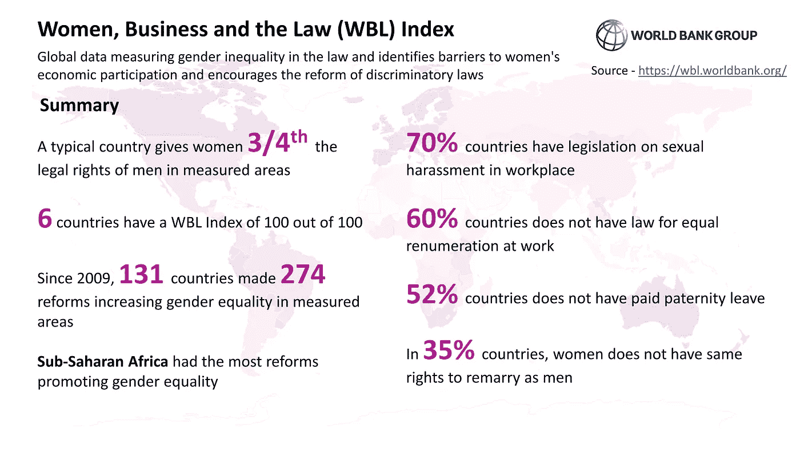

# 妇女、商业和法律——使用 R

> 原文：<https://medium.com/analytics-vidhya/women-business-and-the-law-data-story-telling-using-r-a07c6a8a4fda?source=collection_archive---------7----------------------->

**为什么用数据讲故事很重要？**

如果以正确的方式呈现，数据可以成为强大的交流工具。[研究](https://www.fastcompany.com/3035856/why-were-more-likely-to-remember-content-with-images-and-video-infogr)表明，如果信息以可视化的形式呈现，而不是以数字形式呈现，观众会记得更准确。但是在报告或仪表板中有大量的图表有时会让读者不知所措。重要的是要了解数据中的哪些见解对突出和围绕它开发一个故事最重要。一个好的数据故事会在读者的脑海中构建一幅叙事图，并产生最大的影响。

**为什么使用 R 进行数据可视化？**

其他数据可视化工具的学习难度不如 r。Tableau 是一个用户友好的工具，具有单击和拖动选项，编程技能较低的人可以使用它制作出令人惊叹的可视化效果。但是 R 使您能够转换数据进行探索，并使用其无数的库生成定制的表。特别是如果你正在处理一个复杂的数据集，R 是一个完美的工具来执行数据分析和可视化。应该使用 R 的另一个原因是再现性。你只需要写一次 R 代码，然后你就可以回头再看，并且很容易记住代码的各个步骤。

**这个故事背后的数据是什么？**

[妇女、商业和法律(WBL)](https://wbl.worldbank.org/) 是世界银行集团的一个项目，旨在收集限制妇女经济机会的法律法规的独特数据。自 2009 年以来，WBL 涵盖 187 个国家，有 8 个主题与妇女参与经济有关。在这篇文章中，我使用了 WBL 的最新数据(2018 年)，讲述了一个关于限制女性经济参与的法律法规的数据故事。

**如何创造一个好的数据故事？**

在创建数据故事时，需要记住以下几点:

1.在**阶段**中构建叙述。德国小说家古斯塔夫·弗雷塔吉斯(Gustav Freytagis)开发的弗雷塔格斯金字塔(Freytag's Pyramid)提供了一个人们可以遵循的完善结构。你需要确定最能引起听众共鸣的阶段。

2.在故事的开头创造**情境**。这将有助于读者理解背景并理解故事中呈现的观点。

3.选择正确的可视化。一个故事将有一个可视化的组合。当你想让观众了解数据的概貌或全貌时，可以使用可视化工具，如**地图、面积图**等。但是当你想让观众看到准确的估计或做出准确的判断时，那么就使用可视化工具，比如**条形图和**线图，这样更有效。

4.使用文字为您的数据添加声音。确保突出句子中的重要单词，将它们用**加粗**或增加**字体大小**。

5.保持简单。对于非技术人员来说，使用的可视化和描述应该**一目了然**。

**女人、商业和法律的故事**

这个数据故事分为四个阶段。该故事旨在通过提供全球和区域情况，宣传支持印度(我们的重点国家)妇女参与经济活动的法律法规。

在故事的第一阶段，我提供了一个关于这个问题和所使用的数据的背景。接下来是对数据中关键观点的总结。在这一阶段，我使用叙述来传达作为总结点的见解。



第一阶段—提供背景

在第二阶段，我通过比较不同国家的 WBL 分数提供了这个问题的全球图景。我已经使用 R 在以下两个阶段创建了可视化。我已经在 R 中安装并加载了所需的库，如下所示:

```
install.packages("tidyverse")
install.packages("rworldmap")
install.packages("RColorBrewer")library(tidyverse)
library(rworldmap)
library(RColorBrewer)
```

Tidyverse 是 r 的一组核心包。这些包用于数据整理、操作和可视化。在这个练习中，我使用了 tidyverse 的 **ggplot2** 和 **readr** 子包。 **Rworldmap** 软件包通过促进加入现代世界地图和提供可视化选项，支持国家级和网格用户数据集的制图。RColorBrewer 为可视化创造好看的调色板，特别是为专题地图。

r 有很多可视化库来创建地图。Rworldmap 库允许您使用几行代码轻松创建国家级热图。当人们使用像世界银行研究那样的数据时，它特别有用，这些数据带有像 ISO 3166 这样的标准国家代码。以下代码用于创建全球热图，其中包含每个国家的 WBL 分数。

```
world_wbl <- joinCountryData2Map(wbl, joinCode = "ISO3",
nameJoinColumn = "wbcodev2")colourPalette <- brewer.pal(5,'RdPu')par(mai=c(0.2,0,0.2,0),xaxs="i",yaxs="i")
wbl_map <- mapCountryData(world_wbl, nameColumnToPlot = "WBL_INDEX",
colourPalette=colourPalette, addLegend=FALSE,
mapTitle = "OECD high-income countries have higher WBL scores and 
countries in Middle East and Northern Africa have lesser WBL scores")do.call(addMapLegend,
c(wbl_map, legendLabels="all", legendWidth=0.6,
legendIntervals="data", legendMar = 2))
```

以下可视化是作为热图创建的:


第二阶段——全球视野

这种有影响力的可视化帮助读者掌握 WBL 分数在不同地理位置的变化。

在第三阶段，我从全球层面深入到地区层面。这些见解是根据国家的地理区域和收入群体分类提供的。条形图用于传达调查结果。用于创建其中一个条形图的 R 代码如下所示:

```
wbl1 <- wbl %>%group_by(Region) %>%summarise(wbl_avg = mean(WBL_INDEX, na.rm = T))gwbl1 <- ggplot(wbl1, mapping = aes(x = reorder(Region, wbl_avg), 
y= wbl_avg, fill = ifelse(Region == "South Asia", "Highlighted", "Normal"))) +
geom_bar(stat="identity",width = 0.5) +
theme(panel.background = element_rect(fill ='white'),
legend.position = "none",axis.title.y = element_blank(), axis.title.x = element_blank()) +
ggtitle("Average WBL Scores - Region Wise")+
coord_flip()gwbl1
```


第三阶段——区域层面的见解

在最后一个阶段，我已经用图形和短语的组合可视化了印度特定的数据故事。在这里，我对总共 8 个参数中的 3 个参数提供了详细的见解。这一形象进一步表明，与其他南亚国家相比，印度表现良好，但在确保妇女平等参与经济方面还有很长的路要走。


第四阶段—印度特定见解

我希望这能让你对如何使用 r 创建数据故事有一个基本的了解。来自不同 R 库的其他可视化可用于根据上下文和目标受众交流数据故事。我推荐你使用 R Studio 的[闪亮包](https://rstudio.github.io/shiny/tutorial/)来交流你的数据故事。闪亮的应用程序提供了一个 web 应用程序框架来创建交互式 web 应用程序(可视化)。这将有助于观众与你的故事直接互动，从而提高参与度。