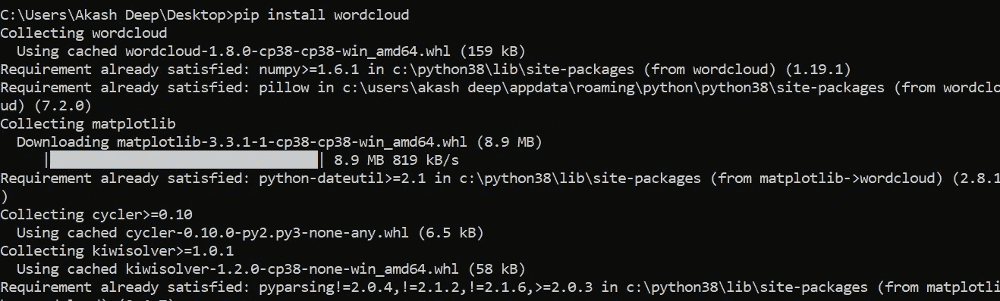
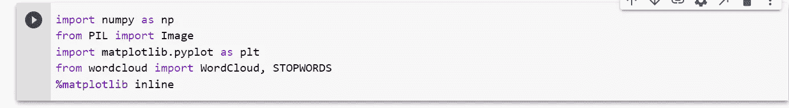
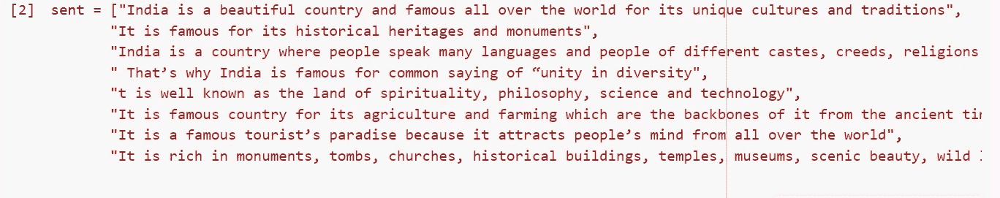
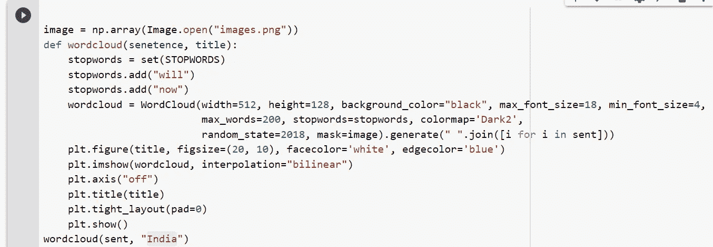
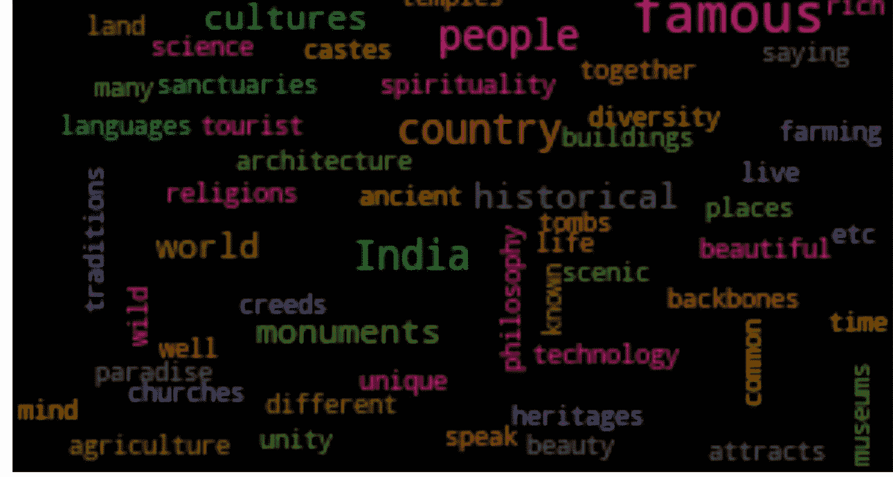
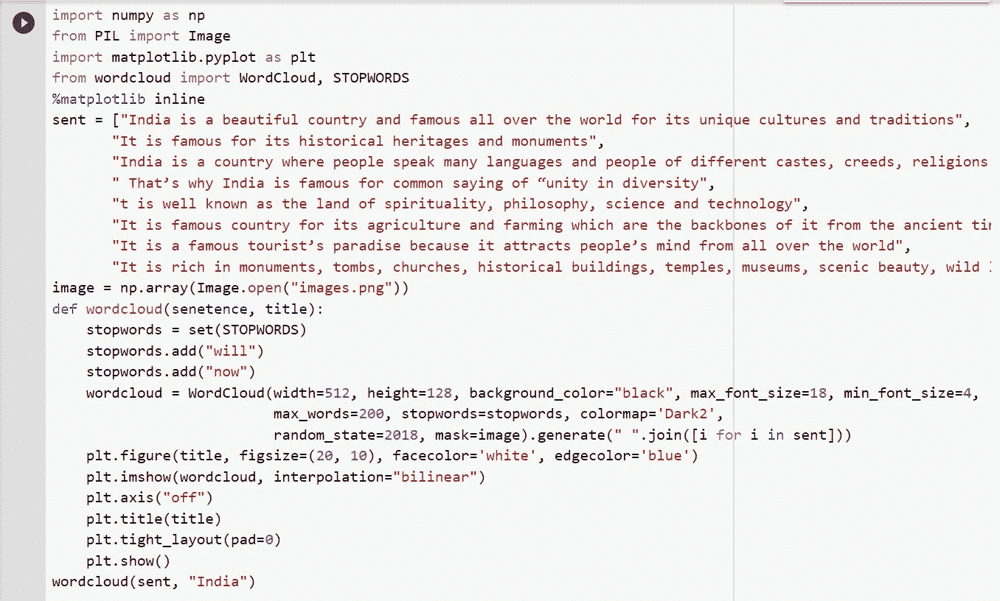

# 使用 Python 中的词云进行词分析

> 原文：<https://medium.com/analytics-vidhya/word-analysis-using-word-cloud-in-python-b273ded249dc?source=collection_archive---------12----------------------->

词云

在这篇文章中，我们将试图了解一个非常方便和有用的工具，即单词云的用法。我们将尝试使用 python 代码实现单词 cloud。这将是一篇很短的文章

词云可以用于分析语料库中存在的词。假设你有 2000-3000 个单词，我们想分析哪些是文档中最常见的单词或重复出现的单词。在上面讨论的场景中，单词云将是非常方便的工具。人们通常用它来快速理解文档，并用来理解文档是关于什么的？假设你有 2000-3000 条推文，你想快速了解推文的性质，无论是正面还是负面。在这种情况下，单词云将是非常方便的工具。下面是从安装开始，我们将从头开始实施 word cloud 的步骤

**步骤 1:** 首先，我们将通过从终端执行以下 pip 命令来安装 word cloud

pip 安装 wordcloud

**第二步:**我们已经成功安装了 word cloud。现在，我们将前往终端并导入以下必需的包。除此之外，我们还将导入 matplotlib 来实现单词的可视化。

词云包

我们将尝试在笔记本电脑图像中嵌入生成的单词云。我们能做到的。首先将笔记本电脑映像下载到本地，并将该映像保存在相同的项目文件夹中。你可以自由选择任何你想保留你的单词云的图片，如果你不想选择图片也没关系。

笔记本电脑图像

**第三步:**我们将随机选择一些我们打算应用词云的句子。我从网上随便选了一些关于我们国家印度的句子。你可以从网上任意选择句子。

我将应用单词云的句子。

**步骤 4:** 现在我们将在 **python** 中创建一个 **word cloud 函数**，并将我们从互联网下载的所有文本传递给创建的函数。此外，我们将应用**停用词**移除，因为停用词不会给我们的分析增加任何价值。如果你想知道更多关于文本预处理的信息，你可以访问我在本文最后附上的文章。此外，我们将在函数中添加绘图代码，但您可以自由地将绘图函数放在 word cloud 函数之外。下面是 Word Cloud 函数的代码。

Wordcloud 和绘图功能

如果我们执行上面定义的单词云函数，下面是生成的单词云。

词云

恭喜你，我们已经实现了 word cloud 简单的 python 代码。正如我上面提到的，对于数据科学家来说，这是一个非常方便的工具，可以对数百万或数十亿个单词的集合进行分析。在未来的文章中，当我们讨论情感分析时，我们将使用词云的概念来理解正面推文中的常用词或最常用词，负面推文中也是如此。

请随意分享您自己的想法，您认为如何在工作中使用非常方便简单的 python word cloud 工具。如果你对本文有任何疑问，如果你对 python 代码有任何困惑，欢迎在下面发表评论，我将非常乐意解答你的疑问。在我们的下一个教程中，我将提供更多的 python 便利工具和函数，它们看似简单，但在日常工作中非常有用。如果你想了解更多关于使用 keras 的单词嵌入标记化或深度学习的信息，我请求你访问下面我写的文章。我附上本教程中使用的代码。

单词云的完整代码

 [## Keras 嵌入层和手套预训练逐步嵌入的程序实现

### Keras 嵌入层是神经网络的第一个输入层。在转换我们的原始输入数据后…

medium.com](/analytics-vidhya/keras-embedding-layer-and-programetic-implementation-of-glove-pre-trained-embeddings-step-by-step-7a4b2fa71544) 

# 敬请关注