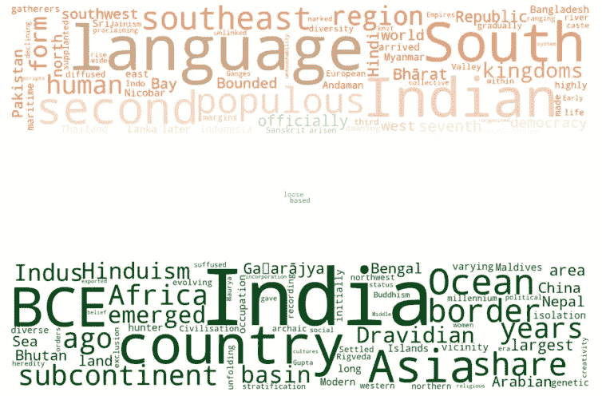

# 词云:一个文本可视化工具

> 原文：<https://medium.com/analytics-vidhya/word-cloud-a-text-visualization-tool-fb7348fbf502?source=collection_archive---------12----------------------->

欢迎大家来到我的新故事。这里，我们将讨论单词 Cloud，它是我们的文本数据的图形化表示。我们将看到一些使用 Python 语言的实际例子。让我们开始吧。


由 [Ales Krivec](https://unsplash.com/@aleskrivec?utm_source=medium&utm_medium=referral) 在 [Unsplash](https://unsplash.com?utm_source=medium&utm_medium=referral) 上拍摄的照片

# 什么是词云？？

1.  对于一般人来说，“词云”简单来说就是*一堆词*。他或她会想到包含单词的云，而不是水。
2.  对于数据分析师或技术人员来说，Word Cloud 是文本数据的高级图形表示。
3.  形式定义:单词云(标签云)是文本语料库中单词的视觉表示，其中单词的视觉大小与单词的频率或重要性成比例。[1]
4.  我们有现成的用 Python 语言命名的 wordcloud。

# 安装选项:

```
# option 01: IF you need basic features
pip install wordcloud# option 02: For advanced features 
git clone [https://github.com/amueller/word_cloud.git](https://github.com/amueller/word_cloud.git) 
cd word_cloud 
pip install .
```

**其他需要的库:** numpy，pandas，matplotlib，pillow。

# 第一个工作示例:

```
from wordcloud import WordCloud
import matplotlib.pyplot as plt# Example text:
input = 'Python Python Java Java Python Python Java ruby ruby scala Python'# Creating empty WordCloud object and generating actual WordCloud.
wordcloud = WordCloud().generate(input)# Display the word cloud
plt.imshow(wordcloud, interpolation='bilinear')
plt.axis("off")
plt.show()
```


上述代码的输出

在我们输入的文本中，“Python”这个词出现的次数最多。因此，Python 在输出图像中具有最大的形状，单词的其余形状也是如此。在这里，我想告诉你一个词的频率如何影响它在词云中的出现。

# **第二个例子(更实用):**

下面的文字资料包含了从印度维基百科页面上摘录的前两段文字[2]。只需将输入变量值替换为以下文本，或者您可以将其保存在文本文件中，读取并用于单词云形成。

```
India, officially the Republic of India (Hindi: Bhārat Gaṇarājya),[23] is a country in South Asia. It is the second-most populous country, the seventh-largest country by area, and the most populous democracy in the world. Bounded by the Indian Ocean on the south, the Arabian Sea on the southwest, and the Bay of Bengal on the southeast, it shares land borders with Pakistan to the west;[f] China, Nepal, and Bhutan to the north; and Bangladesh and Myanmar to the east. In the Indian Ocean, India is in the vicinity of Sri Lanka and the Maldives; its Andaman and Nicobar Islands share a maritime border with Thailand and Indonesia.Modern humans arrived on the Indian subcontinent from Africa no later than 55,000 years ago.[24] Their long occupation, initially in varying forms of isolation as hunter-gatherers, has made the region highly diverse, second only to Africa in human genetic diversity.[25] Settled life emerged on the subcontinent in the western margins of the Indus river basin 9,000 years ago, evolving gradually into the Indus Valley Civilisation of the third millennium BCE.[26] By 1200 BCE, an archaic form of Sanskrit, an Indo-European language, had diffused into India from the northwest, unfolding as the language of the Rigveda, and recording the dawning of Hinduism in India.[27] The Dravidian languages of India were supplanted in the northern regions.[28] By 400 BCE, stratification and exclusion by caste had emerged within Hinduism,[29] and Buddhism and Jainism had arisen, proclaiming social orders unlinked to heredity.[30] Early political consolidations gave rise to the loose-knit Maurya and Gupta Empires based in the Ganges Basin.[31] Their collective era was suffused with wide-ranging creativity,[32] but also marked by the declining status of women,[33] and the incorporation of untouchability into an organised system of belief.[g][34] In South India, the Middle kingdoms exported Dravidian-languages scripts and religious cultures to the kingdoms of Southeast Asia.
```


以上文本的输出

# 用图像遮罩:

这里，我们将在图像颜色的帮助下遮蔽我们的单词云。你也可以在蒙版图像的帮助下塑造你的云。我们将使用以下图像进行遮罩:


图像制作[3]

```
import numpy as np
from PIL import Image
from wordcloud import WordCloud, ImageColorGenerator
import matplotlib.pyplot as plt# load the mask image
mask = np.array(Image.open("india.jpg"))# Loading the text data
fl = open('sample_file_1.txt')
text = fl.read()# Masking process
wordcloud_india = WordCloud(background_color="white", mode="RGB", max_words=1000, mask=mask).generate(text)# coloring from mask image
image_colors = ImageColorGenerator(mask)
# Display the image
plt.figure(figsize=[13,15])
plt.imshow(wordcloud_india.recolor(color_func=image_colors), interpolation="bilinear")
plt.axis("off")
plt.show()
```



输出屏蔽图像

在输出图像中，您可以看到 word cloud 根据蒙版图像进行了着色和整形。您可以在以下链接获得笔记本文件和相关数据(文本、图像、输出):[https://github.com/sawan16/Word_Cloud_medium](https://github.com/sawan16/Word_Cloud_medium)

谢谢你……

# 参考资料:

[1][https://www . data camp . com/community/tutorials/word cloud-python](https://www.datacamp.com/community/tutorials/wordcloud-python)，[2][https://en.wikipedia.org/wiki/India](https://en.wikipedia.org/wiki/India)，[3][https://en.wikipedia.org/wiki/Flag_of_India](https://en.wikipedia.org/wiki/Flag_of_India)