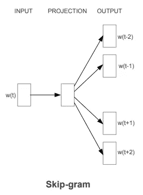
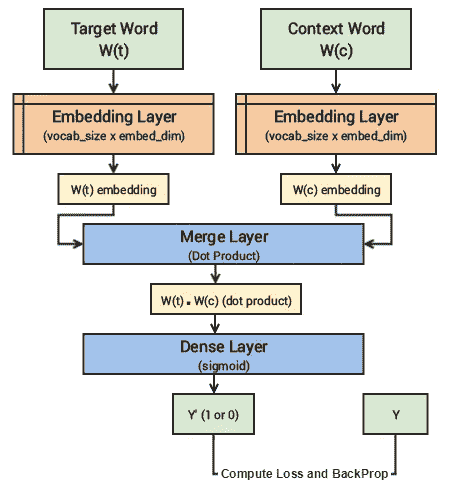
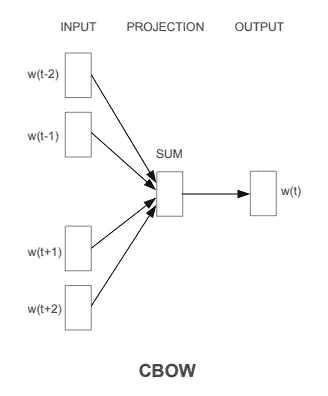
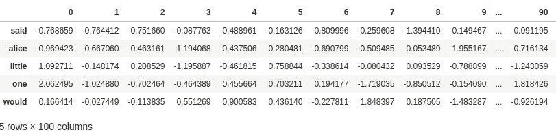

# 单词嵌入:在 Pytorch 中从头开始生成单词的方法

> 原文：<https://medium.com/analytics-vidhya/word-embedding-methods-to-generate-them-usage-in-financial-markets-and-experiments-on-twitter-63fae8a5ddd2?source=collection_archive---------6----------------------->

在大型文本语料库中，相关的单词(同义词等)很有可能出现在一组相似的单词周围，例如，1“国王”规则和“女王”规则。这里国王和王后虽然不能直接替换，但似乎有关系，即都指统治者。这个关于人类生成文本的假设被称为*分布假设*。

现在这就引出了一个问题，你如何用数字表示这种关系和语义相似性？回车，单词嵌入。单词嵌入是单词的*密集*向量表示，使得在相似上下文中出现的单词具有更接近的向量表示。整个向量空间是潜在语义的表示。这些单词嵌入进一步有助于带出文档和句子的含义，这为各种下游任务创造了空间，如情绪分析等，然后可用于证实市场趋势。

有多种方式可以生成单词嵌入。传统的方法被称为*基于频率的方法*。它们包括像 TF-IDF，单词袋等方法，新的方法使用深度学习。基于预测的深度学习模型在提供信息方面要强大得多，因此让我们详细探索它们。通过深度学习的两个流行和普遍存在的模型是跳字模型和连续单词袋模型。让我们使用 **Pytorch** 从头开始实现这两者。但在此之前，先简要介绍一下这两种预测模型。

## **跳过克模型**

顾名思义，skip gram 模型针对给定的单词(被跳过的)使用函数逼近器(像神经网络一样)来预测其*上下文。*给定单词的*上下文*是文本语料库中该单词前后的一组单词。多少单词在前面和后面是模型中必须优化的超参数。

图 1:用于预测上下文的输入单词

现在如图 1 所示，输入的数字表示(通常是一个[热编码](https://machinelearningmastery.com/why-one-hot-encode-data-in-machine-learning/))被放入模型，并根据*上下文向量*进行训练，上下文向量通常是一个 [*单词包*](https://en.wikipedia.org/wiki/Bag-of-words_model) 向量。

为了使网络训练更健壮，基于对训练、测试和验证结果的经验观察，在架构上提出了一些改变。代替一个输入单词预测多个上下文单词，进行简化，使得我们将每个 ***(目标，上下文单词)训练对*** 分解成多个 ***(目标，上下文)训练对*** ，使得每个上下文由旧的一个单词组成。所以如果我们有一个句子，比如说“快速棕色狐狸跳过懒狗”我们的一些训练样本会是——**(棕色，快速)，(狐狸，棕色)，(跳跃，狐狸)**等等。

现在，由于这种新的架构，另一个自然的变化是，我们可以根据数字标签来训练网络，以确定给定的 ***(目标，上下文)训练对*** 是否是有效的上下文。这现在变成了一个上下文有效性分类问题。我们将有效和无效的 ***(目标，上下文)训练对*** 传入我们的网络，以帮助它更好地学习细微差别。传入无效的、随机生成的上下文对被称为**负采样**。

我们训练样本的格式是 ***(X，Y)*** 其中 ***X*** 是我们的 ***输入******Y***是我们的 ***标签。*** 我们通过使用 ***[(目标，上下文)，1]*** 对作为 ***实际输入样本*** 来实现这一点，其中 ***目标*** 是我们感兴趣的单词，而 ***上下文*** 是出现在目标单词附近的上下文单词，并且 ***实际标签 1*** 指示这是上下文相关的对。我们还输入 ***[(目标，随机)，0]*** 对作为 ***负输入样本*** 其中 ***目标*** 再次是我们感兴趣的单词，但是 ***随机*** 只是从我们的词汇表中随机选择的单词，与我们的目标单词没有上下文或关联。

因此 ***否定标记 0*** 表示这是一个上下文不相关的对。我们这样做是为了让模型能够学习哪些词对是上下文相关的，哪些是不相关的，并为语义相似的词生成相似的嵌入。

图 2:改进的 Skip gram 架构优于原来的架构。

## **连续单词袋模型**

这个模型的工作方式是，当你给出上下文单词作为输入时，它预测一个单词的概率。

图 3:用于预测输入单词的上下文

CBOW 模型架构试图基于源上下文单词(周围单词)来预测当前目标单词(中心单词)。考虑一个简单的句子， ***“敏捷的棕色狐狸跳过懒惰的狗”*** ，这可以是成对的 ***(context_window，target_word)*** 如果我们考虑大小为 2 的上下文窗口，我们有这样的例子: ***(【敏捷，狐狸】、棕色)、(【the，棕色)、敏捷)、(【the，狗】*** 等等。因此，该模型试图基于上下文窗口词来预测目标词。

我们可以将这种 CBOW 架构建模为深度学习分类模型，使得我们接受 ***上下文单词作为我们的输入，X*** 并尝试预测 ***目标单词，Y*** 。事实上，构建这种架构比 skip-gram 模型更简单，在 skip-gram 模型中，我们试图从源目标单词预测一整串上下文单词。

## **实施**

让我们使用 Pytorch、nltk 等实现 Skip-Gram 和 CBOW 模型。我们将使用比未经处理的社交媒体数据更简单的文本语料库。这里我选择了 nltk 中的“爱丽丝梦游仙境”语料库作为古腾堡计划的标准语料库。

任何一种 ML 建模的第一步都是数据预处理，所以我将继续这两种模型共有的处理步骤。

代码 1:矢量化函数，用于清理传递给它的文档中的每个句子

如代码 1 所示，我们有一个用空字符串替换常规字母表之外的任何内容的函数。然后去掉它周围的空格，取小写字母并对字符串进行标记。此后，它删除 nltk 给出的所有标准停用词，并将句子连接回去并返回。然后，我们使用 python 标准函数映射，将语料库中的每个句子映射到它的干净版本，并删除所有少于 2 个单词的句子。这显示在代码 2 中。

代码 2:删除标点和数字

之后，我们使用 Code3 的代码将每个独特的单词编码成一个数字。此时，我们现在有了一个编码的数据语料库，我们必须为 CBOW 和 SkipGram 修改不同的语料库。

代码 3:将单词符号化，并用数字等价物替换它们

## **CBOW 实施**

现在这些单词被编码成数字，以便传递到神经网络中。让我们从编码的语料库中创建训练样本。如代码 4 所示。对于语料库的每个句子中的每个单词，我们将它周围的上下文切掉，并将其与该单词配对。

代码 4:生成上下文和标签

此后，我们使用 Pytorch 定义网络的架构。如代码 5 所示，我们有一个嵌入层，它学习词汇表中每个单词的密集向量表示。该层的输出被传递到一个重新激活的线性层。其被进一步传递到具有 **softmax** 激活的另一个线性层。

具有 softmax 激活的层总是返回概率分布。在我们的例子中，概率分布将是我们之前构建的词汇的分布。输出告诉给定一组上下文单词，哪个单词最有可能被放在中心。

代码 CBOW 架构定义

在定义了网络之后，我们根据词汇表的一个热编码向量来训练它，每个热编码向量代表一个目标单词。如代码 6 所示。

代码 6:训练循环

生成的嵌入可以在图 3 中看到。

图 4:数据帧中的学习单词嵌入

## **skip program 实现**

就像在 CBoW 实现中一样，我们将数字编码的句子作为输入，然后将它们转换为**(上下文单词，目标单词)**我们对 skip-gram 模型做了同样的事情。不同之处在于，这种情况下的训练样本格式是( **[(目标，上下文)，*相关性* ])。**这可以通过 keras 序列预处理模块轻松实现，该模块具有创建训练样本的功能。这显示在代码 7 中。该函数将编码后的句子、生成样本的窗口大小和词汇大小作为输入。

代码 7:skip program 训练样本生成

在创建了样本之后，我们将它传递给 skipgram 模型，其架构在代码 8 中给出。它由嵌入层组成，一层用于单词，一层用于上下文。这些的输出被逐元素相乘，然后被传递到具有 **sigmod** 激活的线性层。这个预测的概率值根据标签进行训练，标签告诉我们训练样本的相关性，即它是正样本还是负样本。

代码 8:skip program 模型架构定义

skipgram 网络的训练循环如下。这里，我们对多个正样本和负样本运行一个循环，收集损耗，然后使用这个损耗通过反向传播来改变网络权重。

这包括了两种无处不在的神经方法，从我们选择的任何文本中创建单词嵌入。在金融领域，这可以用于商业文章和社交媒体数据，以帮助识别市场 alphas 的下游任务。模特们的聚集地在这里*和 [*这里*](https://github.com/nautiism/embeddings/blob/master/skipGram.ipynb) 。*

## ***参考文献:***

*[1][https://www . kdnugges . com/2018/04/implementing-deep-learning-methods-feature-engineering-text-data-skip-gram . html](https://www.kdnuggets.com/2018/04/implementing-deep-learning-methods-feature-engineering-text-data-skip-gram.html)*

*[2][https://arxiv.org/abs/1301.3781](https://arxiv.org/abs/1301.3781)(米科洛夫论文)*

*[https://nlp.stanford.edu/pubs/glove.pdf](https://nlp.stanford.edu/pubs/glove.pdf)*