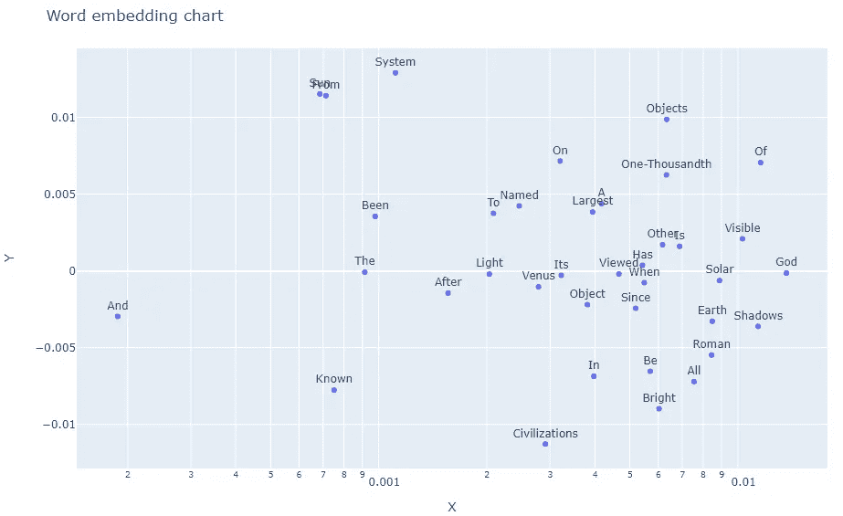

# 使用 Python 嵌入单词

> 原文：<https://medium.com/analytics-vidhya/word-embedding-using-python-63770334841?source=collection_archive---------7----------------------->


[信号源](https://www.pexels.com/photo/screen-web-design-developing-codes-1936299/)

在这篇文章中，我们将看到如何生成单词嵌入并为相应的单词绘制图表。

# 属国

```
- NLTK
- Sklearn
- Gensim
- Plotly
- Pandas
```

首先，我们需要获得一个段落或文本，我们需要为其找到嵌入，我在这篇文章中从[这里](https://en.wikipedia.org/wiki/Jupiter)取了一个 pragraph。

```
paragraph = '''Jupiter is the fifth planet from the Sun and the largest in the Solar System. 
    It is a gas giant with a mass one-thousandth that of the Sun, 
    but two-and-a-half times that of all the other planets in the Solar System combined. 
    Jupiter is one of the brightest objects visible to the naked eye in the night sky, 
    and has been known to ancient civilizations since before recorded history. 
    It is named after the Roman god Jupiter. When viewed from Earth, 
    Jupiter can be bright enough for its reflected light to cast shadows, 
    and is on average the third-brightest natural object in the night sky after the Moon and Venus.'''
```

接下来我们需要对文本进行标记，所以我们使用`nltk`库来完成这项工作:

```
import nltk# tokeninizing the paragraph
sent_text = nltk.sent_tokenize(paragraph)
word_text = [nltk.word_tokenize(sent) for sent in sent_text]
print(word_text)
```

令牌化后，我们将获得一个 2D 数组，如下所示:

```
[['Jupiter', 'is', 'the', 'fifth', 'planet', 'from', 'the', 'Sun', 'and', 'the', 'largest', 'in', 'the', 'Solar', 'System', '.'], ['It', 'is', 'a', 'gas', 'giant', 'with', 'a', 'mass', 'one-thousandth', 'that', 'of', 'the', 'Sun', ',', 'but', 'two-and-a-half', 'times', 'that', 'of', 'all', 'the', 'other', 'planets', 'in', 'the', 'Solar', 'System', 'combined', '.'], ['Jupiter', 'is', 'one', 'of', 'the', 'brightest', 'objects', 'visible', 'to', 'the', 'naked', 'eye', 'in', 'the', 'night', 'sky', ',', 'and', 'has', 'been', 'known', 'to', 'ancient', 'civilizations', 'since', 'before', 'recorded', 'history', '.'], ['It', 'is', 'named', 'after', 'the', 'Roman', 'god', 'Jupiter', '.'], ['When', 'viewed', 'from', 'Earth', ',', 'Jupiter', 'can', 'be', 'bright', 'enough', 'for', 'its', 'reflected', 'light', 'to', 'cast', 'shadows', ',', 'and', 'is', 'on', 'average', 'the', 'third-brightest', 'natural', 'object', 'in', 'the', 'night', 'sky', 'after', 'the', 'Moon', 'and', 'Venus', '.']]
```

现在我们将使用`gensim`包从`Word2Vec`模型中获取单词 embedding。

```
from gensim.models import Word2Vec# train model to get the embeddings
model = Word2Vec(word_text, min_count=1)
```

为了绘制单词嵌入，我们需要首先将多维嵌入转换为 2D 数组。因此，要将其转换为 2D 数组，我们使用`PCA`

```
# getting the embedding vectors
X = model[model.wv.vocab]
# dimentionality reduction using PCA
pca = PCA(n_components=2)
# running the transformations
result = pca.fit_transform(X)
# getting the corresponding words
words = list(model.wv.vocab)
```

我们需要做一些处理来将 PCA 结果转换成数据帧，如下所示:

```
import pandas as pd# creating a dataframe from the results
df = pd.DataFrame(result, columns=list('XY'))
# adding a columns for the corresponding words
df['Words'] = words
# converting the lower case text to title case
df['Words'] = df['Words'].str.title()
```

获得所需的数组后，我们可以使用`plotly`绘制图表

```
import plotly.express as px# plotting a scatter plot
fig = px.scatter(df, x="X", y="Y", text="Words", log_x=True, size_max=60)
# adjusting the text position
fig.update_traces(textposition='top center')
# setting up the height and title
fig.update_layout(
    height=600,
    title_text='Word embedding chart'
)
# displaying the figure
fig.show()
```

现在，单词嵌入图表将如下所示:



单词嵌入图

整个代码如下:

```
import nltk
import pandas as pd
import plotly.express as px
from gensim.models import Word2Vecparagraph = '''Jupiter is the fifth planet from the Sun and the largest in the Solar System. 
    It is a gas giant with a mass one-thousandth that of the Sun, 
    but two-and-a-half times that of all the other planets in the Solar System combined. 
    Jupiter is one of the brightest objects visible to the naked eye in the night sky, 
    and has been known to ancient civilizations since before recorded history. 
    It is named after the Roman god Jupiter. When viewed from Earth, 
    Jupiter can be bright enough for its reflected light to cast shadows, 
    and is on average the third-brightest natural object in the night sky after the Moon and Venus.'''# tokeninizing the paragraph
sent_text = nltk.sent_tokenize(paragraph)
word_text = [nltk.word_tokenize(sent) for sent in sent_text]# train model to get the embeddings
model = Word2Vec(word_text, min_count=1)
# getting the embedding vectors
X = model[model.wv.vocab]
# dimentionality reduction using PCA
pca = PCA(n_components=2)
# running the transformations
result = pca.fit_transform(X)
# getting the corresponding words
words = list(model.wv.vocab)# creating a dataframe from the results
df = pd.DataFrame(result, columns=list('XY'))
# adding a columns for the corresponding words
df['Words'] = words
# converting the lower case text to title case
df['Words'] = df['Words'].str.title()# plotting a scatter plot
fig = px.scatter(df, x="X", y="Y", text="Words", log_x=True, size_max=60)
# adjusting the text position
fig.update_traces(textposition='top center')
# setting up the height and title
fig.update_layout(
    height=600,
    title_text='Word embedding chart'
)
# displaying the figure
fig.show()
```

编码快乐！！！