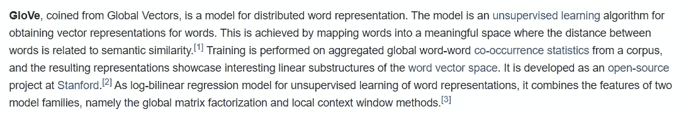

# 单词嵌入(单词表示为向量)

> 原文：<https://medium.com/analytics-vidhya/word-embedding-word-represented-as-vector-f27cd5679be8?source=collection_archive---------14----------------------->

鉴于下面的两篇文章，你能告诉我他们是否在谈论类似的话题吗？

以上两篇文章讨论了两种不同类型的单词嵌入，即 Google 的 Word2Vec 和 Stanford 的 GloVe。在更高的层次上，这些是类似的文章。有趣的事实是，在做这个练习以确定这两篇文章是否相似时，人们通常会查看参与其中的关键词，并尝试查看这两篇文章中有多少关键词匹配，以确定它们是否相似。

> 词汇是文本的典型代表

考虑下面的例子，

那是一张非常漂亮的水星照片！！！

我们在上面的声明中谈论的是什么？[水星——行星](https://en.wikipedia.org/wiki/Mercury_(planet))或[水星——元素](https://en.wikipedia.org/wiki/Mercury_(element))

> 词汇袋没有抓住词汇的语义

我们如何捕捉一个词的语义？

从上面两篇文章中，我们可以清楚地区分文章所指的是哪个概念。第一个是关于元素，第二个是关于行星。这种区别是可能的，因为单词出现的上下文很清楚。语境可以用共现词来定义。

> 一个词的语义可以从它的共现词(上下文)中捕获

# 单词嵌入

直觉地认为语义在进行任何文本处理时都很重要&这是用语义表示单词的第一步。

如果我们将单词表示为单词向量空间中的向量，并且我们可以执行如下算术计算，会怎么样呢:

> 国王-男人+女人=王后

这看起来棒极了！具有相似含义的单词在嵌入空间中将具有接近的向量表示(尽管情况并不总是如此)。

为什么是矢量？单词不是计算机自然理解的东西。通过将它们编码成数字形式，我们可以应用数学规则并对它们进行矩阵运算。

但是我们如何计算单词的向量呢？这就是美丽的“单词嵌入”的由来。使用简单的一层神经网络将单词表示为向量的微妙技术仍然令我敬畏。

从上面的讨论中可以清楚地看出两件事，

1.  可以通过捕获共现单词来捕获语义
2.  用向量表示的单词可以帮助我们有效地捕捉单词的表达。

> 关于 Word2Vector 的一个有趣的事情是，我们为一个任务训练模型，但用它来为另一个任务服务！！

CBOW:给定(n-t)个单词和(n+t)个单词，即相邻的单词，我们能预测单词 n 吗？

CBOW 的神经网络如上图所示，它由一个 N 维隐层、一个输入层和一个输出层组成。

1.  词汇表中的每个单词都被表示为一个长度等于词汇表的独热向量。独热向量的大小是 1 X |V|

2.n-t 个单词& n+t 个单词及其一个热码表示然后被传递到没有激活函数的隐藏层。t 是一个移动窗口，可以设置为任何数字。

3.隐藏层的大小，一个超参数通常是 300。(Word2Vec 使用的默认大小)。隐藏层的权重矩阵的大小为|V| X N，其中 N 是隐藏层的大小。

通过训练和反馈，我们学习隐藏层的权重矩阵。这个隐藏层代表什么？

从上图可以理解，给定网络的一个热点向量，单词表示在隐藏层权重矩阵中被捕获。

# 使用 Genism 的 Word2Vec:

1.  加载预先训练好的谷歌数据。

2.使用模型的函数，如下所示。

# 最先进的单词嵌入技术:

1.  [Word2Vec](https://code.google.com/archive/p/word2vec/)
2.  [手套](https://nlp.stanford.edu/projects/glove/)
3.  [快速文本](https://fasttext.cc/)
4.  埃尔莫
5.  伯特
6.  XLNET

# 单词嵌入的优势:

1.  捕捉单词的语义。
2.  共享知识，即针对各种文本处理任务转移知识。