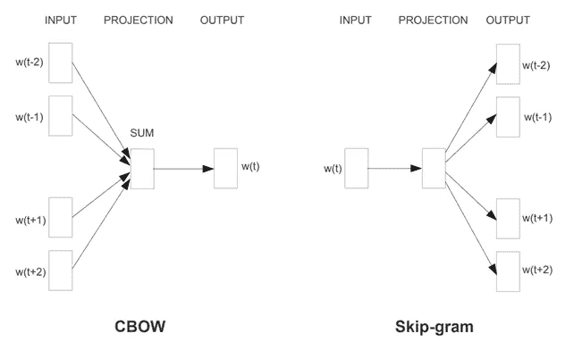
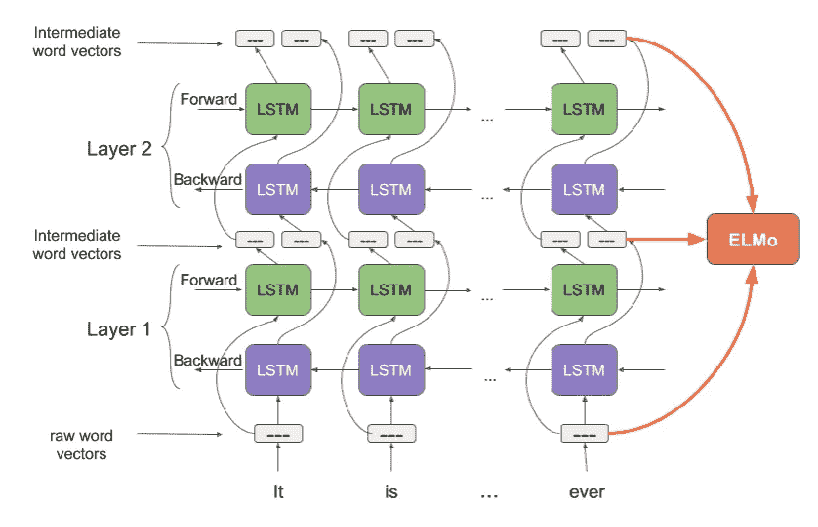
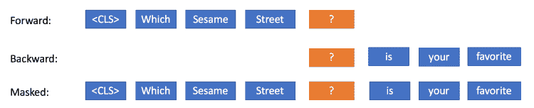

# 单词嵌入:自然语言处理前景介绍

> 原文：<https://medium.com/analytics-vidhya/word-embeddings-an-introduction-to-the-landscape-dcf20cf391a1?source=collection_archive---------4----------------------->

本文旨在以简单的方式解释 NLP 的关键概念，即单词嵌入，以提供单词嵌入是什么、如何使用它们以及为什么它们是构建 NLP 模型的关键的高级概念。

## **先决条件:**

—机器学习概念

—自然语言处理的基础

## **单词嵌入:**

单词嵌入是一种在 D 维向量空间中表示单词的方法，其中 D 可以由您选择。这种向量表示可以用于对单词执行数学运算、查找单词类比、执行情感分析等。

被广泛使用的最基本的嵌入是 **One Hot Encoding** 技术，它通过将每个单词指定为一列来表示向量空间中的分类特征。这个独热编码向量的大小为 N×V，其中 N 是观察值的数量，V 是词汇表的大小。

**为什么其他单词嵌入方法优于一键编码？**

原因是一个热编码向量可以用来表示向量空间中的单词，但是单词的含义或上下文不能被它们捕获。例如，可以使用其他单词嵌入算法来寻找相似的单词，即在相同上下文中使用的单词或具有相似单词的单词，并且通过使用像欧几里德距离或余弦相似性这样的距离度量来计算该上下文相似性。

对于独热编码向量，只有一列具有值 1，而其他列具有值 0，因此任何两个独热字向量之间的欧几里德距离将总是 sqrt(2)，因此所有字被认为是同样相似的。距离可以用欧几里德公式(较小= >较近)或余弦距离(较大= >较近)来度量。

另一方面，单词嵌入捕捉单词的上下文相似性，即“猫”和“猫科动物”向量比“猫”和“飞机”具有更小的距离。在独热编码向量上使用单词嵌入的另一个原因是独热编码的维数随着唯一类别数量的增加而增加，或者用 NLP 术语来说，随着词汇表的增加而增加。而在单词嵌入中，我们可以选择输出维度，而不考虑 vocab 的大小。与 BOW 模型不同，一些高级单词嵌入算法，如 BERT 和 ELMo，也能够处理“不好”等否定。

创建单词嵌入的算法:

*   嵌入层
*   Word2Vec
*   手套
*   快速文本
*   工程与后勤管理局
*   伯特

## **单词嵌入算法**

单词嵌入方法从文本语料库中学习预定义的固定大小词汇的实值向量表示。嵌入的学习过程可以作为某些任务(例如文档分类)的神经网络模型的一部分，或者可以使用文档统计以无监督的方式学习。

**1。嵌入层**

这是一个 keras 内置层，它使得使用嵌入作为神经网络的一部分变得很容易。该层基于语料库的词汇大小 V 和嵌入维度 D 生成权重/嵌入矩阵，如层定义中所指定的。该 VxD 权重矩阵在每次迭代时被更新，并且得到的权重包含单词在相应单词索引处的权重或嵌入。

该层可用于为一组指定的监督学习任务生成嵌入，或者可用于为您的特定用例学习单词的上下文表示。

**2。Word2Vec**

Word2Vec 算法侧重于根据单词使用的上下文来构建单词的矢量表示。谷歌的预训练单词向量包含 300 万个单词和短语，他们从谷歌新闻数据集中训练了大约 1000 亿个单词，嵌入维数为 300，可以下载并直接用于您的项目。

有两种用于生成嵌入的模型架构:

*   连续词袋，或 CBOW 模型，
*   连续跳格模型。

CBOW 模型通过基于使用上下文大小找到的上下文单词预测当前单词来学习嵌入，上下文大小是由用户选择的超参数。

连续跳格模型通过从目标单词预测周围的上下文单词来学习嵌入。

Word2Vec 模型来自“向量空间中单词表示的有效估计”，2013 年

基于上下文窗口的方法不注意语料库的同现统计，因此未能利用数据中的大量重复。关于 Word2Vec 及其内部工作的更多信息，可以参考[这个](https://israelg99.github.io/2017-03-23-Word2Vec-Explained/)。

**3。手套**

GloVe 算法使用上下文计数方法来建立单词共现矩阵，并训练单词向量以基于它们的差异来预测共现比率。

在 Word2Vec 之前，像潜在语义分析(LSA)这样的矩阵分解技术被用来生成单词嵌入。在 LSA，矩阵是“术语-文档”类型，即行对应于单词或术语，列对应于语料库中的不同文档。通过使用奇异值分解分解术语文档矩阵来生成词向量。与 Word2Vec 不同，由此产生的嵌入不能将单词类比表达成简单的算术运算。

另一方面，GloVe 使用固定窗口大小(当单词在固定窗口内一起出现时，它们被认为是共现的)使用局部上下文来计算共现矩阵。在此之后，GLoVe 的目标是使用单词向量来预测共现率。

Glove 可能比 word2vec 更快地生成更好的嵌入，因为 GloVe 使用了全局共现统计以及局部上下文。关于手套背后的数学的更多细节，你可以参考[这里](https://mlexplained.com/2018/04/29/paper-dissected-glove-global-vectors-for-word-representation-explained/)。

**4。快速文本**

FastText 使用 n 元字符拆分单词。与其他流行的通过给每个单词分配不同的向量来学习单词表示的模型相反，FastText 基于 skipgram 模型，其中每个单词都被表示为一包字符 n-gram。向量表示与每个字符 n 元语法相关联；单词被表示为这些表示的总和。

这种方法是对 word2vec 和 GloVe 的重大改进，原因有二:

推断词汇外单词的能力。例如，“英格兰”与“荷兰”相关，因为 land 在“lan”和“and”中都有表示。

对拼写错误和错别字的鲁棒性。

更多关于 FastText 内部工作方式的信息，可以参考[这个](https://towardsdatascience.com/fasttext-under-the-hood-11efc57b2b3)。

**5。ELMo(来自语言模型的嵌入)**

ELMo 表示是 biLM 的所有内部层的函数，即堆叠在每个最终任务的每个输入字上方的向量的线性组合。ELMo 架构将字符串作为输入，使用字符级 CNN 生成原始单词向量。这些原始单词向量被传递到第一预训练双向语言模型(biLM)层，在该层提取的信息形成中间单词向量。这些中间单词向量作为输入被传递到第二预训练 biLM，从该 biLM 提取的信息形成第二中间单词向量。

通过该层生成的三个字向量使用加权和进行组合，并形成 ELMo 字嵌入。以这种方式组合内部状态允许非常丰富的单词表示，即 biLM 是从字符而不是单词计算的，它捕捉单词的内部结构。仅 ELMo 表示法就能显著改善相对误差高达 20%。

ELMo 的代表图。来源:[分析 Vidhya 博客](https://www.analyticsvidhya.com/blog/2019/03/learn-to-use-elmo-to-extract-features-from-text/)

ELMo 可以从 tensorflow hub 导入模块直接使用。tfhub 上的默认 Elmo 实现将字符串类型的标记作为输入，如果提供了完整的句子，它将根据空格对其进行拆分。因此，使用标准的文本预处理方法可能有助于提供更好的结果。由于高度复杂和深入的架构，使用 ELMo 的训练和预测是缓慢的。更多关于 ELMo 的信息，可以参考[这个](https://mlexplained.com/2018/06/15/paper-dissected-deep-contextualized-word-representations-explained)。

要了解如何在你的项目中使用 ELMo，你可以参考[这个](https://www.analyticsvidhya.com/blog/2019/03/learn-to-use-elmo-to-extract-features-from-text/)。

**字符级嵌入**

这种技术使用 ConvNets 从字符级编码文本中提取信息。这是 ELMo 生成原始单词向量的第一步。已经表明，ConvNets 可以直接应用于单词的分布式或离散嵌入，而不需要任何关于语言的句法或语义结构的知识，这使得它可以与传统模型竞争。有关使用 ConvNets 作为嵌入文本方式的更多信息，可以参考这篇[论文](https://arxiv.org/pdf/1509.01626.pdf)。

**6。BERT(来自变压器的双向编码器表示)**

BERT 是另一种最新的算法，广泛用于 NLP 任务。它使用词块嵌入，将单词拆分成它们的子单词单元，即书写变成书写+ ing。这种拆分有助于减少词汇量。BERT 架构使用底层的变压器模型来保持对序列的关注。关于变压器型号的更多信息可以在[这里](http://mlexplained.com/2017/12/29/attention-is-all-you-need-explained/)找到。

BERT 中的另一个不同之处在于，与 ELMo 不同，ELMo 使用 biLM，其中一个 LSTM 被馈送单词和该单词之前的上下文单词，而另一个 LSTM 被馈送目标单词和目标前面的上下文单词，BERT 直接传递整个序列，即输入看起来像这样

ELMo 的前向和后向 LSTM 输入以及 BERT 的组合输入

这有助于模型利用整个句子的信息做出更好的预测。BERT 屏蔽了目标单词 BERT 已经被证明优于一般的单词嵌入以及 ELMo。有关 BERT 的更多信息和深入分析，请参见此处的。谷歌已经在维基百科上对伯特进行了预培训。

要知道如何使用 BERT 查找单词嵌入，你可以参考这篇[文章](https://mccormickml.com/2019/05/14/BERT-word-embeddings-tutorial/)。

# 使用单词嵌入的不同方式

## 1.学习嵌入

可以从语料库中学习嵌入，但是需要大量的文本数据来确保学习到有用的嵌入。可以使用独立的语言模型算法(如 Word2Vec、GLoVe 等)来训练单词嵌入。在我们想要在多个模型中使用嵌入的情况下，或者我们可以将嵌入训练为特定于任务的模型(如分类)的一部分，这被证明是更有用的，这种方法的主要问题是学习到的嵌入仅特定于手边的任务，因此不能被重用。

## 2.重用预训练嵌入

研究人员使用上述算法训练的大多数单词嵌入都可以下载，并可以根据嵌入的许可证在项目中使用。

如果您希望将这些嵌入用于已经为其进行了训练的常规任务，则可以通过在您的模型中将它们保持为不可训练来重用这些嵌入，或者您可以允许更新这些嵌入，从而为手头的任务提供更好的结果。

# 结论

在本文中，我们深入了解了单词嵌入及其用法，以及可以用来生成它们的不同语言模型。在后续文章中，我们将研究如何使用这些单词嵌入来生成文档嵌入。

NLP 的快速发展是一个活跃的研究领域，由于 XLNet 的引入，即使相对较新的技术如 BERT 也不再是最先进的，XLNet 在 20 个 NLP 任务中已经超过了 BERT。

# 确认:

我想借此机会感谢数据科学顾问 Ankush Chandna 对撰写本文的帮助。

# 参考

[https://machine learning mastery . com/what-are-word-embedding/](https://machinelearningmastery.com/what-are-word-embeddings/)

[https://www . kdnugges . com/2019/01/elmo-contextual-language-embedding . html](https://www.kdnuggets.com/2019/01/elmo-contextual-language-embedding.html)

[https://towards data science . com/fast text-under-the-hood-11 EFC 57 B2 B3](https://towardsdatascience.com/fasttext-under-the-hood-11efc57b2b3)

https://arxiv.org/abs/1607.04606 快速文本

[https://ml explained . com/2018/04/29/paper-parsed-GLoVe-global-vectors-for-word-representation-explained/](https://mlexplained.com/2018/04/29/paper-dissected-glove-global-vectors-for-word-representation-explained/)GLoVe

[https://ml explained . com/2018/06/15/paper-parsed-deep-contextized-word-representations-explained/](https://mlexplained.com/2018/06/15/paper-dissected-deep-contextualized-word-representations-explained/)ELMo

[http://ml explained . com/2017/12/29/attention-is-all-you-need-explained/](http://mlexplained.com/2017/12/29/attention-is-all-you-need-explained/)Transformer

[https://ml explained . com/2019/01/07/paper-parsed-BERT-pre-training-of-deep-bidirectional-transformers-for-language-understanding-explained/](https://mlexplained.com/2019/01/07/paper-dissected-bert-pre-training-of-deep-bidirectional-transformers-for-language-understanding-explained/)BERT

[https://arxiv.org/pdf/1509.01626.pdf](https://arxiv.org/pdf/1509.01626.pdf)角色级转换