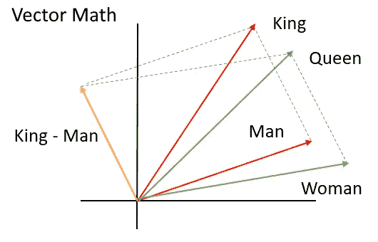
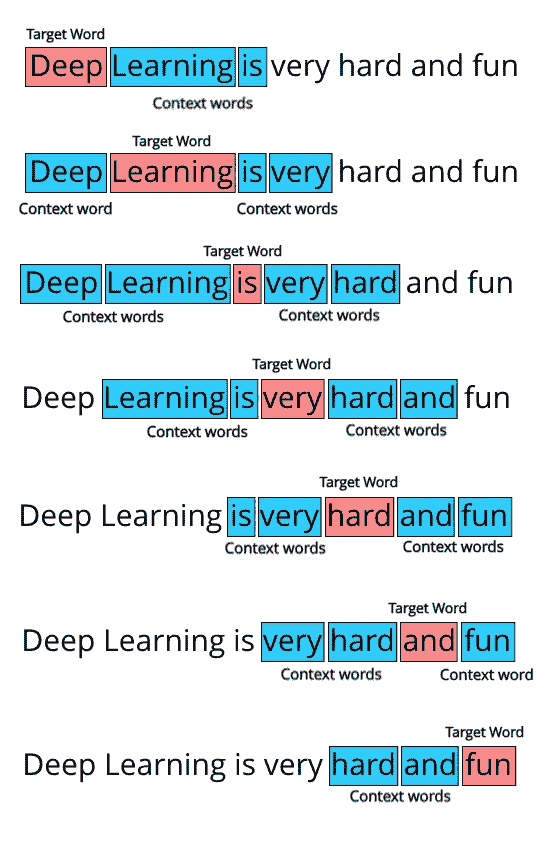
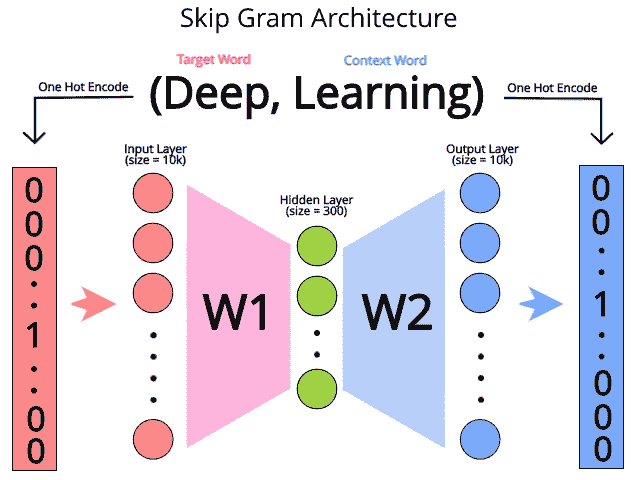

# NLP 中的单词嵌入| Word2Vec | GloVe | fastText

> 原文：<https://medium.com/analytics-vidhya/word-embeddings-in-nlp-word2vec-glove-fasttext-24d4d4286a73?source=collection_archive---------0----------------------->



单词嵌入是单词向量表示，其中具有相似意思的单词具有相似的表示。单词向量是表示单词的最有效方式之一。

在以前的博客([第一部分](/analytics-vidhya/natural-language-processing-using-spacy-in-python-part-1-ac1bc4ad2b9c)，[第二部分](/@AravindR07/nlp-using-spacy-and-topic-modeling-using-gensim-python-42c4574830d))中，我们已经讨论了向量，以及它们如何被用来以数学形式表示文本数据，并且所有 ML 算法的基础都依赖于这些表示。所以，让我们向前迈出一步，使用 ML 技术生成单词的向量表示，更好地**封装单词的**含义。

ML 在文本分析中最重要的应用之一。顾名思义，它根据我们使用的语料库创建单词的向量表示。

# 带有 Word2Vec 的单词向量

使用深度学习来 NLP 任务已经被证明表现非常好。核心概念是将人类可读的句子输入**神经网络**，以便模型能够**从中提取**某种**信息**。

理解如何**为神经网络**预处理文本数据很重要。神经网络可以接受数字作为输入，但不能接受原始文本。因此，我们需要将这些单词转换成数字格式。

# 词向量

单词向量是比***one hot encoded vectors***更好的表示单词的方式(随着词汇量的增加，在表示文本向量时会导致大量的内存使用)。分配给每个单词的索引不包含任何语义。在一个热编码向量中，“狗”和“猫”的向量就像“狗”和“计算机”一样彼此接近，因此神经网络必须非常努力地理解每个单词，因为它们被视为完全孤立的实体。词向量的使用旨在解决这两个问题。

> *“单词向量比一个热编码向量消耗更少的空间，并且它们还保持单词的语义表示”。*

在直接进入单词向量之前，一个重要的方面是，相似的单词比不相似的单词更频繁地出现在一起。

仅仅因为一个词出现在另一个词的附近，并不总是意味着它们有相似的意思，但是当我们考虑被发现在一起的词的频率时，我们发现相似意思的词被发现在一起。

# Word2Vec

在 word2vec 中有两种架构 **CBOW** (连续字包)和 **Skip Gram** 。

首先要做的是收集单词共现数据。我们需要一组数据来告诉我们哪些单词出现在某个单词附近。我们将使用称为 ***的上下文窗口*** *来做这件事。*

考虑一下，“深度学习很辛苦，也很好玩”。我们需要设置一个叫做 ***的窗口大小*** 。假设这种情况下是 2。我们所做的是迭代给定数据中的所有单词，在这种情况下，这只是一个句子，然后**考虑一个包围它的 word 窗口**。这里，因为我们的窗口大小是 2，我们将考虑单词后面的 2 个单词和单词后面的 2 个单词，因此每个单词将得到 4 个与之相关的单词。我们将对数据中的每个单词都这样做，并收集单词对。



上下文单词示例

当我们 ***通过文本数据传递上下文窗口*** 时，我们找到所有**对目标和上下文**单词，以形成目标单词和上下文单词格式的数据集。对于上面的句子，它看起来像这样:

**第一个窗口对:**(深，学)，(深，是)

**第 2 个窗口对:**(学，深)，(学，是)，(学，非常)

**第 3 个窗口对:**(是，深)，(是，学)，(是，很)，(是，硬)

诸如此类。最后，我们的**目标单词与上下文单词数据集**将看起来像这样:

*这可以认为是我们对于 word2vec 的*。**

> **在 skipgram 模型中，我们试图预测给定目标词的每个上下文词。**

**我们使用神经网络来完成这项预测任务。**神经网络的输入是上下文单词**的一个热编码版本。因此，输入和输出层的大小是 **V** (词汇计数)。这个神经网络只有一层在中间，隐藏层的**大小决定了我们希望在最后拥有的单词向量的大小。****

****

**Word2Vec 中的 Skip Gram 架构**

**由于该神经网络总共有 3 层，因此该网络只有 2 个权重矩阵， **W1** 和 **W2** 。 **W1** 的尺寸为 10000*300，而 **W2** 的尺寸为 300*10000。这两个权重矩阵将在计算单词向量时发挥重要作用。**

**对于我们从原始文本数据中收集的整个数据集，我们将把每一对传递给神经网络并对其进行训练。这里的神经网络试图猜测给定一个目标单词可以出现哪些上下文单词。训练好神经网络后，如果我们向神经网络中输入任何一个目标词，它都会给出一个向量输出，这个向量输出代表在给定词附近出现概率较高的词。**

****对于 CBOW 来说，唯一的区别是我们试图在给定上下文单词**的情况下预测目标单词，本质上我们只是反转跳过 gram 模型来获得 CBOW 模型。看起来是这样的:**

****

**来源:[利用语言间的相似性进行机器翻译](https://arxiv.org/pdf/1309.4168v1.pdf)论文。**

**这里，当我们给出一组上下文单词的矢量表示时，我们将得到**最合适的目标单词，它将在那些单词**的附近。**

**例如，如果我们给定句子:Deep _____ is very hard，其中[“Deep”、“is”、“very”、“hard”]代表上下文单词，神经网络应该有希望给出“Learning”作为**输出目标单词**。在 CBOW 的情况下，这是神经网络试图训练的核心任务。**

****单词向量有助于表示单词的语义—** 这是什么意思？**

**这意味着我们可以对单词使用向量推理最著名的例子之一来自 [**Mikolov 的论文**](https://papers.nips.cc/paper/5021-distributed-representations-of-words-and-phrases-and-their-compositionality.pdf) ，其中我们看到，如果我们使用单词 vectors 并执行(这里，我们使用 **V(word)** 来表示单词的向量表示)V(国王)-V(男人)+ V(女人)，得到的向量最接近 V(女王)。很容易看出为什么这是显著的——我们对这些单词的直观理解反映在单词的学习向量表示中。**

**这使我们能够在我们的文本分析管道中添加更多的功能——拥有向量的直观语义表示将会不止一次地派上用场。**

****Word2Vec** 将大文本语料库作为其输入，并产生向量空间，通常具有数百维，语料库中的每个唯一单词被分配给空间中的相应向量。单词向量被定位到向量空间，使得语料库中共享共同上下文的单词在空间中彼此非常接近**

# **履行**

****Word2Vec** 模型使用**分级 softmax 进行训练**，并将拥有 200 个特征，这意味着它具有分级输出，并在其最终层使用 softmax 函数。**

```
**Extract the data set in your colab or ipython notebook
!wget [http://mattmahoney.net/dc/text8.zip](http://mattmahoney.net/dc/text8.zip)# Unzip the data from the path you extracted the data to
!unzip /content/text8.zip**
```

*   **对于 ***word2vec 有一个庞大的参数列表。word 2 vec*类。它们可以在文档页面[这里](https://radimrehurek.com/gensim/models/word2vec.html)找到。****

```
**from gensim.models import word2vec
sentences = word2vec.Text8Corpus('/content/text8')
model = word2vec.Word2Vec(sentences, size=200, hs=1) 
# hs: If hirearchical softmax used for model training**
```

*   **打印模型:**

```
**print(model)
Output: Word2Vec(vocab=71290, size=200, alpha=0.025)**
```

*   **让我们试一个例子:**

```
**model.wv.most_similar(positive=['woman', 'king'], negative=['man'], topn=1)[0]o/p: ('queen', 0.5473929643630981)**
```

**因为这是一个概率过程，所以获得的结果可能会有变化。例如，像“王座”或“帝国”这样的词可能会出现。**

*   **我们也可以使用 **most_similar_cosmul** 方法-**

```
**model.wv.most_similar_cosmul(positive=['woman', 'king'], negative=['man'])**
```

*   **如果我们希望查找一个单词的矢量表示，我们需要做的就是:**

```
**model.wv['computer']**
```

*   **如果您想要将您的模型保存到磁盘并再次使用它，我们可以使用保存和加载功能来实现。**

```
**model.save('text8_model')
model = word2vec.Word2Vec.load('text8_model')**
```

*   **使用单词向量，我们可以确定列表中哪个单词离其他单词最远。Gensim 通过 **dosent_match** 方法实现该功能。**

```
**model.wv.doesnt_match("breakfast cereal dinner lunch".split())Output: “cereal” 
# One word which dosent match the other in the list is picked out.**
```

*   **我们还可以使用该模型来了解语料库中的单词有多相似或不同:**

```
**model.wv.distance(‘man’, ‘woman’) 
**0.35839658414569464 # the result is self explanatory****
```

*   ****CBOW** 速度更快，对更多**常用词有**更好的表现**。****
*   **Skipgram 适用于少量数据，并且被发现可以很好地表示罕见的单词。**

# **手套**

**Glove 基于单词上下文矩阵上的**矩阵分解技术。它首先**构造**(单词 x 上下文)共现信息 ie 的**大矩阵**。对于每个单词，你要计算我们在大型语料库中的某些上下文中看到这些单词的频率。****

**为了理解手套的工作原理，我们需要了解手套的两种主要制作方法**

1.  ****全局矩阵分解****

**在自然语言处理中，全局矩阵分解是使用线性代数的矩阵分解来减少大项频率矩阵的过程。这些矩阵通常表示文档中单词的出现或缺失。**

**2.**本地上下文窗口。****

**局部上下文窗口方法是 **CBOW** 和 **Skip-Gram** ，上面已经解释过了。**

*****Glove 是一种单词向量表示方法，其中对来自语料库*** 的聚集的全局单词-单词共现统计进行训练。这意味着像 word2vec 一样，它使用上下文来理解和创建单词表示。描述该方法的研究论文名为 *GloVe:* [*单词表示的全局向量*](https://nlp.stanford.edu/pubs/glove.pdf) ，非常值得一读，因为它在描述他们自己的方法之前描述了 LSA 和 Word2Vec 的一些缺点。**

**该论文的作者提到，与其学习**原始出现概率，**不如学习这些同时出现概率的**比率**更有用。嵌入被优化，因此**2 个向量的点积等于 2 个字彼此接近出现的次数的对数。****

**例如，如果两个单词“猫”和“狗”在彼此的上下文中出现，比如在文档语料库中的 10 个单词的窗口中出现 20 次，那么—**

****载体(猫)。向量(狗)=对数(10)****

**这就迫使模型在一个更加全球化的环境中对出现在它们附近的词的频率分布进行编码。**

# **快速文本**

**FastText 是 facebook AI research 开发的一种矢量表示技术。正如它的名字暗示了它执行相同任务的**快速而有效的方法**并且因为它训练方法的本质，它最终也学习了**形态学**的细节。**

**FastText 是独一无二的，因为它可以**为未知单词或词汇表外的单词导出单词向量**——这是因为通过考虑单词的形态特征，它可以*为未知单词创建*单词向量。由于**形态学指的是单词**的结构或句法，FastText 倾向于更好地执行此类任务， **word2vec** 更好地执行**语义任务**。**

****FastText 对生僻字很好用**。因此，即使一个单词在训练中没有被看到，它也可以被分解成 n 元语法来获得它的嵌入。**

***Word2vec 和 GloVe 都无法为不在模型词典中的单词提供任何矢量表示*。这是这种方法的一个巨大优势。**

**脸书的实现可以在他们的 [GitHub](https://github.com/facebookresearch/fastText) 库中找到。**

# **应用程序**

*   **分析调查反馈。**
*   **分析逐字评论。**
*   **音乐/视频推荐系统。**

# **摘要**

**在这篇文章中，文本分析的**主要创新之一，单词嵌入或单词向量被探究。这不仅有助于代表我们的**单词**和**单词**，也是看待我们单词的一种新方式。博客的一些主题参考了 deeplearning 的分层页面和 Bhargav Srinivasa-Desikan 的书 [NLP 和 CL](https://www.packtpub.com/product/natural-language-processing-and-computational-linguistics/9781788838535) 。word2vec 的成功导致了各种单词嵌入方法的爆发，每种方法都有自己的优缺点。****

**如果你喜欢这篇文章，请给它鼓掌。感谢您的阅读。**

****继续学习** ………..**

# **谢谢你，谢谢你**