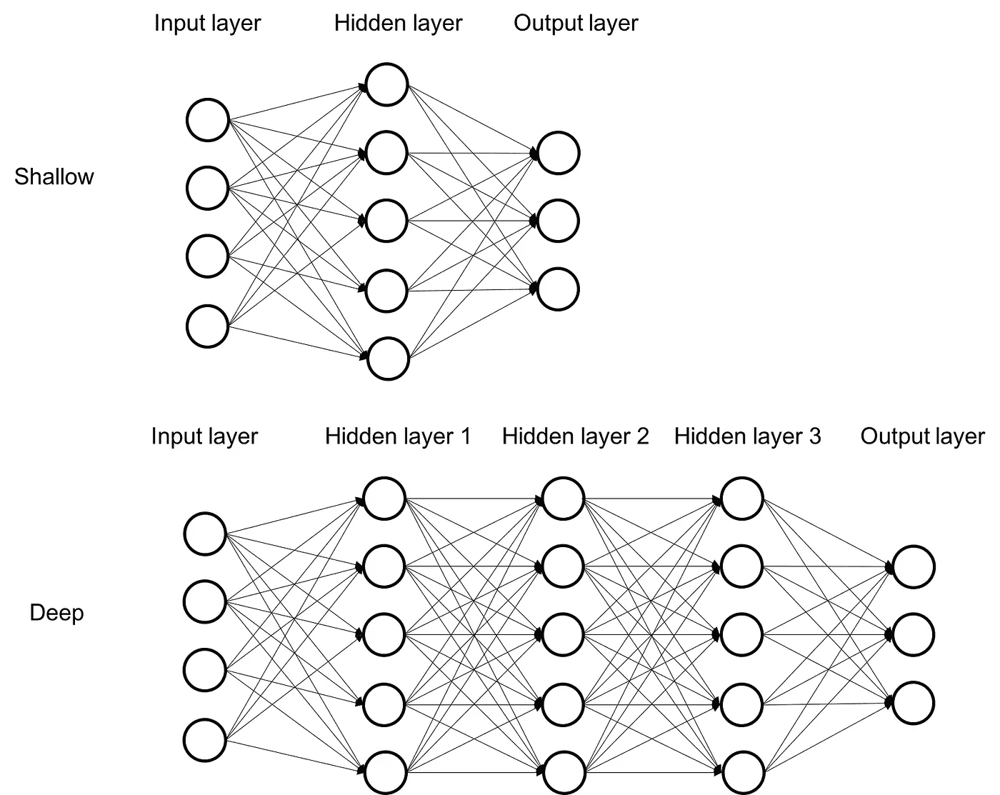

# 单词相似度| Word2vec |自然语言处理

> 原文：<https://medium.com/analytics-vidhya/word-similarity-word2vec-natural-language-processing-fe085f9f03e7?source=collection_archive---------7----------------------->

有了先进的技术，我们在计算机科学领域有了革命性的变化。在过去的十年里，在计算机科学领域，人们对人工智能进行了大量的研究。但是，由于机器不识别自然语言，所以我们要求把它转换成机器可读的语言。单词嵌入是一种文本呈现类型，它可以帮助我们找到任何相似的单词模式，并使其适合机器学习。虽然可以找到各种各样的单词嵌入模型，但我们将讨论由 Google 开发的 word2vec 模型，我喜欢 Google 的一切。本文将讨论 word2vec 架构以及实际实现，以理解嵌入技术。

***背景词 2 vec***

> 在学习任何新东西之前，先了解一下他的背景是有好处的。因为可以找到各种单词表示算法，例如单词包(BOW)、词频逆文档(TF-IDF)等等。这些算法之间的巨大差距是语义信息无法存储。这种算法(word2vec)比传统算法性能更好，因为它可以存储语义。Word2vec 是由托马斯·米科洛夫于 2013 年在谷歌开发的。许多行业经常使用这种算法来分析客户的评论以及情感分析。另一个例子是我们通常在 YouTube 或其他地方看到的推荐系统。所以，可能你已经理解了为什么这个算法，以及在哪里可以利用这个算法。根据图 1 理解单词之间的关系。

**图 1 .与文字相符。**

***word 2 vec 的层结构***

> *这是一个简单的两层神经网络。浅层神经网络与输入和输出之间的深层连接，而深层神经网络包括输入和输出之间的多个私有层。由于神经网络的隐藏层对我们的单词表示进行编码，我们将这种自然语言处理应用程序主要留给神经网络。需要一些专门的框架来再次转换这两者。一个很好的框架是“Jensim”。真的是一个很棒的框架。但是，在开始的时候，‘词 2 Vec’。意思是从单词到矢量。仔细看看图 2，图中显示了浅层和深层网络。*

[**图 2 .浅层与深层**](https://subscription.packtpub.com/book/big_data_and_business_intelligence/9781785880360/1/ch01lvl1sec12/why-deep-learning)

***的建筑文字 2vec***

> 图 3 显示了 word2vec 的架构图。典型地，在 word2vec 中使用两种体系结构模型，例如，Skip-gram 和连续单词包(CBOW)。每个人对于文字处理都有自己的特点。细节顺序如图 3 所示

**图 3:word 2 vec**的架构

***跳跃式架构***

> *在不涉及太多复杂性的情况下，我可以说 Word2vec 以两种方式工作。一种我们称之为 skip-gram，意思是通过预测句子的上下文来处理单词。当我们的 skip-gram 中的* ***目标*** *词作为输入给出时——输出其周围的目标词。比如一个句子，“Analytics vidhya is great”，如果输入的单词是“vidhya”，那么它的输出将是“Analytics”“is”，以及“great”。我们这里的窗口大小是 3。这里的输入和输出数据将在相同的维度，必须有'一个热编码'。这个网络有一个隐藏层，其尺寸等于“嵌入尺寸”——实际上小于输入和输出向量的尺寸。在输出层的末端，一个“softmax”激活函数将被应用于每个输出因子的元素，以便概率分布中的单词将接近这里的上下文。图 4 显示了跳格模型图。*

[**图 4: Skip-gram**](https://www.researchgate.net/publication/322905432_Patent_Keyword_Extraction_Algorithm_Based_on_Distributed_Representation_for_Patent_Classification/figures?lo=1) **模型:输入层到输出层**

***连续包字(CBOW)架构***

> 单词 2vec 的另一个概念是“连续单词包”，它类似于 Skip-Gram，但它改变了输入和输出。问题是，我们将给出一个“上下文”,我们想知道哪个单词最有可能首先出现。这两个系统的最大区别是声音矢量的产生方式。“连续单词包”中目标单词的所有例子都被输入到网络中，网络实际上通过对它们进行平均来从隐藏层中提取它们。找出如何平均我们所有类型的句子不是一个大问题。让我们看一张图图 5

[**图 5: CBOW 模型:输入层到输出层**](https://subscription.packtpub.com/book/web_development/9781786465825/3/ch03lvl1sec34/continuous-bag-of-words-model)

**通过实际实现找出单词的相似度。**

让我们做一些练习测试来理解 Word2vec。按照下面的代码，我写了五个步骤，对初学者来说可能是一个更好的选择。更好的说法是，当一个理论被阅读时，如果你实际地去实现它，那会很棒。

> **步骤 01:导入必要的库**
> 
> **1 .导入 nltk** (nltk 库被导入，您可以从这里下载 X 语料库)
> 
> **2 .从 gensim.models 导入 Word2Vec** (Gensim 是导入的。如果没有安装 Gensim，请安装)
> **3 .从 nltk.corpus 导入停用词**(我们需要忽略一些不必要的词，比如“是”、“the”、“but”等等。
> 
> 4 .导入 re (re mans:正则表达式。它要求在文本处理过程中。)
> 
> **步骤 02:从数据集读取数据**
> 
> 正如我试图解释的那样，我不会处理非常大的数据集，在这种情况下，我会用一些预定义的数据进行实验。
> 
> 今天，我怀着沉重的心情来到你们面前。你们都知道我们有多努力。但令人悲伤的是，达卡、吉大港、库尔纳、朗布尔和拉杰夏希的街道上今天溅满了我兄弟的鲜血，我们听到的孟加拉人民的呼声是要求自由、生存和权利的呼声。是你们带来了人民联盟的胜利，所以你们可以看到一个宪法政府的恢复。人们希望当选的代表们能够""( T15)()这是孟加拉国国父的一句名言的一部分，我把它作为一个数据集。)
> 
> **步骤 03:处理数据**
> 
> text = re . sub(r ' \[[0–9]* \]'，' '，paragraph)//我们不需要特殊字符来查找单词中的相似性，因为它有时会使过程变慢。
> text = re sub(r ' \ s+'，' '，text)
> text = text . lower()
> text = re sub(r ' \ d '，' '，text)
> text = re sub(r ' \ s+'，' '，text)
> 
> **步骤 03:准备数据集**
> 
> sentences = nltk . sent _ tokenize(text)
> 
> sentences =[nltk . word _ tokenize(sentence)for sentences in sentences]
> 
> for I in range(len(sentences)):
> sentences[I]=[word for word in sentences[I]if word not in stop words . words(' English ')]
> 
> **步骤 04:训练 Word2Vec 模型**
> 
> model = Word2Vec(句子，min_count=1)
> 
> words = model.wv.vocab
> 
> **步骤 05:测试你的模型(寻找词向量或相似度)**
> 
> # Finding Word Vectors
> vector = model . wv['奴役']
> 
> #最相似词
> 相似= model.wv.most_similar('悲伤')

**输出**

如果你看上面的图像，你会看到每个单独的部分都被创建了，例如，为“被奴役”创建了一个向量。word2vec 就是这样工作的。

**综上所述，**在本文中，已经讨论了单词嵌入模型。通常，可以找到几种嵌入技术，word2vec 更可靠地找到单词中的相似性。其次，给出了 word2vec 的体系结构，最后，描述了 word2vec 模型的具体实现。

如果您希望看到我关于研究和创新的另一个更新，请关注我:

**研究门:**【https://www.researchgate.net/profile/Elias_Hossain7】T4

**领英:**[https://www.linkedin.com/in/elias-hossain-b70678160/](https://www.linkedin.com/in/elias-hossain-b70678160/)