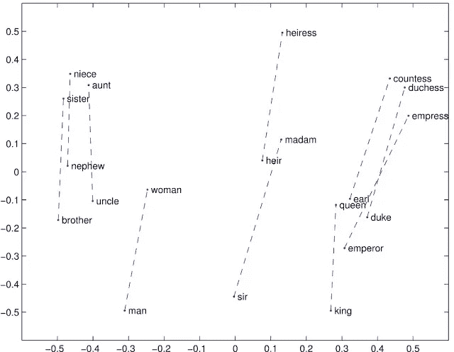

# 什么是手套？

> 原文：<https://medium.com/analytics-vidhya/word-vectorization-using-glove-76919685ee0b?source=collection_archive---------0----------------------->


GloVe 代表单词表示的全局向量。它是由斯坦福大学开发的一种无监督学习算法，用于通过从语料库聚集全局单词-单词共现矩阵来生成单词嵌入。由此产生的嵌入显示了向量空间中单词的有趣的线性子结构。

线性子结构的例子有:



这些结果令人印象深刻。这种类型的表示在许多机器学习算法中非常有用。

要阅读更多关于单词矢量化的内容，你可以阅读我的另一篇文章。

在这篇博文中，我们将学习 python 中 GloVe 的实现。那么，我们开始吧。

# 让我们创建嵌入

# 安装 Glove-Python

GloVe 是用 python 实现的，可以在库 **glove-python 中找到。**

```
pip install glove_python
```

# 文本预处理

在这一步中，我们将对文本进行预处理，如删除停用词、对词进行词条归类等。

> 您可以根据自己的需求执行不同的步骤。

我将使用 nltk 停用词语料库来移除停用词，并使用 nltk 词词条化来查找词条。

为了使用 nltk 语料库，您需要使用以下命令下载它。

# 下载语料库

> import nltk nltk . download()#这将打开一个 GUI，您可以从中下载语料库

# 输入初始化

> #要矢量化的句子列表 lines=[“你好，这是一个如何将单词转换为整数格式的教程”，“这是美好的一天”，“杰克要去办公室了”]

# 删除停用词

> from nltk . corpus import stop words stop _ words = set(stop words . words(' English '))lines _ without _ stop words =[]# stop words 包含 line in lines:temp _ line =[]for word in lines:if word not in stop _ words:temp _ line . append(word)string = ' ' lines _ without _ stop words . append(string . join(temp _ line))lines = lines _ without _ stop words

# 词汇化

> # import WordNet lemma tizer from nltk from nltk . stem import WordNet lemma tizer WordNet _ lemma tizer = WordNet lemma tizer()lines _ with _ lemmas =[]# stop words 包含行中行的停用词集合:temp _ line =[]for word in lines:temp _ line . append(WordNet _ lemma tizer . lemma tize(word))string = ' ' lines _ with _ lemmas . append(string . join(temp _ line))lines = lines _ with _ lemmas

现在我们已经完成了文本的基本预处理。任何其他预处理工作都可以类似地完成。

# 准备输入

我们有一个行数组形式的输入。为了让模型处理数据，我们需要将输入转换为单词数组(:\)。

# 我们的投入

> lines=[“你好，这是一个关于如何将单词转换成整数格式的教程”，“这是美好的一天”，“杰克要去办公室了”]

# 新输入

> lines =[' Hello '，' this '，' tutorial '，' on '，' how '，' convert '，' word '，' integer '，' format']，['this '，' beautiful '，' day']，['Jack '，' going '，' office']
> 
> 对于行中的行，new _ lines =[]:new _ lines = line . split(' ')# new lines 具有新格式 lines=new_lines

# 构建手套模型

```
#importing the glove library
from glove import Corpus, Glove# creating a corpus object
corpus = Corpus() #training the corpus to generate the co occurence matrix which is used in GloVe
corpus.fit(lines, window=10)#creating a Glove object which will use the matrix created in the above lines to create embeddings
#We can set the learning rate as it uses Gradient Descent and number of componentsglove = Glove(no_components=5, learning_rate=0.05)

glove.fit(corpus.matrix, epochs=30, no_threads=4, verbose=True)
glove.add_dictionary(corpus.dictionary)
glove.save('glove.model')
```

创建手套模型使用语料库对象生成的共现矩阵来创建嵌入。

**corpus.fit** 有两个参数:

*   线条——这是我们在预处理后创建的 2D 数组
*   窗口—这是两个单词之间的距离，algo 应该考虑在这两个单词之间找到某种关系

手套参数:

*   组件数量—这是手套生成的输出向量的尺寸
*   learning _ rate 算法使用梯度下降，因此学习速率定义算法达到最小值的速率(速率越低，学习所需的时间越长，但达到最小值的时间越长)

glove.fit 参数:

*   共现矩阵:词-词共现矩阵
*   时期:这定义了算法通过数据集的次数
*   线程数:算法运行时使用的线程数

在训练手套对象有了我们提供的单词向量之后。但是字典仍然驻留在语料库对象中。我们需要将字典添加到 glove 对象中以使其完整。

```
glove.add_dictionary(corpus.dictionary)
```

这一行在 glove 对象中做字典添加。之后，对象就可以为您提供嵌入了。

```
print glove.word_vectors[glove.dictionary['samsung']]
OUTPUT:[ 0.04521741  0.02455266 -0.06374787 -0.07107575  0.04608054]
```

这将打印单词“samsung”的嵌入内容。

# 结束注释

我们已经学习了如何为文本数据生成向量，这对创建许多机器学习模型和技术非常有用，如 SVM、KNN、K-Means、逻辑分类器、情感分析、文档分类等。

可以在斯坦福大学的[网站](https://nlp.stanford.edu/projects/glove/)上了解更多关于这款手套的信息。

关注我的频道，了解 Python 和技术世界的最新动态