# Word2Vec — CBOW & Skip-gram:算法优化

> 原文：<https://medium.com/analytics-vidhya/word2vec-cbow-skip-gram-algorithmic-optimizations-921d6f62d739?source=collection_archive---------2----------------------->

易消化+小而脆:

Word2Vec 所做的是给定一个单词，它返回一个向量，使得这些向量在语义上与相似的单词相似。

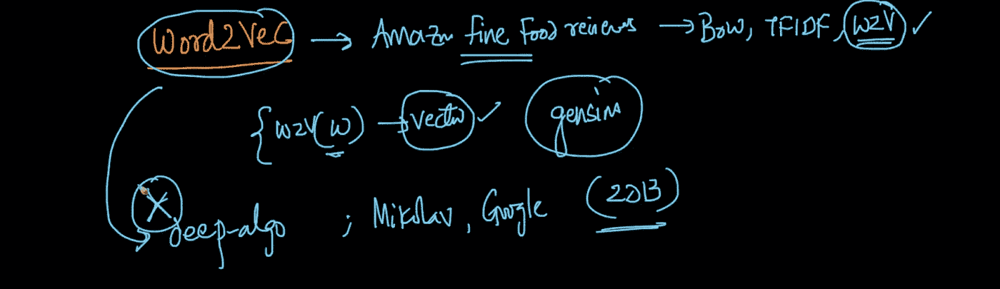

让我们以下面的例子为例，如果猫是焦点词，其他环境是上下文词。上下文单词对于理解焦点单词非常有用，反之亦然。

有两种 Word2Vec 算法 **CBOW(连续包字)** & **skip-gram。**

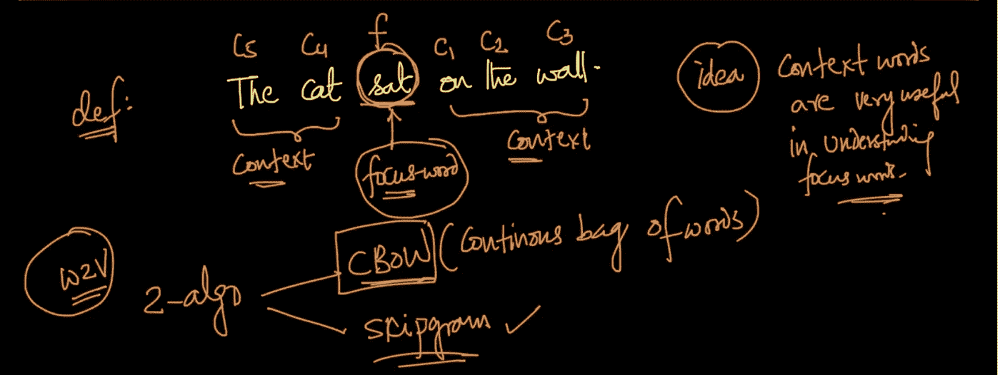

# Word2Vec: CBOW

假设我们有大小为 V 的单词 V 的词汇表&我们使用一键编码来表示每个单词，因此，给定任何单词，我们都可以有一个 V 维的二进制向量(因为我们在词汇表中有总共 V 个单词)。

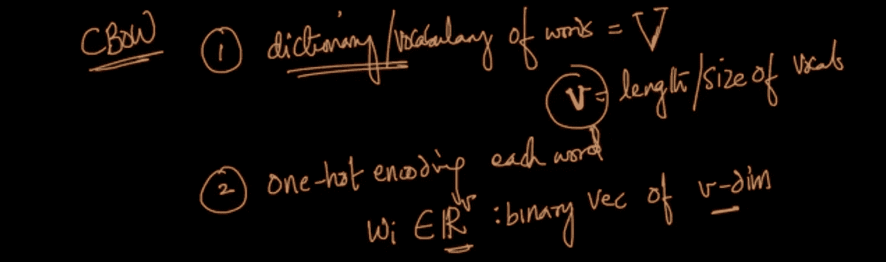

假设我们有一个热编码的 k 个上下文词向量，那么，CBOW 的核心思想是给定上下文词，我们可以预测焦点词。

k 个上下文单词(每个上下文单词的维度为词汇 v)连接到 N 个维度的隐藏层，如下所示。所以，现在我们的目标是预测维度 v 的焦点词向量。

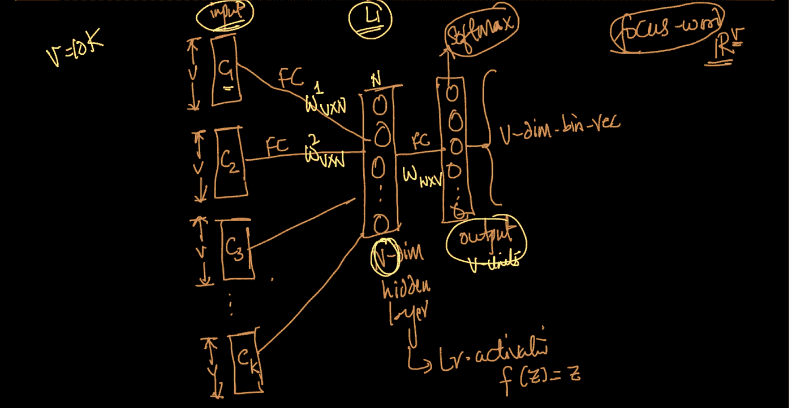

为了训练 Word2Vec CBOW，我们可以创建焦点单词和上下文单词组合，并训练这个 NN。在训练结束时，我们有了所有这些重量(上面用黄色表示)。所以对于每个单词，我们在权重 N*V 矩阵中有一个向量。

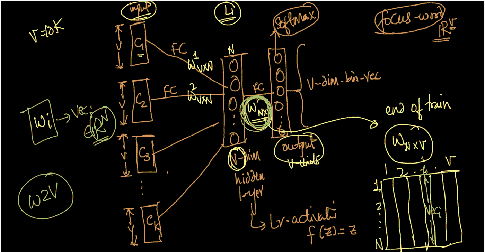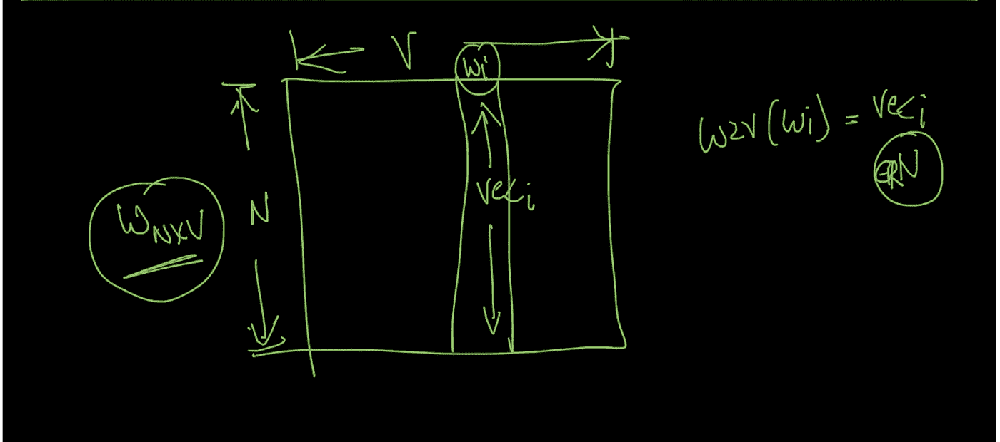

**Word2Vec: Skip-gram**

因此，在 CBOW 中，我们试图在给定上下文单词的情况下预测焦点单词，而在 skip-gram 中，我们试图做相反的事情，我们试图在给定焦点单词的情况下预测上下文单词(完全相反的任务)。

因此，我们有维度 v(词汇的大小)的焦点单词，其连接到大小为 N 的隐藏层，该隐藏层将进一步连接到 softmax(每个 softmax 是 v 维度)以预测上下文单词。因此，在输出层，我们有 k 个 softmax(上下文字数)，它可以被认为是 k 个多类分类器。

在要训练的参数的数量方面，但是在 CBOW 中，我们有一个 softmax 要训练，而在 skip-gram 中，我们有 k 个 softmax，因此 skip-gram 比 CBOW 花费更多的时间，所以它在计算上更昂贵。

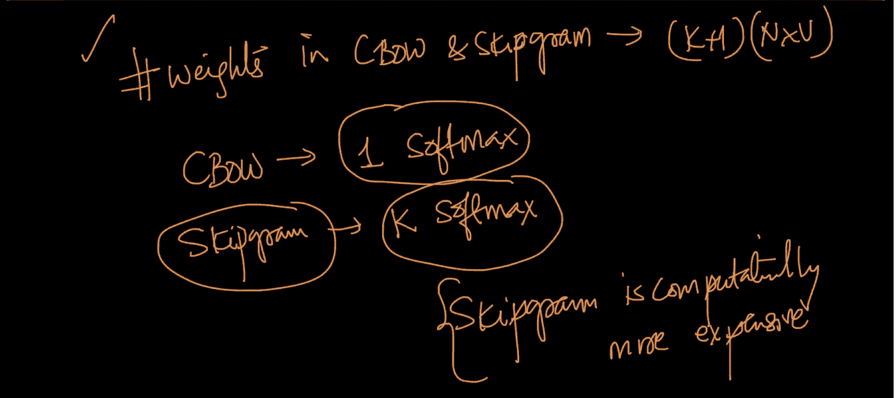

【CBOW 之间的比较&跳过程序:

1.  CBOW 比 skip-gram 训练起来相对更快(因为 CBOW 只需要训练一个 softmax)。

2.CBOW 更适合频繁出现的单词(因为如果一个单词出现得更频繁，它将有更多的训练单词需要训练)。

3.Skip-gram 速度较慢，但适用于比 CBOW 更小的数据量。

4.Skip-gram 比 CBOW 更适用于出现频率较低的单词。

5.CBOW 是一个比 Skip-gram 更简单的问题(因为在 CBOW 中，我们只需要在给定许多上下文单词的情况下预测一个焦点单词)。

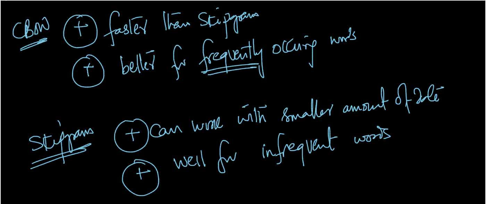

对于 Skip-gram 和 CBOW，随着上下文单词数量的增加，N 维向量表示更好(通常 N 维接近 200/300)。

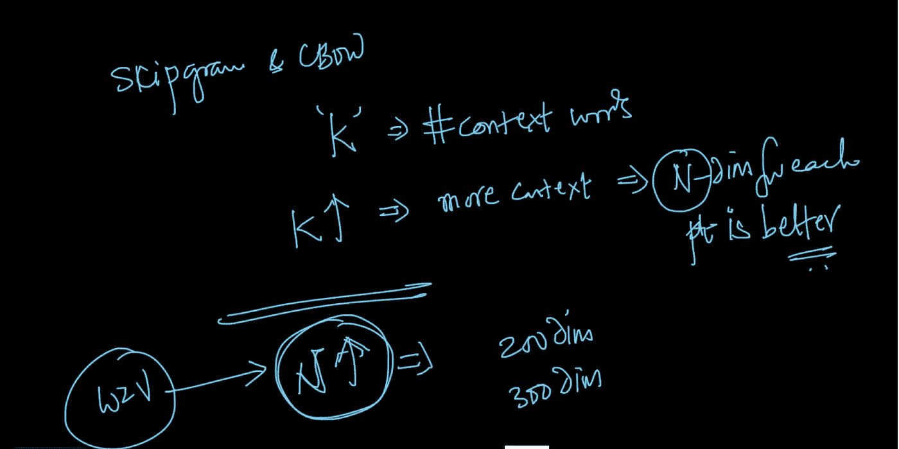

在 Skip-gram 的情况下，我们使用下面的权重矩阵来获得上下文单词的向量。

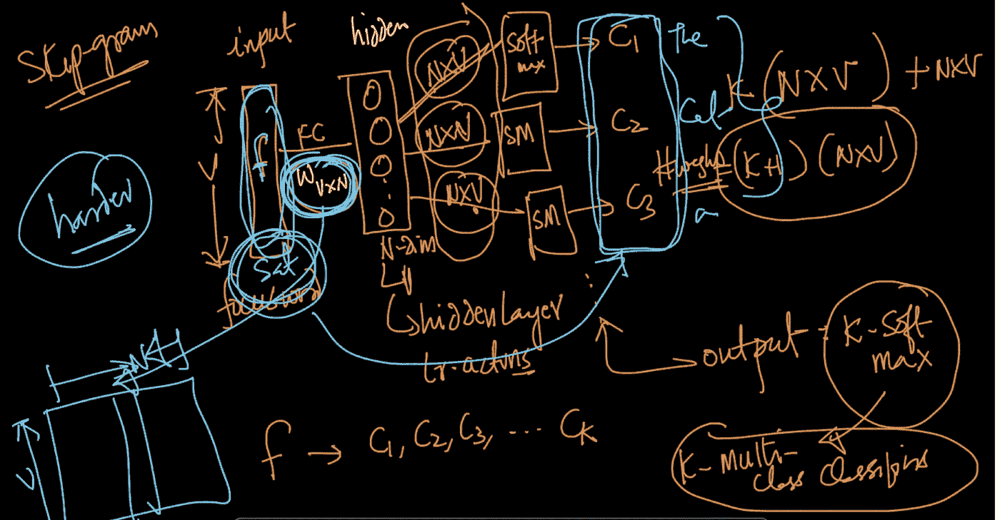

在这两种情况下，我们都有一个主要的问题，我们有太多的参数需要学习(k+1)(N*V)。在 N=200，k=5 & V=10k 的情况下，我们有将近 1200 万个参数要训练&这可能要花很长时间来训练，所以，我们需要以某种方式优化这种训练。

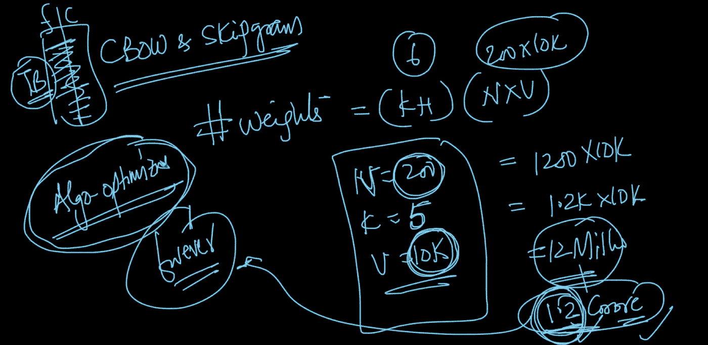

**训练 Word2Vec 的算法优化:**

由于我们有数百万个权重要学习，这非常耗时，一种处理方法是分层 softmax &另一种是负采样。

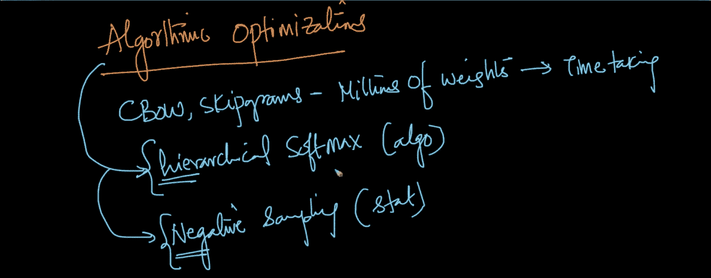

**分级 Softmax:**

在 CBOW & Skip-gram 是 softmax，他们需要花很多时间来训练，所以，更困难的部分是优化 softmax 的训练。因此，核心思想是我们能否优化 v-softmax，使其达到最优。softmax 正在做的是 v 类分类，所以，我们可以修改它，使其达到最优。假设我们的词汇表有 8 个单词，我们可以把这些单词作为二叉树的叶节点，当我们把树分成两部分时，一半的单词在树的一边，另一半在树的另一边。

因此，代替 v-class 分类器，我们说单词出现在二叉树的这一半中，还是单词出现在前四个或后四个中。让我们假设它在前四个单词中，然后我们可以划分前四个，看看这个单词是在前两个还是在后两个，等等。所以，我们用了 3 个激活单元来找出单词，而不是 8 个激活单元。因此，如果我们在 softmax 中有 v 个激活，我们将几乎需要一个 v 基数为 2 的激活的日志来找出焦点词概率。

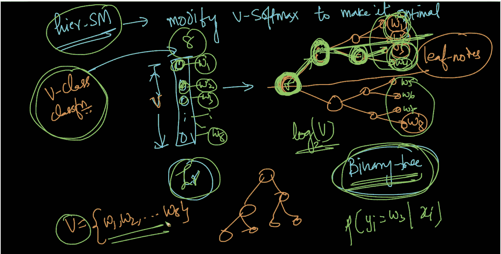

**负采样:**

这是一种基于统计/概率的技术，只需在每次迭代中更新词汇表之外的单词样本&样本定义为—

1.  始终保持目标词&
2.  在非目标单词中，它们的唯一样本被更新并由下面的公式给出，其中单词被选择的概率与它的频率成反比

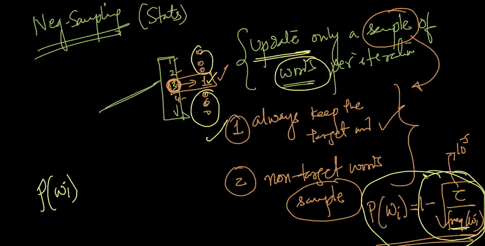