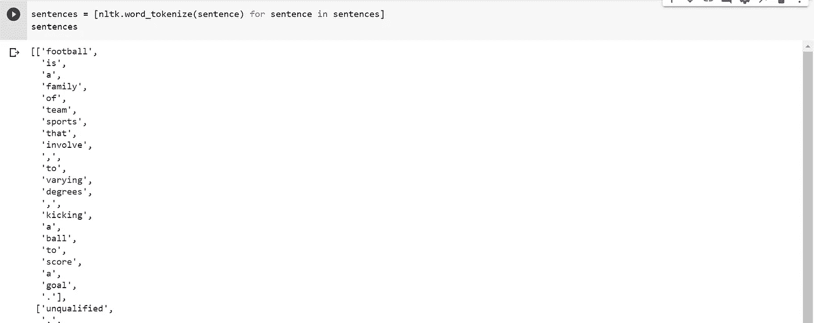
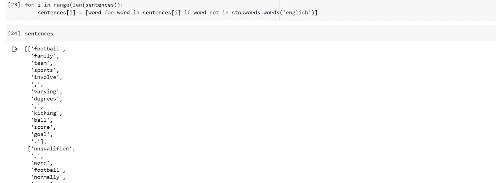

# Word2Vec、GLOVE、FastText 和基线单词逐步嵌入

> 原文：<https://medium.com/analytics-vidhya/word2vec-glove-fasttext-and-baseline-word-embeddings-step-by-step-d0489c15d10b?source=collection_archive---------1----------------------->

在之前的讨论中，我们已经逐步了解了标记化的基础。如果你没有看过我的前一篇文章，我强烈推荐你看一下那篇文章，因为首先要理解嵌入，我们需要理解标记化器，这篇文章是前一篇文章的延续。我在下面提供了我关于 Tokenizers 的帖子的链接。我用一个简单的例子一步一步地解释了这些概念

 [## 通过示例了解 NLP Keras 标记器类参数

### 众所周知，准备输入是完成图像和文本深度学习管道中非常重要的一步…

medium.com](/@akash97715/understanding-nlp-keras-tokenizer-class-arguments-with-example-551c100f0cbd) 

还有很多像 countvectorizer 和 TF-IDF 这样的方法。但在这两种情况下，单词的上下文都没有得到维护，这导致了非常低的准确性，并且再次基于我们需要选择的不同场景。Countvectorizer 和 TF-IDF 不在讨论范围之内。谈到嵌入，首先我们试图理解嵌入这个词的真正含义。正如我们所知，英语中有超过 171，476 个单词，每个单词都有不同的意思。如果我们希望根据每个单词的含义在维度中表示 171，476 个甚至更多的单词，那么这将导致超过 30-40 万个维度，因为我们之前已经讨论过每个单词都有不同的含义，需要注意的一点是，单词的含义很有可能也会根据上下文发生变化。为了更好地理解基于上下文的含义，我们将看下面的例子

一天一个苹果，医生远离我。由于新冠肺炎·疫情，苹果公司的股票价格正在下跌。我

在上面的例子中，苹果的意思根据两个不同的上下文而变化。所以如果我们看看不同句子中不同单词的上下文含义，那么互联网上有超过 1000 亿个单词。因此，为了理解互联网上每一个单词的真实含义，谷歌和 facebook 开发了许多模型。word2vec 和 glove 是 Google 开发的，fastText 模型是脸书开发的。Word2Vec 是针对 300 万个单词和短语的词汇向量进行训练的，他们从谷歌新闻数据集中训练了大约 1000 亿个单词，与 GLOVE 和 fastText 的情况类似。在这里，嵌入是指所有的单词都根据意思保持的维度，最重要的是根据不同的上下文，我再次重复，根据不同的上下文。

在这篇文章中，我们将尝试使用 python 的 **gensim** 库来理解 word2vec、glove、fastText 和 **Word2Vec 的基本编程实现**背后的直觉。手套和快速文本的程序化实现我们会看看其他的帖子。

我们将试着逐一了解 Word2Vec、GLOVE 和 fastText 背后的基本直觉。首先将从 Word2vec 开始

**Word2Vec:** 它背后的主要思想是，你在每个单词上训练一个关于上下文的模型，所以相似的单词会有相似的数字表示。就像一个正常的前馈密集连接神经网络(NN)一样，其中您有一组自变量和一个您试图预测的目标因变量，您首先将您的句子分成单词(标记化)并根据窗口大小创建许多单词对。因此，其中一个组合可以是一对单词，如(' cat '，' purr ')，其中 cat 是独立变量(X)，而' purr '是我们要预测的目标因变量(Y)。

我们通过用随机权重初始化的嵌入层将“猫”输入到神经网络中，并通过 softmax 层传递它，最终目的是预测“咕噜声”。诸如 SGD 的优化方法最小化损失函数“(目标单词|上下文单词)”，其寻求最小化给定上下文单词时预测目标单词的损失。如果我们用足够多的历元来这样做，嵌入层中的权重将最终表示单词向量的词汇，即单词在这个几何向量空间中的“坐标”。

**GLOVE:** GLOVE 的工作方式与 Word2Vec 类似。虽然你可以在上面看到 Word2Vec 是一个预测给定单词上下文的“预测”模型，但 GLOVE 通过构建一个共现矩阵(单词 X 上下文)来学习，该矩阵基本上计算一个单词在上下文中出现的频率。因为这将是一个巨大的矩阵，我们分解这个矩阵以获得一个低维的表示。有很多细节，但这是粗略的想法。

**FastText:** FastText 与以上 2 种嵌入有很大不同。虽然 Word2Vec 和 GLOVE 将每个单词作为训练的最小单位，但 FastText 使用 n-gram 字符作为最小单位。例如，单词 vector“apple”可以分解成单独的单词 vector 单元，如“ap”、“app”、“ple”。使用 FastText 的最大好处是，它可以为罕见的单词生成更好的单词嵌入，甚至是在训练期间看不到的单词，因为 n 元字符向量与其他单词共享。这是 Word2Vec 和 GLOVE 无法实现的。

**Baseline:** Baseline 不使用这三种嵌入中的任何一种，或者我可以直接说，标记化的单词被传递到 keras 嵌入层，但是对于这三种嵌入类型，我们需要将我们的数据集传递到这些预训练的嵌入层，并且这三种嵌入的输出需要在 keras 嵌入层上传递。keras 嵌入层的实现不在本教程的讨论范围之内，我们将在以后的文章中看到，但是流程是怎样的我们需要理解。

我们已经学习了 Word2Vec、GLOVE 和 FastText 的基础知识，并得出结论，以上 3 个都是单词嵌入，可以根据不同的用例使用，或者我们可以在用例中使用这 3 个预先训练好的单词，这样可以提高用例的准确性。现在我们将一步一步地看到 word2vec 的编程实现

正如我上面提到的，我们将使用 python 的 gensim 库来导入 word2vec 预训练的嵌入。这可以通过执行下面的代码来完成。我使用 google colab 来执行我所有帖子中的所有代码。

**从 gensim.models 导入 Word2Vec**

现在我们将选取一个非常简单的段落，我们需要在其上应用单词嵌入。我在我的帖子里放了一小段，这样就容易理解，如果我们能理解如何在小段中使用嵌入，那么显然我们可以在巨大的数据集上重复同样的步骤。

我们将采取“段=足球是一个家庭的团队运动，涉及，在不同程度上，踢球得分。非限定性的，football 这个词通常指的是使用这个词的地方最流行的足球形式。俗称足球的运动有协会足球(有些国家称为英式足球)；gridiron 足球(特指美式足球或加拿大足球)；澳大利亚规则足球；橄榄球(橄榄球联盟或橄榄球联盟)；还有盖尔足球。这些不同形式的足球在不同程度上有着共同的起源，被称为足球代码。”

> 我们可以看到，在上面的段落中，我们有许多停用词和特殊字符，所以我们需要首先删除它们。我们删除是因为我们已经知道，这些都不会给我们的语料库添加任何信息。为了完成这项任务，我们不需要太担心。我们有 python 中的“NLTK”包，它将删除停用词，还有**“正则表达式”**包，它将删除特殊字符。详情请参考下面的片段

导入 NLTK、RE 和段落初始化的代码

现在，我们将使用下面的代码删除段落中的所有特殊字符，并将干净的段落存储在文本变量中

应用文本清理后，我们将查看清理前后的段落长度。注意，在清除了我们存储在文本变量中的文本之后。很明显，我们可以看到之前的长度是 598，现在清洗后缩短到 593

清洗前后的单词长度

现在我们将使用下面的代码将单词转换成句子并存储在列表中。我们可以清楚地看到,“sent_tokenize”方法将 593 个单词转换成了 4 个句子，并将其存储在 list 中，基本上我们得到了输出的句子列表。“sent_tokenize”已使用。作为在句子中分割单词的标记

单词到句子的转换

现在我们将使用下面的代码把这个句子列表转换成单词列表。句子列表被转换成单词列表并存储在另一个列表中。

句子列表到单词列表

我们得到了单词列表，现在我们将使用下面的代码片段从单词列表中删除所有停用词，如 is、am、are 等。我们可以比较前面代码和下面代码的输出片段，我们会清楚地看到不同之处，像' is '，' a '等停用词都从句子中删除了

停用词移除

现在我们可以在上面准备好的单词上应用 word2vec 嵌入了。Word2vec 是我们已经从 python 的 gensim 库中导入的一个类。现在，我们将把预处理过的单词传递给 word2vec 类，并在将单词传递给 word2vec 类时指定一些属性。下面列出了一些重要的属性

1.  **min_counts:指定相似词出现的最小次数。一般来说，我们通常指定为 2 和 3，这意味着 word2vec 将保留相同的单词 2 或 3 次，如果该单词出现超过 3 次，它将从我们将作为输入传递的单词列表中删除**
2.  **尺寸:这也是我们需要牢记的最重要的属性之一。Size 指定我们想要为一个单词指定的维度空间。简单地说，它意味着我们之前讨论过的那个词的封闭的相似维度。默认情况下，其值为 100。我们可以改变这个值。这里 100 表示它将为单词分配 100 个向量。我们将在下面的片段中看到细节。**

在下面的代码片段中，我们从 Word2Vec 类实例创建了一个模型对象，并且我们将 min_count 赋值为 1，因为我们的数据集非常小，我的意思是它只有几个单词。大小我们已经指定为 10，所以 10 个向量即维度将被分配给 Word2Vec 类中所有传递的单词。我们将在创建的模型对象上使用方法“wv ”,并从下面的单词列表中传递任何单词来检查维度或向量的数量，在我们的例子中是 10

Word2vec 培训

我们使用了单词列表中的单词规则，得到了预期的 10 个向量的大小

在上面的帖子中，我们已经成功地将 word2vec 预训练单词嵌入应用到我们的小数据集。如果我们理解了这些概念，那么我确信我们能够在更大的数据集上应用同样的概念。为了进行更多的单词嵌入练习，我建议从 **UCI 机器学习库**获取任何大型数据集，并在该数据集上应用相同的讨论过的概念。在下一篇博客中，我们将尝试理解 Keras 嵌入层以及更多。如果任何人对我们在本帖中讨论过的话题有任何疑问，请在下面随意评论，我将非常乐意解答您的疑问。

# 敬请关注