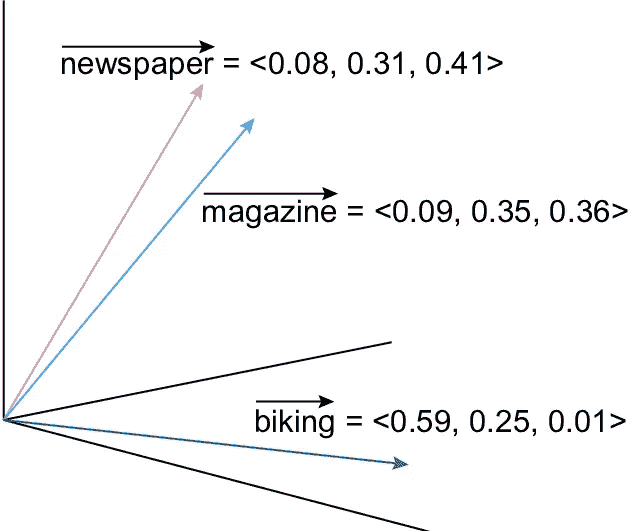
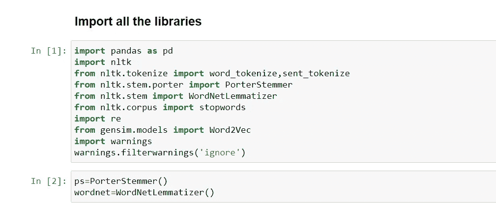
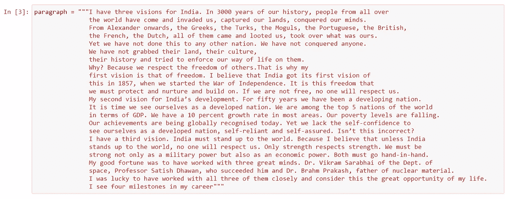
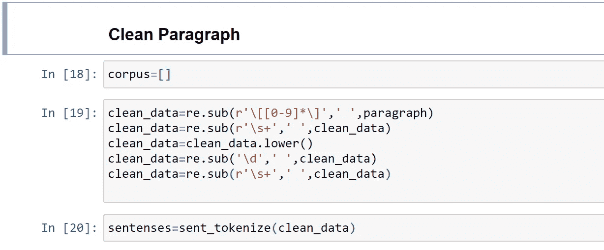
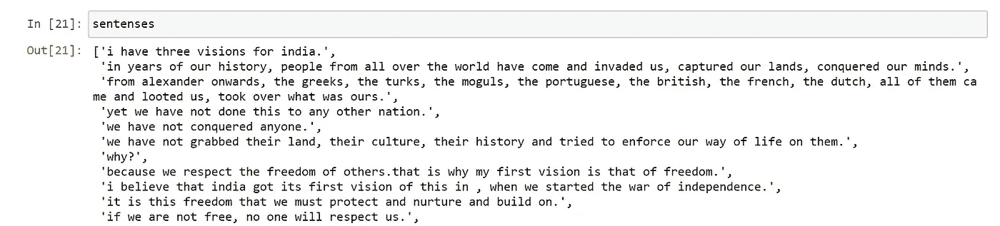
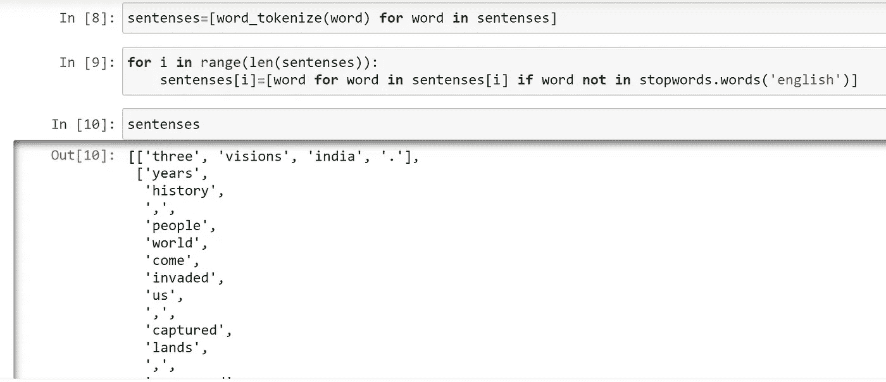
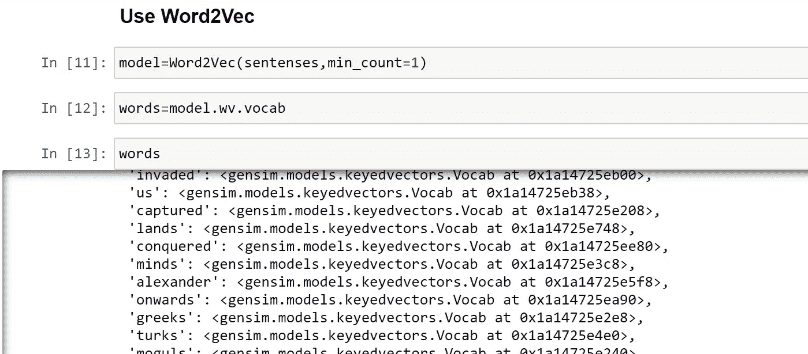
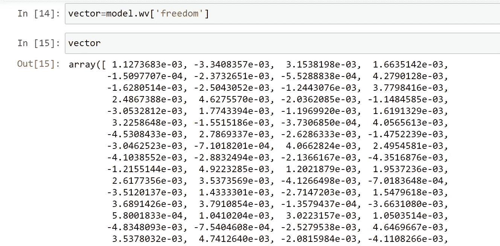
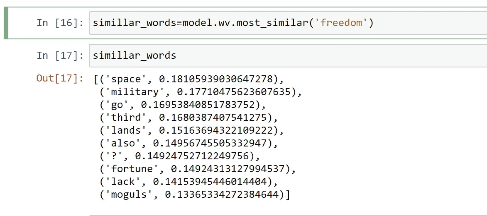

# 自然语言处理中的 Word2Vec

> 原文：<https://medium.com/analytics-vidhya/word2vec-in-natural-language-processing-1379b050220?source=collection_archive---------18----------------------->


图片:mortentolboll.weebly

# **概述**

在前面讨论的主题中，在单词包(BOW)和 TF-IDF 方法中，没有存储语义信息。这里，BOW 对语料库中的每个词给予同等的优先权，而 TF-IDF 对生僻词给予同等的优先权。

语义意味着在一个句子中，单词的顺序和关系很重要。比如，如果我有一个句子说“他要去拼贴”,那么这个句子中单词之间的顺序就很重要

弓和 TF-IDF 也有过度配合的可能

以上两个问题的解决方案是 **Word2Vec**

**word 2 vec**工作介绍&

1.在 word2vec 中，每个单词基本上都表示为 32 维或更多维的向量，而不是单个数字

2.在 Word2Vec 中，还保留了不同单词之间的语义信息和关系。

**word 2 vec 的可视化表示:**



图片:researchgate.net

> 如果你看到上面的图片，我们已经尝试用三维方式显示单词。由于单词**【报纸】**和**【杂志】**相关，它们具有邻近的矢量(这两个单词的矢量之间的距离非常接近)表示，而与上述两个不相关的单词**【骑自行车】**具有完全不同的矢量表示。因此，我们可以说，词语**、**、**、**之间存在着语义信息和关系

**创建 Word2Vec 的步骤**

第一步:语料库中句子的标记化。

步骤 2:创建直方图

第三步:从语料库中提取最常用的单词

第四步:用所有独特的单词创建一个矩阵。它还显示了基于出现次数的单词之间的关系

让我们用 Python，Gensim 库来做吧。

**导入所有需要的库**



**文集/段落:**



**清理上面的段落:**



**句子会是这样的:**



**使用分词器将句子拆分成单词，并使用停用词删除频繁出现的不需要的单词(如 the、he she、we、is 等)**



最后使用 **Word2Vec**



**每个单词的矢量表示**。这里的每个词**“自由”**都用 100 个维度来表示



只是给大家展示一下单词**“自由”**的所有 100 个维度值

```
array([ 1.1273683e-03, -3.3408357e-03,  3.1538198e-03,  1.6635142e-03,
       -1.5097707e-04, -2.3732651e-03, -5.5288838e-04,  4.2790128e-03,
       -1.6280514e-03, -2.5043052e-03, -1.2443076e-03,  3.7798416e-03,
        2.4867388e-03,  4.6275570e-03, -2.0362085e-03, -1.1484585e-03,
       -3.0532812e-03,  1.7743394e-03, -1.1969920e-03,  1.6191329e-03,
        3.2258648e-03, -1.5515186e-03, -3.7306850e-04,  4.0565613e-03,
       -4.5308433e-03,  2.7869337e-03, -2.6286333e-03, -1.4752239e-03,
       -3.0462523e-03, -7.1018201e-04,  4.0662824e-03,  2.4954581e-03,
       -4.1038552e-03, -2.8832494e-03, -2.1366167e-03, -4.3516876e-03,
       -1.2155144e-03,  4.9223285e-03,  1.2021879e-03,  1.9537236e-03,
        2.6177356e-03,  3.5373569e-03, -4.1266498e-03, -7.0183648e-04,
       -3.5120137e-03,  1.4333301e-03, -2.7147203e-03,  1.5479618e-03,
        3.6891426e-03,  3.7910854e-03, -1.3579437e-04, -3.6631080e-03,
        5.8001833e-04,  1.0410204e-03,  3.0223157e-03,  1.0503514e-03,
       -4.8348093e-03, -7.5404608e-04, -2.5279538e-03,  4.6469667e-03,
        3.5378032e-03,  4.7412640e-03, -2.0815984e-03, -4.1108266e-03,
       -4.5497515e-03, -2.0349291e-03,  4.8185606e-03, -3.5920267e-03,
        2.0674071e-03,  1.9790779e-03, -3.9039373e-03,  3.4050874e-03,
        3.8651349e-03,  3.6706368e-03,  4.2692507e-03, -3.9807847e-03,
        7.2977535e-05,  2.1913229e-03,  2.3057887e-03, -1.3587050e-04,
       -4.7944724e-03,  1.2130835e-03, -1.8126203e-03, -2.1072873e-03,
       -2.2353262e-03, -2.9427181e-03,  6.3250802e-04,  5.5979716e-04,
        3.3508011e-03, -9.0776308e-04, -4.8847585e-03,  1.9552025e-03,
       -2.2549990e-03, -4.4488683e-03,  1.2665773e-03, -1.4139886e-03,
        1.4697905e-03, -4.8091747e-03,  3.0768490e-03,  6.0989073e-04],
      dtype=float32)
```

寻找相似的单词，如单词**“自由”**



> 因此，我们可以看到，我们使用 word2vec 获得了语义和关系信息，并且能够找到相关的单词。在这个例子中是它的“自由”

**结论** : Word2vec 在寻找单词之间的语义和关系信息方面非常有用，并在人工智能& NLP 应用程序中大量使用，如调查响应、评论分析、推荐引擎等。

请写下您的疑问和意见，并分享您的反馈。

希望你喜欢我的文章。请鼓掌👏(50 次)激励我继续写下去。

想要连接:

链接地:【https://www.linkedin.com/in/anjani-kumar-9b969a39/ 

如果你喜欢我在 Medium 上的帖子，并希望我继续做这项工作，请考虑在[上支持我](https://www.patreon.com/anjanikumar)

[TF-IDF 链接](/@anjanimca2007/tf-idf-in-natural-language-processing-8db8ef4a7736)

[包话链接](/@anjanimca2007/bag-of-words-in-natural-language-processing-fe996f9ae9d2)