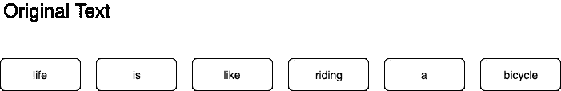
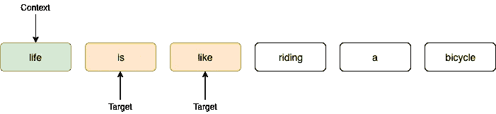
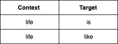
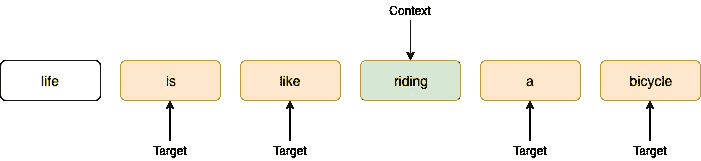
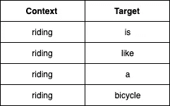
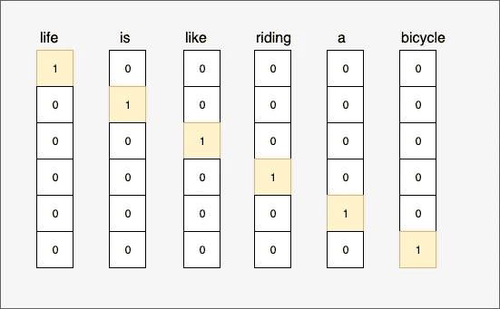
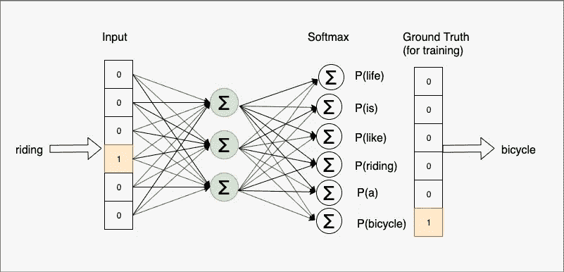
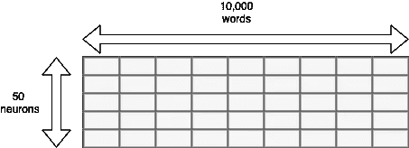
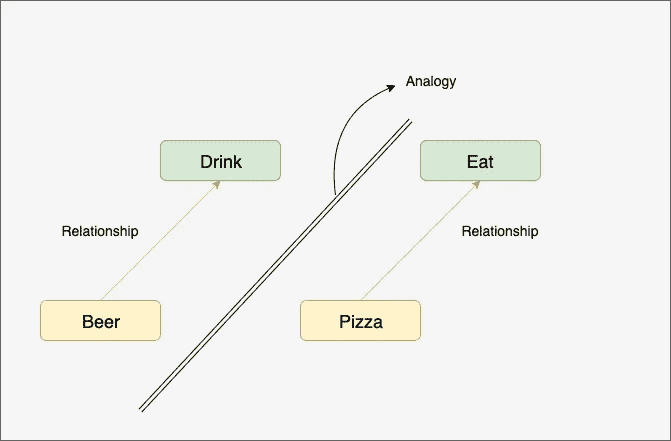

# Word2Vec(SkipGram)讲解！

> 原文：<https://medium.com/analytics-vidhya/word2vec-skipgram-explained-f7b3af90f02e?source=collection_archive---------9----------------------->

## 文字与人工智能相遇的地方

图片由[皮克斯拜](https://pixabay.com/?utm_source=link-attribution&utm_medium=referral&utm_campaign=image&utm_content=2175285)的 Gerd Altmann 提供

# 介绍

在本文中，我们将探究 Word2Vec 中的跳格模型是什么，向量是如何创建的，以及如何使用它们。重点不在于介绍，而在于如何得出单词 vectors。

Word2Vec 是创建单词“矢量表示”的一种方式。这些通常被称为单词嵌入。这里的意图是将具有相似含义(或上下文)的单词放在一起，而将不相关的单词放在一起。

例如，让我们假设词汇表中的每个单词都用一个 100 维的向量来表示。然后，通过单词的适当嵌入，我们应该能够看到‘苹果’和‘桔子’的向量应该比‘苹果’和‘氢’的向量更接近。当我们说“更近”时，我们指的是这些矢量表示之间的“余弦”距离。

现在，让我们看看如何构建这些向量。本教程将只涵盖 skip-gram 模型(CBOW 或 Glove 等主题留待以后的文章讨论)。我们将看到 Skip-gram 是神经网络的一个非常简单的用例(只有一个隐藏层),我们实现嵌入的方式简单得令人难以置信。

# 跳格模型

在高层次上，给定上下文中的单词，skip-gram 模型将尝试预测附近的单词(作为目标)。让我们详细阐述这一点。

**背景和目标**

要理解这一点，我们就拿“人生如骑自行车”这句话来说吧。这个句子中的每个单词(或标记)可以被认为是一个“上下文”,有了这个上下文，我们可以预测附近的单词。显然，我们不能将一个相距 5 段的单词定义为“附近”的单词。因此，必须选择足够小的窗口大小来决定哪些单词同时出现。让我们以 2 个单词的窗口大小来理解。

让我们用“生活”作为上下文词来举例。因为我们将窗口大小设为 2，所以单词“is”和“like”是目标。

下面是上下文及其相应的目标。

为了确保这个想法被理解，对另一个上下文单词“riding”重复相同的步骤。

下面是上下文及其相应的目标。

有了这种理解，就可以为整个语料库建立上下文和目标词组合。

这里，神经网络用于使用上下文单词来预测目标单词。随着神经网络用足够大的语料库学习和更新隐藏层的权重，这些权重将神奇地成为我们代表上下文单词的单词向量。

# 网络

现在上下文和目标是可用的，单层神经网络被用于使用上下文单词来预测目标单词。让我们更深入地了解一下神经网络的样子。

来源:http://mccormickml.com/

## 输入层

如上所述，源和目标都是从语料库中挑选出来用于训练神经网络的单词。每个单词表示为输入的方式是使用一键编码方法。

如果语料库中有 10，000 个唯一的单词，则输入是一个长度为 10，000 的数组，其中只有一个单词为“1 ”,其余的单词为零。

让我们观察一下上面例子中的输入向量是什么样子的。下面是我们采用的单词的一键表示法(在现实生活中，单词在分配一键向量之前是按字母顺序排序的)。

## 输出层

神经网络的输出是特定单词在给定输入单词“附近”的概率。如果语料库中有 10，000 个单词，则输出层是长度为 10，000 的数组，并且每个元素是 0 到 1 之间的值，表示目标单词与上下文单词一起出现的概率。

## 培养

给定输入单词，神经网络预测目标单词。神经网络将输入单词的一键表示作为输入，并预测每个目标单词的概率作为输出。为了训练模型并使损失最小化，我们需要将实际值与预测值进行比较并计算损失。为此，目标单词的一键表示将作为输出层的实际值。在神经网络的输出端使用 Softmax 层。

让我们观察一下这个例句中的网络是什么样子的。在这里，“骑”被认为是中心词，而“自行车”是目标

## 隐蔽层

这里是所有奇迹发生的地方！！

隐藏层中神经元的数量将定义我们如何“嵌入”10，000 长度的稀疏向量(以及嵌入到什么维度)。让我们把 50 作为隐藏层的维数。这意味着我们正在为通过网络的每个单词创建 50 个特征。

现在让我们把注意力集中在重量上。在我们的例子中，输入层的大小为 10，000，我们刚刚决定隐藏层的大小为 50。因此，权重矩阵的大小为(50×10000)

首先，让我们从隐藏层的角度来看权重。对于隐藏层中的第一个神经元，有 10，000 个输入连接，每个连接来自输入数组的每个元素。但是，因为输入层是一个热码表示，所以只有一个输入是“1 ”,其余的输入都是零。因此，对于任何单词，10，000 个权重中只有一个将被传递给激活函数。对于隐藏层的所有 50 个神经元都是如此。

现在，让我们从输入层的角度来看权重。对于任何一个字，由于一位热码表示，输入数组中只有一个元素是 10，000 中的 1。对于该输入元素，隐藏层中的 50 个神经元中的每一个都有 50 个连接(权重)。当下一个单词作为输入出现时，另一个输入元素将具有值 1，并且它将具有其自己的到隐藏层的 50 个连接(权重)。因此，在某种程度上，语料库中的每个单词都有自己的一组 50 个权重，当该单词出现在上下文中时，将使用这些权重。

这 50 个权重是代表语料库中的单词的单词向量。

## 直觉

这是事情变得清晰的地方。让我们说两个词有相似的上下文。如果我们把出现在第一个单词周围的所有单词和出现在第二个单词周围的所有单词都拿来，可以说会有一些单词是相同的。从神经网络的角度来看，在这种情况下，两个不同的上下文单词给出相同的目标单词作为输出。因此，这些上下文单词的权重将被类似地更新。

词的空间表征

由于大量目标单词对于两个上下文单词是相同的，所以它们的权重更新将彼此相似。因此，两个上下文单词的最终权重将彼此接近。有了大的语料库和足够好的隐藏层维度，这些权重将成为单词的良好空间表示。

有了这些权重，我们可以执行多项任务，从寻找相似的单词、单词类比(例如国王对于男人就像女王对于女人)到更复杂的任务，如命名实体识别、词性标注等

当谷歌在 Word2Vec 上发表论文时，它使用了 300 维向量表示，训练是在谷歌新闻文章上进行的。

# 然后

本文只讨论了使用 Skip-gram 模型的 Word2Vec 的初始实现的细节。但是从权重矩阵的大小可以看出，获得嵌入层是一个计算量很大的过程。Google 如何处理这个问题将在下一篇文章中详细讨论。

下一篇文章还将介绍使用 Word2Vec 检查两个或更多单词的相似性和相似性的 python 代码。