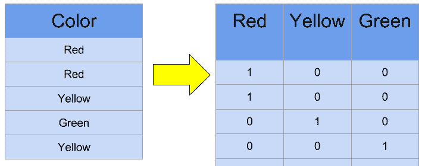
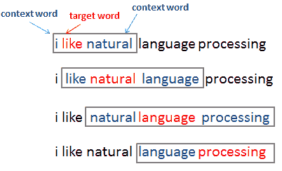
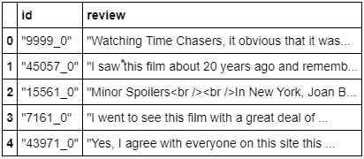
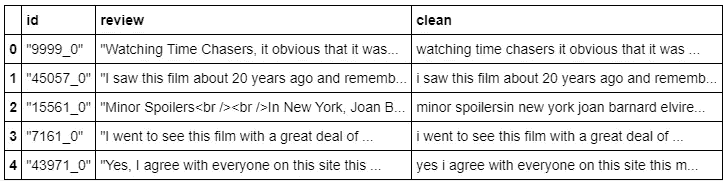
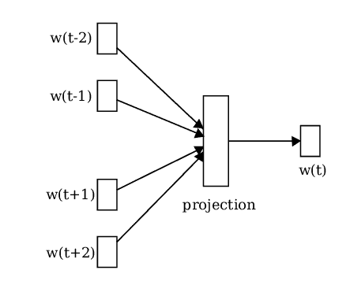
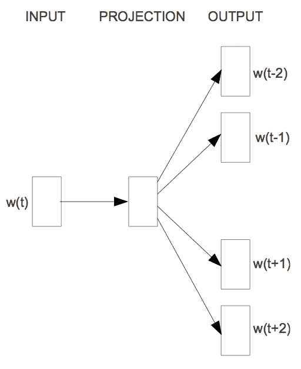

# 使用 Gensim 的 Word2Vector

> 原文：<https://medium.com/analytics-vidhya/word2vector-using-gensim-e055d35f1cb4?source=collection_archive---------1----------------------->

# 简介:

**什么是 Word2Vec？**

*   通俗地说，就是以语料库为输入，以向量的形式输出的算法。
*   一点技术定义:Word2Vec 是形成/创建单词嵌入的模型。这是一种表示单词的现代方法，其中每个单词由一个向量(基于嵌入大小的数字数组)表示。向量只不过是神经元的权重，所以如果我们将神经元的大小设置为 100，那么我们将有 100 个权重，这些权重就是我们的单词嵌入或简单的密集向量。
*   输入字必须是一个热编码。例如:



**但为什么是 Word2Vec 呢？**

*   Word2Vec 发现单词之间的关系(语义或句法),这是我们传统的 TF-IDF 或基于频率的方法所不能实现的。当我们训练模型时，每一个热编码单词都在一个维度空间中获得一个点，在那里它学习并分组具有相似含义的单词。
*   这里结合的神经网络是一个浅层的。
*   这里需要注意的一点是，我们需要将大量文本数据传递到 Word2Vec 模型中，以便找出单词之间的关系或生成有意义的结果。
*   一般来说，Word2Vec 是基于窗口方法的，我们必须指定一个窗口大小。



*   在上面的可视化表示中，窗口大小设置为 1。因此，来自目标双方的 1 个字都被考虑。类似地，在每次迭代中，窗口将滑动一步，我们的邻居将不断变化。
*   有两种类型的算法:CBOW 和 Skip-gram。(随着我们的进展，我们将看到它的细节)

# 数据收集:

## 来源:

*   我们使用了 Kaggle 网站上的“一袋文字和一袋爆米花”中的一组未标记的数据:【https://www.kaggle.com/c/word2vec-nlp-tutorial/data 

## 详细信息:

*   unlabeledTrainData 没有标签的额外训练集。制表符分隔的文件有一个标题行，后跟 50，000 行，包含每个评论的 id 和文本。

## **数据字段:**

*   id:每个审核的唯一 ID
*   审查:审查的文本

## 目标:

*   目标是在 Gensim 的帮助下建立 Word2Vec 单词嵌入模型。

# Gensim:

*   Gensim 是相当容易使用的模块，它继承了 CBOW 和 Skip-gram。
*   我们可以用**安装！pip 在 Jupyter 笔记本上安装 gensim** 。
*   实现 Word2Vec 的另一种方法是从头开始构建，这相当复杂。
*   阅读更多关于 Gensim 的信息:[https://radimrehurek.com/gensim/index.html](https://radimrehurek.com/gensim/index.html)
*   **仅供参考，Gensim 是由 NLP 研究员拉迪姆·řehůřek 和他的公司 RaRe Technologies 开发和维护的。**

# 加载包和数据:

```
*#Import packages* **import** **pandas** **as** **pd
import** **gensim***#import beautiful soup , regex* **from** **bs4** **import** BeautifulSoup
**import** **re**, **string***#import warnings
#warnings.filterwarnings(action='ignore')*
```

*   上面我们使用漂亮的汤库来消除 HTML 标签。另一种方法是我们可以使用正则表达式来消除标签。

```
*#reading dataset*

df = pd.read_csv('unlabeledTrainData.tsv', header=0, delimiter='**\t**', quoting=3)
df.head()
```



*   数据集的形状是 50000 个例子，具有 2 个属性，即 id 和 review。

```
'"Watching Time Chasers, it obvious that it was made by a bunch of friends. Maybe they were sitting around one day in film school and said, \\"Hey, let\'s pool our money together and make a really bad movie!\\" Or something like that. What ever they said, they still ended up making a really bad movie--dull story, bad script, lame acting, poor cinematography, bottom of the barrel stock music, etc. All corners were cut, except the one that would have prevented this film\'s release. Life\'s like that."'
```

*   我们可以观察到我们的语料库可能包含 HTML 标签、特殊字符等。
*   我们需要通过消除这些标签和字符来清理语料库。

```
*#empty list*
clean = [ ]

*#for loop to clean dataset while removing html tags, special characters*
**for** doc **in** df['review']:
    x = doc.lower()                     *#lowerthe case*
    x = BeautifulSoup(x, 'lxml').text   *#html tag removal*
    x = re.sub('[^A-Za-z0-9]+', ' ', x) *#separate words by space*
    clean.append(x)

*#assigning clean list to new attribute*
df['clean'] = clean
```

*   上面我们使用漂亮的汤库来消除 HTML 标签。另一种方法是我们可以使用正则表达式来消除标签。



*   最后，我们将 clean 集合添加到 list 中，并形成一个新的属性 clean。

# (a)连续单词包(CBOW):

*   在这里，邻近单词被提供作为预测目标的输入。换句话说，提供上下文作为预测目标的输入。例如:
*   让我们用视觉表现来看看这个:



*   我们可以观察到， **W(t)** 在给定上下文/相邻单词作为输入的情况下被预测。基于馈送到网络的输入来估计目标单词的 p 值。
*   我们这里有一个浅层神经网络。嵌入的每个单词或单个密集向量的大小取决于我们拥有的神经元数量。
*   这些向量是每个神经元学习的权重。
*   无论单词有多大或多小，它都将由我们设置的嵌入大小来表示。

**优势:**

*   CBOW 速度更快，并且更好地表示频繁出现的单词。
*   当谈到内存利用率时，CBOW 倾向于消耗低内存。

**缺点:**

*   无法表示不常用的单词。
*   需要大量的文本数据。( ***注:不能说是缺点，因为它消耗内存少，但值得一提*** )

# (b)跳格图:

*   Skip-gram 与 CBOW 相反/相反，其中提供目标单词作为输出，以便预测上下文/相邻单词。
*   让我们用视觉表现来看看这个:



*   这里，一个目标词被输入到我们的浅层神经网络，权重从隐含层学习。从相邻单词中随机挑选一个单词(基于我们的窗口大小)。此外，对于与我们输入给网络的输入单词接近的上下文单词，正在计算 P 值。

## **优点:**

*   Skip-gram 适用于较小的数据集。
*   它能够很好地表示生僻字。

## **缺点:**

*   如果数据集很大，训练速度会很慢。
*   并且不是存储器有效的。

# 我们可能会面临什么问题？

*   这两种技术都基于概率估计。
*   让我们考虑一个例子，我们有一个 1000 字的语料库。我们需要预测目标单词(CBOW)或上下文(Skip-gram)。现在，我们指定一个固定的窗口大小来在语料库中滑动。假设我们的窗口大小是 1，即在 CBOW 的情况下，输入将是 2 个单词(目标两侧的单词)，而在 Skip-gram 的情况下，输入将是单个单词，以便预测上下文(2 个单词)。
*   在这种情况下，将对特定窗口内的单词进行概率估计，并且这些概率将高于远离邻域的单词的概率。
*   计算巨大语料库(例如:数百万个单词)的概率在计算上将是昂贵的，因为算法将在每次迭代中估计所有单词的概率。在这种情况下，模型也可能给出不相关的结果。因此，为了克服这个问题**，提出了负采样**。
*   在**负抽样**中，概率是在我们的固定窗口大小内为单词估计的，就像以前一样，但只有少数随机单词被选择出固定窗口。通过这种方式，p 值估计的负荷与以前相比降低了。训练速度更快，效果更满意。

## CBOW 或 Skip-gram:何时选择哪一个？

*   这取决于问题的性质。
*   两者都有自己的一套好处。

# Word2Vec 建模

*   此外，我们将看看如何实现 Word2Vec 并获得密集向量。

```
*#Word2vec implementation*model = gensim.models.Word2Vec(docs,
                              min_count=10, 
                              workers=4,
                              size=50,
                              window=5,
                              iter = 10)
```

这里有几个可以使用的参数:

*   **句子:**句子接受一个令牌列表列表。(如果是 CBOW，最好有大的文件列表)
*   **大小:**要并入隐藏层的神经元数量或单词嵌入的大小。默认情况下，其设置为 100。
*   **窗口:**窗口大小或围绕目标考虑的字数。如果 size = 1，则将考虑两边的 1 个字。默认情况下，5 是固定的窗口大小。
*   **最小计数:**默认值为 5。基于提到的最小计数的不频繁的单词将被忽略。(*我们选择了 10 作为阈值*)
*   **workers :** 一次使用的 CPU 线程数，用于更快的训练。
*   **sg :** 不是 0 就是 1。默认值为 0 或 CBOW。必须通过传递 1 来显式定义 Skip-gram。
*   **iter :** 迭代次数/历元数。

```
*#vocab size*
len(model.wv.vocab.keys())
```

*   除去少于 10 个的单词后，我们的词汇表中还有 28656 个单词可供使用。
*   并且每个单词会用 50 个数字/权重来表示(这是我们的嵌入大小)。

```
*#uncomment to view vocabulary*
*#model.wv.vocab*
```

*   上面这段代码将揭示完整的词汇。

```
*#word2vector representation*
model.wv['great']
```

## 输出:

数组([-2.7726305，-1.0800452，-1.788979，2.340867，-0.32861072，0.0651653，1.6166486，-3.2617207，-3.6233435，-3.32576，-1.7012835，1.0813012，-0.2412

*   上面我们可以观察到“伟大”这个词是用 50 个权重来表示的。

```
*#find similar words to the given word*
model.wv.most_similar('dumb')
```

## 输出:

```
[('stupid', 0.899315595626831),
 ('lame', 0.8604525923728943),
 ('silly', 0.8508281111717224),
 ('generic', 0.7499771118164062),
 ('pathetic', 0.7478170394897461),
 ('retarded', 0.7461548447608948),
 ('corny', 0.7456734776496887),
 ('cheesy', 0.7454365491867065),
 ('ridiculous', 0.7351659536361694),
 ('bad', 0.7300432920455933)]
```

*   关于 Gensim 的一个美丽的事情是，我们有这样的方法，可以给我们以最高的概率排列相似的单词。
*   计算单词之间的余弦相似度，以找到最相似的单词。
*   当我们经过“dumb”时，我们可以观察到大多数相似的单词是如何通过它们各自的 P 值对齐的。
*   鉴于“哑”，大多数类似的词是愚蠢，跛脚，傻等。

```
*#words which doesn't match*
model.wv.doesnt_match('house rent trust apartment'.split())
```

## 输出:

```
'trust'
```

*   我们还可以识别哪些单词关系不密切。
*   上面我们通过了“房子，租金，信托，公寓”，输出是“信托”——这显然是令人满意的。

```
*#arithmetic operations*
model.most_similar(positive=['woman','man'], negative=['king'])[0]
```

## 输出:

```
('girl', 0.7452774047851562)
```

*   上面我们已经完成了基本的算术问题。
*   如果女人+男人=国王-？
*   输出是 p 值为 0.74 的“女孩”，这是可以接受的，如果我们有更大的语料库，那么我们可能会得到作为“女王”的输出。

```
*#word embeddings*
model.wv.vectors
```

## 输出:

```
array([[-1.0976436 , -1.0300254 ,  1.0157741 , ...,  2.0884573 ,
         1.2929492 , -0.50073916],
       [-0.10799529,  1.1408263 ,  0.23857029, ..., -0.6748595 ,
         1.4341863 , -0.03276591],
       [-0.67246455,  1.097886  ,  0.97168344, ..., -0.7108262 ,
        -0.20907082, -0.37925354],
       ...,
       [ 0.44054744,  0.13000782,  0.04757666, ...,  0.09963967,
         0.2213286 , -0.13963003],
       [ 0.42221656,  0.37493396,  0.28681585, ..., -0.1619114 ,
         0.2634282 ,  0.0619109 ],
       [ 0.43446574,  0.11213642,  0.05965824, ..., -0.02202358,
         0.1439297 , -0.01608269]], dtype=float32)
```

*   上面是我们的 50 维数组。
*   我们可以在嵌入层的帮助下进一步将其用于情感分析。

# 保存和加载模型:

*   我们可以将我们的模型保存为“<name>”。bin”文件并查看内容。</name>

```
*#saving model*
model.wv.save('word2vector-50.bin')
```

*   此外，我们还可以使用 load()方法加载模型。

```
#loading model
model = gensim.models.Word2Vec.load('word2vec-50.bin')
```

*   我们也可以从这里下载文件来加载 Google Word2Vec 模型:[https://drive . Google . com/file/d/0b 7 xkcwpi 5 kdynlnuttlss 21 pqmm/edit](https://drive.google.com/file/d/0B7XkCwpI5KDYNlNUTTlSS21pQmM/edit)
*   这是谷歌预先训练的模型，它是在谷歌新闻数据上训练的，其中每个词由 300 个嵌入大小表示。
*   有许多这样的预训练模型可用，仅举几个例子，如 Stanford 的 GloVe(单词表示的全局向量),脸书人工智能研究实验室的 FastText。人们可以加载它们并检查哪个工作得更好。

# 结论

*   在这个案例研究中，我们详细学习了 CBOW 和 Skip-gram。
*   我们也看到了我们所面临的障碍，以及研究人员如何通过添加负采样来克服它。
*   我们通过传递一个干净的标记化的语料库来训练模型。
*   最后，我们看了如何保存/加载模型，并在将来使用它。

# 下一步是什么？

*   在嵌入层的帮助下，我们可以使用单词嵌入作为情感分析的特征。

# 参考资料:

*   在这里阅读快速文本:[https://fasttext.cc/](https://fasttext.cc/)
*   在这里阅读手套:[https://nlp.stanford.edu/projects/glove/](https://nlp.stanford.edu/projects/glove/)
*   在这里阅读关于谷歌新闻的 word 2 vec:[https://code.google.com/archive/p/word2vec/](https://code.google.com/archive/p/word2vec/)
*   维基百科:[https://en.wikipedia.org/wiki/Word2vec](https://en.wikipedia.org/wiki/Word2vec)
*   **提及:**此处使用的图片来自各种来源，如 ResearchGate、MiroMedium、RaRe Technologies 等。

**注:***如有错误，请指正。如果你觉得有帮助，请分享。*

***多谢。***