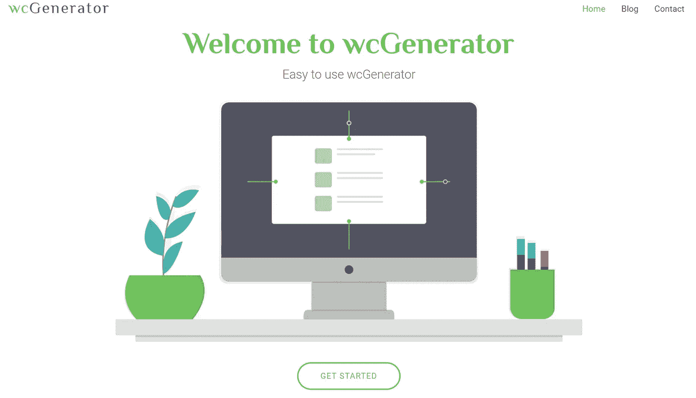
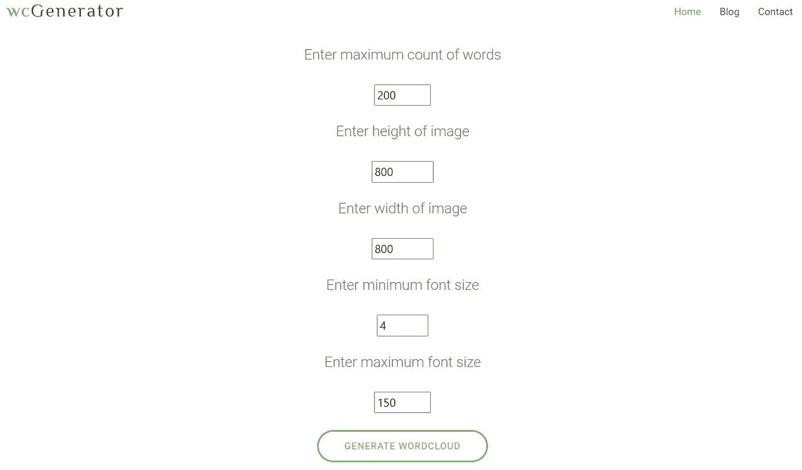
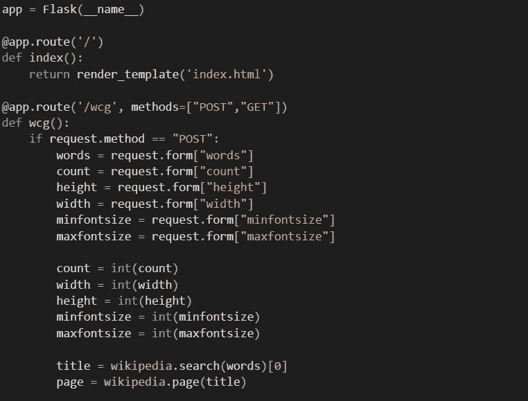
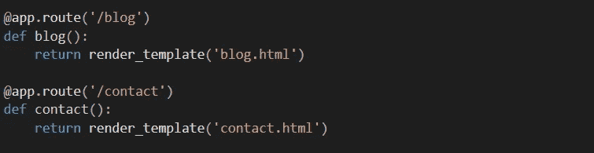
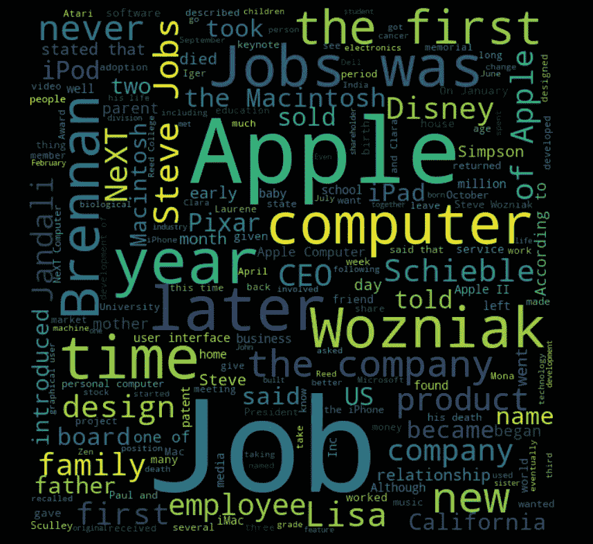

# 使用 Python 和 Flask 的 WordCloud 生成器

> 原文：<https://medium.com/analytics-vidhya/wordcloud-generator-using-python-and-flask-afd1bed1c578?source=collection_archive---------9----------------------->

当你开始学习一些关于编码的新东西或构建新系统的新技术时，它会促使你用它，用你所学的一切来构建一个项目。

最近，在参加关于数据科学和数据可视化的培训时，我偶然发现了一个叫做 wordcloud 的 python 库。将数据以 wordcloud 的形式表现出来，是一种数据可视化的方法。基于这个想法，我开发了一个用于创建单词云的本地应用程序。即使是最不熟悉的人也可以使用这个网络应用生成文字云。

**第一步:构建前端**

主页

前端使用 HTML5 和 Bootstrap，便于理解用户界面。为博客、联系人和最重要的 wordcloud 生成器整合多个网页。这是表单的外观。

WC-发电机

这个表单是为用户输入他们想要的带有其他参数的 wordcloud 字符串准备的。它足够灵活，因为用户可以根据文本框中提到的最小值和最大值输入值。它还提到了每个输入项的默认(建议)值。

**第二步:开发 app.py**

app.py 是用于通过 web 应用程序运行 python 代码的主要应用程序文件。

使用 POST 方法接受表单中的所有参数和输入值，并在类型转换后存储到变量中。相同的变量作为参数传递给 wordcloud 库的 wordcloud generator 方法。app.py 文件不仅链接表单代码，还链接通过每个按钮或链接引用的其余网页。

**第三步:用合适的引用整合所有文件**

App.py 不是唯一有代码的文件。HTML 网页将在 app.py 文件的 route 方法中链接

如上面的代码所示，在 web 应用程序中单击 contact.html 页面或在 URL 中提到路径时，路由方法会引用该页面。一旦所有文件都与 app.py 文件链接，您的 web 应用程序就可以运行了。

运行 web 应用程序:

1.  打开您的命令提示符
2.  导航到存储所有文件的目录
3.  类型:python app.py
4.  打开浏览器并键入:localhost:5000
5.  您的 web 应用程序已经可以使用了

**第四步:生成词云**

你可以点击生成 wordcloud 按钮了，这是最后一步。

输入字符串:史蒂夫·乔布斯

使用所有默认参数，输出是

史蒂夫·乔布斯单词云

仅此而已！

**未来工作:**

总是建议用你学到的任何东西来更新。这个 web 应用程序将使用 Heroku 应用程序进行部署，以便可以在全球范围内使用。Heroku app 是一个云服务提供商，用于部署项目，以便可以在全球范围内使用。这使得多个用户可以使用部署的项目，而不需要从 GitHub 克隆构建。

总之，你可以在这里查看完整的代码。

欢迎任何推荐！谢谢大家！