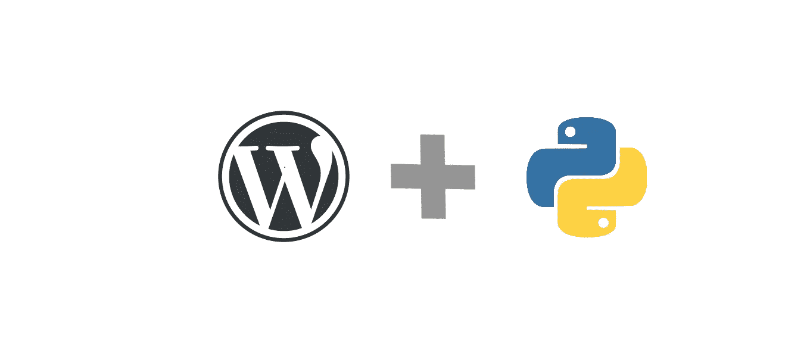
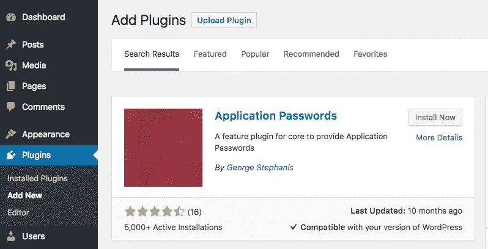

# 使用 Python 的 WordPress REST API

> 原文：<https://medium.com/analytics-vidhya/wordpress-rest-api-with-python-f53a25827b1c?source=collection_archive---------2----------------------->

在这篇博客中，我们将结合 Python 使用 REST API 的强大功能，并执行 crud 操作。在这个博客中，我们将获取所有的帖子，创建一个新的帖子，使用 REST API 和 Python 更新和删除它。



# 证明

首先，我们需要基本的认证来执行 crud 操作，除非你安装一个名为 application password 的特殊插件来获取应用程序密码，否则它不会工作。

转到您的仪表板->插件->添加新的，并在搜索框中键入应用程序密码。



一旦你安装了插件，进入你的配置文件设置并滚动到底部。您将看到一个应用程序密码字段将被添加到那里。键入您的应用程序名称，并按下回车键，弹出将出现一个密码。从弹出窗口复制生成的密码。

# 是时候了解一下 python 了

现在，用**创建一个文件。py** 分机。你可以给它取任何名字(例如 **app.py** )。

导入一些必需的包:

```
import requests
import json
import base64
```

# 获取帖子

```
url = "[https://example.com/wp-json/wp/v2/posts](https://example.com/wp-json/wp/v2/posts)"user = "your-username"
password = "your-application-password"credentials = user + ':' + passwordtoken = base64.b64encode(credentials.encode())header = {'Authorization': 'Basic ' + token.decode('utf-8')}responce = requests.get(url , headers=header)print(responce)
```

让我们来理解这个代码。

*   **URL** 是你想从中获取帖子的站点的 URL。
*   **用户**是您的管理员用户名。
*   **密码**是您刚刚生成的应用程序密码。
*   对您的凭证进行编码，并在标头授权中传递它们，如代码所示。
*   在这一行的底部，我们打印出我们的回答，看看我们得到了什么。

现在，打开您的终端并运行您的 app.py 文件。

```
python app.py
```

# 创建帖子

要创建一个帖子，我们需要使用一些必需的参数来发出帖子请求，比如 URL、您的 JSON 数据。让我们这样做:

```
url = "[https://wholeblogs.com/wp-json/wp/v2/posts](https://wholeblogs.com/wp-json/wp/v2/posts)"user = "your-username"
password = "your-application-password"credentials = user + ':' + passwordtoken = base64.b64encode(credentials.encode())header = {'Authorization': 'Basic ' + token.decode('utf-8')}post = {
 'title'    : 'Hello World',
 'status'   : 'publish', 
 'content'  : 'This is my first post created using rest API',
 'categories': 5, // category ID
 'date'   : '2020-01-05T10:00:00'
}responce = requests.post(url , headers=header, json=post)print(responce)
```

# 更新帖子

要更新帖子，您需要传递帖子 id 来告诉 REST API 您想要更新哪个帖子。让我们看看如何做到这一点。

```
url = "[https://wholeblogs.com/wp-json/wp/v2/posts/](https://wholeblogs.com/wp-json/wp/v2/posts/)"postID = 1user = "your-username"
password = "your-application-password"credentials = user + ':' + passwordtoken = base64.b64encode(credentials.encode())header = {'Authorization': 'Basic ' + token.decode('utf-8')}post = {
 'title'    : 'Hello World Updated',
 'content'  : 'This is my first post created using rest API Updated'
}responce = requests.post(url + postID , headers=header, json=post)print(responce)
```

这里，postID 是要更新的帖子的 ID。

# 删除帖子

要删除一篇文章，我们需要使用 python 提供的删除请求。

```
url = "[https://wholeblogs.com/wp-json/wp/v2/posts/](https://wholeblogs.com/wp-json/wp/v2/posts/)"user = "your-username"
password = "your-application-password"credentials = user + ':' + passwordtoken = base64.b64encode(credentials.encode())header = {'Authorization': 'Basic ' + token.decode('utf-8')}responce = requests.delete(url + postID , headers=header)print(responce)
```

这是用 python 对 WordPress REST API 的一个小介绍。

你可以在我的 GitHub 库检查代码。

[](https://github.com/BRdhanani/wordpress-rest-api-with-python) [## BRdhanani/WordPress-rest-API-with-python

### 用 python 实现的 WordPress Rest API CRUD 操作。通过…为 BRdhanani/WordPress-rest-API-with-python 开发做出贡献

github.com](https://github.com/BRdhanani/wordpress-rest-api-with-python) 

*查看*[wholeblogs.com](https://wholeblogs.com/)*了解更多参考资料和博客。*