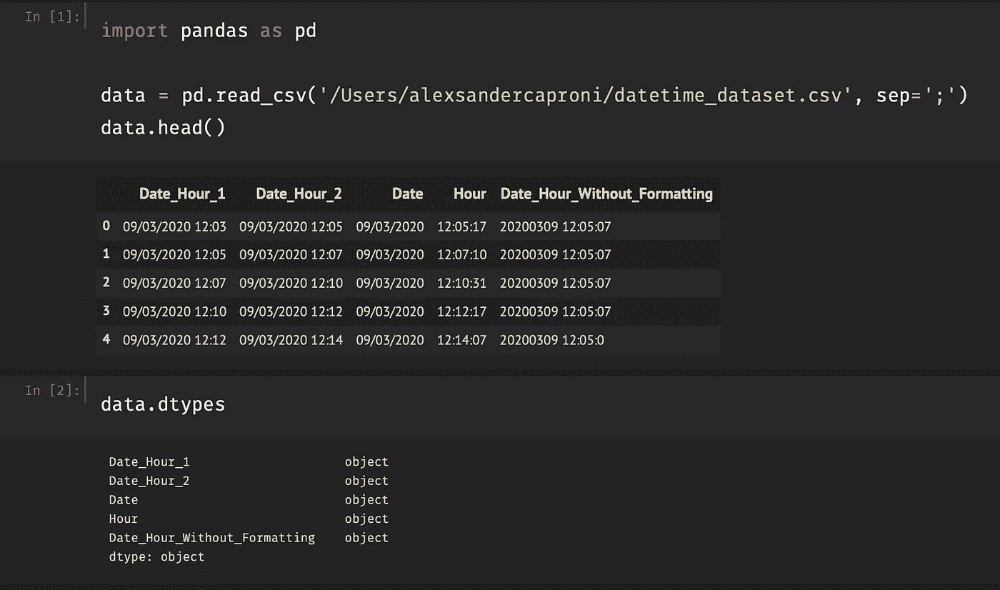
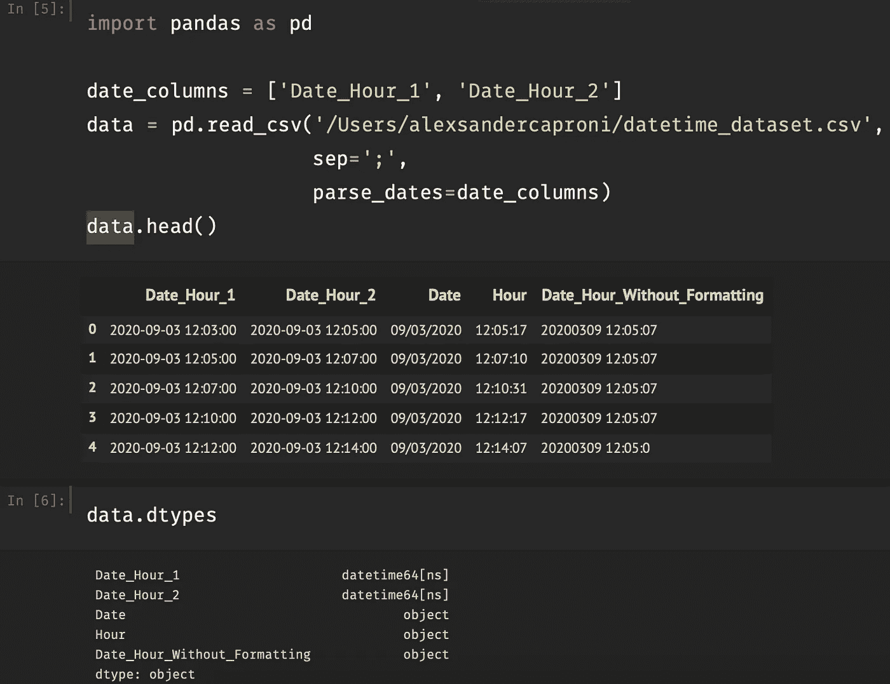
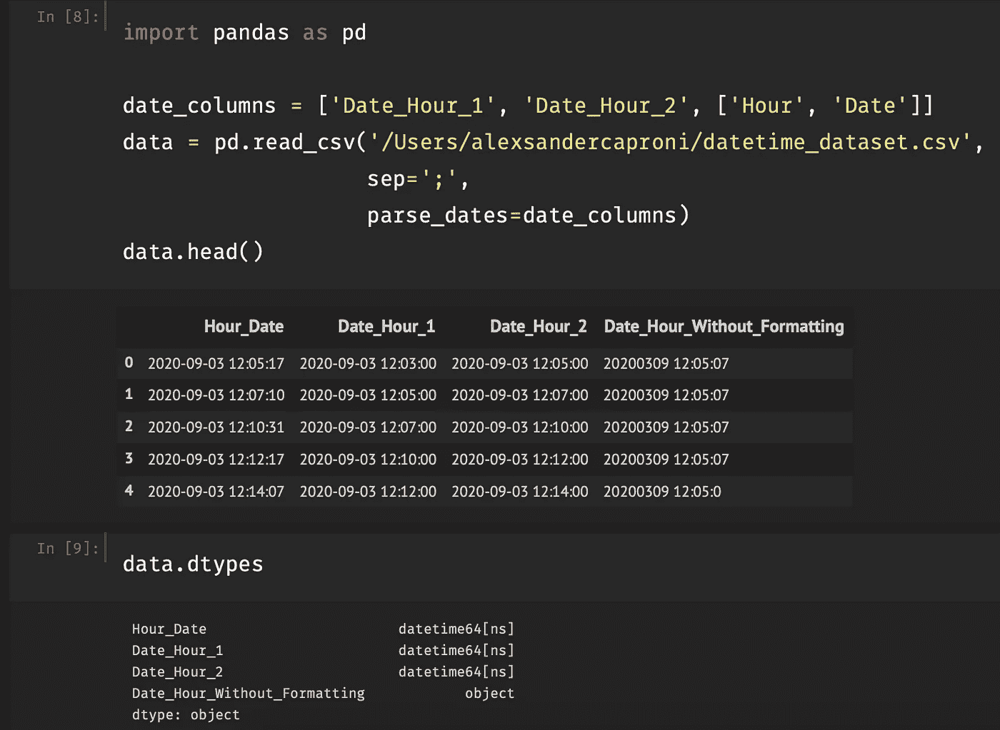
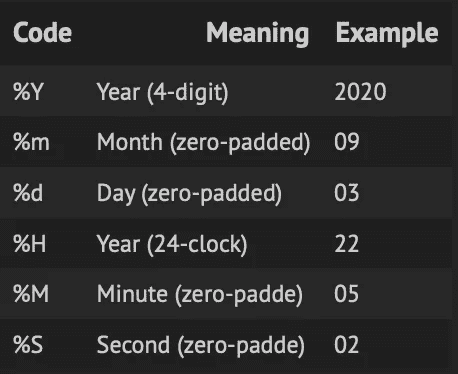
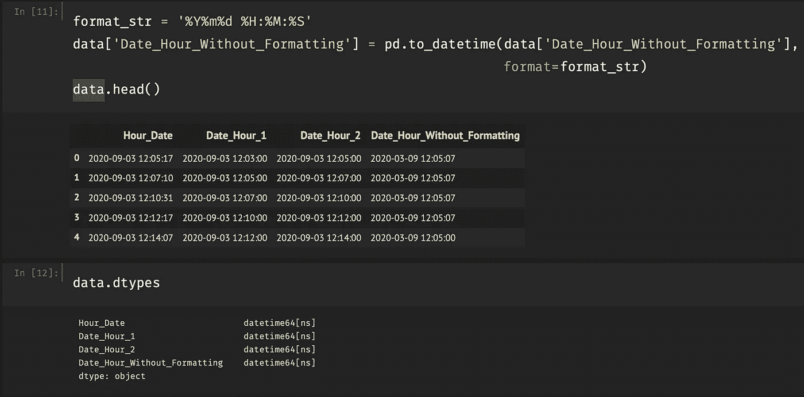

# 有效处理熊猫中的日期

> 原文：<https://medium.com/analytics-vidhya/work-effectively-with-dates-in-pandas-9bf0bf582f35?source=collection_archive---------15----------------------->

计算机如何处理日期和时间是一个丰富的话题，但是您现在需要知道的是 Python 将它们存储为一种特殊的日期类型: **datetime** 。

然而，在 pandas 中，默认情况下 datetime 列作为对象(字符串)加载，如果您想按时间排列记录，请选择在一个时间范围内或计算某个时间间隔，但是您将需要 datetime 列。

## 导入数据

以导入数据集为例，在导入过程中不进行任何配置，会得到以下结果:

导入没有日期配置的数据集

正如我上面提到的，默认情况下，日期列作为对象加载。因此，为了确保将列作为 datetime 导入，我们指定列的 datetime 带有`parse_dates`关键字参数(不是`dtype`)。除此之外，`parse_dates`接受:

*   要分析的列名或列号的列表；
*   包含要组合和解析的列的列表，例如单独的日、月和年列；
*   一种字典，其中键是新的列名，值是要一起解析的列的列表

# 解析日期

**标准格式**

为了解析标准格式的日期，我们使用前面提到的`parse_dates`，传递列名或列名列表，如下所示:

使用 parse_dates 参数导入数据集。

当我们检查时间戳列的 dtypes 时，我们看到两列被成功解析。

为了解析**拆分时间戳**列，我们可以添加一个包含特定列的列表，并将它们传递给`parse_dates`参数。在我们的例子中，我们需要连接`Date`和`Hour`列。因此，pandas 创建了一个新的组合 datetime `Hour_Date`列。结果如下所示:

拆分时间戳的结果

# 非标准日期

然而，`parse_dates`只在数据是熊猫理解的格式时才起作用。也就是说，如果您试图用`parse_dates`解析未格式化的日期，比如 **09032020** 表示**九月** **03，2020，**您将得到一个字符串列作为结果。相反，我们需要在用 pandas `to_datetime()`方法导入数据集后转换非标准的。

`to_datetime()`采用以下参数:

*   要转换的数据框架和列；
*   `format`:日期时间格式的字符串表示。

## 日期格式

它们用代码和字符描述日期时间字符串格式。我们可以将最常见的日期格式举例如下:

> 完整名单请参考[https://strftime.org](https://strftime.org)

最常见的日期格式

## 解析非标准日期

首先，我们需要检查我们的数据，看看数据是以什么格式排列的。在我们的例子中，我们解析**Date _ Hour _ Without _ Formatting**列，我们可以看到日、月、年、小时、分钟和秒的序列。因此，在这之后，我们定义格式化代码并使用`to_datetime()`，如图所示:

解析非标准日期的结果

那就这样吧！我想指出的是，还有其他方法来转换日期！感谢你的阅读，如果你喜欢这篇文章，尽你所能点击鼓掌图标！