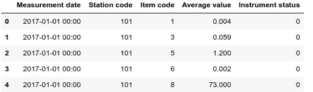

# 在 pandas 和 MySQL(或任何其他 RDBMS)中高效地处理大量数据

> 原文：<https://medium.com/analytics-vidhya/working-efficiently-with-large-data-in-pandas-and-mysql-or-any-other-rdbms-1d7376936763?source=collection_archive---------0----------------------->


大家好，这个简短的教程将向大家展示如何使用 pandas 从 csv、excel 或外部数据库中高效地读取大型数据集，并将其存储在一个集中的数据库中。

[**pandas**](https://pandas.pydata.org/) 是一款快速、强大、灵活且易于使用的开源数据分析和操作工具，构建在 [Python](https://www.python.org/) 编程语言之上。

我们将读取的数据集是首尔空气污染的 csv 文件。你可以从 [**这里**](https://www.kaggle.com/bappekim/air-pollution-in-seoul) (如果你有 kaggle 账号的话)或者 [**这里**](https://data.seoul.go.kr/dataList/OA-15526/S/1/datasetView.do) 下载。

> 感谢首尔市、首尔开放数据广场、空气质量分析中心提供数据。

不占用您太多的时间，让我们直接开始吧…

1.  **导入所需的库**

`import pandas as pd
import mysql.connector as sql`

2.**读取 csv 文件(传统方式)**

`df = pd.read_csv(‘Measurement_item_info.csv’,sep=’,’)`

让我们预览一下文件的外观

`df.head()`



让我们检查一下我们有多少行和列

`df.shape >> (3885066, 5)`

这大约是 390 万行和 5 列。

由于我们使用传统的方式，我们的 ***内存管理*效率不高。让我们看看每一列消耗了多少内存，以及消耗内存的总和。**注意:输出以字节为单位****

`df.memory_usage(index=False, deep=True)`

```
Measurement date     283609818
Station code          31080528
Item code             31080528
Average value         31080528
Instrument status     31080528
```

`df.memory_usage(index=False, deep=True).sum()`

`407931930 bytes.`

*大约 408MB* 、**、*而磁盘*、**上实际文件大小为 124.4MB。不好！！！

**3。内存管理**

虽然有时我们可能会侥幸逃脱，但像上面那样使用内存并不是最好的做法。为了能够管理内存，我们需要能够理解数据帧的数据类型。让我们这样做…

`df.dtypes`

```
Measurement date      object
Station code           int64
Item code              int64
Average value        float64
Instrument status      int64
```

> 默认情况下，pandas 分配上述“dtypes ”,以防止任何数据太大而不适合存储。例如，带符号的 int64(即 64 位整数)的最大值是 9，223，372，036，854，775，807。

让我们检查是否有任何 int64 dtypes 实际上接近这个数字

`df[‘Station code’].max() >> 125`

`df[‘Item code’].max() >> 9`

`df[‘Instrument status’].max()>> 9`

`df[‘Average value’].max() >> 6256`

我们的值没有一个接近分配的内存空间！！ ***让我们更有效地重新分配内存*** 。

> 注意:作为一名开发人员，尤其是在使用 DBMS 时，知道或预测数据所能容纳的最大值总是很重要的

在本例中，我们读取了一个新的数据帧

`df_eff_memory = pd.read_csv(‘Measurement_info.csv’,sep=’,’,dtype={‘Station code’:’int8',’Item code’:’int8',’Instrument status’:’int8',
‘Average value’:’float16',’Measurement date’:’string’})`

`df_eff_memory.memory_usage(index=False,deep=True)`

```
Measurement date     31080528
Station code          3885066
Item code             3885066
Average value         7770132
Instrument status     3885066
```

`# total memory used
df_eff_memory.memory_usage(index=False,deep=True).sum()`

```
50505858 bytes
```

***约 51MB*** 。这减少了 **87.61%** 的内存使用！！！

**4。在 MySQL 中存储数据**

有时，我们希望集中管理和保护我们组织的数据。在这种情况下，我们将使用社区版本的 MySQL。

***a)让我们创建我们的凭证***

`db=’mysql’
user=’db_admin’
paswd=’db_admin_password'###SHOULD BE KEPT HIGHLY SECRETIVE!!!!
host=’localhost’`

***b)创建连接对象***

`conn = sql.connect(db=db,user=user,host=host,password=paswd,use_unicode=True,
charset=”utf8", auth_plugin=’mysql_native_password’)`

***c)创建光标读或写***
`cur = conn.cursor()`

***d)插入查询***
`measurement_insert_query = “””
insert into measurement_info (measurement_date,average_value,instrument_status,measurement_item_info_id,
measurement_station_info_id) values(%s,%s,%s,(select measurement_item_info.id from measurement_item_info
where item_code = %s),(select measurement_station_info.id from measurement_station_info where station_code = %s))
“””`

***e)数据插入***

`data = list(zip(df_eff_memory[‘Measurement date’],df_eff_memory[‘Average value’],df_eff_memory[‘Instrument status’],
df_eff_memory[‘Item code’],df_eff_memory[‘Station code’]))`

***f)现在终于插入数据***

`try:
cur.executemany(measurement_insert_query,data)
conn.commit()
print(‘success’)`

`except (sql.Error,sql.Warning) as e:
print(e)`

```
**2055: Lost connection to MySQL server at 'localhost:3306', system error: 32 Broken pipe**
```

> 等等！刚刚发生了什么！几分钟后，我们收到一个错误，尽管我们有效地利用了内存。似乎服务器厌倦了等待，关闭了连接，尽管我们没有在代码中要求这样做

**5。读取和插入数据的最后一步**

由于我们无法将数据作为一个整体插入 MySQL，我们将分块或小块插入。pandas 在最初读取数据时提供了 ***chunksize*** 选项，因此我们需要编写某种迭代/循环来进行读写

> 这里我们一次读取 10000 行并写入数据库。在每次插入之后，我们还会得到一个成功的输出

```
success
success
success
success
success
```

我们终于能够成功地读写**大数据**到我们的数据库！！

B onus

> **使用 numpy 矢量提高速度**

NumPy 是用 Python 进行科学计算的基础包。通过对数据块进行小的调整，我们可以更快地读取数据。

你所需要做的就是在每个专栏的末尾添加`to_numpy()`

# 结论

根据您使用的计算机，您的输出和内存使用可能与我的略有不同。

> 如果您无法完全读取数据，您可能处于 ***BigData*** 区域。您应该考虑像 pyspark 这样的库，它们主要是为处理它们而构建的。

在用 Python 进行数据分析时，pandas 是一个很好的工具。我仅仅触及了数据的表面，我鼓励你做更多的实验和研究。

非常感谢你抽出时间。快乐编码:)

# 关于作者

James 在信息技术(软件开发、数据科学和 web 开发)领域拥有超过 15 年的经验，在推动业务增长、领导力和组织效率领域的战略创新方面拥有丰富的经验和能力。他为网络和独立系统设计和构建数据分析和可视化算法。

James 还是一名飞行操作和调度员执照持有人，拥有超过 7 年的航空经验。他的职责是确保安全、安保、效率和应急标准始终得到执行。他还参与控制和协调航空公司整个航线网络(国际、地区和国内)的日常机队运营。