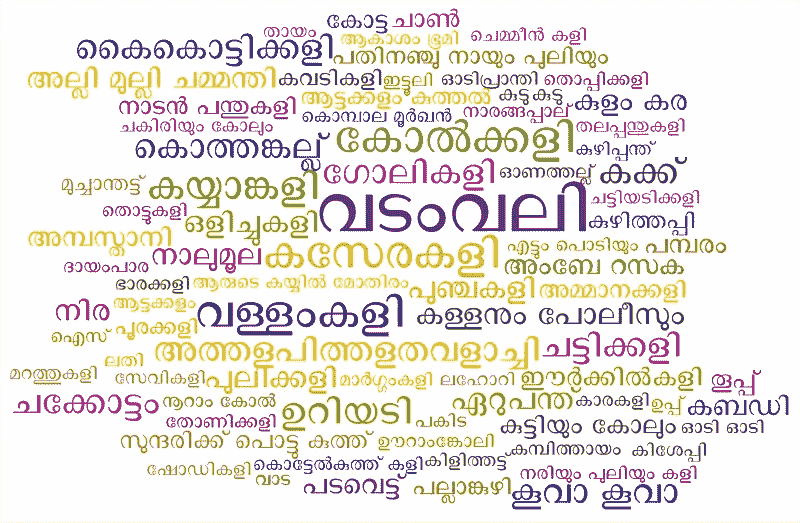
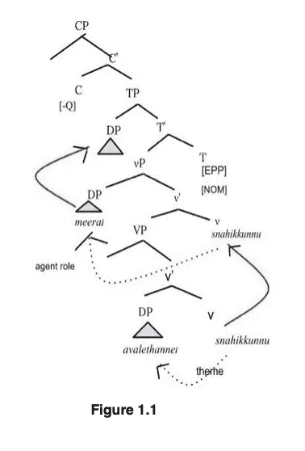

# 计算语言学论文的工作笔记

> 原文：<https://medium.com/analytics-vidhya/working-notes-on-a-computational-linguistics-paper-75a7020e32d6?source=collection_archive---------15----------------------->

纳瓦内斯·克里希南[CC BY-SA([https://creativecommons.org/licenses/by-sa/4.0](https://creativecommons.org/licenses/by-sa/4.0))]

# 约束理论在东南亚流行语言马拉雅拉姆语中的应用——第一部分

我想写一些我以前在研究生院做的工作，希望能唤起一些志同道合的研究人员的兴趣或评论，因为这一特定的工作是未出版的，我相信是原创工作。

计算语言学或自然语言处理(众所周知)是一个一直试图让计算机理解人类语言(简单来说)的领域。一次又一次，这项任务被证明几乎是不可能完成的。一个常见的误解是，我们已经解决了人工智能中最难的问题之一，因为现在 Alexa 可以播放音乐，或者 Siri 可以打电话给我爸爸。这些智能体仅仅给人一种假装理解自然语言的印象，而假装(老实说)只能让你到此为止。

根据维基百科的定义，**Government and binding**(**GB**， **GBT** )是上世纪 80 年代主要由[诺姆·乔姆斯基](https://en.wikipedia.org/wiki/Noam_Chomsky)发展而来的[转换语法](https://en.wikipedia.org/wiki/Transformational_grammar)传统中的一种[句法](https://en.wikipedia.org/wiki/Syntax)和[短语结构语法](https://en.wikipedia.org/wiki/Phrase_structure_grammar)。在将约束理论应用于英语和其他欧洲语言方面，已经做了大量的工作。对于一些南亚语言来说，情况就不一样了。

Malayalam/mæləˈjɑːləm/语(malayāḷam)is 一种主要在印度喀拉拉邦使用的语言。2013 年，印度政府宣布马拉雅拉姆语为古典语言，在印度、拉克沙威和普杜切里有 3300 万人说马拉雅拉姆语(截至 2001 年人口普查)。马拉雅拉姆语吸收了许多来自梵语的元素，截至 2013 年，学术用途中超过 80%的马拉雅拉姆语词汇来自梵语。像其他德拉威语(主要是卡纳达语、泰米尔语、泰卢固语和图鲁语)，马拉雅拉姆语是一种粘合语言。它也是我的母语，因此我对它很熟悉。

# 马拉雅拉姆语的词序

尽管对母语者来说，它和其他德拉威语的一个共同特征似乎是 SOV(主语-宾语-动词)的规范词序。这就是下面的例子所暗示的词序。下面泰米尔语和马拉雅拉姆语的句子展示了 SOV。

> (1) ராமன் மாம்பழ சாப்பிட்டேன்.
> 
> 拉曼芒果吃了。
> 
> 拉曼吃了芒果。
> 
> (2) രാമന് മാങ് കഴിചു.
> 
> 拉曼漫画 kazhichu
> 
> 拉曼芒果吃了。
> 
> 拉曼吃了芒果。

然而，马拉雅拉姆语似乎有自由词序。在他的论文“语法关系和回指”，(1981) Mohanan 认为马拉雅拉姆语有自由词序，语言没有动词短语节点。他接着说，VP 节点的参数是对称放置的，这使得能够进行加扰。这种论点的移动将会产生不同结构的不同句子。然而，在他们题为“南亚语言中的词序问题:丰富的短语结构和多维性”的论文中，K . P Mohanan 和 T. Mohanan 认为，这种混乱只有在表现出非分句自由词序的语言中才是允许的。马拉雅拉姆语和印地语就是两种这样的语言。

在 Subbārāo 的标志性著作(Subbārāo，2012)中，他讨论了在词序拓扑研究以及最近的理论框架中，动词(或中心词)在句子中的位置对句子中元素的出现顺序起着至关重要的作用。在政府和绑定框架中，它被称为“头(方向)参数”。SOV 语言中的补语(宾语)出现在中心语、动词或命题的左边。因此，动词终结语言的格分配方向是从右到左。因此，补语在动词中心语之前。这与英语或法语中补语跟在中心语之后形成对比。因此，在动词性终末语和非动词性终末语中，补语和中心语之间存在镜像关系。因此，我将在有 VP 节点的情况下采用这种方法，尽管这将反映我们在英语中如何处理 VP 节点的镜像。

# r-表达式、代词和照应词

subārāo 的工作解释说，sal 有两种形式的名词性回指(简单和复杂)和两种形式的动词性回指(动词性反身或 VR 和动词性对等 VREC)。在马拉雅拉姆，我们没有 VR 和 VRECs。也许 Jayaseelan 能够在他的论文中指出为什么马拉雅拉姆语没有任何动词回指。

# 1.照应词

照应词是一个名词短语，它必须从句子中的另一个名词短语中获得其含义。传统上回指只能出现在需要指称名词短语的结构中。考虑句子(2)，这里的*拉曼*不回指另一个 NP，并且独立存在，没有任何问题。因此，我们可以在(2)中省去共同索引。然而，考虑到句子(3)，共同索引允许我们将名词短语*她自己*指向名词短语*米拉。*如图 1.1 所示。因此，在这种情况下，很自然地，就像在英语中一样，照应词必须与共同指称的名词短语一起出现。否则，它将是一个 R 表达式或代词。

> (3.i) മീര1 അവളെതതനെന1 സനേ്ഹികുനനു
> 
> meera avalle tanne snahikkunnu
> 
> 米拉是她最爱的人。
> 
> 米拉爱她自己。
> 
> (3.ii) *米拉·阿凡·斯纳希库努*
> 
> 米拉他爱。
> 
> 米拉爱他

在上面的例子(3.i)中， *meera* 是一个 r 表达式，从上下文中得到它的含义，但是*她自己* ( അവളെതതനെന)必须引用回 *Meera* 。它不能指世界上的任何其他人。这个名词短语必须从句子中的前一个词得到它的意思。所以，在这个句子中*她自己* ( അവളെതതനെന)是回指者。

*免责声明:我的观点仅代表我个人，并不代表我的雇主或与我相关的任何人的观点。上面的一些观点写得很幽默，也应该如此看待。上面这篇文章应该被看作是一篇正在撰写的文章，因为它肯定是一个重要的话题。稍后我会添加更多的内容。如有任何问题或意见，请写信到 aardkannan@gmail.com 给我。*