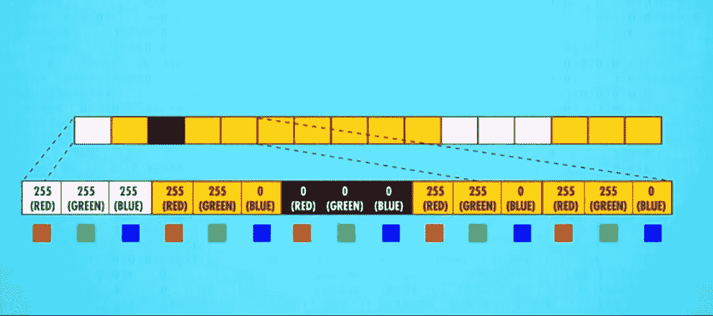
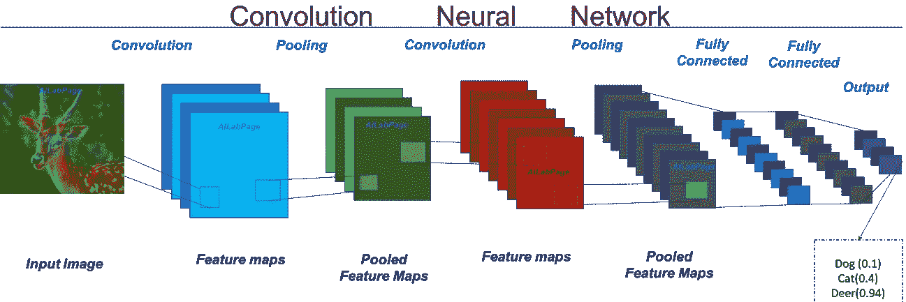
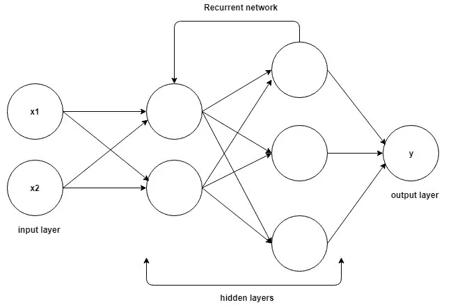
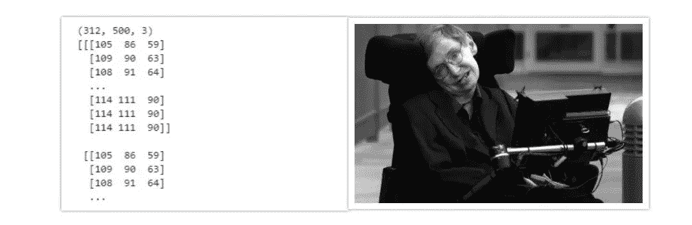

# 通过 OpenCV 实现计算机视觉

> 原文：<https://medium.com/analytics-vidhya/working-of-computer-vision-and-a-beginners-guide-to-opencv-2d0e50ccc38a?source=collection_archive---------16----------------------->

视觉是带宽最高的感觉，它提供了关于你周围环境的信息。人脑在理解和分析等任务上的功能更多地依赖于视觉信息，而不是其他感官。

数码相机可以捕捉你最美好的瞬间，如果你需要的话，还可以美化这些图像。但是就像去*听*不等于去*听*，去*拍*不等于去*看*。由于这个原因，已经开发了许多算法来即兴发挥**计算机视觉**的功能。

# 什么是计算机视觉？

简而言之，通过模仿人眼的工作方式，使计算机能够看到、识别和处理图像，并获得高层次的理解。

# 计算机视觉是如何工作的？

你可能知道，计算机以像素的形式存储图像。像素是屏幕上可寻址的小元素。这些像素代表色谱的强度。每个像素由存储为三原色红、绿和蓝的组合的颜色来定义。



**像素颜色划分**

这个阶段被称为图像采集，图像被转换成机器可理解的二进制数据。

通常，这些图像在处理之前被转换成灰度，以提高信噪比并简化可视化过程。


**根据色谱的强度将灰度图像转换为像素数。**

当我们看到每一朵阿瑟花上的一个物体时，我们的大脑会立刻认出它。这是否意味着我们可以比高端电脑计算得更快？不要！我们的大脑在作弊，因为我们已经有了几千年的进化背景。但是电脑没有这种优势。对于计算机来说，图像仅仅是一个二维数组。

# 处理像素

一旦像素数准备好了，我们就可以开始下一步了，即根据内容、颜色、类型等对这些图像进行分类。执行这些任务的热门新算法之一是卷积神经网络或 CNN。

CNN 将称为过滤器的像素矩阵作为输入，开始将这些模式与网络正在寻找的特定模式进行比较，并开始使用自上而下的方法进行分类。在开始阶段，它理解边界和形状，最后，它识别物体。



**CNN 的阶段**

在没有足够数据的情况下，无论这些网络有多深，我们都不能相信任何算法。我们需要用大量不同的数据来训练模型，以提高其性能。

但是 CNN 仅仅局限于单个帧。它只能处理单个图像。这将再次导致一个困境和误解。


想象一个人在荡秋千。现在，如果我们看一个单独的画面，我们不知道那个人在那个时刻是来回移动，因为没有预语境。在分析图像时，这些事情往往会导致误解。这就是 CNN 缺乏的地方。它们只能考虑空间特征，而不能考虑时间或时间特征。使用视频可以更容易地做到这一点。

视频只不过是帧的集合。每一帧的 CNN 的输出必须被取出并反馈给新的网络。这种类型的模型被称为递归神经网络或 RNN。RNN 可以使用已经处理过的数据进行决策。



**RNN 结构**

RNN 最主要也是最重要的特征是**隐藏状态**，它记住了关于一个序列的一些信息。rnn 有一个**“存储器”**，它会记住所有已经计算过的信息。它对每个输入使用相同的参数，因为它对所有输入或隐藏层执行相同的任务来产生输出。这降低了参数的复杂性，与其他神经网络不同。

# 使用 Python 迈向 OpenCV 的初级步骤

OpenCV 是一个主要针对实时计算机视觉的编程函数库，最初由英特尔开发。它可以用于执行图像捕获和处理。

要安装 OpenCV，请使用以下命令:

```
pip install opencv-python
```

现在打开任意编辑器或 python IDLE 并导入 cv2 模块:

```
import cv2
```

要从目录中读取图像，我们使用:cv2.imread(path，flag)

```
img_color = cv2.imread('stephen_hawking.jpg',1) #reads a color image
img_gray = cv2.imread('stephen_hawking.jpg',0)#reads a gray image
```

要在窗口中显示图像，请使用

```
cv2.imshow('image', img_color)  #displays image in a window
cv2.waitKey(0)  #will keep displaying till any key is pressed
cv2.destroyAllWindows()
```

要查看图像的像素值，只需使用 print()。我们还可以看到，彩色图像是二维的，而灰度图像是三维的，因为增加了一个额外的维度来存储 BGR 颜色强度。

```
print(img_color.shape) #prints the dimensions 
print(img_color) #prints 3d array representing color intensities
```



**左:3d 像素阵列右:灰度图像**

要知道一个像素在(x，y)的 BGR 值，打印该值在[y][x]。

```
print(img_color[0][0]) #output: [105  86  59]
```

最后现在保存一个图像:

```
cv2.imwrite('stephen_hawking_grayscale.jpg',img_gray)
```