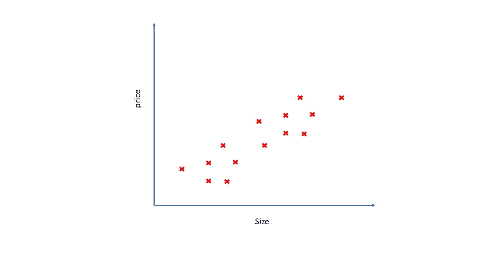
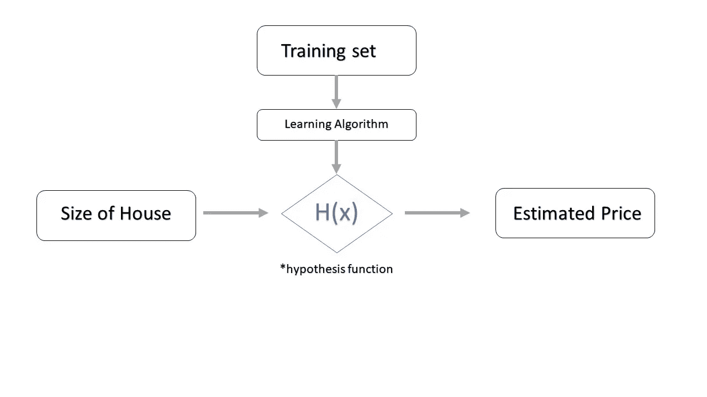
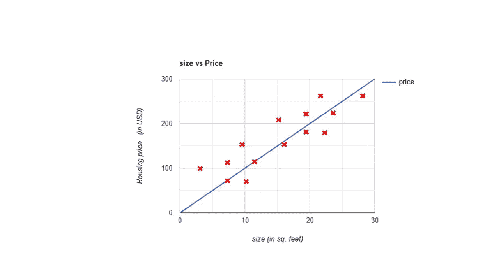

# 线性回归在起作用。

> 原文：<https://medium.com/analytics-vidhya/working-of-linear-regression-3c0e294a6d22?source=collection_archive---------28----------------------->

*所以，你以前用过线性回归，但不知道算法背后的数学。很多人不知道背后的真实数据。所以，我今天要告诉你。*

线性回归是*监督学习的一部分，*我们有标签数据(“正确答案”)，我们必须根据以前的“正确答案”预测新值。在线性回归中，我们处理的是连续值而不是离散值(一些固定值。)

**让我们以俄勒冈州波特兰市(美国)的房价为例**

尺寸与价格曲线图(不按比例)

通过绘制价格与大小的关系图，我们可以说大小与价格成正比("*随着大小的增加，价格也会增加*")。在本文中，我们只处理一个独立变量或一元线性回归。自变量也被称为解释值，因变量通常被称为目标值。

> 那么我们如何预测这些值呢？

如果我们用给定的数据点画出假设函数。我们可以以某种方式预测新的输出，但会有一些误差。所以，我们需要一个假设函数，*函数代表问题陈述。*假设函数通常用 h(x)来表示。

对于这个问题我们的假设函数是 h(x) = θ + θ1*x *或者 y= mx+c*

*(如果你熟悉这个方程 ie。你必须知道直线方程* ***m 或θ1 是斜率*******c 或θ是直线的截距****)**

**

*算法*

> *成本函数或目标函数*

*成本函数不同于假设函数，也可以说是预测函数，也表示为 J(θ)。线性回归算法使用的代价函数是
*梯度下降算法。**

***h(x) = 1/2m * ∑(从 i=0 到 m)【h(Xi)-(易)】***

*我们需要一条与数据点误差最小的线，这样我们可以更精确地预测，我们如何找到这条线？我们需要最小化∑[(h(x)-y)]*

*所以现在我们的代价函数简化为 J(θ) = 1/2m * ∑(从 I 到 m) [h(xi)-(易)]。对于 y=mx，我们画出 J(θ)。*

**

*成本函数 J(θ)的曲线图*

*梯度下降看起来像这样*

*重复直到收敛{*

****θj = θj -α * ( ∂/∂(θj ) ) * J(θ，θ1)，对于 j=0 和 j=1*** **同时更新θ和θ1 的值***

*}*

*这里α是学习率或找到最小值的步长。*

> *当我们接近局部最小值时，学习率应该降低(更小的步长),否则我们可能会导致过度拟合。*

*在绘制了成本函数 J(θ)和给定的数据点之后，我们能够以 94%的准确度或 0.94 的概率进行预测*

**

*准确率:94%*

*有许多评估方法可以发现错误，例如:-*

*平均绝对误差 (MAE)*

**均方误差* (MSE)*

**均方根误差* (RMSE)*

**相对平方误差。*(称为 r2 分数误差)*

> ***恭喜你！现在你知道线性回归是如何工作的，你可以使用:sklearn.linear_model 中的**导入线性回归**并开始预测。***

> *如果你已经到达这里，感谢你阅读这篇文章！。。。喜欢就留个掌声:)*

**

*由[刘汉宁·内巴霍](https://unsplash.com/@hannynaibaho?utm_source=medium&utm_medium=referral)在 [Unsplash](https://unsplash.com?utm_source=medium&utm_medium=referral) 上拍摄的照片*

> *人工智能是新的电力*