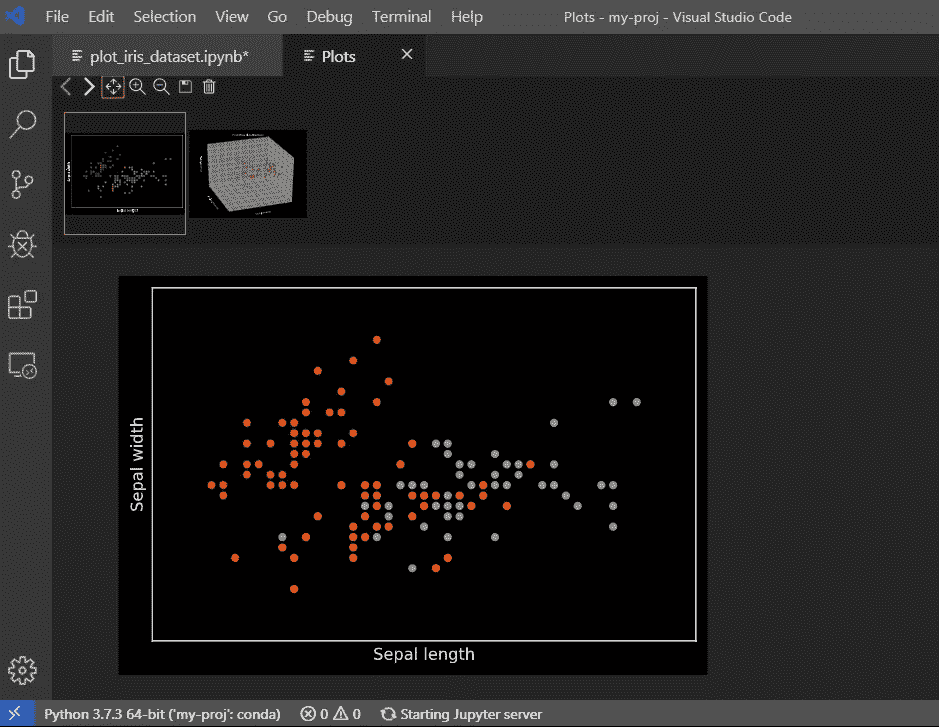

# 在虚拟 conda 环境中使用 VS 代码开发 Jupyter 笔记本

> 原文：<https://medium.com/analytics-vidhya/working-on-jupyter-notebooks-in-vs-code-from-virtual-conda-environment-f415726e329d?source=collection_archive---------1----------------------->

现在，我们可以从 Visual Studio 代码中对 Jupyter 笔记本进行本地编辑，可视化交互式图形，并从一个位置部署数据科学项目！


卡斯帕·卡米尔·鲁宾在 [Unsplash](https://unsplash.com/s/photos/microsoft?utm_source=unsplash&utm_medium=referral&utm_content=creditCopyText) 上的照片

当我看到微软关于在 VS 代码中对 Jupyter 笔记本进行[原生编辑的公告时，我很兴奋能够使用这个功能，因为你现在可以直接编辑了。ipynb 文件，并获得 Jupyter 笔记本的交互性和 VS 代码的所有功能。](https://devblogs.microsoft.com/python/announcing-support-for-native-editing-of-jupyter-notebooks-in-vs-code/)

**为什么要 VS 代码？**

> “VS Code 有很多内置特性，比如调试、嵌入式 Git 控件和 GitHub、语法高亮、智能代码完成、代码片段和代码重构。它是非常可定制的，允许用户改变主题、键盘快捷键、偏好，并安装增加额外功能的插件。它还有一个嵌入其中的终端。”— [数据营](https://www.datacamp.com/community/tutorials/top-python-ides-for-2019)

但是在尝试这个新特性时，由于不熟悉 VS 代码和 Anaconda 虚拟环境，我花了一些时间来解决环境问题。我想分享一下我的经验，主要是给和我一样习惯在 jupyter 笔记本上做数据科学，想开始使用 jupyter 笔记本的 VS 代码原生编辑的人。

让我们开始吧:

1.  安装 anaconda.com[的 Anaconda](https://docs.anaconda.com/anaconda/install/)(如果你对 Anaconda vs Miniconda vs conda 感到困惑，请浏览 Daniel Bourke 的精彩博客。如果您的系统中已经安装了 Anaconda，那么您可以从第 3 步开始
2.  如果您喜欢使用命令行界面(CLI ),您可以使用 conda 在 Windows 或终端上使用 Anaconda 提示符来验证安装。
3.  要打开 Anaconda 提示符:

Windows:单击开始，搜索或从菜单中选择 Anaconda 提示符。


资料来源:anaconda.com

**注意:** Anaconda 提示符是 Anaconda 安装附带的，与常规的 Windows powershell 或命令提示符不同。详细说明请查看官方[蟒蛇网站](https://www.anaconda.com/distribution/)。

4.a)如果你想在基本位置创建虚拟 conda 环境/项目文件夹<my-proj>:</my-proj>

```
(base)C:\Users\<user-name>
```

在 Anaconda 提示符下键入:

```
(base)C:\Users\<user-name> conda create -n my-proj python=3.7 pandas numpy matplotlib scikit-learn jupyter notebook
```

使用上面的命令我们要求 **conda** 到**创建**一个虚拟环境由**命名 my-proj** 带有特定版本[**python 3.7**](https://www.python.org/)**[**numpy**](https://numpy.org/)**[**matplotlib**](https://matplotlib.org/)**[**scikit-learn**您可以根据您的项目需求编辑包名。](https://scikit-learn.org/stable/)******

****键入以下命令以激活虚拟环境。****

```
**(base) C:\Users\<user-name> conda activate my-proj(my-proj) C:\Users\<user-name> code**
```

****可以使用*‘conda install<package-name>’*或*‘pip install<package-name>’*命令添加额外的库。****

****5.将您的项目文件夹<my-proj>添加到 VS 代码项目工作区。</my-proj>****

*******注意:*** *确保安装了* [*Visual Studio 代码*](https://code.visualstudio.com/download) *并启用了 Anaconda、Python 和 Jupyter 扩展。* [*Jupyter 笔记本对 visual studio 代码的支持*](https://code.visualstudio.com/docs/python/jupyter-support) *给出了从 Visual Studio 代码访问 Jupyter 笔记本的完整细节。这个博客主要关注康达环境下 jupyter 笔记本的本地编辑。*****

****6.从 VS 代码中打开终端，并确保您处于虚拟 conda 环境中。如果没有再次激活环境—****

```
**C:\Users\<user-name>\Anaconda3\envs\my-proj> conda activate my-proj**
```

****7.从可用的解释器中选择解释器，并确保它与我们在上面创建的虚拟 conda 环境路径相同，后跟 python.exe:****

```
 **C:\Users\<user-name>\<my-proj>\python.exe**
```

********

******8** 。如果出现错误，打开**。在our < my-proj >文件夹中创建的 vscode** 文件夹。验证**settings . JSON**' python . python path '字典值设置为****

```
“C:\\Users\\<user-name>\\<my-proj>\\python.exe” 
```

**如果没有，请编辑当前虚拟环境位置的路径，后跟“python.exe”，并用“\\”替换“\”。**

**9.创建一个新的 jupyter 笔记本并开始编码！！**

**或者**

**下载 [plot_iris_dataset.ipynb](https://scikit-learn.org/stable/auto_examples/datasets/plot_iris_dataset.html#sphx-glr-auto-examples-datasets-plot-iris-dataset-py) 并上传到< my-proj >文件夹，在 Visual Studio 代码中测试 jupyter 笔记本的原生编辑。如果一切正常，你将能够看到下面的可视化。**

****

# ****绘图查看器****

> **绘图查看器使您能够更深入地处理绘图。在查看器中，您可以在当前任务中平移、缩放和导航地块。您也可以将图导出为 PDF、SVG 和 PNG 格式。**
> 
> **在笔记本编辑器窗口中，双击任何图，在查看器中打开它，或选择图左上角的图查看器按钮(悬停时可见)——[code.visualstudio.com](https://code.visualstudio.com/docs/python/jupyter-support)**

********

***免责声明:在虚拟环境中首次启动 jupyter 服务器大约需要 2-3 分钟！！！***

**感谢下面帮助我理解 Python 中的 Anaconda、miniconda 和虚拟环境，并尝试 Visual Studio 代码。**

1.  **[用康达拯救环境(以及如何让别人运行你的程序)](https://kiwidamien.github.io/save-the-environment-with-conda-and-how-to-let-others-run-your-programs.html) —丹尼尔·马丁**
2.  **[让你的电脑为机器学习做好准备:如何使用 Anaconda、Miniconda 和 conda 以及为什么要使用它们](https://towardsdatascience.com/get-your-computer-ready-for-machine-learning-how-what-and-why-you-should-use-anaconda-miniconda-d213444f36d6)**
3.  **[StackOverflow 线程](https://stackoverflow.com/questions/37926940/how-to-specify-new-environment-location-for-conda-create)**
4.  **[Visual Studio 文档](https://code.visualstudio.com/docs/python/environments)**
5.  **[Devblogs.microsoft.com](https://devblogs.microsoft.com/dotnet/)**