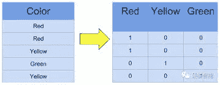
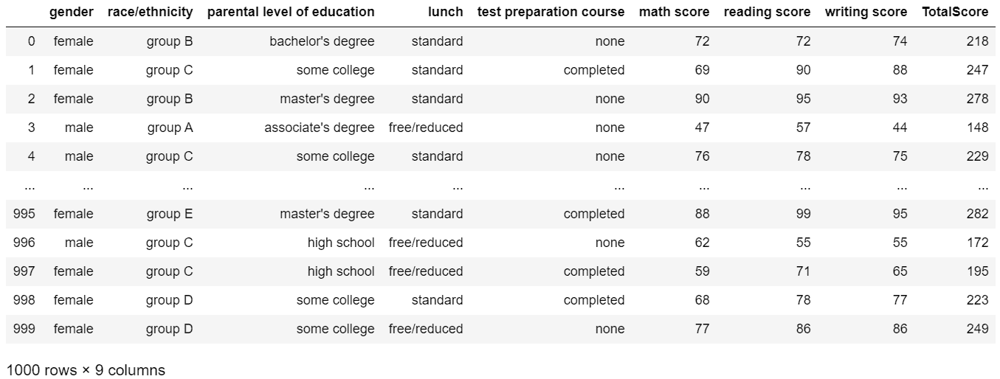
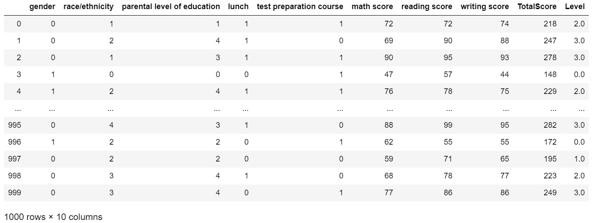
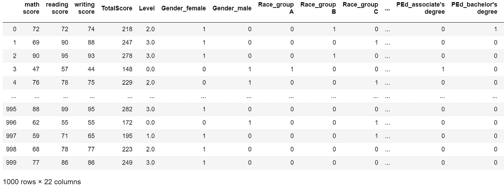
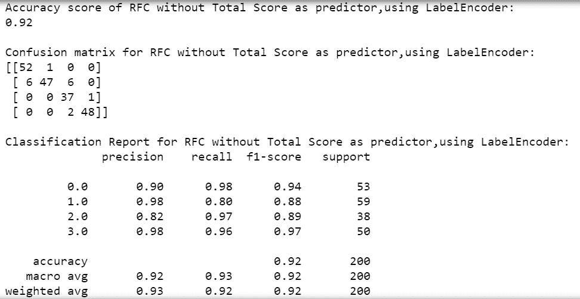
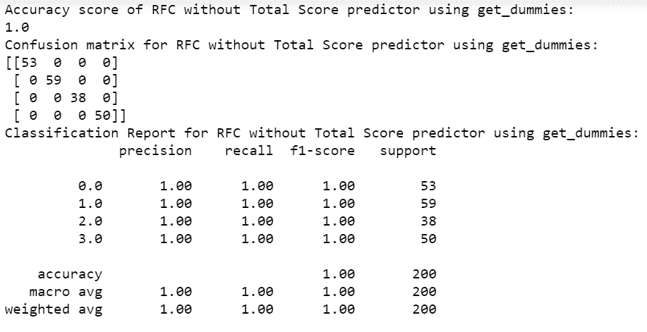
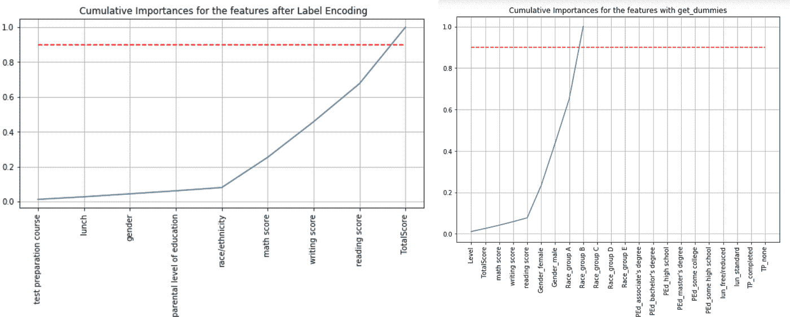
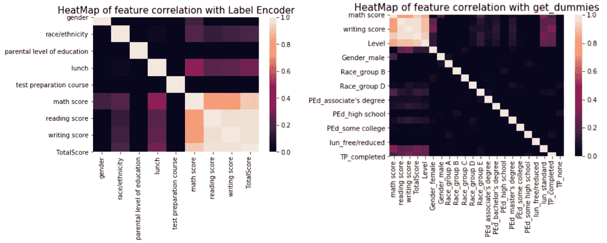

# 使用分类预测器

> 原文：<https://medium.com/analytics-vidhya/working-with-categorical-predictors-dd0bea831845?source=collection_archive---------34----------------------->

伊利亚·巴甫洛夫在 [Unsplash](https://unsplash.com?utm_source=medium&utm_medium=referral) 上的照片

我对预测算法相当陌生，我意识到知道如何向算法输入数据并让它毫不费力地预测和显示模型的“准确性分数”并不是最好的方法。

图片来源:【www.codestudyblog.com 

当我学习如何实现一些机器学习算法时，我主要使用“全数字”数据集。后来，当用一个数据集进行实验以理解不同算法如何工作时，我意识到有一个问题。当使用某些预测模型处理数据集时，如果某些列是“分类”列，即文本列，Python 中会出现错误。这让我开始研究如何使用分类特征。

处理分类数据的一个最明显的解决方案是将它们转换成数字表示。比方说，一列颜色[红色、蓝色、绿色和黑色]可以用数字 1、2、3、4 来表示，每个数字代表一种颜色。将一系列数字分配给分类值的过程称为整数编码，在 Python 中使用标签编码器执行。事后看来，这个过程在 Python 中指定了一个 order 0 <1<2 < 3\. For columns like Colors, there seems to be no particular order and therefore it makes more sense to interpret and represent them in a different manner.

Original table:

Integer Coded table using LabelEncoder in Python:

When you convert all your categorical columns into numeric data, the code snippet runs without errors. However, some may not realize that the accuracy score may have suffered as a result. If your Column consisted of Overall Ranks[Overall Ranks:’first’,’second’,’third’], ’first’ to 1, ‘second’ to 2 and ‘third’ to 3 would be sensible since the Ranks in fact do have an order among themselves.

So what is the alternative?

The get_dummies function, which comes in the *pandas* 包，用于将分类变量转换为哑变量。为每个唯一值形成一个新列。列颜色将分为 4 列:红色，蓝色，绿色和黑色。红色的行值将表示为 1，0，0，0；绿色的行值将表示为 0、0、1、0 等等。

Python 中使用 get_dummies 的二进制编码表:

**注意:**分类值现在被拆分成单独的列。

我将我的模型拟合到数据集的两个版本:使用标签编码器进行整数编码，使用熊猫的 get_dummies 进行二进制编码。

*   用 label encoder[整数编码]对模型进行性能评估:

*   用 get _ dummies[二进制编码]对模型进行性能评估:

观察 1:我的随机森林分类器使用二进制编码确实比使用整数编码效果更好。

我还绘制了每种编码的累积特征重要性，并且我注意到，即使一个类别的整体影响可能很低，该类别中的特定值/子类型仍然可能更有影响力。让我们假设，你的数据集有一列“城市”。虽然地理位置总体上可能不会对计算的价值产生重大影响，但您可以得出结论，如果您来自纽约或西雅图，您的结果会受到明显影响。

观察 2:在绘制了特性重要性之后，我现在可以计算出特定子类别的影响。(文中解释)

虽然互联网上有很多关于处理分类变量时何时使用何种编码技术的信息，但推理表明，当特征是序数时，我们使用整数编码，当特征不是序数时，我们使用二进制编码。

**注:**

1.  还有其他处理分类变量的方法，但是在我的分析中，我使用了上面讨论的两种方法。
2.  每种方法都有一些没有提到的缺点，因为这超出了我的文章范围。