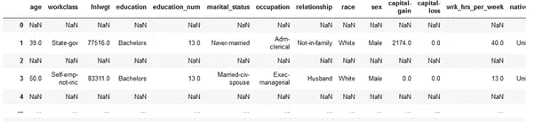
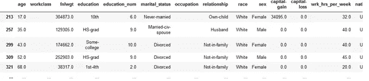
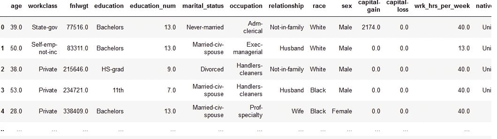
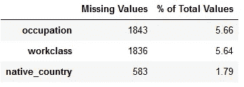

# 使用缺失值

> 原文：<https://medium.com/analytics-vidhya/working-with-missing-values-4a415c64b2f6?source=collection_archive---------17----------------------->

在 EDA 中首先要做的事情之一就是分析缺失值。根据数据的不同，许多类型的值都可以被视为缺失值。有时只有空格的单元格被视为缺失值，而其他时候空单元格被视为缺失值。有时，文件中会出现空行，这些空行会被认为是程序中缺少的值。

在本文中，我将讨论如何将只有空格的单元格和空单元格转换为`NaN`值(`np.nan`)，以便在查找缺失值时可以轻松识别它们。我还将讨论如何删除空行。

# 数据

在本文中，我们将研究[这个数据集](https://github.com/divijsharma/Blog/blob/master/adult-data.csv)。所以我们来看看文件。

成人 _ 数据.头()

成人数据[成人数据.工作类== ' ']

数据中有空行(所有列都有`NaN`)和某些以空格为值的列将被视为缺失值。

# 处理空行

在查找缺失值之前，可以从数据集中删除空行，以便空行不会导致缺失值。

执行上述代码后，数据帧如下所示，没有空行。

删除空行后

# 处理空格和空单元格

为了更好地处理空格和空单元格，我们应该将它们转换成`NaN`。

# 聚在一起

现在我们知道了如何处理空行和空单元格，让我们把它们放在一起，创建一个函数来完成上面提到的所有事情，并找出有多少行有缺失值。

该函数返回没有空行的更新数据帧和具有列名和缺少值的行数的新数据帧。

包含缺失值信息的数据框如下所示

行的百分比将帮助我们确定在模型中是应该估算值还是应该忽略列。