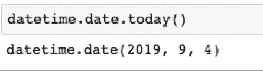
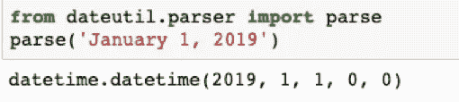
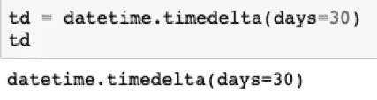

# 使用 Python 日期时间

> 原文：<https://medium.com/analytics-vidhya/working-with-python-datetime-ca5870989f1e?source=collection_archive---------6----------------------->

由[阿格巴洛斯](https://unsplash.com/@agebarros?utm_source=medium&utm_medium=referral)在 [Unsplash](https://unsplash.com?utm_source=medium&utm_medium=referral) 上拍摄的照片

Python datetime 是一个在 Python 中处理日期的模块，它基本上有 4 个用于日期和时间操作的主要对象:日期、时间、日期时间和时间增量。让我们一步一步地了解这一点，我们可以使用这 4 个对象进行各种操作，并从易到难逐步解决问题。

# **简介**

每当我们需要处理日期时，日期时间模块提供了必要的工具。因为，它是 python 的标准库部分，所以我们不需要单独安装它。

您可以在下面看到它是如何导入的:

最重要和最常用的对象是 datetime 模块中的 datetime 类。

请不要与名称混淆，因为模块名和类名是相同的。

除了 datetime.datetime 类，我们还有其他 3 个类:

> 1.日期类
> 
> 2.时间类
> 
> 3.时间增量类

## **1—datetime . datetime . now()**

现在，任何人都会问的一个非常基本的问题是，我们如何在 python 中获得当前的日期和时间？让我们看看！

datetime.datetime.now()可以给你答案。很简单，对吧？

我们可以在这里看到，格式遵循 YYYY、MM、DD、HH、MM、SS、MS，并以本地日期和本地时区给出当前日期时间。

## **2 — datetime.date.today( )**

我们还可以使用 datetime.date.today()只获取日期。

因为 today()是 datetime.date 类的方法，它不包含时间信息。

很好，但是你不认为上面的符号很难读懂吗？如果你把它打印出来，它会以一个漂亮的 YYYY-MM-DD 格式显示给你。

## **3 — datetime.datetime()**

我们在上面看到了如何为当前时间创建 datetime 对象，但是让我们看看如何为任何日期和时间创建它。

我们可以按照同样的顺序将其传递给 datetime.datetime()。

## **4 — dateutil.parser**

现在，让我们学习解析。解析就是将日期时间字符串转换成日期时间格式，因为在处理电子表格列或数据集时，它可以是任何格式。

我们可以从 dateutil.parser 导入 parse。

使用 dateutil 可以将任何 datestring 转换为 datetime 对象。

同样，我们可以将 datestring 解析为 datetime。

## **5 — strftime**

现在，将日期时间对象格式化为任何日期格式。我们可以使用 strftime()方法将任何 datetime 对象转换成几乎任何日期格式的表示。

## **6 —日期时间函数**

让我们学习一些有用的日期时间函数。

## **6.1 — datetime.time()**

我们可以使用 datetime.time()来单独表示时间部分。

## **6.2 —日期时间.时间增量**

让我们使用 timedelta 来获得两个日期或时间之间的差异。语法:datetime.timedelta

我有一个表示 30 天持续时间的 timedelta 对象。让我们计算一下 20 天后的日期。

我们也可以减去两个 datetime 对象，我们将得到一个表示持续时间的 timedelta 对象。

类似地，我们可以减去两个 timedelta 来获得另一个 time delta 对象。

## **7 — pytz(时区)**

现在让我们把它变得复杂一点。

使用时区。对于时区，python 推荐 pytz 模块，它不是标准的内置库。您需要单独安装它(在终端或命令提示符下输入` **pip install pytz** `)那么如何将时区设置为特定的日期时间呢？创建 datetime 时，只需将相应的 pytz timezone 对象传递给 tzinfo 参数。然后，该日期时间将成为时区感知时间。让我们创建一个属于 UTC 时区的 datetime 对象。

## **7.1 — pytz.all_timezones**

UTC 是 pytz 模块的一个直接属性。那么，如何设置不同的时区呢？为您选择的时区查找 pytz.all_timezones。然后使用 pytz.timezone()创建相应的 timezone 对象，该对象将被传递给 tzinfo 参数。

# **实现**

现在让我们看一个飞行数据集的例子。你可以从[这里](https://www.kaggle.com/shivamsarawagi/flighttestdataset/download)下载数据集

**步骤 1** :导入库

**第二步**:从 excel 中读取数据

**步骤 3** :检查数据集的外观

**步骤 4** :将 Date_of_Journey 转换为 datatime，我们将从中提取特征

**步骤 5** :从 datetime 中提取 dayofweek

**第六步**:从日期时间中提取日期

**步骤 7** :从日期时间中提取年份

**步骤 8** :从日期时间中提取月份

让我们看看提取时间要素后数据集的样子

**恭喜**！您已经在数据集上成功实现了 python datetime。