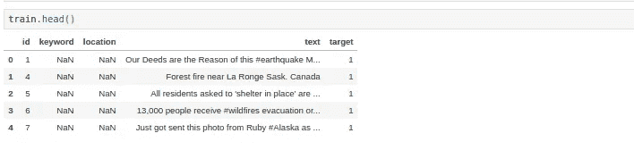
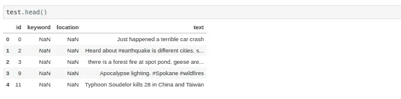

# 使用 Sklearn 管道-第 1 部分

> 原文：<https://medium.com/analytics-vidhya/working-with-sklearn-pipeline-part1-419b32fc8b1?source=collection_archive---------24----------------------->


今天的帖子是三个部分的第一部分，我们将了解 Sklearn 管道，以及我们如何在建模过程中有效地集成它们。在这一部分中，我们将使用 FeatureUnions 集成不同的特性，并在我们的管道中使用它。在这个练习中，我们使用了一个来自 [kaggle](https://www.kaggle.com/c/nlp-getting-started/overview) 的简单数据集。

让我们首先来看看数据集

```
def pull_data(train_pth,test_pth):
   *"""
   train_pth: Training Data Path
   test_pth: Test Data Path

   """* train_dt = pd.read_csv(train_pth)
   test_dt = pd.read_csv(test_pth)

   return train_dt,test_dt
```



训练数据



测试数据

这是一个简单的文本分类二进制数据集，现在我们将专注于文本部分，看看我们如何在其上开发基本功能，并使用 FeatureUnion 来合并这些自定义功能和已内置的功能(tfidf，standardscaler)。根据 scikit-learn 文档，理论上， *FeatureUnion 将几个 transformer 对象组合成一个新的 transformer，该 transformer 将它们的输出组合起来。A* `[***FeatureUnion***](https://scikit-learn.org/stable/modules/generated/sklearn.pipeline.FeatureUnion.html#sklearn.pipeline.FeatureUnion)` *取一个 transformer 对象列表。在拟合过程中，每一个都独立地拟合到数据。转换器并行应用，它们输出的特征矩阵并排连接成一个更大的矩阵。*

因此，基本上我们可以开发不同的特征(位置标签、数字特征)并将它们组合起来，为模型提供一个完整的矩阵来进行训练，多酷啊！！让我们试试第一个特性，看看结果矩阵是什么样的。文本最重要和最基本的自定义特性之一是计算文本的基本统计数据，如“总字数”、“字符数”、“标点数”、…

```
class FeatureMultiplierCount(BaseEstimator, TransformerMixin):
    def __init__(self, word_count=True,char_count=True,
                word_density=True,total_length=True,
                capitals=True,caps_vs_length=True,num_exclamation_marks=True,num_question_marks=True,
                num_punctuation=True,num_symbols=True,num_unique_words=True,words_vs_unique=True,
                word_unique_percent=True):
        self.word_count = word_count
        self.total_length = total_length

    def transform(self, X,y=None):
        X = pd.DataFrame(X)
        X['word_count'] = X['text'].apply(lambda x : len(x.split()))
        X['char_count'] = X['text'].apply(lambda x : len(x.replace(" ","")))
        X['word_density'] = X['word_count'] / (X['char_count'] + 1)

        X['total_length'] = X['text'].apply(len)
        X['capitals'] = X['text'].apply(lambda comment: sum(1 for c in comment if c.isupper()))
        X['caps_vs_length'] = X.apply(lambda row: float(row['capitals'])/float(row['total_length']),axis=1)
        X['num_exclamation_marks'] =X['text'].apply(lambda x: x.count('!'))
        X['num_question_marks'] = X['text'].apply(lambda x: x.count('?'))
        X['num_punctuation'] = X['text'].apply(lambda x: sum(x.count(w) for w in '.,;:'))
        X['num_symbols'] = X['text'].apply(lambda x: sum(x.count(w) for w in '*&$%'))
        X['num_unique_words'] = X['text'].apply(lambda x: len(set(w for w in x.split())))
        X['words_vs_unique'] = X['num_unique_words'] / X['word_count']
        X['word_unique_percent'] =  X["num_unique_words"]*100/X['word_count']

        return X[['word_count','char_count','word_density','total_length',
                 'capitals','caps_vs_length','num_exclamation_marks','num_question_marks',
                 'num_punctuation','num_symbols','num_unique_words','words_vs_unique',
                 'word_unique_percent']]

    def fit(self, *_):
        return self
```

如果你们中的许多人不熟悉 python 中的 Baseestimator，这里有一个对它的快速解释， *Baseestimator 提供了* `***get_params***` *和* `***set_params***` *方法的默认实现，基本上是你自己的定制估算器，用于定制特性等任务。这主要是为了使模型网格可通过* `***GridSearchCV***` *进行自动参数调整，并在与 Scikit-Learn Pipeline 结合使用时表现良好。*

主要的计算发生在变换方法中。根据 Scikit-Learn pipeline，任何自定义特性都应该有“fit”和“transform”方法，原因很明显。


另一个很棒的功能是计算文本的词类特征，在一个简短的解释中，我们尝试计算句子中出现的“NNS”(名词)、“VB”(动词)、“DT”(行列式)的数量。

```
class PosTagMatrix(BaseEstimator, TransformerMixin):
    #normalise = True - devide all values by a total number of tags in the sentence
    #tokenizer - take a custom tokenizer function
    def __init__(self, tokenizer=lambda x: x.split(), normalize=True):
        self.tokenizer=tokenizer
        self.normalize=normalize

    #helper function to tokenize and count parts of speech
    def pos_func(self, sentence):
        return Counter(tag for word,tag in nltk.pos_tag(self.tokenizer(sentence)))

    # fit() doesn't do anything, this is a transformer class
    def fit(self, X, y = None):
        return self

    #all the work is done here
    def transform(self, X):

        X_tagged = X.apply(self.pos_func).apply(pd.Series).fillna(0)
        X_tagged['n_tokens'] = X_tagged.apply(sum, axis=1)
        if self.normalize:
            X_tagged = X_tagged.divide(X_tagged['n_tokens'], axis=0)
        columns_ =['PRP','VBP','DT','NN','IN','NNP']

        common_columns = set(X_tagged.columns).intersection(columns_)

        add_columns = set(columns_)-common_columns

        for cols in add_columns:

            X_tagged[cols]=0.0

        return X_tagged[columns_]
```


位置标签的输出

在使用 Tfidf 等功能之前，我们也使用了基本的清洁过程，清洁过程也是自定义功能的形式。

```
class FeatureCleaner(BaseEstimator, TransformerMixin):
    def __init__(self, clean=True):
        self.clean = clean

    def clean_and_normalize_text_data(self,sentence):
        sentence = re.sub(r'[^a-zA-Z\s]', ' ', sentence, re.I|re.A)
        sentence = sentence.lower()
        sentence = sentence.strip()
        tokens = wpt.tokenize(sentence)
        stemmed_words = [ps.stem(w) for w in tokens]
        #remove stopwords
        filtered_tokens = [token for token in stemmed_words if token not in stops]
        filtered_len =[token for token in filtered_tokens if len(token)>2]
        filtered_len = np.unique(filtered_len)
        sentence = ' '.join(filtered_len)
        return sentence

    def transform(self, X,y=None):
        c =pd.Series([self.clean_and_normalize_text_data(x) for x in X])
        return c

    def fit(self, *_):
        return self
```


清洗过程的输出

sklearn 的 Tfidf、Standardscaler 等标准特性不需要任何修改，因为它们已经内置了 fit 和 transform 方法，所以我们可以简单地在管道中调用它们并执行它们。现在让我们合并管道，对于这个例子，我使用的是模型 ExtratreesClassifier。

```
ET_pipeline_pos_tag = Pipeline([
   ('u1', FeatureUnion([
      ('tfdif_features', Pipeline([('cleaner', FeatureCleaner()),
                            ('tfidf', TfidfVectorizer(max_features=40000, ngram_range=(1, 3))),
                            ])),
      ('numerical_features', Pipeline([('numerical_feats', FeatureMultiplierCount()),
                               ('scaler', StandardScaler()), ])),

      ('pos_features', Pipeline([
         ('pos', PosTagMatrix(tokenizer=nltk.word_tokenize)),
      ])),
   ])),
   ('clf', ExtraTreesClassifier(n_estimators=50)),
])
```

让我们分解一下管道，以便详细了解:

1.  我们创建一个 tfidf 特性管道，其第一步是使用 FeatureCleaner 清理数据，然后在其上应用 Tfidf。
2.  第二个特性是 FeatureMultiplier 管道，它从文本中计算数字特性，并在其上应用 StandardScaler。
3.  第三个特征是后置定语矩阵，在这里我们可以找到与一个句子相关的后置定语的数量。
4.  然后，我们使用特征联合来并行组合这些特征，并用树外分类器对其进行拟合。


安装管道后

还可以使用 joblib 保存模型/管道，并将其作为常规模型进行预测。

```
dump_file = 'extratrees.joblib'
joblib.dump(ET_pipeline_pos_tag, dump_file, compress=1)
```


模型结果

Scikit-Learn 管道是加速和模块化代码的好方法。它基本上平滑了你的整个建模过程。在下一个系列中，我们将探索如何使用 Scikit learn pipeline 来适应不同的模型。如果这篇文章有任何帮助，请鼓掌:)

感谢阅读！！