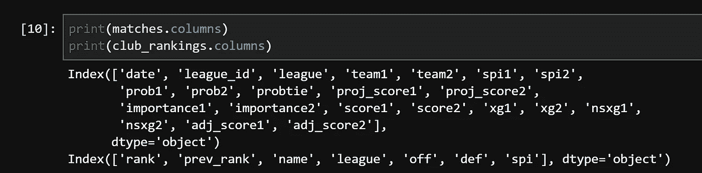
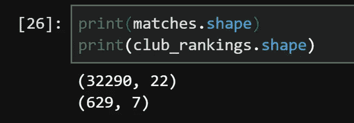
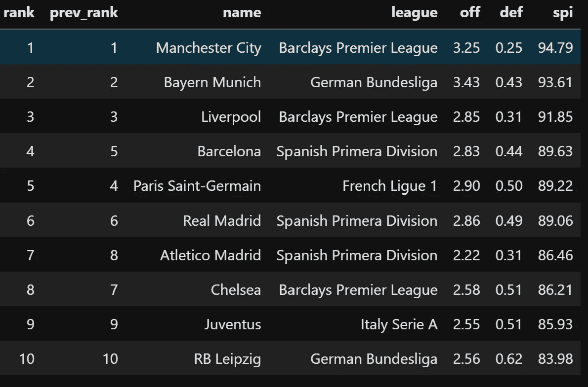
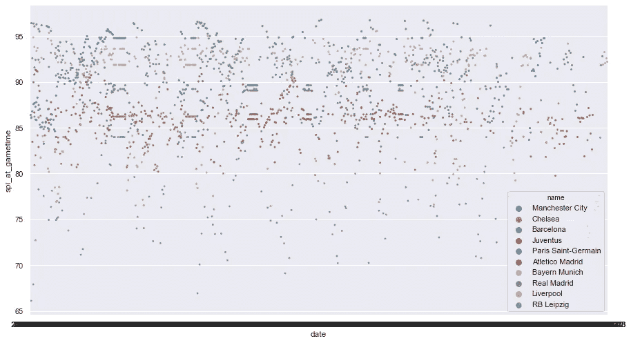
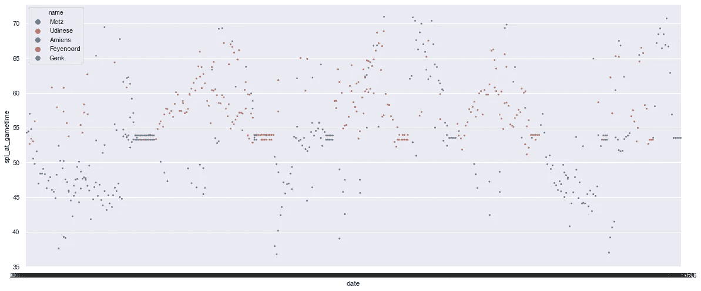
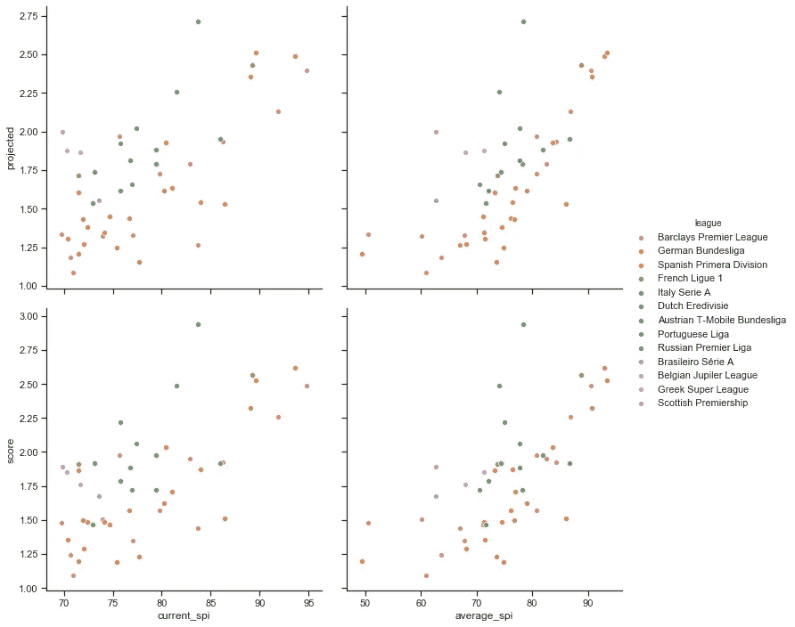

# 使用 538 足球数据

> 原文：<https://medium.com/analytics-vidhya/working-with-the-fivethirtyeight-soccer-data-ac941a13a6dc?source=collection_archive---------10----------------------->

维也纳·雷耶斯在 [Unsplash](https://unsplash.com?utm_source=medium&utm_medium=referral) 上拍摄的照片

最近，FiveThirtyEight 文章使用的一些数据被公之于众。在这篇博客中，我将使用 python 来探索和研究 538 俱乐部足球数据。

## 背景

对于门外汉来说，FiveThirtyEight(从现在开始，我将 FiveThirtyEight 称为 538)是一份出版物，其报道重点是体育和政治，还有一些其他类别的报道，如经济和娱乐。538 的与众不同之处在于他们对使用数据来支持论点和预测的深入方法。538 归 ABC 新闻所有，而 ABC 新闻又归迪士尼所有。

我将关注顶级俱乐部的整体实力如何随着时间的推移而变化，我将关注欧洲五大联赛的得分差异。为此，我将使用熊猫和海牛。

在足球比赛中，每个队都有三种可能的结果:赢、平或输。获胜的队伍获得三分，平局时两队各得一分，失败则得零分。在整个赛季中，各队相互比赛两次，联赛冠军是在整个赛季中赢得最多积分的球队。

## 韵律学

538 使用几种不同的指标来跟踪性能并进行预测。由 538 计算的主要指标被称为 SPI(足球力量指数)。SPI 的计算方法是将一支球队的预期进球与同一支球队的预期失球进行比较。这两个预测指标都是基于在中立场地对一般团队的预期表现。SPI 然后被确定为在一个中立的场地上，在给定球队的预期目标和目标的情况下，在一个平均水平的球队中获胜的比赛的百分比。一支欧洲顶级球队的 SPI 值会超过 70，这意味着他们在中立位置有 70%的机会击败一支普通球队。SPI 将允许我们根据总体质量来比较两支球队，但是 SPI 不考虑诸如伤病或位置等因素。在整个赛季中，SPI 根据团队的表现而变化，特别是根据加权总目标和总体结果。

## 数据

加载完数据后，我做的第一件事是检查数据集有多大，以及它们包含哪些值。

如您所见，数据中包含了大量信息。

就数据点而言，包括 32，290 场比赛和 629 个俱乐部。

## 问题

接下来，我需要提出一些我想探究的问题。经过一番思考后，我决定研究团队的 SPI 是如何随着时间的推移而变化的。我还想根据 SPI、预计进球和实际进球来比较不同的联赛。

## 问题 SPI 如何随时间变化？

对于这个问题，我决定先看看基于 SPI 排名前十的俱乐部(截至 12/2/19)，然后再看一片中档俱乐部。以下是排名前十的俱乐部:

随着时间的推移，我预计会有很多这样的俱乐部停留在顶部附近，但是也有一些可能会出现一些波动。

欧洲 10 大俱乐部的 SPI 随时间的变化

虽然这个图表相当混乱，但我们可以从中得出一些一般性的结论。由于最低的 SPI 值仍然高于 65，我们可以得出结论，目前欧洲顶级球队在过去几年中一直表现良好(比赛数据可以追溯到大约三年半前)。此外，精英中的精英，即曼城、巴塞罗那和皇家马德里，一直保持在精英水平，他们的 SPI 从未低于 85。

由于 10 支球队有太多的东西要了解，对于中等水平的俱乐部，我决定只用 5 支球队，这样更容易理解这个图表。

虽然总共有 629 家俱乐部，但我决定将“中档”定义为在国内联赛中被认为相当强大，但不足以在欧洲舞台上与顶级球队竞争的俱乐部。我还决定找一个只来自欧洲的组，这样我们可以更公平地将他们与前十名进行比较，前十名都来自欧洲。经过一些猜测和检查，我决定使用排名从 159 到 163 的队伍。他们在这里:

队伍排名从 159 到 163

我预计会有比排名前十的俱乐部更多的变化，因为从逻辑上来说，一个普通的球队会有更多不可预测的结果，所以他们的预期结果也应该更不可预测。

特定中档俱乐部的长期 SPI。

这一次，显然有更多的变化，Genk 偶尔会突破 70 SPI 阈值，但有时也会低于 55。此外，与前五名团队之间的差距相比，这五个团队之间的整体价值观差距更大。然而，还是有一些一致性。乌迪内斯保持在大约 13 个 SPI 点之内，如果你去掉几个异常值，他们的范围下降到大约 10 个 SPI 点。这种一致性与几个精英团队相当，尽管精英团队的平均差距约高 20 分。另一个值得注意的比较是，对于几个中档俱乐部等于或高于最低评级为 RB 莱比锡，排名第十的球队在顶部。这表明欧洲十大俱乐部并非不受外来者的影响，如果他们经历一两年的好时光，其中一支中档球队可能会发现自己接近顶级。

## 问题 2:比较不同的联赛

对于这个问题，我首先尝试只使用排名前 50 的团队(截至 12/2/19)。虽然我认为使用这些团队会很好，但我发现有太多不同的联盟。很难从图表中收集到任何有用的信息，因为一对图中包含了大量的信息。

我第一次尝试策划 50 强球队。

正如你所看到的，这个结对图需要太多的时间来仔细观察才有效。然而，在这里可以找到一些信息。例如，我们可以看到，一般来说，团队的得分相当接近他们的预期目标。我们可以推断出这一点，因为图形通常保持相同的形状，尤其是在极端情况下。需要注意的是，计划目标从 1 到 2.75，而实际目标从 1 到 3。这是相当重要的，尽管它与这个问题不太相关，因为我只是想比较不同的联赛，而不是评估预测有多准确。

为了更有凝聚力，我决定将队伍限制在前 5 名联赛的成员中，而不是前 50 名。虽然这将总共增加更多的团队，但也会产生更清晰的结对图，使理解可视化变得更容易。

顶级联赛对比

正如你所看到的，这些图表仍然很混乱，但更容易理解，因为数据点之间只有 5 种不同的色调。我还包括了一个单独的联赛专栏，这使得更容易看到联赛之间的直接比较。

从这张双人图中可以明显看出，意大利队平均进球数较少，而德国队平均进球数较多。

从中可以得出几个结论。例如，意大利队得分低于其他联赛的球队可能意味着意大利队的防守更好。这也可能意味着意大利队的进攻更加糟糕。这甚至可能意味着两种结论的混合——意大利队防守非常好，进攻非常平庸。德国队的情况正好相反。他们在进攻上更好，在防守上更差，或者至少相对来说是这样。

对我来说，西班牙联赛是最有趣的。几乎所有球队的预期目标和实际目标都很低，但有两支球队在整体得分上名列前茅。这可能是由于顶级球队通过支配所有其他球队来扭曲数据，或者他们可能只是离群值，不会对其他球队产生太大影响。

在德国和法国也有类似的现象，尽管这一次每个联赛的统治力来自一支球队，而不是两支球队。另一件要注意的事情是，意大利是唯一一个没有球队在进球方面明显优于联赛其他球队的联赛。

## 结论

我处理这些数据的目的是为了对熊猫和海牛进行更多的练习，所以从这个角度来看，这个项目是完全成功的。在未来，我期待着探索更多的 538 使用的数据，结合我目前正在学习的统计和编程技能。