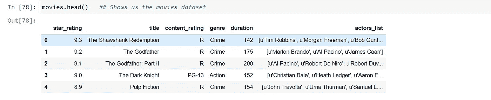
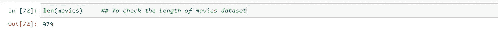
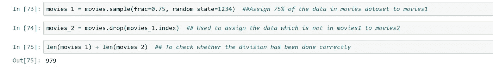
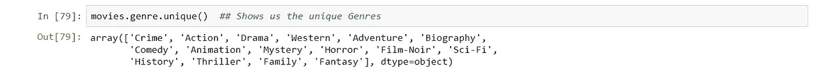
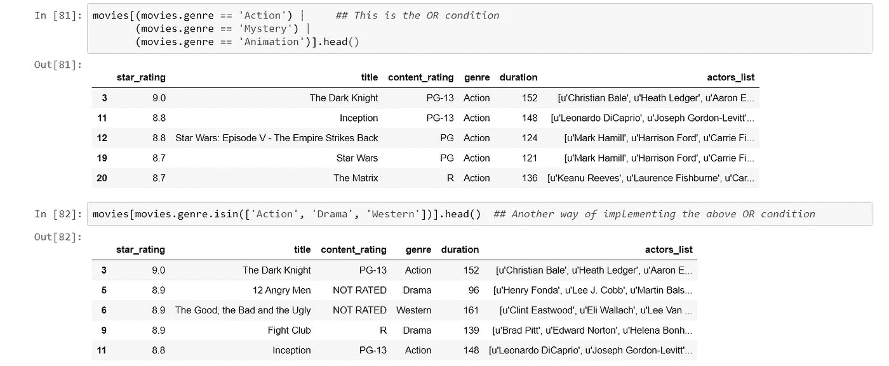
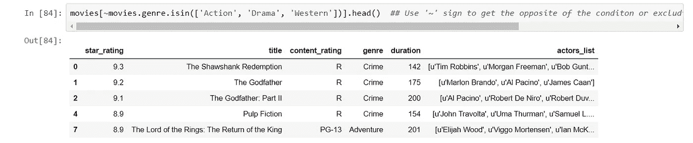
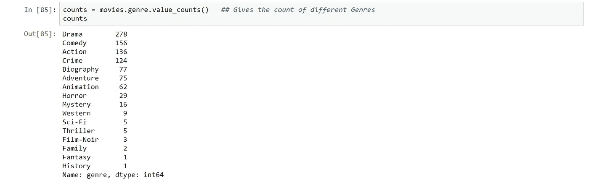
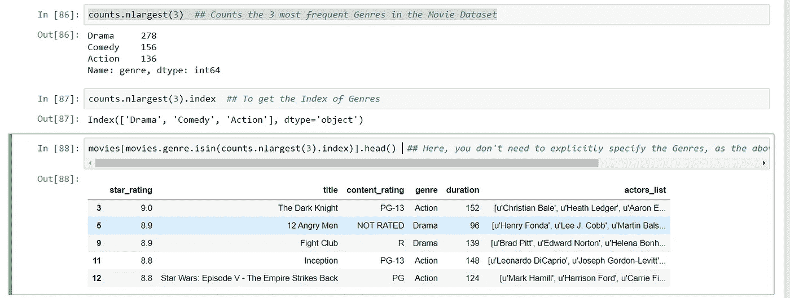

# 熊猫的把戏第四部分

> 原文：<https://medium.com/analytics-vidhya/world-is-in-lockdown-but-our-panda-is-still-working-to-move-on-860023a666f?source=collection_archive---------33----------------------->


在 [Unsplash](https://unsplash.com?utm_source=medium&utm_medium=referral) 上由 [Kawshar Ahmed](https://unsplash.com/@kawshar?utm_source=medium&utm_medium=referral) 拍摄的照片

在本文中，我将继续使用 python 中的 pandas 进行数据分析和操作技巧。在我上一篇[文章](/analytics-vidhya/useful-pandas-tricks-part-3-9db0d534a05a)中，我们讨论了数据类型及其转换，还讨论了通过行和列连接数据帧。这些分析和操作技术非常有用，在我处理数据并从中获得有价值的见解时，对我的职业生涯帮助很大。

今天，我们将使用来自 [IMDb](https://www.imdb.com/) 的电影数据帧，展示一些有用的熊猫把戏。这种技巧可以用在各种业务数据上。

让我们先读出数据帧:

```
movies = pd.read_csv('[http://bit.ly/imdbratings'](http://bit.ly/imdbratings'))
```

然后，您可以使用命令 *movies.head()* 浏览数据帧，如下所示:

```
movies.head() 
```



电影数据集一瞥

如果您想检查整个数据集的长度或数据集中有多少行，您可以使用 *len()* 命令，如下所示:

```
len(movies) ##To check the length of movies dataset
```



电影数据集中的长度或行数

我们还可以将数据集的一部分提取到另一个数据集中。这是特别有用的，当在一个非常大的数据集中，我们想首先集中在它的一部分，以便研究它并得出我们的结论。这有助于我们从不同的数据集中提取有价值的见解，并将它们相互比较以及与完整的数据集进行比较。这些研究有助于我们得出结论，事情是如何随时间变化的，以及在不同的数据集中发生了什么，这与完整完成的整个研究不同。

下面，我们创建了两个数据集，将 75%的数据分配给*电影 1* ，剩余部分分配给*电影 2* 。

```
movies_1 = movies.sample(frac=0.75, random_state=1234)movies_2 = movies.drop(movies_1.index)len(movies_1) + len(movies_2)  ## To check whether the division has been done correctly
```



将电影数据集划分为 75%和 25%的两个块

***注意:*** 如果索引值不是唯一的，那么这整个方法都不起作用。因此，我们需要首先对我们的两个数据集进行排序，然后我们应该继续对它们进行分析。

```
movies_1.index.sort_values()  ## Sort and checkmovies_2.index.sort_values()  ## Sort and check
```

现在，在我们的电影数据集中，如果我们想知道有多少独特的类型，我们可以通过*独特的*命令来检查，如下所示:

```
movies.genre.unique()  ## Shows us the unique Genres
```



数据集中的独特类型

如果我们想要检查一组特定的流派，那么我们可以使用*或*条件或 *isin* 方法。



OR 条件或 isin()方法

同样，在' ~ '的帮助下，我们可以显示不属于 *isin()* 方法中提到的类型，如下所示:

```
movies[~movies.genre.isin(['Action', 'Drama', 'Western'])].head()
```



获取不同于 isin()方法中的类型

现在，如果我们想知道不同流派的电影数量，我们可以借助 *value_counts()* 方法来实现。



要检查不同流派的数量

为了得到最频繁出现的流派的数量，我们可以使用 *nlargest()* 方法。

```
counts.nlargest(3)  ## Counts the 3 most frequent Genres in the Movie Dataset
```



nlargest()方法的演示

有了这些，我将结束这篇文章，我们将在下一篇文章中讨论一些其他有用的熊猫技巧。希望你学会并喜欢。