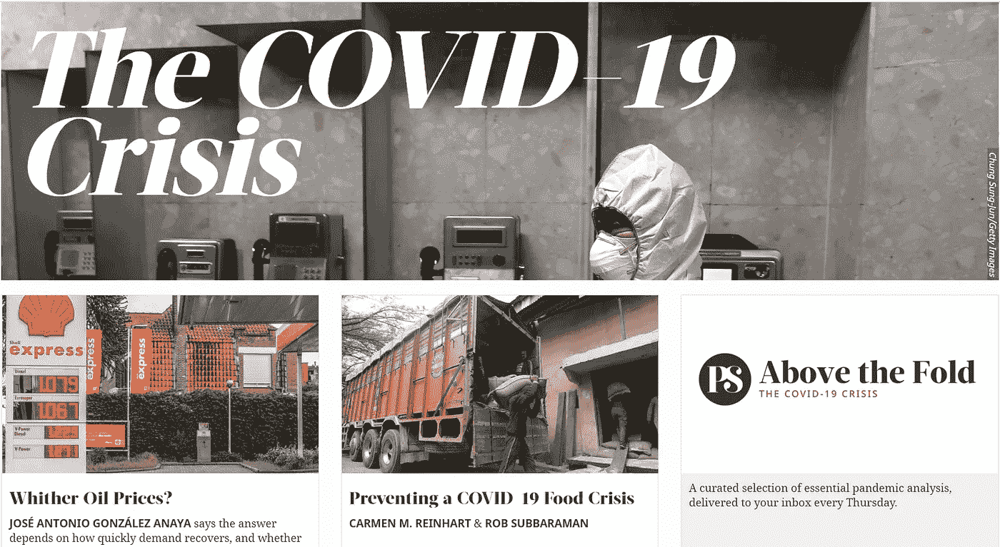
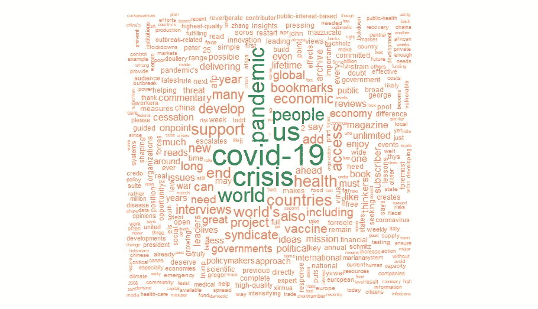
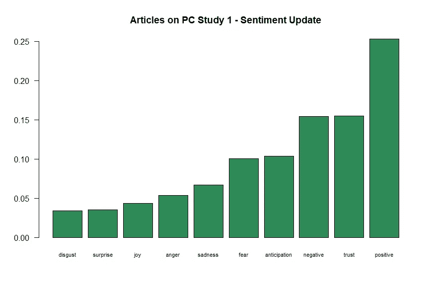
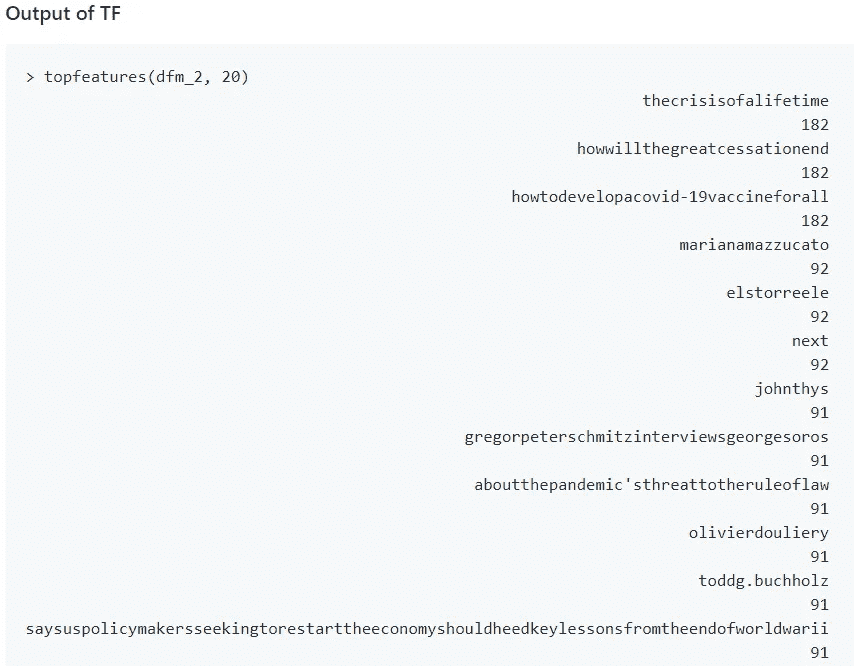
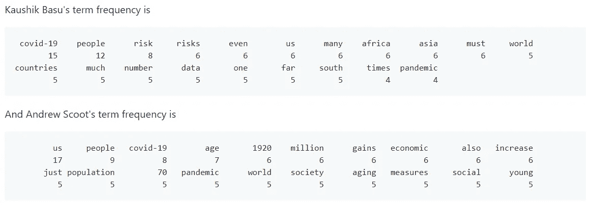
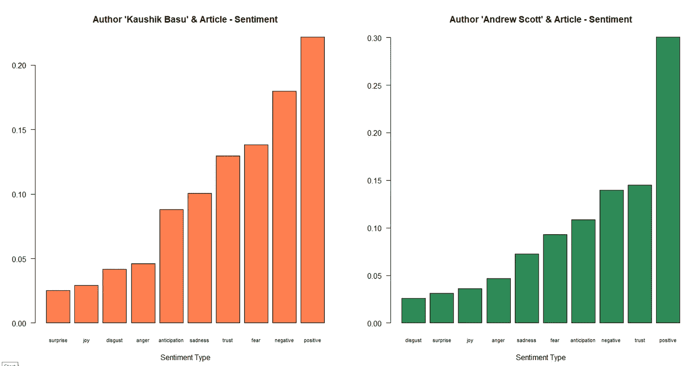

# 世界观点页—和 COVID 19！

> 原文：<https://medium.com/analytics-vidhya/worlds-opinion-page-and-covid-19-64740e985242?source=collection_archive---------29----------------------->

## 使用 NLP 对与 COVID19 相关的 project-syndicate.com 文章进行文本挖掘和分析。

照片由[联合国新冠肺炎回应](https://unsplash.com/@unitednations?utm_source=medium&utm_medium=referral)在 [Unsplash](https://unsplash.com?utm_source=medium&utm_medium=referral)

Project Syndicate 是一个著名的网站。该网站的口号是“世界意见页”，这确实是真的。世界各地的领导人、经济学家和学者发表他们对各种话题的看法，从宏观经济到世界政治。

在这项研究中，我们决定借助 NLP 和文本分析来分析他们的观点，尤其是对 COVID19 危机的观点。在这项研究中，我们特意只选择了与 COVID19 主题相关的文章

我们研究了 2020 年 4 月 1 日至 2020 年 5 月 14 日的文章。总共有 91 篇文章。

在研究中，我们从三个方面分析了文章。

1.  给定时间段内所有文章的情感分析和词频。
2.  给定时间段内所有明文文章的词频。
3.  作者和他/她的特定文章情感分析和词频分析。

# 研究 1:所有文章的情感分析和词频

研究 1 集中于从 project-syndicate 网站收集的所有文章。这里，我们只选择来自世界各地作者的 COVID 相关文章。在这项研究中，我们做了 TF — IDF 术语频率—逆文档频率。

词云

正如我们在 out 中看到的，文章中使用的术语 COVID 和 crisis 是意料之中的。基于这一点，我们可以说这些文章的收集是好的，因为我们能够实现我们的目标。现在，对我们的研究更重要的是情感分析。

情感分析

对文章的分析显示了积极和信任。在这个前所未有的时代，这是一个重要因素。

# 研究 2:给定时间段内所有具有明文的文章的词频

> 这项研究很有趣，我们偶然发现了研究的这一部分。

这项研究很有趣，我们偶然发现了研究的这一部分。在抓取网页时，formate 并不清楚所有的数据，我们决定删除白色的形状，并将日期和作者分开，以便更好地分析。为此我们使用了 gsub()函数，我们在文章中发现了许多有趣的短语。为此，我们还研究了词频，以下是输出。

检索词频率

很少有短语像书评和访谈之类的。

我们忽略了这些 TF，我们只关注几个重要的 TF，比如..有 182 个计数的生命周期。howwillthegreatcessationend 和 how to developa covid-19 vaccineforal 也有 182 个计数。以及有 91 条罪状的“sthreattotheruleoflaw”。

这项研究表明了作者对 COVID 疫苗的不确定性以及 COVID 和衰退后的经济后果。

# 研究 3:作者和他/她的特定文章情感分析和词频分析

在这项研究中，我们分析了两位作者的个人文章，并进行了词频和情感分析。

首先，我们分析了考希克·巴苏在 2020 年 5 月 6 日发表在 PS 上的文章。我们对安德鲁·斯科特文章的第二个分析是 2020 年 4 月 22 日。

检索词频率

基于 TF- IDF 的分析，我们可以说考希克·巴苏在他的文章中频繁使用术语“人”和“风险”,安德鲁试图传达 1920 年的信息——大贬值。

但是，让我们看看情绪分析是怎么说的，

情感分析

基于情感分析，我们可以说，考希克·巴苏的文章反映了积极，但同时他也是消极和恐惧的。另一方面，安德鲁的文章有显著的积极意义。

欲了解更多研究详情和 NLP 代码(包括文本挖掘)，请访问 Github 知识库— [点击此处](https://github.com/RutvijBhutaiya/Text-Mining-project-syndicate.org)

 [## rutvijbhutaya/Text-Mining-project-syndicate . org

### Project Syndicate 是一个著名的网站。该网站的口号是“世界意见页”，这确实是真的。世界…

github.com](https://github.com/RutvijBhutaiya/Text-Mining-project-syndicate.org)