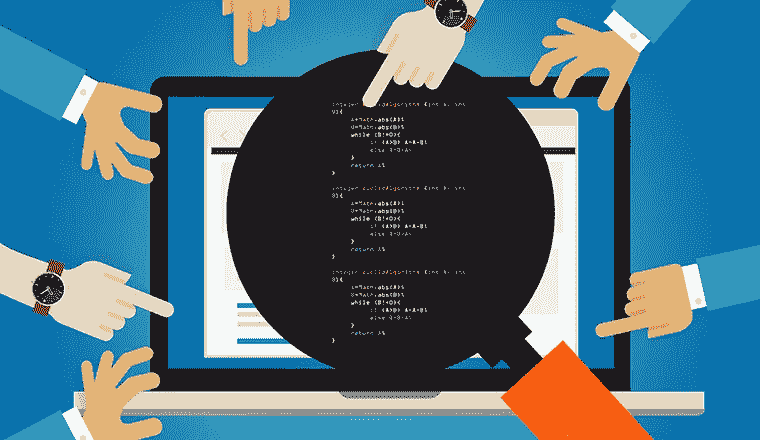

# 写一个干净的代码:SonarQube

> 原文：<https://medium.com/analytics-vidhya/write-a-clean-code-sonarqube-cb2bd2ffa834?source=collection_archive---------15----------------------->

本文将深入探讨代码质量的重要性以及如何使用 SonarQube 来实现这一点。

你有没有想过，达到代码质量有多重要，写一个干净的代码是非常必要的？？🤔尤其是，在一个复杂的项目中工作时，这被认为是最重要的活动。