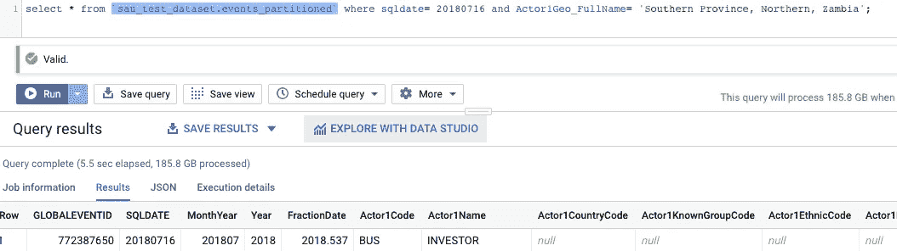
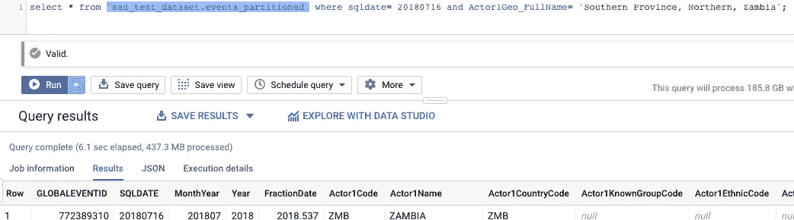
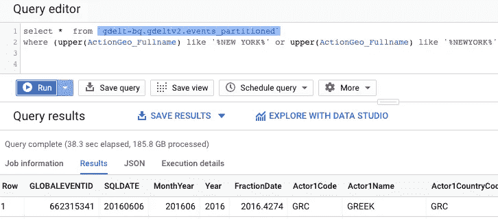
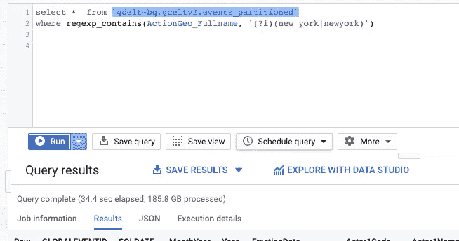
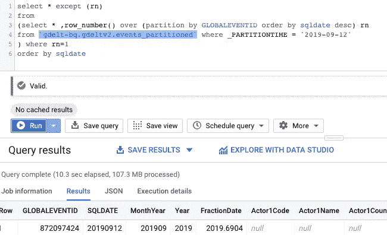
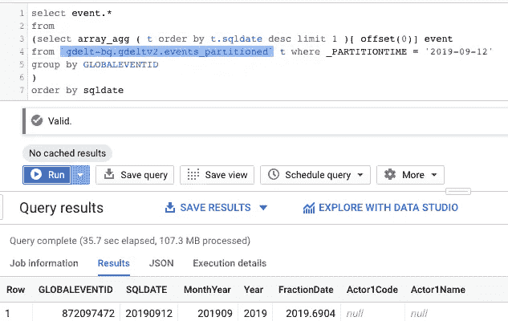
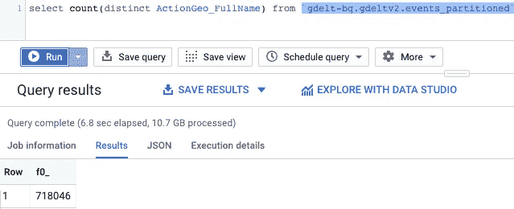
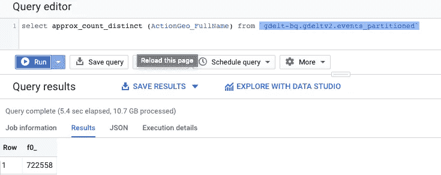

# 在 BigQuery 上编写高效的查询

> 原文：<https://medium.com/analytics-vidhya/write-efficient-queries-on-bigquery-42686c72d81e?source=collection_archive---------4----------------------->

## 在过去的三年里，我一直致力于谷歌大查询，这个博客是为了与你分享我一路走来收集的东西。最重要的一点是，有很多方法可以在 BigQuery 上编写 SQL 查询，但是知道什么在成本和时间效率方面最有效将有助于每个人编写高效的查询。

在我分享在 BigQuery 上编写高效查询的 4 种有效方法之前，让我分享一下为什么我觉得有必要考虑这一点

BigQuery 是一个无服务器、高度可扩展且经济高效的云数据仓库，具有内存 BI 引擎和内置的机器学习。BigQuery 对千兆字节到千兆字节的数据运行极快的 SQL 查询，并简化公共或商业数据集与数据的连接。

在 BigQuery (BQ)上，按需查询根据读取的字节数收费。BQ 的[定价是基于使用量的，也就是说，您根据使用 BQ 资源付费，这些资源可能是您通过流式传输存储、查询和插入的数据量。因为你实际上有无限的资源，如果你不够谨慎，很容易花很多钱。](https://cloud.google.com/bigquery/pricing)

这里有四个优化，可以帮助您节省查询的成本和时间:

1.  **对已分区表使用聚类。**

> 聚集数据并使用筛选子句的查询的性能可以通过聚集来提高。聚类可用于以下情况:
> 
> a)当您使用分区表时。
> 
> b)当您通常在查询中的特定列上使用筛选器或聚合时。

没有聚集表的查询

使用聚集表进行查询

如您所见，该表聚集在 sqldate 和 actor1geo_fullname 字段上，将从 **185 GB** 读取的字节减少到 **437 MB** 。

2.**使用 REGEXP_CONTAINS 代替 UPPER()和 LOWER()函数。**

> 由于每个字符都需要单独映射，因此 LOWER()和 UPPER()在 unicode 文本中表现不佳。相反，使用 REGEX_MATCH()并添加不区分大小写的检查(？I)到您的正则表达式进行不区分大小写的搜索。同一个字段的多个搜索值可以合并成一个正则表达式。

使用 upper()函数进行查询

使用 regexp_contains()进行查询

正如您可以看到的两种情况下查询处理时间的结果，处理时间相差 4 秒。当您处理较大的数据集时，这一点会更明显。

3.**使用 ARRAY_AGG()代替 ROW_NUMBER()。**

> 使用 ROW_NUMBER()函数有时会失败，并出现错误“**Resources excended**”,因为数据量增长到太多元素，无法在单个分区中进行排序。通过使用 ARRAY_AGG()，可以避免这个问题，因为 ORDER BY 允许删除除每个 GROUP BY 上的顶部记录之外的所有内容。

使用 row_number()进行查询

使用 ARRAY_AGG()进行查询

在这种情况下，您可以看到使用 ARRAY_AGG()重写了查询。尽管查询执行起来可能会慢一点，但它永远不会出现“资源超出错误”,这可能有点令人沮丧。

4.**使用近似函数。**

> 在不需要精确计数的情况下，可以使用近似函数。近似函数产生的结果通常在精确数的 1%以内。

在这种情况下，您可以看到当您使用近似函数时，查询花费的时间少了几秒钟。同样，在较大的数据集上，这种差异会很大。

以下是一些可以遵循的最佳实践，可以帮助您充分利用 BQ。还有很多其他的也在 [BigQuery 的官方文档](https://cloud.google.com/bigquery/docs/best-practices-performance-compute)中列出。

欢迎对我的帖子发表评论，如果我错过了任何其他优化技术，请告诉我。还有*如果你喜欢我的帖子，别忘了鼓掌:)*