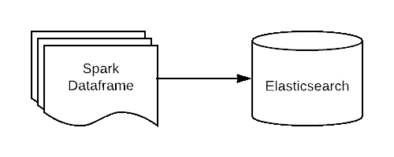

# 将 Spark 数据帧写入弹性搜索索引

> 原文：<https://medium.com/analytics-vidhya/writing-a-spark-dataframe-to-an-elasticsearch-index-16fdedd74ff7?source=collection_archive---------4----------------------->



在本帖中，我们将详细介绍为弹性搜索指数写 Spark `DataFrame`的过程。

Elastic 通过 [elasticsearch-hadoop](https://www.elastic.co/guide/en/elasticsearch/hadoop/master/spark.html) 提供 Apache Spark 支持，它具有 elasticsearch 和 Apache Spark 之间的原生集成。

**注意:所有例子都是用 Scala 2.11 和 Spark SQL 2.3.x 编写的。有 Apache Spark 的经验是先决条件。**

# 细分:

*   Maven 依赖项。
*   Spark-ES 配置。
*   writeToIndex()代码。

# Maven 依赖性

下面提到的依赖项应该出现在您的`classpath`中。`elasticsearch-spark-20`为 Spark 提供原生的 Elasticsearch 支持，需要`commons-httpclient`对 Elasticsearch APIs 进行 RESTful 调用。出于某种奇怪的原因，这个版本的`elasticsearch-spark-20`省略了 http 客户端依赖，所以必须手动添加。

```
-------------------
Snippet of the pom.xml
-------------------
<dependency>
    <groupId>org.apache.spark</groupId>
    <artifactId>spark-sql_2.11</artifactId>
    <version>2.3.0</version>
</dependency>
<dependency>
    <groupId>commons-httpclient</groupId>
    <artifactId>commons-httpclient</artifactId>
    <version>3.1</version>
</dependency>
<dependency>
    <groupId>org.elasticsearch</groupId>
    <artifactId>elasticsearch-spark-20_2.11</artifactId>
    <version>6.4.2</version>
</dependency>
```

# Spark-ES 配置

为了让 Spark 与 Elasticsearch 通信，我们需要知道 ES 节点的位置以及与之通信的端口。这些通过设置`spark.es.nodes`和`spark.es.port`配置提供给`SparkSession`。

*注意:这里的例子使用了托管到 AWS 的 Elasticsearch，因此需要一个额外的配置* `*spark.es.nodes.wan.only*` *来设置为* `*true*` *。*

让我们看一些创建`SparkSession`的代码。

```
**val** spark **=** **SparkSession**
   **.**builder**()**
   **.**appName**(**"WriteToES"**)**
   **.**master**(**"local[*]"**)**
   **.**config**(**"spark.es.nodes"**,**"<IP-OF-ES-NODE>"**)**
   **.**config**(**"spark.es.port"**,**"<ES-PORT>"**)**
   **.**config**(**"spark.es.nodes.wan.only"**,**"true"**)** *//Needed for ES on AWS
*   **.**getOrCreate**()**
```

# writeToIndex()代码

首先，我们将定义一个`**case** **class**`来表示我们的索引结构。

```
**case** **class** **AlbumIndex(**artist**:String,** yearOfRelease**:Int,** albumName**:** **String)**
```

接下来，我们将创建一个`AlbumIndex`对象的`Seq`，并使用方便的`.toDF()`函数将它们转换成一个`DataFrame`，该函数可以通过导入`spark.implicits._`来调用。

```
**import** spark.implicits._ **val** indexDocuments **=** **Seq(**
        **AlbumIndex(**"Led Zeppelin"**,**1969**,**"Led Zeppelin"**),**
        **AlbumIndex(**"Boston"**,**1976**,**"Boston"**),**
        **AlbumIndex(**"Fleetwood Mac"**,** 1979**,**"Tusk"**)**
   **).**toDF
```

*注:* `*spark*` *此处代表* `*SparkSession*` *对象。*

一旦我们准备好了`DataFrame`，我们需要做的就是导入`org.elasticsearch.spark.sql._`并调用它的`.saveToEs()`方法。

```
**import** org.elasticsearch.spark.sql._indexDocuments**.**saveToEs**(**"demoindex/albumindex"**)**
```

这是完整的源代码。

```
**import** org.apache.spark.sql.SparkSession
**import** org.elasticsearch.spark.sql._**object** **WriteToElasticSearch** **{** **def** main**(**args**:** **Array[String]):** **Unit** **=** **{**
   **WriteToElasticSearch.**writeToIndex**()**
 **}** **def** writeToIndex**():** **Unit** **=** **{** **val** spark **=** **SparkSession**
    **.**builder**()**
    **.**appName**(**"WriteToES"**)**
    **.**master**(**"local[*]"**)**
    **.**config**(**"spark.es.nodes"**,**"<IP-OF-ES-NODE>"**)**
    **.**config**(**"spark.es.port"**,**"<ES-PORT>"**)**
    **.**config**(**"spark.es.nodes.wan.only"**,**"true"**)** *//Needed for ES on AWS
*    **.**getOrCreate**()** **import** spark.implicits._ **val** indexDocuments **=** **Seq(**
       **AlbumIndex(**"Led Zeppelin"**,**1969**,**"Led Zeppelin"**),**
       **AlbumIndex(**"Boston"**,**1976**,**"Boston"**),**
       **AlbumIndex(**"Fleetwood Mac"**,** 1979**,**"Tusk"**)**
   **).**toDF indexDocuments**.**saveToEs**(**"demoindex/albumindex"**)**
 **}**
**}****case** **class** **AlbumIndex(**artist**:String,** yearOfRelease**:Int,** albumName**:** **String)**
```

# 参考

1.  [弹性搜索火花支持。](https://www.elastic.co/guide/en/elasticsearch/hadoop/master/spark.html)

*还贴在*[*https://olivermascarenhas . com/2019-01-06-writing-spark-data frames-to-es/*](https://olivermascarenhas.com/2019-01-06-writing-spark-dataframes-to-es/)